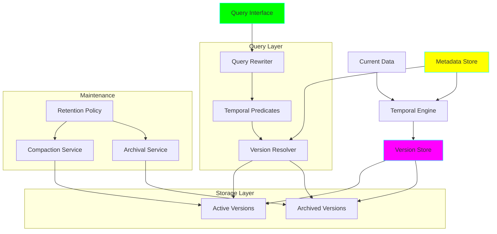
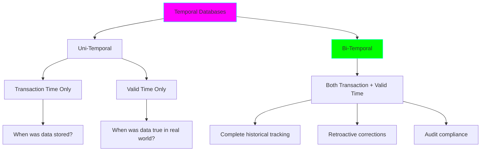

# Project 29: Time-Travel Query System

**Complexity:** ⭐⭐⭐⭐⭐ | **Time:** 12-15 hours | **Tier:** Expert Level

## Overview

Build a production-grade temporal database system that enables time-travel queries, version-based auditing, and point-in-time data recovery. This project implements bi-temporal data modeling, efficient version storage, query rewriting for temporal predicates, and intelligent retention policies.

## Learning Objectives

After completing this project, you will understand:

- ✅ Temporal database concepts (valid time vs transaction time)
- ✅ Bi-temporal data modeling techniques
- ✅ Slowly changing dimensions (SCD) at scale
- ✅ Version storage strategies and optimization
- ✅ Temporal query rewriting and optimization
- ✅ Time-travel query patterns (as-of, between, from-to)
- ✅ Storage optimization with compression and compaction
- ✅ Retention policies and archival strategies

## Architecture



## Key Concepts

### Temporal Database Types



### Bi-Temporal Model

**Transaction Time:** When the data was stored in the database
**Valid Time:** When the data was/is/will be true in the real world

| Employee ID | Name | Salary | Valid From | Valid To | Tx From | Tx To |
|-------------|------|--------|------------|----------|---------|-------|
| 1 | Alice | 50000 | 2024-01-01 | 2024-06-30 | 2024-01-01 | 2024-07-01 |
| 1 | Alice | 55000 | 2024-07-01 | 9999-12-31 | 2024-07-01 | 9999-12-31 |
| 1 | Alice | 50000 | 2024-01-01 | 2024-05-31 | 2024-06-15 | 9999-12-31 |

**Note:** Third row is retroactive correction (discovered in June that raise was May, not July)

### Time-Travel Query Types

```sql
-- 1. AS-OF Query: State at specific time
SELECT * FROM employees
FOR SYSTEM_TIME AS OF '2024-01-15'

-- 2. BETWEEN Query: Changes in time range
SELECT * FROM employees
FOR SYSTEM_TIME BETWEEN '2024-01-01' AND '2024-06-30'

-- 3. FROM-TO Query: All versions in period
SELECT * FROM employees
FOR SYSTEM_TIME FROM '2024-01-01' TO '2024-12-31'

-- 4. CONTAINED IN: Versions fully within period
SELECT * FROM employees
FOR SYSTEM_TIME CONTAINED IN ('2024-01-01', '2024-12-31')
```

## Implementation Guide

### Step 1: Temporal Data Model

```python
from dataclasses import dataclass, field
from datetime import datetime, date
from typing import Optional, Any, Dict, List
from enum import Enum
import uuid
import logging

class TemporalType(Enum):
    """Type of temporal tracking."""
    TRANSACTION_TIME = "transaction_time"
    VALID_TIME = "valid_time"
    BI_TEMPORAL = "bi_temporal"

@dataclass
class TemporalRow:
    """Row with temporal tracking."""
    # Primary Key
    id: Any

    # Business Data
    data: Dict[str, Any]

    # Transaction Time (System Time)
    tx_from: datetime
    tx_to: datetime = field(default=datetime.max)

    # Valid Time (Application Time)
    valid_from: datetime = field(default_factory=datetime.now)
    valid_to: datetime = field(default=datetime.max)

    # Version tracking
    version_id: str = field(default_factory=lambda: str(uuid.uuid4()))

    # Metadata
    is_deleted: bool = False
    created_by: Optional[str] = None
    modified_by: Optional[str] = None

class TemporalTable:
    """Table with temporal capabilities."""

    def __init__(
        self,
        name: str,
        temporal_type: TemporalType = TemporalType.BI_TEMPORAL,
        primary_key: str = "id"
    ):
        self.name = name
        self.temporal_type = temporal_type
        self.primary_key = primary_key

        # In-memory storage (in production, use database)
        self.versions: List[TemporalRow] = []
        self.active_versions: Dict[Any, TemporalRow] = {}

        self.logger = logging.getLogger(__name__)

    def insert(
        self,
        data: Dict[str, Any],
        valid_from: Optional[datetime] = None,
        user: Optional[str] = None
    ):
        """
        Insert new row with temporal tracking.

        Args:
            data: Row data
            valid_from: Start of validity period
            user: User performing operation
        """
        pk_value = data[self.primary_key]

        # Check if row already exists
        if pk_value in self.active_versions:
            raise ValueError(f"Row with {self.primary_key}={pk_value} already exists")

        row = TemporalRow(
            id=pk_value,
            data=data,
            tx_from=datetime.now(),
            valid_from=valid_from or datetime.now(),
            created_by=user
        )

        self.versions.append(row)
        self.active_versions[pk_value] = row

        self.logger.info(f"Inserted row: {pk_value}, version: {row.version_id}")

    def update(
        self,
        pk_value: Any,
        new_data: Dict[str, Any],
        valid_from: Optional[datetime] = None,
        user: Optional[str] = None
    ):
        """
        Update row, creating new version.

        Args:
            pk_value: Primary key value
            new_data: New data
            valid_from: Start of validity for new version
            user: User performing operation
        """
        if pk_value not in self.active_versions:
            raise ValueError(f"Row {pk_value} not found")

        # Close current version
        current = self.active_versions[pk_value]
        current.tx_to = datetime.now()

        if valid_from:
            current.valid_to = valid_from

        # Create new version
        new_row = TemporalRow(
            id=pk_value,
            data=new_data,
            tx_from=datetime.now(),
            valid_from=valid_from or datetime.now(),
            modified_by=user
        )

        self.versions.append(new_row)
        self.active_versions[pk_value] = new_row

        self.logger.info(
            f"Updated row: {pk_value}, version: {new_row.version_id}"
        )

    def delete(
        self,
        pk_value: Any,
        valid_from: Optional[datetime] = None,
        user: Optional[str] = None
    ):
        """
        Delete row (soft delete with temporal tracking).

        Args:
            pk_value: Primary key value
            valid_from: When deletion is effective
            user: User performing operation
        """
        if pk_value not in self.active_versions:
            raise ValueError(f"Row {pk_value} not found")

        current = self.active_versions[pk_value]
        current.tx_to = datetime.now()

        if valid_from:
            current.valid_to = valid_from

        # Create deletion marker
        deletion_marker = TemporalRow(
            id=pk_value,
            data=current.data,
            tx_from=datetime.now(),
            valid_from=valid_from or datetime.now(),
            is_deleted=True,
            modified_by=user
        )

        self.versions.append(deletion_marker)
        del self.active_versions[pk_value]

        self.logger.info(f"Deleted row: {pk_value}")

    def retroactive_update(
        self,
        pk_value: Any,
        new_data: Dict[str, Any],
        valid_from: datetime,
        valid_to: Optional[datetime] = None,
        user: Optional[str] = None
    ):
        """
        Retroactively update data (insert historical correction).

        Args:
            pk_value: Primary key value
            new_data: Corrected data
            valid_from: Start of corrected validity period
            valid_to: End of corrected validity period
            user: User performing operation
        """
        # Find affected versions
        affected = [
            v for v in self.versions
            if v.id == pk_value
            and v.valid_from <= valid_from
            and v.valid_to > valid_from
            and not v.is_deleted
        ]

        if not affected:
            raise ValueError(f"No version found for retroactive update")

        # Close affected versions in transaction time
        for version in affected:
            version.tx_to = datetime.now()

        # Create corrected version
        corrected = TemporalRow(
            id=pk_value,
            data=new_data,
            tx_from=datetime.now(),
            valid_from=valid_from,
            valid_to=valid_to or datetime.max,
            modified_by=user
        )

        self.versions.append(corrected)

        # Update active version if needed
        if valid_to is None or valid_to >= datetime.now():
            self.active_versions[pk_value] = corrected

        self.logger.info(
            f"Retroactive update for {pk_value}: "
            f"valid {valid_from} - {valid_to}"
        )
```

### Step 2: Time-Travel Query Engine

```python
from typing import Callable

class TimeTravel QueryEngine:
    """Execute time-travel queries on temporal tables."""

    def __init__(self, table: TemporalTable):
        self.table = table
        self.logger = logging.getLogger(__name__)

    def query_as_of_transaction_time(
        self,
        timestamp: datetime,
        filter_func: Optional[Callable] = None
    ) -> List[Dict[str, Any]]:
        """
        Query state as it was at specific transaction time.

        Args:
            timestamp: Transaction time point
            filter_func: Optional filter function

        Returns:
            List of rows
        """
        results = []

        for version in self.table.versions:
            # Check if version was active at timestamp
            if (version.tx_from <= timestamp < version.tx_to
                and not version.is_deleted):

                if filter_func is None or filter_func(version.data):
                    results.append(version.data)

        self.logger.info(
            f"AS-OF transaction time {timestamp}: {len(results)} rows"
        )

        return results

    def query_as_of_valid_time(
        self,
        timestamp: datetime,
        filter_func: Optional[Callable] = None
    ) -> List[Dict[str, Any]]:
        """
        Query state as it was valid at specific time.

        Args:
            timestamp: Valid time point
            filter_func: Optional filter function

        Returns:
            List of rows
        """
        results = []

        # Get latest transaction time version for each row
        # that was valid at timestamp
        pk_to_version: Dict[Any, TemporalRow] = {}

        for version in self.table.versions:
            if (version.valid_from <= timestamp < version.valid_to
                and not version.is_deleted):

                pk = version.id

                # Keep version with latest transaction time
                if (pk not in pk_to_version
                    or version.tx_from > pk_to_version[pk].tx_from):
                    pk_to_version[pk] = version

        for version in pk_to_version.values():
            if filter_func is None or filter_func(version.data):
                results.append(version.data)

        self.logger.info(
            f"AS-OF valid time {timestamp}: {len(results)} rows"
        )

        return results

    def query_as_of_bi_temporal(
        self,
        tx_timestamp: datetime,
        valid_timestamp: datetime,
        filter_func: Optional[Callable] = None
    ) -> List[Dict[str, Any]]:
        """
        Query state at specific transaction and valid time.

        Args:
            tx_timestamp: Transaction time point
            valid_timestamp: Valid time point
            filter_func: Optional filter function

        Returns:
            List of rows
        """
        results = []

        for version in self.table.versions:
            if (version.tx_from <= tx_timestamp < version.tx_to
                and version.valid_from <= valid_timestamp < version.valid_to
                and not version.is_deleted):

                if filter_func is None or filter_func(version.data):
                    results.append(version.data)

        self.logger.info(
            f"AS-OF tx={tx_timestamp}, valid={valid_timestamp}: "
            f"{len(results)} rows"
        )

        return results

    def query_between_valid_time(
        self,
        start: datetime,
        end: datetime,
        filter_func: Optional[Callable] = None
    ) -> List[Dict[str, Any]]:
        """
        Query all versions that were valid during time range.

        Args:
            start: Start of range
            end: End of range
            filter_func: Optional filter function

        Returns:
            List of versions
        """
        results = []

        for version in self.table.versions:
            # Check if valid time overlaps with range
            if (version.valid_from < end
                and version.valid_to > start
                and not version.is_deleted):

                if filter_func is None or filter_func(version.data):
                    results.append({
                        **version.data,
                        '_valid_from': version.valid_from,
                        '_valid_to': version.valid_to,
                        '_version_id': version.version_id
                    })

        self.logger.info(
            f"BETWEEN {start} AND {end}: {len(results)} versions"
        )

        return results

    def query_contained_in(
        self,
        start: datetime,
        end: datetime,
        filter_func: Optional[Callable] = None
    ) -> List[Dict[str, Any]]:
        """
        Query versions fully contained within time range.

        Args:
            start: Start of range
            end: End of range
            filter_func: Optional filter function

        Returns:
            List of versions
        """
        results = []

        for version in self.table.versions:
            # Check if version is fully contained
            if (version.valid_from >= start
                and version.valid_to <= end
                and not version.is_deleted):

                if filter_func is None or filter_func(version.data):
                    results.append({
                        **version.data,
                        '_valid_from': version.valid_from,
                        '_valid_to': version.valid_to,
                        '_version_id': version.version_id
                    })

        self.logger.info(
            f"CONTAINED IN [{start}, {end}]: {len(results)} versions"
        )

        return results

    def get_version_history(
        self,
        pk_value: Any,
        order_by: str = "tx_from"
    ) -> List[Dict[str, Any]]:
        """
        Get complete version history for a row.

        Args:
            pk_value: Primary key value
            order_by: Sort field (tx_from or valid_from)

        Returns:
            List of all versions
        """
        versions = [
            {
                **v.data,
                '_tx_from': v.tx_from,
                '_tx_to': v.tx_to,
                '_valid_from': v.valid_from,
                '_valid_to': v.valid_to,
                '_version_id': v.version_id,
                '_is_deleted': v.is_deleted
            }
            for v in self.table.versions
            if v.id == pk_value
        ]

        # Sort by specified field
        versions.sort(key=lambda x: x[f'_{order_by}'])

        return versions

    def temporal_join(
        self,
        other_table: TemporalTable,
        join_key: str,
        timestamp: datetime,
        time_type: str = "valid"
    ) -> List[Dict[str, Any]]:
        """
        Perform temporal join at specific point in time.

        Args:
            other_table: Table to join with
            join_key: Column to join on
            timestamp: Point in time for join
            time_type: 'valid' or 'transaction'

        Returns:
            Joined results
        """
        # Query both tables at timestamp
        if time_type == "valid":
            left_rows = self.query_as_of_valid_time(timestamp)
            right_engine = TimeTravelQueryEngine(other_table)
            right_rows = right_engine.query_as_of_valid_time(timestamp)
        else:
            left_rows = self.query_as_of_transaction_time(timestamp)
            right_engine = TimeTravelQueryEngine(other_table)
            right_rows = right_engine.query_as_of_transaction_time(timestamp)

        # Build lookup for right table
        right_lookup = {
            row[join_key]: row
            for row in right_rows
        }

        # Perform join
        results = []
        for left_row in left_rows:
            key = left_row.get(join_key)
            if key in right_lookup:
                joined = {**left_row, **right_lookup[key]}
                results.append(joined)

        self.logger.info(f"Temporal join: {len(results)} rows")

        return results
```

### Step 3: Version Storage Optimization

```python
import gzip
import pickle

class VersionStorage:
    """Optimized storage for temporal versions."""

    def __init__(self):
        self.logger = logging.getLogger(__name__)

    def compress_version(self, version: TemporalRow) -> bytes:
        """
        Compress version for storage.

        Args:
            version: Version to compress

        Returns:
            Compressed bytes
        """
        # Serialize
        serialized = pickle.dumps(version)

        # Compress
        compressed = gzip.compress(serialized)

        compression_ratio = len(serialized) / len(compressed)

        self.logger.debug(
            f"Compressed version {version.version_id}: "
            f"{compression_ratio:.2f}x"
        )

        return compressed

    def decompress_version(self, compressed: bytes) -> TemporalRow:
        """
        Decompress version.

        Args:
            compressed: Compressed bytes

        Returns:
            TemporalRow object
        """
        decompressed = gzip.decompress(compressed)
        version = pickle.loads(decompressed)

        return version

    def delta_encode_versions(
        self,
        versions: List[TemporalRow]
    ) -> List[Dict[str, Any]]:
        """
        Store versions as deltas (changes only).

        Args:
            versions: List of versions (sorted by time)

        Returns:
            Delta-encoded versions
        """
        if not versions:
            return []

        encoded = []

        # First version: full data
        encoded.append({
            'version_id': versions[0].version_id,
            'type': 'full',
            'data': versions[0].data,
            'tx_from': versions[0].tx_from,
            'valid_from': versions[0].valid_from
        })

        # Subsequent versions: deltas only
        for i in range(1, len(versions)):
            prev_data = versions[i-1].data
            curr_data = versions[i].data

            # Calculate delta
            delta = {}
            for key, value in curr_data.items():
                if key not in prev_data or prev_data[key] != value:
                    delta[key] = value

            encoded.append({
                'version_id': versions[i].version_id,
                'type': 'delta',
                'delta': delta,
                'tx_from': versions[i].tx_from,
                'valid_from': versions[i].valid_from
            })

        # Calculate storage savings
        full_size = sum(len(str(v.data)) for v in versions)
        delta_size = sum(
            len(str(e.get('data', e.get('delta', {}))))
            for e in encoded
        )

        self.logger.info(
            f"Delta encoding: {full_size} -> {delta_size} bytes "
            f"({delta_size/full_size:.2%})"
        )

        return encoded

    def reconstruct_from_deltas(
        self,
        encoded_versions: List[Dict[str, Any]],
        target_version_id: str
    ) -> Dict[str, Any]:
        """
        Reconstruct version from delta chain.

        Args:
            encoded_versions: Delta-encoded versions
            target_version_id: Version to reconstruct

        Returns:
            Reconstructed data
        """
        # Find target version index
        target_idx = None
        for i, v in enumerate(encoded_versions):
            if v['version_id'] == target_version_id:
                target_idx = i
                break

        if target_idx is None:
            raise ValueError(f"Version {target_version_id} not found")

        # Start with full version
        data = encoded_versions[0]['data'].copy()

        # Apply deltas up to target
        for i in range(1, target_idx + 1):
            if encoded_versions[i]['type'] == 'delta':
                data.update(encoded_versions[i]['delta'])

        return data
```

### Step 4: Compaction and Archival

```python
from datetime import timedelta

class TemporalCompaction:
    """Compact and archive old versions."""

    def __init__(self, table: TemporalTable):
        self.table = table
        self.logger = logging.getLogger(__name__)

    def compact_versions(
        self,
        retention_days: int = 90,
        keep_latest: int = 5
    ):
        """
        Compact old versions to reduce storage.

        Args:
            retention_days: Days to keep all versions
            keep_latest: Number of latest versions to always keep
        """
        cutoff_date = datetime.now() - timedelta(days=retention_days)

        # Group versions by primary key
        pk_to_versions: Dict[Any, List[TemporalRow]] = {}

        for version in self.table.versions:
            pk = version.id
            if pk not in pk_to_versions:
                pk_to_versions[pk] = []
            pk_to_versions[pk].append(version)

        compacted_count = 0

        for pk, versions in pk_to_versions.items():
            # Sort by transaction time
            versions.sort(key=lambda v: v.tx_from, reverse=True)

            # Keep recent versions
            to_keep = versions[:keep_latest]

            # Keep versions within retention period
            for v in versions[keep_latest:]:
                if v.tx_from >= cutoff_date:
                    to_keep.append(v)
                else:
                    compacted_count += 1

            # Update table versions
            pk_to_versions[pk] = to_keep

        # Rebuild table versions
        self.table.versions = []
        for versions in pk_to_versions.values():
            self.table.versions.extend(versions)

        self.logger.info(f"Compacted {compacted_count} versions")

    def archive_old_versions(
        self,
        archive_days: int = 365,
        archive_path: str = "/archive"
    ):
        """
        Archive very old versions to cold storage.

        Args:
            archive_days: Days after which to archive
            archive_path: Path to archive storage
        """
        cutoff_date = datetime.now() - timedelta(days=archive_days)

        to_archive = [
            v for v in self.table.versions
            if v.tx_to < cutoff_date
        ]

        if not to_archive:
            self.logger.info("No versions to archive")
            return

        # Compress and write to archive
        storage = VersionStorage()

        archived_data = []
        for version in to_archive:
            compressed = storage.compress_version(version)
            archived_data.append(compressed)

        # Write to archive storage
        archive_file = f"{archive_path}/{self.table.name}_{datetime.now().date()}.archive"

        with open(archive_file, 'wb') as f:
            pickle.dump(archived_data, f)

        # Remove from active storage
        self.table.versions = [
            v for v in self.table.versions
            if v not in to_archive
        ]

        self.logger.info(
            f"Archived {len(to_archive)} versions to {archive_file}"
        )

    def restore_from_archive(
        self,
        archive_file: str
    ):
        """
        Restore versions from archive.

        Args:
            archive_file: Path to archive file
        """
        storage = VersionStorage()

        with open(archive_file, 'rb') as f:
            archived_data = pickle.load(f)

        restored_versions = []
        for compressed in archived_data:
            version = storage.decompress_version(compressed)
            restored_versions.append(version)

        self.table.versions.extend(restored_versions)

        self.logger.info(
            f"Restored {len(restored_versions)} versions from {archive_file}"
        )
```

### Step 5: Retention Policy Engine

```python
@dataclass
class RetentionPolicy:
    """Retention policy definition."""
    name: str
    retention_days: int
    archive_days: int
    min_versions_to_keep: int
    applies_to: List[str]  # List of table names

class RetentionPolicyEngine:
    """Manage retention policies."""

    def __init__(self):
        self.policies: Dict[str, RetentionPolicy] = {}
        self.logger = logging.getLogger(__name__)

    def register_policy(self, policy: RetentionPolicy):
        """Register retention policy."""
        self.policies[policy.name] = policy
        self.logger.info(f"Registered policy: {policy.name}")

    def apply_policies(self, tables: Dict[str, TemporalTable]):
        """
        Apply all retention policies to tables.

        Args:
            tables: Dictionary of table name to TemporalTable
        """
        for policy in self.policies.values():
            for table_name in policy.applies_to:
                if table_name in tables:
                    table = tables[table_name]

                    self.logger.info(
                        f"Applying policy '{policy.name}' to {table_name}"
                    )

                    compactor = TemporalCompaction(table)

                    # Compact
                    compactor.compact_versions(
                        retention_days=policy.retention_days,
                        keep_latest=policy.min_versions_to_keep
                    )

                    # Archive
                    compactor.archive_old_versions(
                        archive_days=policy.archive_days
                    )

    def get_policy_compliance(
        self,
        table: TemporalTable,
        policy: RetentionPolicy
    ) -> Dict[str, Any]:
        """
        Check compliance with retention policy.

        Args:
            table: Table to check
            policy: Policy to check against

        Returns:
            Compliance report
        """
        cutoff_date = datetime.now() - timedelta(days=policy.retention_days)
        archive_cutoff = datetime.now() - timedelta(days=policy.archive_days)

        old_versions = sum(
            1 for v in table.versions
            if v.tx_to < cutoff_date
        )

        archivable_versions = sum(
            1 for v in table.versions
            if v.tx_to < archive_cutoff
        )

        return {
            'table': table.name,
            'policy': policy.name,
            'total_versions': len(table.versions),
            'old_versions': old_versions,
            'archivable_versions': archivable_versions,
            'is_compliant': old_versions == 0 and archivable_versions == 0,
            'checked_at': datetime.now()
        }
```

## Nuanced Scenarios

### 1. Temporal Indexes for Performance

```python
from collections import defaultdict
from bisect import bisect_left, bisect_right

class TemporalIndex:
    """Index for efficient temporal queries."""

    def __init__(self):
        # Index by transaction time
        self.tx_time_index: List[tuple] = []  # [(timestamp, version)]

        # Index by valid time
        self.valid_time_index: List[tuple] = []

        # Index by primary key
        self.pk_index: Dict[Any, List[TemporalRow]] = defaultdict(list)

        self.logger = logging.getLogger(__name__)

    def build_indexes(self, versions: List[TemporalRow]):
        """Build all indexes from versions."""
        self.tx_time_index = sorted(
            [(v.tx_from, v) for v in versions],
            key=lambda x: x[0]
        )

        self.valid_time_index = sorted(
            [(v.valid_from, v) for v in versions],
            key=lambda x: x[0]
        )

        self.pk_index.clear()
        for v in versions:
            self.pk_index[v.id].append(v)

        self.logger.info(f"Built indexes for {len(versions)} versions")

    def query_tx_time_range(
        self,
        start: datetime,
        end: datetime
    ) -> List[TemporalRow]:
        """Query versions by transaction time range using index."""
        # Binary search for range
        start_idx = bisect_left(self.tx_time_index, (start, None))
        end_idx = bisect_right(self.tx_time_index, (end, None))

        return [v for _, v in self.tx_time_index[start_idx:end_idx]]

    def query_valid_time_range(
        self,
        start: datetime,
        end: datetime
    ) -> List[TemporalRow]:
        """Query versions by valid time range using index."""
        start_idx = bisect_left(self.valid_time_index, (start, None))
        end_idx = bisect_right(self.valid_time_index, (end, None))

        return [v for _, v in self.valid_time_index[start_idx:end_idx]]

    def query_by_pk(self, pk_value: Any) -> List[TemporalRow]:
        """Query all versions for primary key."""
        return self.pk_index.get(pk_value, [])
```

### 2. Temporal Triggers and Constraints

```python
from typing import Callable

class TemporalConstraint:
    """Temporal constraint checker."""

    def __init__(self):
        self.constraints: List[Callable] = []
        self.logger = logging.getLogger(__name__)

    def add_constraint(self, constraint: Callable):
        """Add temporal constraint."""
        self.constraints.append(constraint)

    def validate(self, version: TemporalRow) -> bool:
        """Validate version against constraints."""
        for constraint in self.constraints:
            if not constraint(version):
                return False
        return True

    @staticmethod
    def no_overlapping_valid_time(
        new_version: TemporalRow,
        existing_versions: List[TemporalRow]
    ) -> bool:
        """Ensure no overlapping valid time periods."""
        for existing in existing_versions:
            if existing.id == new_version.id:
                # Check for overlap
                if (new_version.valid_from < existing.valid_to
                    and new_version.valid_to > existing.valid_from):
                    return False
        return True

    @staticmethod
    def valid_time_after_transaction_time(version: TemporalRow) -> bool:
        """Ensure valid time starts after transaction time."""
        return version.valid_from >= version.tx_from
```

### 3. Audit Trail Generation

```python
class AuditTrail:
    """Generate audit trails from temporal data."""

    def __init__(self, table: TemporalTable):
        self.table = table
        self.logger = logging.getLogger(__name__)

    def generate_audit_log(
        self,
        pk_value: Any,
        start_date: Optional[datetime] = None,
        end_date: Optional[datetime] = None
    ) -> List[Dict[str, Any]]:
        """
        Generate detailed audit log for a row.

        Args:
            pk_value: Primary key value
            start_date: Optional start date filter
            end_date: Optional end date filter

        Returns:
            List of audit events
        """
        versions = [
            v for v in self.table.versions
            if v.id == pk_value
        ]

        if start_date:
            versions = [v for v in versions if v.tx_from >= start_date]

        if end_date:
            versions = [v for v in versions if v.tx_from <= end_date]

        # Sort by transaction time
        versions.sort(key=lambda v: v.tx_from)

        audit_log = []

        for i, version in enumerate(versions):
            event = {
                'timestamp': version.tx_from,
                'version_id': version.version_id,
                'user': version.modified_by or version.created_by,
                'valid_from': version.valid_from,
                'valid_to': version.valid_to
            }

            if i == 0:
                event['action'] = 'CREATE'
                event['changes'] = version.data
            elif version.is_deleted:
                event['action'] = 'DELETE'
                event['changes'] = {}
            else:
                event['action'] = 'UPDATE'

                # Calculate changes
                prev_data = versions[i-1].data
                curr_data = version.data

                changes = {}
                for key in set(prev_data.keys()) | set(curr_data.keys()):
                    old_val = prev_data.get(key)
                    new_val = curr_data.get(key)

                    if old_val != new_val:
                        changes[key] = {
                            'old': old_val,
                            'new': new_val
                        }

                event['changes'] = changes

            audit_log.append(event)

        return audit_log

    def detect_retroactive_changes(self) -> List[Dict[str, Any]]:
        """Detect retroactive updates in the table."""
        retroactive = []

        for version in self.table.versions:
            # Retroactive if valid_from is before tx_from
            if version.valid_from < version.tx_from:
                retroactive.append({
                    'id': version.id,
                    'version_id': version.version_id,
                    'tx_time': version.tx_from,
                    'valid_time': version.valid_from,
                    'lag_days': (version.tx_from - version.valid_from).days,
                    'user': version.modified_by
                })

        return retroactive
```

## Exercises

### Exercise 1: Build Employee History System
Create temporal employee database:
- Track salary changes over time
- Support retroactive corrections
- Generate audit trails
- Handle promotions and terminations

### Exercise 2: Financial Compliance System
Build system for financial records:
- Bi-temporal tracking required
- Immutable audit trail
- Point-in-time reporting
- Retention policies (7 years)

### Exercise 3: Inventory Management
Temporal inventory system:
- Track stock levels over time
- Correct historical data
- Temporal joins (orders + inventory)
- Archive old data

### Exercise 4: Performance Optimization
Optimize for 10M+ versions:
- Build temporal indexes
- Implement delta encoding
- Partition by time ranges
- Measure query performance

## Success Criteria

- [ ] Support bi-temporal data model
- [ ] Execute AS-OF queries in <100ms
- [ ] Handle retroactive updates correctly
- [ ] Generate complete audit trails
- [ ] Implement delta encoding for 70%+ space savings
- [ ] Archive data older than retention period
- [ ] Support temporal joins
- [ ] Query performance scales with data size

## Testing Checklist

```python
# tests/test_time_travel.py

def test_insert_and_query():
    """Test basic insert and query."""
    pass

def test_update_creates_version():
    """Test that updates create new versions."""
    pass

def test_as_of_query():
    """Test AS-OF temporal query."""
    pass

def test_between_query():
    """Test BETWEEN temporal query."""
    pass

def test_retroactive_update():
    """Test retroactive data correction."""
    pass

def test_temporal_join():
    """Test join at point in time."""
    pass

def test_version_compaction():
    """Test version compaction."""
    pass

def test_archival():
    """Test archival and restoration."""
    pass

def test_audit_trail():
    """Test audit log generation."""
    pass
```

## Common Pitfalls

1. **Clock Skew:** Timestamps inconsistent across systems
   - Solution: Use database server time, not client time

2. **Version Explosion:** Too many versions consume storage
   - Solution: Implement compaction and archival

3. **Query Performance:** Slow queries on large history
   - Solution: Build temporal indexes, partition data

4. **Null Handling:** Missing valid_to or tx_to values
   - Solution: Use sentinel value (datetime.max)

5. **Retroactive Cascades:** Retroactive update affects downstream
   - Solution: Track dependencies, propagate corrections

## Next Steps

After completing this project:
1. Integrate with **Project 26: Iceberg** for snapshot-based time-travel
2. Use with **Project 27: Observability** for change tracking
3. Explore commercial temporal databases (TemporalDB, MariaDB System-Versioned Tables)
4. Study SQL:2011 temporal features

## References

- [Temporal Database Concepts](https://en.wikipedia.org/wiki/Temporal_database)
- [SQL:2011 Temporal Features](https://modern-sql.com/feature/system-versioned-tables)
- [Snodgrass - Developing Time-Oriented Database Applications in SQL](https://www2.cs.arizona.edu/~rts/tdbbook.pdf)
- [Bi-Temporal Data Modeling](https://martinfowler.com/articles/bitemporal-history.html)
- [MariaDB System-Versioned Tables](https://mariadb.com/kb/en/system-versioned-tables/)

---

**Travel Through Time with Data! ⏰**
