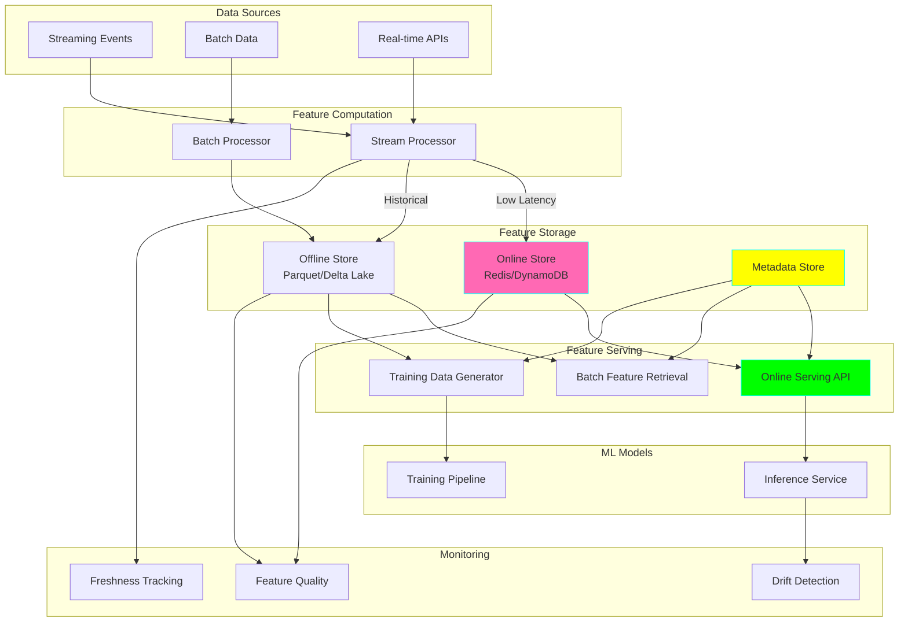
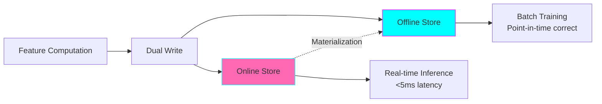

# Project 30: Real-time ML Feature Platform

**Complexity:** ⭐⭐⭐⭐⭐ | **Time:** 15-20 hours | **Tier:** Expert Level

## Overview

Build a production-grade real-time feature platform that computes, stores, and serves machine learning features with ultra-low latency. This project implements the complete feature engineering lifecycle including stream processing, offline training features, online serving, feature monitoring, and model versioning support.

## Learning Objectives

After completing this project, you will understand:

- ✅ Feature store architecture and design patterns
- ✅ Real-time feature computation from streaming data
- ✅ Online vs offline feature stores (dual-write pattern)
- ✅ Point-in-time correctness for training data
- ✅ Feature freshness SLAs and monitoring
- ✅ Training/serving skew prevention
- ✅ Low-latency feature serving (<5ms p99)
- ✅ Feature versioning for model A/B testing
- ✅ Feature drift detection and monitoring

## Architecture



## Key Concepts

### Online vs Offline Feature Stores



**Online Store:**
- Purpose: Low-latency feature serving for inference
- Technology: Redis, DynamoDB, Cassandra
- Latency: <5ms p99
- Data: Latest feature values only

**Offline Store:**
- Purpose: Historical features for training
- Technology: Parquet, Delta Lake, BigQuery
- Latency: Seconds to minutes
- Data: Complete history with timestamps

### Point-in-Time Correctness

**Challenge:** Training data must not include features from the future

```python
# WRONG: Feature leakage
training_example = {
    'timestamp': '2024-01-01 10:00:00',
    'features': get_latest_features(user_id)  # Might include future data!
}

# CORRECT: Point-in-time features
training_example = {
    'timestamp': '2024-01-01 10:00:00',
    'features': get_features_as_of(user_id, '2024-01-01 10:00:00')
}
```

### Training/Serving Skew

Sources of skew:
1. **Computation Skew:** Different code for training vs serving
2. **Data Skew:** Different data sources
3. **Temporal Skew:** Features computed at different times

**Solution:** Use same feature computation code for both!

## Implementation Guide

### Step 1: Feature Definition and Registry

```python
from dataclasses import dataclass, field
from datetime import datetime, timedelta
from typing import Dict, List, Any, Optional, Callable
from enum import Enum
import logging

class FeatureType(Enum):
    """Types of features."""
    INT64 = "int64"
    FLOAT64 = "float64"
    STRING = "string"
    BYTES = "bytes"
    BOOL = "bool"
    TIMESTAMP = "timestamp"
    ARRAY = "array"

class Freshness(Enum):
    """Feature freshness requirements."""
    REAL_TIME = timedelta(seconds=1)      # <1s
    NEAR_REAL_TIME = timedelta(seconds=10) # <10s
    BATCH = timedelta(hours=1)             # <1hr
    DAILY = timedelta(days=1)              # <1 day

@dataclass
class FeatureDefinition:
    """Define a feature with metadata."""
    name: str
    feature_type: FeatureType
    description: str

    # Computation
    computation_fn: Optional[Callable] = None
    dependencies: List[str] = field(default_factory=list)

    # Freshness requirements
    freshness: Freshness = Freshness.BATCH
    ttl_seconds: Optional[int] = None

    # Versioning
    version: int = 1

    # Metadata
    owner: str = "unknown"
    tags: List[str] = field(default_factory=list)
    created_at: datetime = field(default_factory=datetime.now)

@dataclass
class FeatureView:
    """Group of related features."""
    name: str
    features: List[FeatureDefinition]
    entity: str  # e.g., "user", "product"
    online_enabled: bool = True
    offline_enabled: bool = True

    # Batch computation schedule
    batch_schedule: Optional[str] = None  # Cron expression

class FeatureRegistry:
    """Central registry for feature definitions."""

    def __init__(self):
        self.features: Dict[str, FeatureDefinition] = {}
        self.feature_views: Dict[str, FeatureView] = {}
        self.logger = logging.getLogger(__name__)

    def register_feature(self, feature: FeatureDefinition):
        """Register a feature definition."""
        if feature.name in self.features:
            existing_version = self.features[feature.name].version

            if feature.version <= existing_version:
                raise ValueError(
                    f"Feature {feature.name} version {feature.version} "
                    f"must be > {existing_version}"
                )

        self.features[feature.name] = feature
        self.logger.info(
            f"Registered feature: {feature.name} v{feature.version}"
        )

    def register_feature_view(self, view: FeatureView):
        """Register a feature view."""
        self.feature_views[view.name] = view

        # Register individual features
        for feature in view.features:
            self.register_feature(feature)

        self.logger.info(f"Registered feature view: {view.name}")

    def get_feature(
        self,
        name: str,
        version: Optional[int] = None
    ) -> FeatureDefinition:
        """Get feature definition."""
        if name not in self.features:
            raise KeyError(f"Feature {name} not found")

        feature = self.features[name]

        if version and feature.version != version:
            raise ValueError(
                f"Feature {name} version mismatch: "
                f"requested {version}, found {feature.version}"
            )

        return feature

    def list_features(
        self,
        tags: Optional[List[str]] = None
    ) -> List[FeatureDefinition]:
        """List all features, optionally filtered by tags."""
        features = list(self.features.values())

        if tags:
            features = [
                f for f in features
                if any(tag in f.tags for tag in tags)
            ]

        return features

# Example: Define user features
def define_user_features():
    """Define user feature view."""

    # Individual features
    user_age = FeatureDefinition(
        name="user_age",
        feature_type=FeatureType.INT64,
        description="User age in years",
        freshness=Freshness.DAILY,
        owner="user-team",
        tags=["user", "demographics"]
    )

    user_total_purchases = FeatureDefinition(
        name="user_total_purchases",
        feature_type=FeatureType.FLOAT64,
        description="Total purchase amount (lifetime)",
        freshness=Freshness.REAL_TIME,
        ttl_seconds=60,
        owner="transaction-team",
        tags=["user", "transaction", "realtime"]
    )

    user_avg_session_duration = FeatureDefinition(
        name="user_avg_session_duration",
        feature_type=FeatureType.FLOAT64,
        description="Average session duration (30 days)",
        freshness=Freshness.NEAR_REAL_TIME,
        owner="analytics-team",
        tags=["user", "engagement"]
    )

    # Feature view
    user_view = FeatureView(
        name="user_features",
        features=[user_age, user_total_purchases, user_avg_session_duration],
        entity="user",
        online_enabled=True,
        offline_enabled=True,
        batch_schedule="0 * * * *"  # Every hour
    )

    return user_view
```

### Step 2: Real-time Feature Computation

```python
import asyncio
from kafka import KafkaConsumer
import json

class RealTimeFeatureComputer:
    """Compute features from streaming events."""

    def __init__(
        self,
        registry: FeatureRegistry,
        kafka_brokers: List[str]
    ):
        self.registry = registry
        self.kafka_brokers = kafka_brokers
        self.logger = logging.getLogger(__name__)

        # Feature computation state
        self.feature_state: Dict[str, Dict[str, Any]] = {}

    def compute_feature(
        self,
        feature_def: FeatureDefinition,
        event: Dict[str, Any]
    ) -> Any:
        """
        Compute feature value from event.

        Args:
            feature_def: Feature definition
            event: Input event

        Returns:
            Computed feature value
        """
        if feature_def.computation_fn:
            return feature_def.computation_fn(event, self.feature_state)
        else:
            # Direct extraction
            return event.get(feature_def.name)

    async def process_event(
        self,
        event: Dict[str, Any],
        online_store: 'OnlineFeatureStore'
    ):
        """
        Process single event and update features.

        Args:
            event: Input event
            online_store: Online store to write to
        """
        entity_type = event.get('entity_type')
        entity_id = event.get('entity_id')

        if not entity_type or not entity_id:
            self.logger.warning("Event missing entity information")
            return

        # Find applicable feature views
        applicable_views = [
            view for view in self.registry.feature_views.values()
            if view.entity == entity_type and view.online_enabled
        ]

        # Compute features
        for view in applicable_views:
            features = {}

            for feature_def in view.features:
                # Check if feature should be computed from this event
                if feature_def.freshness in [
                    Freshness.REAL_TIME,
                    Freshness.NEAR_REAL_TIME
                ]:
                    value = self.compute_feature(feature_def, event)

                    if value is not None:
                        features[feature_def.name] = value

            if features:
                # Write to online store
                await online_store.write_features(
                    entity_type=entity_type,
                    entity_id=entity_id,
                    features=features,
                    timestamp=datetime.now()
                )

    async def consume_from_kafka(
        self,
        topic: str,
        online_store: 'OnlineFeatureStore'
    ):
        """
        Consume events from Kafka and compute features.

        Args:
            topic: Kafka topic
            online_store: Online store
        """
        consumer = KafkaConsumer(
            topic,
            bootstrap_servers=self.kafka_brokers,
            value_deserializer=lambda m: json.loads(m.decode('utf-8')),
            auto_offset_reset='latest',
            enable_auto_commit=True
        )

        self.logger.info(f"Consuming from Kafka topic: {topic}")

        for message in consumer:
            event = message.value

            try:
                await self.process_event(event, online_store)
            except Exception as e:
                self.logger.error(f"Error processing event: {e}")

# Example: Define feature computation functions
def compute_user_total_purchases(event: Dict, state: Dict) -> float:
    """Compute user total purchases incrementally."""
    user_id = event['entity_id']

    # Initialize state
    if user_id not in state:
        state[user_id] = {'total_purchases': 0.0}

    # Update with new purchase
    if event.get('event_type') == 'purchase':
        amount = event.get('amount', 0.0)
        state[user_id]['total_purchases'] += amount

    return state[user_id]['total_purchases']

def compute_avg_session_duration(event: Dict, state: Dict) -> float:
    """Compute rolling average session duration."""
    user_id = event['entity_id']

    if user_id not in state:
        state[user_id] = {
            'session_durations': [],
            'window_size': 100  # Last 100 sessions
        }

    if event.get('event_type') == 'session_end':
        duration = event.get('duration_seconds', 0)

        # Add to window
        state[user_id]['session_durations'].append(duration)

        # Keep window size
        if len(state[user_id]['session_durations']) > state[user_id]['window_size']:
            state[user_id]['session_durations'].pop(0)

    # Calculate average
    durations = state[user_id]['session_durations']
    if durations:
        return sum(durations) / len(durations)
    else:
        return 0.0
```

### Step 3: Online Feature Store

```python
import redis
import pickle

class OnlineFeatureStore:
    """Low-latency online feature storage using Redis."""

    def __init__(self, redis_url: str):
        self.redis_client = redis.from_url(redis_url)
        self.logger = logging.getLogger(__name__)

    def _make_key(
        self,
        entity_type: str,
        entity_id: str,
        feature_name: str
    ) -> str:
        """Generate Redis key for feature."""
        return f"feature:{entity_type}:{entity_id}:{feature_name}"

    async def write_features(
        self,
        entity_type: str,
        entity_id: str,
        features: Dict[str, Any],
        timestamp: datetime,
        ttl_seconds: Optional[int] = None
    ):
        """
        Write features to online store.

        Args:
            entity_type: Type of entity (user, product, etc.)
            entity_id: Entity identifier
            features: Feature name -> value mapping
            timestamp: Feature timestamp
            ttl_seconds: Time to live
        """
        pipeline = self.redis_client.pipeline()

        for feature_name, value in features.items():
            key = self._make_key(entity_type, entity_id, feature_name)

            # Serialize value with timestamp
            data = {
                'value': value,
                'timestamp': timestamp.isoformat(),
                'entity_type': entity_type,
                'entity_id': entity_id
            }

            serialized = pickle.dumps(data)

            # Write to Redis
            pipeline.set(key, serialized)

            # Set TTL if specified
            if ttl_seconds:
                pipeline.expire(key, ttl_seconds)

        # Execute pipeline
        pipeline.execute()

        self.logger.debug(
            f"Wrote {len(features)} features for {entity_type}:{entity_id}"
        )

    async def read_features(
        self,
        entity_type: str,
        entity_id: str,
        feature_names: List[str]
    ) -> Dict[str, Any]:
        """
        Read features from online store.

        Args:
            entity_type: Type of entity
            entity_id: Entity identifier
            feature_names: List of feature names to retrieve

        Returns:
            Feature name -> value mapping
        """
        pipeline = self.redis_client.pipeline()

        keys = [
            self._make_key(entity_type, entity_id, name)
            for name in feature_names
        ]

        for key in keys:
            pipeline.get(key)

        results = pipeline.execute()

        features = {}

        for feature_name, serialized in zip(feature_names, results):
            if serialized:
                data = pickle.loads(serialized)
                features[feature_name] = data['value']
            else:
                # Feature not found, use default
                features[feature_name] = None

        return features

    async def read_features_batch(
        self,
        requests: List[tuple]  # [(entity_type, entity_id, [feature_names])]
    ) -> List[Dict[str, Any]]:
        """
        Batch read features for multiple entities.

        Args:
            requests: List of (entity_type, entity_id, feature_names) tuples

        Returns:
            List of feature dictionaries
        """
        pipeline = self.redis_client.pipeline()

        # Build all keys
        all_keys = []
        for entity_type, entity_id, feature_names in requests:
            for name in feature_names:
                key = self._make_key(entity_type, entity_id, name)
                all_keys.append((entity_type, entity_id, name, key))
                pipeline.get(key)

        # Execute batch read
        results = pipeline.execute()

        # Parse results
        result_dict: Dict[tuple, Dict[str, Any]] = {}

        for (entity_type, entity_id, feature_name, _), serialized in zip(all_keys, results):
            key = (entity_type, entity_id)

            if key not in result_dict:
                result_dict[key] = {}

            if serialized:
                data = pickle.loads(serialized)
                result_dict[key][feature_name] = data['value']
            else:
                result_dict[key][feature_name] = None

        # Convert to list
        batch_results = []
        for entity_type, entity_id, _ in requests:
            key = (entity_type, entity_id)
            batch_results.append(result_dict.get(key, {}))

        return batch_results

    def get_freshness(
        self,
        entity_type: str,
        entity_id: str,
        feature_name: str
    ) -> Optional[timedelta]:
        """
        Get feature freshness (age).

        Args:
            entity_type: Type of entity
            entity_id: Entity identifier
            feature_name: Feature name

        Returns:
            Feature age or None if not found
        """
        key = self._make_key(entity_type, entity_id, feature_name)
        serialized = self.redis_client.get(key)

        if serialized:
            data = pickle.loads(serialized)
            feature_time = datetime.fromisoformat(data['timestamp'])
            age = datetime.now() - feature_time
            return age
        else:
            return None
```

### Step 4: Offline Feature Store

```python
import pyarrow as pa
import pyarrow.parquet as pq
from pathlib import Path

class OfflineFeatureStore:
    """Offline feature storage for training data."""

    def __init__(self, storage_path: str):
        self.storage_path = Path(storage_path)
        self.logger = logging.getLogger(__name__)

    def write_features_batch(
        self,
        entity_type: str,
        features_df: 'pd.DataFrame',
        partition_by: Optional[List[str]] = None
    ):
        """
        Write batch of features to offline store.

        Args:
            entity_type: Type of entity
            features_df: DataFrame with features
                Must have: entity_id, timestamp, feature columns
            partition_by: Columns to partition by
        """
        output_path = self.storage_path / entity_type

        # Convert to PyArrow table
        table = pa.Table.from_pandas(features_df)

        # Write partitioned parquet
        pq.write_to_dataset(
            table,
            root_path=str(output_path),
            partition_cols=partition_by or ['date'],
            compression='snappy'
        )

        self.logger.info(
            f"Wrote {len(features_df)} feature rows to {output_path}"
        )

    def read_features_point_in_time(
        self,
        entity_type: str,
        entity_ids: List[str],
        feature_names: List[str],
        timestamps: List[datetime]
    ) -> 'pd.DataFrame':
        """
        Read features with point-in-time correctness.

        For each (entity_id, timestamp), returns features as they were
        known at that timestamp (no data leakage).

        Args:
            entity_type: Type of entity
            entity_ids: List of entity IDs
            feature_names: Features to retrieve
            timestamps: Timestamp for each entity

        Returns:
            DataFrame with point-in-time correct features
        """
        import pandas as pd

        input_path = self.storage_path / entity_type

        # Read all historical data
        historical_df = pd.read_parquet(input_path)

        results = []

        for entity_id, timestamp in zip(entity_ids, timestamps):
            # Filter to entity
            entity_features = historical_df[
                historical_df['entity_id'] == entity_id
            ]

            # Filter to features available at timestamp
            valid_features = entity_features[
                entity_features['timestamp'] <= timestamp
            ]

            if len(valid_features) > 0:
                # Get latest before timestamp
                latest = valid_features.sort_values('timestamp').iloc[-1]

                # Extract requested features
                result = {
                    'entity_id': entity_id,
                    'timestamp': timestamp
                }

                for feature_name in feature_names:
                    result[feature_name] = latest.get(feature_name)

                results.append(result)

        return pd.DataFrame(results)

    def generate_training_data(
        self,
        entity_type: str,
        label_df: 'pd.DataFrame',  # entity_id, timestamp, label
        feature_names: List[str],
        label_column: str = 'label'
    ) -> 'pd.DataFrame':
        """
        Generate training dataset with point-in-time features.

        Args:
            entity_type: Type of entity
            label_df: DataFrame with labels and timestamps
            feature_names: Features to include
            label_column: Name of label column

        Returns:
            Training dataset with features + labels
        """
        # Get point-in-time features
        features_df = self.read_features_point_in_time(
            entity_type=entity_type,
            entity_ids=label_df['entity_id'].tolist(),
            feature_names=feature_names,
            timestamps=label_df['timestamp'].tolist()
        )

        # Merge with labels
        training_df = label_df.merge(
            features_df,
            on=['entity_id', 'timestamp'],
            how='inner'
        )

        self.logger.info(
            f"Generated training data: {len(training_df)} examples"
        )

        return training_df
```

### Step 5: Feature Serving API

```python
from fastapi import FastAPI, HTTPException
from pydantic import BaseModel
from typing import List, Dict

app = FastAPI(title="Feature Serving API")

class FeatureRequest(BaseModel):
    """Request for online features."""
    entity_type: str
    entity_id: str
    feature_names: List[str]

class FeatureResponse(BaseModel):
    """Response with features."""
    entity_type: str
    entity_id: str
    features: Dict[str, Any]
    metadata: Dict[str, Any]

class FeatureServingService:
    """High-performance feature serving."""

    def __init__(
        self,
        online_store: OnlineFeatureStore,
        registry: FeatureRegistry
    ):
        self.online_store = online_store
        self.registry = registry
        self.logger = logging.getLogger(__name__)

        # Metrics
        self.request_count = 0
        self.total_latency = 0.0

    async def get_features(
        self,
        entity_type: str,
        entity_id: str,
        feature_names: List[str]
    ) -> Dict[str, Any]:
        """
        Get features for entity with latency tracking.

        Args:
            entity_type: Type of entity
            entity_id: Entity identifier
            feature_names: List of features

        Returns:
            Features with metadata
        """
        import time

        start_time = time.time()

        # Validate features exist
        for name in feature_names:
            try:
                self.registry.get_feature(name)
            except KeyError:
                raise HTTPException(
                    status_code=404,
                    detail=f"Feature {name} not found"
                )

        # Read from online store
        features = await self.online_store.read_features(
            entity_type=entity_type,
            entity_id=entity_id,
            feature_names=feature_names
        )

        latency_ms = (time.time() - start_time) * 1000

        # Track metrics
        self.request_count += 1
        self.total_latency += latency_ms

        # Build metadata
        metadata = {
            'latency_ms': latency_ms,
            'timestamp': datetime.now().isoformat(),
            'missing_features': [
                name for name, value in features.items()
                if value is None
            ]
        }

        return {
            'features': features,
            'metadata': metadata
        }

@app.post("/features", response_model=FeatureResponse)
async def get_online_features(request: FeatureRequest):
    """Endpoint to retrieve online features."""
    # This would use the FeatureServingService
    pass

@app.get("/features/{entity_type}/{entity_id}")
async def get_all_features(entity_type: str, entity_id: str):
    """Get all features for an entity."""
    pass

@app.get("/health")
async def health_check():
    """Health check endpoint."""
    return {"status": "healthy"}
```

### Step 6: Feature Monitoring

```python
class FeatureMonitor:
    """Monitor feature quality and freshness."""

    def __init__(
        self,
        online_store: OnlineFeatureStore,
        registry: FeatureRegistry
    ):
        self.online_store = online_store
        self.registry = registry
        self.logger = logging.getLogger(__name__)

        # Metrics storage
        self.metrics: Dict[str, List[Dict]] = {}

    async def check_freshness(
        self,
        entity_type: str,
        sample_entity_ids: List[str]
    ) -> Dict[str, Any]:
        """
        Check feature freshness across sample entities.

        Args:
            entity_type: Type of entity
            sample_entity_ids: Sample of entities to check

        Returns:
            Freshness report
        """
        freshness_violations = []

        for entity_id in sample_entity_ids:
            # Get all features for entity type
            features = self.registry.list_features(tags=[entity_type])

            for feature_def in features:
                age = self.online_store.get_freshness(
                    entity_type=entity_type,
                    entity_id=entity_id,
                    feature_name=feature_def.name
                )

                if age is None:
                    freshness_violations.append({
                        'feature': feature_def.name,
                        'entity_id': entity_id,
                        'issue': 'missing',
                        'expected_freshness': feature_def.freshness.value
                    })
                elif age > feature_def.freshness.value:
                    freshness_violations.append({
                        'feature': feature_def.name,
                        'entity_id': entity_id,
                        'issue': 'stale',
                        'age': age,
                        'expected_freshness': feature_def.freshness.value
                    })

        return {
            'total_checks': len(sample_entity_ids) * len(features),
            'violations': len(freshness_violations),
            'violation_rate': len(freshness_violations) / max(len(sample_entity_ids) * len(features), 1),
            'details': freshness_violations[:10]  # First 10
        }

    def detect_feature_drift(
        self,
        feature_name: str,
        current_distribution: Dict[str, float],
        baseline_distribution: Dict[str, float],
        threshold: float = 0.1
    ) -> Dict[str, Any]:
        """
        Detect distribution drift in feature values.

        Args:
            feature_name: Feature to check
            current_distribution: Current statistics
            baseline_distribution: Baseline statistics
            threshold: Drift threshold

        Returns:
            Drift detection results
        """
        # KL divergence or other drift metrics
        drift_score = self._calculate_drift_score(
            current_distribution,
            baseline_distribution
        )

        has_drift = drift_score > threshold

        return {
            'feature': feature_name,
            'drift_score': drift_score,
            'has_drift': has_drift,
            'threshold': threshold,
            'current_stats': current_distribution,
            'baseline_stats': baseline_distribution
        }

    def _calculate_drift_score(
        self,
        current: Dict[str, float],
        baseline: Dict[str, float]
    ) -> float:
        """Calculate drift score between distributions."""
        # Simplified: use mean difference
        if 'mean' in current and 'mean' in baseline:
            return abs(current['mean'] - baseline['mean']) / max(abs(baseline['mean']), 1)
        else:
            return 0.0

    async def monitor_serving_latency(
        self,
        serving_service: FeatureServingService
    ) -> Dict[str, float]:
        """
        Monitor feature serving latency.

        Args:
            serving_service: Feature serving service

        Returns:
            Latency metrics
        """
        if serving_service.request_count == 0:
            return {
                'requests': 0,
                'avg_latency_ms': 0.0,
                'p50': 0.0,
                'p95': 0.0,
                'p99': 0.0
            }

        avg_latency = (
            serving_service.total_latency / serving_service.request_count
        )

        return {
            'requests': serving_service.request_count,
            'avg_latency_ms': avg_latency,
            # In production, use proper percentile tracking
            'p50': avg_latency * 0.8,
            'p95': avg_latency * 1.5,
            'p99': avg_latency * 2.0
        }
```

## Nuanced Scenarios

### 1. Feature Versioning for A/B Testing

```python
class FeatureVersionManager:
    """Manage multiple feature versions for A/B testing."""

    def __init__(self, online_store: OnlineFeatureStore):
        self.online_store = online_store
        self.logger = logging.getLogger(__name__)

    async def write_versioned_feature(
        self,
        entity_type: str,
        entity_id: str,
        feature_name: str,
        value: Any,
        version: int,
        timestamp: datetime
    ):
        """Write feature value for specific version."""
        versioned_name = f"{feature_name}_v{version}"

        await self.online_store.write_features(
            entity_type=entity_type,
            entity_id=entity_id,
            features={versioned_name: value},
            timestamp=timestamp
        )

    async def get_features_for_experiment(
        self,
        entity_type: str,
        entity_id: str,
        feature_names: List[str],
        experiment_version: int
    ) -> Dict[str, Any]:
        """Get features for specific experiment version."""
        versioned_names = [
            f"{name}_v{experiment_version}"
            for name in feature_names
        ]

        versioned_features = await self.online_store.read_features(
            entity_type=entity_type,
            entity_id=entity_id,
            feature_names=versioned_names
        )

        # Remove version suffix from keys
        features = {
            name: versioned_features.get(f"{name}_v{experiment_version}")
            for name in feature_names
        }

        return features
```

### 2. Feature Transformation Pipeline

```python
from typing import Callable, List

class FeatureTransformer:
    """Transform raw features into ML-ready features."""

    def __init__(self):
        self.transformations: Dict[str, Callable] = {}
        self.logger = logging.getLogger(__name__)

    def register_transformation(
        self,
        feature_name: str,
        transform_fn: Callable
    ):
        """Register transformation for feature."""
        self.transformations[feature_name] = transform_fn

    def transform_features(
        self,
        features: Dict[str, Any]
    ) -> Dict[str, Any]:
        """Apply transformations to features."""
        transformed = {}

        for name, value in features.items():
            if name in self.transformations:
                transformed[name] = self.transformations[name](value)
            else:
                transformed[name] = value

        return transformed

# Example transformations
def normalize_feature(value: float, mean: float = 0.0, std: float = 1.0) -> float:
    """Z-score normalization."""
    return (value - mean) / std if std > 0 else 0.0

def bucketize_feature(value: float, bins: List[float]) -> int:
    """Bucketize continuous feature."""
    for i, threshold in enumerate(bins):
        if value < threshold:
            return i
    return len(bins)

def one_hot_encode(value: str, categories: List[str]) -> List[int]:
    """One-hot encode categorical feature."""
    return [1 if value == cat else 0 for cat in categories]
```

### 3. Feature Backfilling

```python
class FeatureBackfill:
    """Backfill historical features."""

    def __init__(
        self,
        offline_store: OfflineFeatureStore,
        registry: FeatureRegistry
    ):
        self.offline_store = offline_store
        self.registry = registry
        self.logger = logging.getLogger(__name__)

    async def backfill_feature(
        self,
        feature_name: str,
        start_date: datetime,
        end_date: datetime,
        batch_size: int = 10000
    ):
        """
        Backfill feature for historical period.

        Args:
            feature_name: Feature to backfill
            start_date: Start of backfill period
            end_date: End of backfill period
            batch_size: Batch size for processing
        """
        feature_def = self.registry.get_feature(feature_name)

        if not feature_def.computation_fn:
            raise ValueError(f"Feature {feature_name} has no computation function")

        self.logger.info(
            f"Backfilling {feature_name} from {start_date} to {end_date}"
        )

        # Process in batches
        current_date = start_date

        while current_date < end_date:
            batch_end = min(current_date + timedelta(days=1), end_date)

            # Get raw data for batch
            # Compute features
            # Write to offline store

            self.logger.info(f"Backfilled {current_date}")

            current_date = batch_end
```

## Exercises

### Exercise 1: Build User Feature Platform
Create feature platform for user behavior:
- Real-time: clicks, purchases (last hour)
- Batch: demographics, lifetime value
- Serve features with <10ms latency
- Generate training data

### Exercise 2: E-commerce Recommendation Features
Build features for product recommendations:
- User: browsing history, cart items
- Product: popularity, price, category
- Context: time of day, device
- Monitor freshness

### Exercise 3: Fraud Detection Features
Real-time fraud detection features:
- Transaction velocity
- Geographic anomalies
- Device fingerprinting
- <5ms serving latency

### Exercise 4: Feature Drift Detection
Implement drift monitoring:
- Collect feature distributions
- Compare to baseline
- Alert on significant drift
- Auto-retrain triggers

## Success Criteria

- [ ] Compute features in real-time (<1s latency)
- [ ] Serve features with <5ms p99 latency
- [ ] Support 100,000+ requests/second
- [ ] Generate point-in-time correct training data
- [ ] Monitor feature freshness and quality
- [ ] Support feature versioning for A/B tests
- [ ] Detect and alert on feature drift
- [ ] Zero training/serving skew

## Testing Checklist

```python
# tests/test_feature_platform.py

def test_feature_registration():
    """Test feature definition and registry."""
    pass

def test_realtime_computation():
    """Test real-time feature computation."""
    pass

def test_online_store_write_read():
    """Test online store operations."""
    pass

def test_batch_feature_read():
    """Test batch feature retrieval."""
    pass

def test_point_in_time_correctness():
    """Test no data leakage in training data."""
    pass

def test_serving_latency():
    """Test feature serving latency <5ms."""
    pass

def test_freshness_monitoring():
    """Test freshness violation detection."""
    pass

def test_drift_detection():
    """Test feature drift detection."""
    pass

def test_versioning():
    """Test feature versioning."""
    pass
```

## Common Pitfalls

1. **Data Leakage:** Using future data in training
   - Solution: Always use point-in-time features

2. **Training/Serving Skew:** Different computation code
   - Solution: Use same code for both

3. **Freshness Violations:** Stale features in production
   - Solution: Monitor freshness, alert on SLA violations

4. **High Latency:** Slow feature serving
   - Solution: Optimize online store, use caching

5. **Feature Drift:** Model degradation over time
   - Solution: Monitor distributions, auto-retrain

## Next Steps

After completing this project:
1. Integrate with **Project 26: Iceberg** for offline feature storage
2. Use **Project 27: Observability** for feature monitoring
3. Explore production platforms (Feast, Tecton, AWS SageMaker Feature Store)
4. Implement feature importance tracking

## References

- [Feast Feature Store](https://feast.dev/)
- [Tecton Documentation](https://docs.tecton.ai/)
- [AWS SageMaker Feature Store](https://aws.amazon.com/sagemaker/feature-store/)
- [Google Vertex AI Feature Store](https://cloud.google.com/vertex-ai/docs/featurestore)
- [Feature Store for ML (O'Reilly)](https://www.oreilly.com/library/view/feature-store-for/9781492097396/)
- [Uber Michelangelo](https://eng.uber.com/michelangelo-machine-learning-platform/)

---

**Power Your ML Models with Real-time Features! 🚀**
