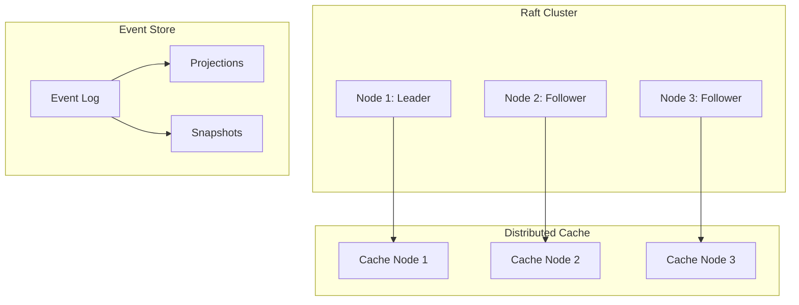

# 🌐 Distributed Systems from Scratch

**Status:** 🚧 In Progress | **Tech:** Rust | **Timeline:** 8-12 weeks

## Overview

Build distributed systems fundamentals from scratch. Raft consensus, distributed cache, event sourcing. Natural progression from language-models-from-scratch.

## Projects

### 1. Raft Consensus (Weeks 1-4)

Build a Raft consensus implementation from the paper.

**Features:**
- Leader election
- Log replication
- Safety guarantees
- Cluster membership changes

**Learning:**
- Distributed consensus
- State machines
- Network protocols
- Fault tolerance

### 2. Distributed Cache (Weeks 5-8)

Build a distributed in-memory cache.

**Features:**
- Consistent hashing
- Replication
- Sharding
- Cache invalidation

**Learning:**
- Data distribution
- Consistency models
- Performance optimization
- Scalability patterns

### 3. Event Sourcing System (Weeks 9-12)

Build event sourcing with CQRS.

**Features:**
- Event store
- Projections
- Snapshots
- Replay

**Learning:**
- Event-driven architecture
- CQRS pattern
- Eventual consistency
- Temporal queries

## Architecture



## Quick Start

```bash
# Raft implementation
cd projects/distributed-systems-from-scratch/raft
cargo run --bin raft-node

# Distributed cache
cd ../cache
cargo run --bin cache-server

# Event sourcing
cd ../event-sourcing
cargo run --bin event-store
```

## Learning Path

**Week 1-2: Raft Leader Election**
- Implement election timeout
- Candidate voting
- Leader heartbeats

**Week 3-4: Log Replication**
- Log entries
- Consistency checks
- Commit index

**Week 5-6: Distributed Cache Basics**
- Consistent hashing
- Get/Set operations
- TTL support

**Week 7-8: Cache Replication**
- Primary/replica model
- Sync vs async replication
- Failover

**Week 9-10: Event Store**
- Append-only log
- Event serialization
- Queries

**Week 11-12: Projections & CQRS**
- Read models
- Event handlers
- Snapshots

## Testing Strategy

- Unit tests for algorithms
- Integration tests for clusters
- Chaos testing (network partitions)
- Performance benchmarks

## Resources

- [Raft Paper](https://raft.github.io/raft.pdf)
- [Designing Data-Intensive Applications](https://dataintensive.net/)
- [Distributed Systems for Fun and Profit](http://book.mixu.net/distsys/)

## Graduation Criteria

- [ ] Raft passes all paper scenarios
- [ ] Cache handles 10k+ requests/sec
- [ ] Event store supports replay
- [ ] Comprehensive test suite
- [ ] Published as learning resource
