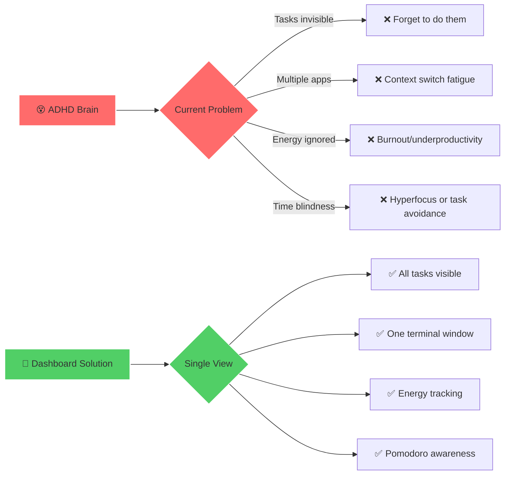
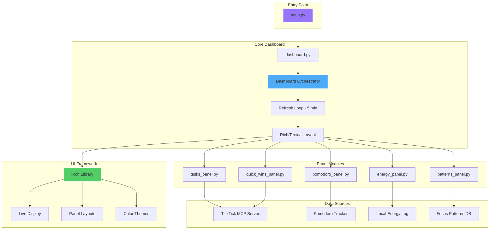

# 🧠 ADHD Executive Function Dashboard

**Status:** 🚧 In Progress

**Tech Stack:** Python 3.11+ | Rich/Textual | TickTick MCP | Pomodoro Tracker

**Last Updated:** 2025-11-16

## Problem & Solution

### The Problem

Living with ADHD creates specific executive function challenges:

- **Object Permanence Issues** - Tasks not visible = tasks don't exist
- **Overwhelm from Context Switching** - Checking multiple apps drains mental energy
- **Energy Management** - Difficulty tracking when you're most productive
- **Time Blindness** - Poor awareness of time passing during work
- **Analysis Paralysis** - Too many choices leads to decision fatigue

### The Solution

A **single-view terminal dashboard** that:

- ✅ **Makes everything visible** - All critical info in one place
- ✅ **Reduces context switching** - No need to open multiple apps
- ✅ **Tracks energy patterns** - Helps you work with your brain, not against it
- ✅ **Maintains focus** - Live Pomodoro timer keeps you aware of time
- ✅ **Reduces decision fatigue** - Shows only actionable quick wins



## Features

### 🎯 Core Functionality

1. **Live Dashboard** - Updates every 5 minutes automatically
2. **Multiple Information Panels** - All critical data in one view
3. **Beautiful Terminal UI** - Using Rich or Textual for visual appeal
4. **Minimal Cognitive Load** - Designed to reduce mental overhead

### 📊 Dashboard Panels

```mermaid
graph TD
    A[Executive Function Dashboard] --> B[Today's Tasks Panel]
    A --> C[Current Pomodoro Panel]
    A --> D[Energy Check-in Panel]
    A --> E[Focus Patterns Panel]
    A --> F[Quick Wins Panel]

    B --> B1[From TickTick MCP]
    B --> B2[Due today + overdue]
    B --> B3[Priority indicators]

    C --> C1[Current session status]
    C --> C2[Time remaining]
    C --> C3[Session count today]

    D --> D1[Current energy level]
    D --> D2[Simple prompts]
    D --> D3[Quick logging]

    E --> E1[Best focus times]
    E --> E2[Energy patterns]
    E --> E3[Visual graphs]

    F --> F1[Tasks < 15 min]
    F --> F2[Low cognitive load]
    F --> F3[Easy to start]

    style A fill:#9775fa,stroke:#ffffff,stroke-width:3px
    style B fill:#4dabf7,stroke:#ffffff
    style C fill:#51cf66,stroke:#ffffff
    style D fill:#ffd43b,stroke:#ffffff
    style E fill:#ff6b6b,stroke:#ffffff
    style F fill:#ff8787,stroke:#ffffff
```



## Architecture



## Tech Stack Details

| Component | Technology | Purpose |
|-----------|------------|---------|
| **UI Framework** | Rich or Textual | Beautiful terminal interfaces |
| **Task Integration** | TickTick MCP Server | Fetch today's tasks and quick wins |
| **Pomodoro** | Local tracker or API | Track focus sessions |
| **Data Storage** | SQLite | Store energy logs and patterns |
| **Environment** | Python 3.11+ | Modern Python features |
| **Package Manager** | uv | Fast dependency management |

## Environment Setup

### Prerequisites

- Python 3.11 or higher
- uv package manager (or pip)
- TickTick MCP server configured
- Terminal with color support

### Installation Steps

```bash
# 1. Navigate to project directory
cd /home/user/fantastic-engine/projects/executive-function-dashboard/

# 2. Check Python version (should be 3.11+)
python --version

# 3. Create virtual environment
uv venv

# 4. Activate virtual environment
source .venv/bin/activate

# 5. Install dependencies
uv pip install -r requirements.txt

# 6. Copy and configure environment variables
cp .env.example .env
# Edit .env with your settings

# 7. Run the dashboard
python main.py
```

### Environment Variables

Create a `.env` file with the following:

```env
# TickTick MCP Server
TICKTICK_API_KEY=your_api_key_here
TICKTICK_USERNAME=your_username

# Pomodoro Settings
POMODORO_WORK_MINUTES=25
POMODORO_BREAK_MINUTES=5
POMODORO_LONG_BREAK_MINUTES=15

# Dashboard Settings
REFRESH_INTERVAL_SECONDS=300  # 5 minutes
THEME=cyberpunk  # cyberpunk, nord, monokai

# Data Storage
DATABASE_PATH=./data/dashboard.db
```

## Project Structure

```
executive-function-dashboard/
├── README.md                 # This file
├── main.py                   # Entry point
├── dashboard.py              # Main dashboard orchestration
├── requirements.txt          # Python dependencies
├── .env.example             # Environment variables template
├── .python-version          # Python version specification
├── panels/                  # Dashboard panel modules
│   ├── __init__.py
│   ├── tasks_panel.py       # TickTick tasks display
│   ├── pomodoro_panel.py    # Current Pomodoro session
│   ├── energy_panel.py      # Energy check-ins
│   ├── patterns_panel.py    # Focus pattern visualization
│   └── quick_wins_panel.py  # Quick wins (<15 min tasks)
└── data/                    # Local data storage
    └── dashboard.db         # SQLite database
```

## Usage

### Running the Dashboard

```bash
# Standard run
python main.py

# Run with specific theme
python main.py --theme nord

# Run with custom refresh interval (in seconds)
python main.py --refresh 180  # 3 minutes
```

### Dashboard Interactions

| Key | Action |
|-----|--------|
| `q` | Quit dashboard |
| `r` | Refresh now |
| `e` | Log energy level |
| `p` | Start/pause Pomodoro |
| `t` | Mark task complete |
| `?` | Show help |

### Energy Check-in

When you press `e`, you'll see a simple prompt:

```
How's your energy right now?

1. 🔋 High - Ready to tackle complex tasks
2. ⚡ Medium - Good for regular work
3. 🪫 Low - Quick wins only
4. 💤 Depleted - Time for a break

Enter 1-4:
```

This data feeds into your focus patterns over time.

## Dependencies

### Core Dependencies

- **rich** - Beautiful terminal formatting and live displays
- **textual** (optional) - More advanced TUI framework if needed
- **python-dotenv** - Environment variable management
- **requests** - API calls to TickTick MCP
- **sqlalchemy** - Database ORM for energy/pattern tracking

### Optional Dependencies

- **matplotlib** - Generate ASCII graphs for focus patterns
- **tabulate** - Pretty table formatting

## Learning Log

### What I Learned

- [ ] Rich library live display capabilities
- [ ] Terminal UI design best practices
- [ ] ADHD-friendly information architecture
- [ ] MCP server integration patterns
- [ ] Real-time data refresh strategies

### Challenges Faced

- [ ] Balancing information density vs. overwhelm
- [ ] Choosing between Rich and Textual
- [ ] Designing intuitive keyboard shortcuts
- [ ] Optimizing refresh performance

### Next Steps

- [ ] Implement basic dashboard with Rich
- [ ] Integrate TickTick MCP server
- [ ] Add Pomodoro timer functionality
- [ ] Build energy logging system
- [ ] Create focus pattern visualization
- [ ] Add keyboard interaction handlers
- [ ] Optimize for different terminal sizes
- [ ] Add configuration file support
- [ ] Create automated tests
- [ ] Write comprehensive user guide

## Graduation Criteria

This project is ready to graduate to its own repository when:

- [x] All core panels implemented and working
- [x] TickTick MCP integration functional
- [x] Pomodoro tracking working
- [x] Energy logging and pattern visualization complete
- [x] Dashboard updates reliably every 5 minutes
- [x] Keyboard interactions fully implemented
- [x] Works on different terminal sizes (responsive)
- [x] Comprehensive documentation written
- [x] Unit tests covering core functionality
- [x] Installation/setup process tested by another user
- [x] Used daily for at least 2 weeks successfully
- [x] GitHub repo created with CI/CD setup

## Visual Examples

### Dashboard Layout Preview

```
╭─────────────────────────────── ADHD Executive Function Dashboard ───────────────────────────────╮
│                                    🧠 Your Command Center                                         │
│                                   Last updated: 14:23:15                                         │
├──────────────────────────────────────────────────────────────────────────────────────────────────┤
│                                                                                                  │
│  ┌─ 📋 TODAY'S TASKS ────────────────┐  ┌─ 🍅 CURRENT POMODORO ──────────┐                     │
│  │                                   │  │                                 │                     │
│  │  ⚠️  Overdue (2)                  │  │  Session 3/8 today             │                     │
│  │  • Fix login bug                 │  │                                 │                     │
│  │  • Review PR #123                │  │  🔴 WORKING                     │                     │
│  │                                   │  │  ⏱️  18:32 remaining            │                     │
│  │  🎯 Due Today (5)                 │  │                                 │                     │
│  │  • Write documentation           │  │  Next break in 18 mins          │                     │
│  │  • Team standup                  │  │                                 │                     │
│  │  • Deploy to staging             │  │  [p] Pause  [s] Skip            │                     │
│  │  • Update dependencies           │  │                                 │                     │
│  │  • Code review                   │  │                                 │                     │
│  │                                   │  │                                 │                     │
│  └───────────────────────────────────┘  └─────────────────────────────────┘                     │
│                                                                                                  │
│  ┌─ ⚡ ENERGY CHECK-IN ─────────────┐  ┌─ 📊 FOCUS PATTERNS ────────────┐                     │
│  │                                   │  │                                 │                     │
│  │  Current: ⚡ Medium               │  │  Best Focus Times:              │                     │
│  │  Last logged: 13:45              │  │                                 │                     │
│  │                                   │  │  🔋 9:00-11:00 AM  High        │                     │
│  │  [e] Log energy level            │  │  ⚡ 2:00-4:00 PM   Medium      │                     │
│  │                                   │  │  🪫 4:00-6:00 PM   Low         │                     │
│  │                                   │  │                                 │                     │
│  │                                   │  │  Pattern: Morning person        │                     │
│  │                                   │  │  Recommendation: Deep work AM   │                     │
│  │                                   │  │                                 │                     │
│  └───────────────────────────────────┘  └─────────────────────────────────┘                     │
│                                                                                                  │
│  ┌─ 🎯 QUICK WINS (<15 MIN) ────────────────────────────────────────────────────────────────┐   │
│  │                                                                                           │   │
│  │  • Update README typo (5 min)                                                            │   │
│  │  • Respond to email from Sarah (10 min)                                                  │   │
│  │  • Schedule dentist appointment (5 min)                                                  │   │
│  │                                                                                           │   │
│  │  [t] Mark complete  [n] Next task                                                        │   │
│  │                                                                                           │   │
│  └───────────────────────────────────────────────────────────────────────────────────────────┘   │
│                                                                                                  │
├──────────────────────────────────────────────────────────────────────────────────────────────────┤
│  [q] Quit  [r] Refresh  [e] Log Energy  [p] Pomodoro  [t] Complete Task  [?] Help              │
╰──────────────────────────────────────────────────────────────────────────────────────────────────╯
```

## Resources

### Documentation

- [Rich Documentation](https://rich.readthedocs.io/)
- [Textual Documentation](https://textual.textualize.io/)
- [TickTick API Docs](https://developer.ticktick.com/)

### Related Projects

- [fantastic-engine/experiments/pomodoro-tracker](../experiments/) - Pomodoro timer experiment
- [fantastic-engine/projects/ticktick-mcp](../ticktick-mcp/) - TickTick MCP server integration

### ADHD Resources

- [How to ADHD - Executive Function](https://www.youtube.com/c/HowtoADHD)
- [ADHD & Productivity](https://www.additudemag.com/category/manage-adhd-life/)

---

**Remember:** This dashboard is designed to work WITH your ADHD brain, not against it. The goal is to reduce cognitive load and make executive function tasks visible and manageable. 🧠✨
