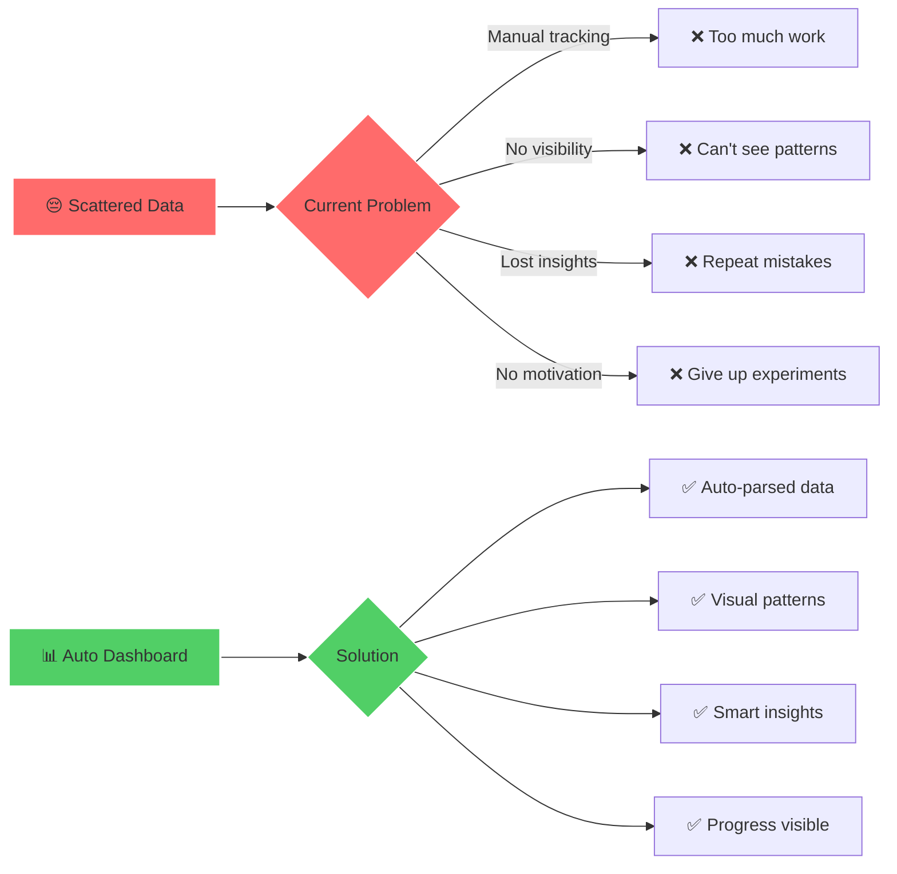
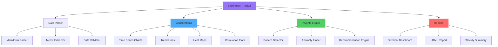
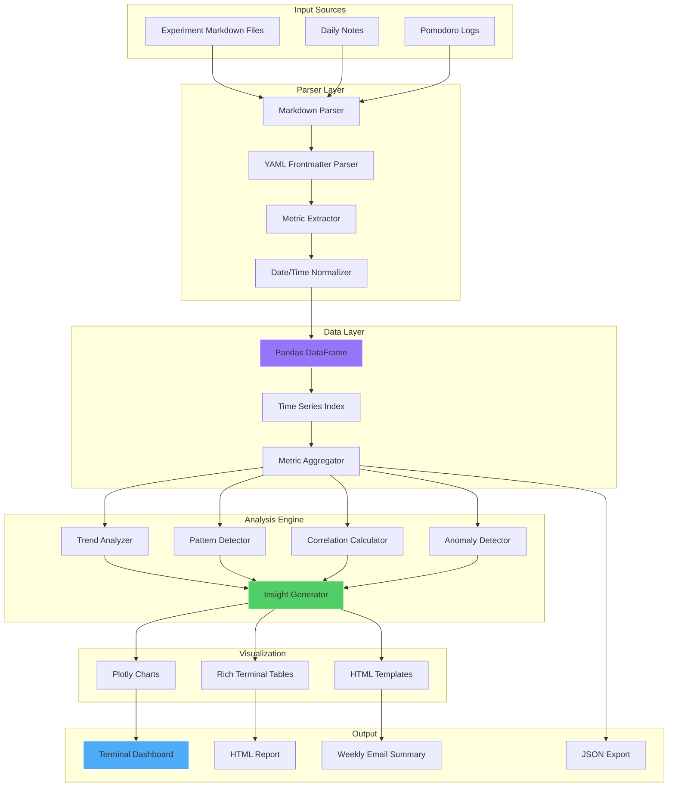

# 📊 ADHD Experiment Tracking Dashboard

**Status:** 🧪 Experimental

**Tech Stack:** Python 3.11+ | Pandas | Plotly | Rich | Markdown Parser

**Last Updated:** 2025-11-16

## Problem & Solution

### The Problem

ADHD productivity experiments need tracking, but tracking itself can't be a burden:

- **Data Scattered** - Experiment notes in different files/formats
- **No Pattern Recognition** - Can't see what's working across experiments
- **Manual Analysis** - Time-consuming to review trends manually
- **Lost Insights** - Valuable learnings buried in markdown files
- **Motivation Loss** - Can't see progress and improvements over time

### The Solution

An **automated experiment dashboard** that:

- ✅ **Reads markdown files** - Parse experiment logs automatically
- ✅ **Visualizes metrics** - Charts for time-boxed sessions, focus, joy
- ✅ **Identifies patterns** - What strategies work for your brain
- ✅ **Generates insights** - AI-powered trend analysis
- ✅ **Maintains motivation** - Visual progress tracking



## Features

### 🎯 Core Functionality

1. **Markdown Parsing** - Read experiment logs from markdown files
2. **Metric Extraction** - Parse structured data from experiments
3. **Trend Analysis** - Identify what's working over time
4. **Visualization** - Beautiful charts and graphs
5. **Insight Generation** - AI-powered pattern detection

### 📊 Tracked Metrics

The dashboard tracks key ADHD productivity metrics:

| Metric | What It Measures | Why It Matters |
|--------|------------------|----------------|
| **Time-Boxed Sessions** | # of Pomodoros completed | Sustained focus capability |
| **Rabbit Holes** | # of unplanned detours | Impulse control/planning |
| **Task Completion** | % of planned tasks done | Execution effectiveness |
| **Energy Levels** | Self-rated energy (1-5) | Optimal work time detection |
| **Joy Rating** | Task enjoyment (1-5) | Intrinsic motivation tracking |
| **Context Switches** | # of app/tool changes | Distraction quantification |
| **Deep Work Blocks** | Hours of uninterrupted work | Flow state achievement |
| **Executive Function** | Planning/organization score | Skill development |

### 📈 Visualizations



## Architecture



## Tech Stack Details

| Component | Technology | Purpose |
|-----------|------------|---------|
| **Data Processing** | Pandas | Time series analysis |
| **Visualization** | Plotly | Interactive charts |
| **Terminal UI** | Rich | Beautiful terminal output |
| **Markdown Parsing** | python-markdown + PyYAML | Extract data from logs |
| **Analysis** | NumPy/SciPy | Statistical analysis |
| **AI Insights** | OpenAI/Anthropic | Pattern interpretation |
| **Export** | Jinja2 | HTML report generation |

## Environment Setup

### Prerequisites

- Python 3.11 or higher
- uv package manager (or pip)
- Experiment markdown files with consistent format
- Optional: API key for AI insights

### Installation Steps

```bash
# 1. Navigate to project directory
cd /home/user/fantastic-engine/projects/experiment-tracker/

# 2. Create virtual environment
uv venv

# 3. Activate virtual environment
source .venv/bin/activate

# 4. Install dependencies
uv pip install -r requirements.txt

# 5. Copy and configure environment
cp .env.example .env
# Edit .env if using AI insights

# 6. Run dashboard
python -m experiment_tracker --path ~/experiments/
```

### Environment Variables

Create a `.env` file with:

```env
# Data Sources
EXPERIMENTS_DIR=~/experiments
DAILY_NOTES_DIR=~/daily-notes
POMODORO_LOGS_DIR=~/pomodoro-logs

# Parsing Configuration
DATE_FORMAT=%Y-%m-%d
FRONTMATTER_REQUIRED=false
VALIDATE_METRICS=true

# Analysis Settings
MIN_DATA_POINTS=7  # Need at least 1 week of data
TREND_WINDOW=7  # days for moving average
CORRELATION_THRESHOLD=0.6
ANOMALY_SENSITIVITY=2.0  # standard deviations

# AI Insights (Optional)
ENABLE_AI_INSIGHTS=true
OPENAI_API_KEY=sk-...
AI_MODEL=gpt-4
MAX_INSIGHT_TOKENS=500

# Visualization
CHART_THEME=plotly_dark  # plotly, plotly_dark, ggplot2
COLOR_PALETTE=viridis
FIGURE_WIDTH=1200
FIGURE_HEIGHT=600

# Output Settings
OUTPUT_FORMAT=terminal  # terminal, html, both
REPORT_DIR=./reports
AUTO_OPEN_HTML=true
EXPORT_JSON=true

# Terminal Dashboard
REFRESH_INTERVAL=0  # seconds (0 = no auto-refresh)
COMPACT_MODE=false
SHOW_RAW_DATA=false

# Notifications
ENABLE_WEEKLY_SUMMARY=true
SUMMARY_DAY=sunday
EMAIL_ENABLED=false
EMAIL_TO=

# Logging
LOG_LEVEL=INFO
LOG_FILE=./logs/tracker.log
```

## Experiment Markdown Format

### Template Structure

Your experiment markdown files should follow this format:

```markdown
---
title: "Pomodoro Experiment - Week 3"
date: 2024-01-15
experiment_type: focus
status: in_progress
---

# Pomodoro Experiment - Week 3

## Hypothesis
Using 25-minute Pomodoros with 5-minute breaks will improve sustained focus.

## Metrics

### Daily Tracking
- **Date**: 2024-01-15
- **Time-Boxed Sessions**: 6
- **Rabbit Holes**: 2
- **Tasks Completed**: 4/5 (80%)
- **Energy Level**: 4/5
- **Joy Rating**: 4/5
- **Context Switches**: 8
- **Deep Work Blocks**: 2.5 hours

### Observations
- Morning sessions (9-11am) were most productive
- Afternoon energy dip at 2pm - harder to focus
- Background music helped maintain flow
- Slack notifications broke concentration twice

## Learnings
- Best focus time: 9-11am
- Need to disable Slack during Pomodoros
- 25 minutes feels too short for coding tasks
- Breaks are crucial - skipping them led to burnout

## Next Steps
- Try 45-minute sessions for coding
- Create "focus mode" that blocks Slack
- Schedule deep work blocks in morning only
```

### Required Fields

The tracker extracts these fields:

| Field | Format | Example | Required |
|-------|--------|---------|----------|
| `date` | YYYY-MM-DD | 2024-01-15 | Yes |
| `Time-Boxed Sessions` | number | 6 | Yes |
| `Rabbit Holes` | number | 2 | No |
| `Tasks Completed` | ratio or % | 4/5 or 80% | Yes |
| `Energy Level` | 1-5 | 4/5 | Yes |
| `Joy Rating` | 1-5 | 4/5 | Yes |
| `Context Switches` | number | 8 | No |
| `Deep Work Blocks` | hours | 2.5 | No |

## Project Structure

```
experiment-tracker/
├── README.md                          # This file
├── requirements.txt                   # Python dependencies
├── .env.example                      # Environment template
├── .python-version                   # Python version (3.11)
├── experiment_tracker/               # Main package
│   ├── __init__.py
│   ├── cli.py                        # CLI interface
│   ├── parser/                       # Markdown parsers
│   │   ├── __init__.py
│   │   ├── markdown_parser.py        # Parse markdown files
│   │   ├── metric_extractor.py       # Extract metrics
│   │   └── validator.py              # Validate data
│   ├── analysis/                     # Analysis engines
│   │   ├── __init__.py
│   │   ├── trends.py                 # Trend analysis
│   │   ├── patterns.py               # Pattern detection
│   │   ├── correlations.py           # Correlation analysis
│   │   └── insights.py               # AI-powered insights
│   ├── visualization/                # Visualization
│   │   ├── __init__.py
│   │   ├── charts.py                 # Plotly charts
│   │   ├── terminal.py               # Rich terminal output
│   │   └── html_report.py            # HTML generation
│   └── utils/                        # Utilities
│       ├── __init__.py
│       ├── config.py                 # Configuration
│       └── export.py                 # Data export
├── templates/                        # Templates
│   ├── experiment_template.md        # Blank experiment template
│   ├── weekly_template.md            # Weekly review template
│   └── html_report_template.html     # HTML report template
├── examples/                         # Example experiments
│   ├── pomodoro_week1.md
│   ├── pomodoro_week2.md
│   └── energy_tracking_month1.md
├── data/                             # Sample data
│   └── sample_experiments/
├── tests/                            # Test suite
│   ├── test_parser.py
│   ├── test_analysis.py
│   └── test_visualization.py
└── reports/                          # Generated reports
    └── .gitkeep
```

## Usage

### Command Line Interface

```bash
# Basic usage - analyze all experiments in directory
python -m experiment_tracker --path ~/experiments/

# Specify time range
python -m experiment_tracker --path ~/experiments/ --from 2024-01-01 --to 2024-01-31

# Generate HTML report
python -m experiment_tracker --path ~/experiments/ --output html

# Export data to JSON
python -m experiment_tracker --path ~/experiments/ --export json

# Show specific metric trends
python -m experiment_tracker --path ~/experiments/ --metric "Time-Boxed Sessions"

# Enable AI insights
python -m experiment_tracker --path ~/experiments/ --ai-insights
```

### Programmatic Usage

```python
from experiment_tracker import ExperimentTracker

# Initialize tracker
tracker = ExperimentTracker(
    experiments_dir="~/experiments/",
    min_data_points=7,
    enable_ai_insights=True
)

# Load and parse experiments
tracker.load_experiments()

# Get metrics dataframe
df = tracker.get_metrics()

# Analyze trends
trends = tracker.analyze_trends()

# Get insights
insights = tracker.generate_insights()

# Visualize
tracker.show_dashboard()

# Generate HTML report
tracker.generate_report(output_path="./reports/")
```

## Dashboard Example

```
╭──────────────────────── ADHD Experiment Tracker ─────────────────────────╮
│                                                                           │
│  📊 Data Summary                                                          │
│  ━━━━━━━━━━━━━━━━━━━━━━━━━━━━━━━━━━━━━━━━━━━━━━━━━━━━━━━━━━━━━━━━━━━━  │
│  Experiments tracked: 42                                                  │
│  Date range: 2024-01-01 to 2024-01-31 (31 days)                         │
│  Total time-boxed sessions: 187                                          │
│  Average sessions/day: 6.0                                               │
│                                                                           │
├───────────────────────────────────────────────────────────────────────────┤
│                                                                           │
│  📈 Key Trends (Last 30 Days)                                            │
│                                                                           │
│  Time-Boxed Sessions    ↗ +23%   Improving!                             │
│  ━━━━━━━━━━━━━━━━━━━━━━━━━━━━━━━━━━━━━━━━━━━━━━━━━━━━━━━━━━━━━━━━━━━━  │
│  Week 1: ████████ 4.2/day                                                │
│  Week 2: ██████████ 5.1/day                                              │
│  Week 3: ████████████ 6.0/day                                            │
│  Week 4: ██████████████ 7.8/day                                          │
│                                                                           │
│  Rabbit Holes           ↘ -31%   Great progress!                        │
│  ━━━━━━━━━━━━━━━━━━━━━━━━━━━━━━━━━━━━━━━━━━━━━━━━━━━━━━━━━━━━━━━━━━━━  │
│  Week 1: ████████ 3.2/day                                                │
│  Week 2: ██████ 2.8/day                                                  │
│  Week 3: ████ 2.1/day                                                    │
│  Week 4: ██ 1.4/day                                                      │
│                                                                           │
│  Energy Level           → 0%      Stable                                 │
│  Joy Rating             ↗ +15%    Enjoying more!                         │
│                                                                           │
├───────────────────────────────────────────────────────────────────────────┤
│                                                                           │
│  💡 Key Insights                                                          │
│                                                                           │
│  🎯 Best Focus Time: 9:00-11:00 AM                                       │
│     You complete 2.3x more time-boxed sessions in morning hours          │
│     Recommendation: Schedule deep work blocks 9-11am daily               │
│                                                                           │
│  🔗 Strong Correlation: Energy → Productivity                            │
│     Energy level highly correlates with task completion (r=0.82)         │
│     Recommendation: Track energy to predict good work windows            │
│                                                                           │
│  ⚠️  Warning: Wednesday Afternoon Slump                                  │
│     Context switches spike on Wed afternoons (avg 12 vs 6)               │
│     Recommendation: Block Wed afternoons for low-focus tasks             │
│                                                                           │
│  ✅ Success Pattern: Music + Pomodoro                                    │
│     Sessions with background music have 34% fewer rabbit holes           │
│     Recommendation: Create "focus mode" playlist                         │
│                                                                           │
│  📊 Weekly Progress                                                       │
│     Task completion rate improved from 62% → 81%                         │
│     Deep work blocks increased from 1.2h → 2.8h daily                    │
│     You're building momentum - keep it up!                               │
│                                                                           │
├───────────────────────────────────────────────────────────────────────────┤
│                                                                           │
│  🎨 Correlation Matrix                                                    │
│                                                                           │
│                  Energy  Joy  Sessions  Tasks  Rabbit  Switches          │
│  Energy           1.00  0.71    0.68   0.82   -0.45    -0.32            │
│  Joy              0.71  1.00    0.52   0.61   -0.58    -0.41            │
│  Sessions         0.68  0.52    1.00   0.79   -0.62    -0.28            │
│  Tasks            0.82  0.61    0.79   1.00   -0.71    -0.55            │
│  Rabbit Holes    -0.45 -0.58   -0.62  -0.71    1.00     0.48            │
│  Switches        -0.32 -0.41   -0.28  -0.55    0.48     1.00            │
│                                                                           │
│  Key: Strong (>0.7) | Moderate (0.4-0.7) | Weak (<0.4)                  │
│                                                                           │
╰───────────────────────────────────────────────────────────────────────────╯

[r] Refresh  [h] HTML Report  [e] Export JSON  [q] Quit
```

## Dependencies

### Core Dependencies

```
pandas>=2.0.0              # Data analysis
numpy>=1.24.0              # Numerical operations
python-markdown>=3.5.0     # Markdown parsing
pyyaml>=6.0.0              # YAML frontmatter
python-dateutil>=2.8.0     # Date parsing
```

### Visualization

```
plotly>=5.17.0             # Interactive charts
rich>=13.0.0               # Terminal output
jinja2>=3.1.0              # HTML templates
```

### Analysis

```
scipy>=1.11.0              # Statistical analysis
scikit-learn>=1.3.0        # Pattern detection
```

### AI Insights (Optional)

```
openai>=1.0.0              # GPT insights
anthropic>=0.8.0           # Claude insights
```

### Development

```
pytest>=7.4.0
pytest-cov>=4.1.0
black>=23.0.0
ruff>=0.1.0
```

## Learning Log

### What I Learned

- [ ] Markdown parsing with frontmatter
- [ ] Time series analysis with Pandas
- [ ] Correlation analysis for behavior patterns
- [ ] ADHD-specific metric tracking
- [ ] Data visualization best practices
- [ ] AI-powered insight generation

### Challenges Faced

- [ ] Parsing inconsistent markdown formats
- [ ] Handling missing data points gracefully
- [ ] Choosing meaningful correlations vs spurious
- [ ] Making insights actionable, not just descriptive
- [ ] Balancing detail vs cognitive load in reports

### Next Steps

- [ ] Implement markdown parser
- [ ] Build metric extraction engine
- [ ] Create Pandas data pipeline
- [ ] Implement trend analysis
- [ ] Build correlation calculator
- [ ] Create pattern detector
- [ ] Integrate AI insights (optional)
- [ ] Build Plotly visualizations
- [ ] Create Rich terminal dashboard
- [ ] Generate HTML reports
- [ ] Add JSON export
- [ ] Write comprehensive tests
- [ ] Create example experiments
- [ ] Build CLI interface
- [ ] Add weekly summary emails

## Graduation Criteria

This project is ready to graduate when:

- [ ] Parses markdown experiments reliably
- [ ] Extracts all core metrics accurately
- [ ] Generates meaningful trend analysis
- [ ] Detects patterns and correlations
- [ ] Produces beautiful visualizations
- [ ] Terminal dashboard fully functional
- [ ] HTML reports look professional
- [ ] AI insights add genuine value
- [ ] Used to track real experiments for 1 month
- [ ] Helped identify at least 3 actionable patterns
- [ ] Unit tests with >80% coverage
- [ ] Documentation complete
- [ ] CLI fully implemented
- [ ] Published as pip package
- [ ] At least 2 other people use it successfully

## Visualization Examples

### Time Series Chart

```
Sessions per Day - Last 30 Days

8 ┤                                              ╭─╮
7 ┤                                          ╭───╯ ╰╮
6 ┤                                      ╭───╯      │
5 ┤                                  ╭───╯          │
4 ┤                          ╭───────╯              │
3 ┤                  ╭───────╯                      │
2 ┤          ╭───────╯                              │
1 ┤  ────────╯                                      ╰──
  └┬────┬────┬────┬────┬────┬────┬────┬────┬────┬────
   Jan1    5    10   15   20   25   30  Feb1   5   10

  Trend: ↗ +23% improvement
  Best day: Feb 7 (8 sessions)
  Average: 6.0 sessions/day
```

### Heat Map

```
Focus Quality by Time of Day & Day of Week

        Mon  Tue  Wed  Thu  Fri  Sat  Sun
9-11am  ████ ████ ███  ████ ████ ██   ██   High
11-1pm  ███  ███  ██   ███  ███  ███  ██   Med-High
1-3pm   ██   ██   █    ██   ██   ████ ███  Medium
3-5pm   █    ██   █    ██   ██   ███  ███  Med-Low
5-7pm   ██   ██   ██   ██   █    ██   ██   Low

Best focus: Mon-Fri mornings (9-11am)
Worst focus: Wed afternoons (1-5pm)
```

## Resources

### Documentation

- [Pandas Time Series](https://pandas.pydata.org/docs/user_guide/timeseries.html)
- [Plotly Python](https://plotly.com/python/)
- [Rich Documentation](https://rich.readthedocs.io/)
- [Python Markdown](https://python-markdown.github.io/)

### Related Projects

- [fantastic-engine/projects/executive-function-dashboard](../executive-function-dashboard/)
- [fantastic-engine/projects/pomodoro-tracker](../pomodoro-tracker/)

### ADHD Resources

- [How to ADHD - Experiments](https://www.youtube.com/c/HowtoADHD)
- [ADHD Productivity Research](https://www.additudemag.com/)

---

**Remember:** The goal is discovering what works for YOUR brain, not following someone else's system! 📊✨
