# 🎴 Flashcard Generator

**Status:** 🧪 Experimental
**Tech Stack:** Python 3.11, OpenAI GPT-4, Anki
**Purpose:** Generate Anki flashcards from Obsidian notes and technical documentation

---

## Problem

Creating flashcards manually is:
- ⏰ **Time-consuming** - Hours to create cards from lengthy notes
- 🎯 **Inconsistent** - Hard to identify key concepts uniformly
- 📚 **Tedious** - Boring, repetitive work
- 🧠 **Cognitive overhead** - Hard to do when ADHD brain is tired

**You need:** Automated flashcard generation that extracts key concepts from your notes.

---

## Solution

An AI-powered tool that:
1. **Reads** Obsidian markdown files
2. **Extracts** key concepts, definitions, code examples
3. **Generates** high-quality flashcards using GPT-4
4. **Formats** as Anki-compatible CSV
5. **Supports** cloze deletions, code snippets, diagrams


---

## Features

### Core Features
- ✅ **Smart Extraction** - Identifies key concepts, definitions, examples
- ✅ **Multiple Card Types** - Basic, cloze, code, image occlusion
- ✅ **Code-Aware** - Preserves syntax highlighting in code blocks
- ✅ **Anki CSV Format** - Ready to import
- ✅ **Batch Processing** - Process entire vault or folder
- ✅ **Tag Propagation** - Obsidian tags → Anki tags

### Advanced Features
- 🎯 **Spaced Repetition Hints** - Suggests initial ease/interval
- 🔗 **Linked Notes** - Creates cards for linked concepts
- 📊 **Difficulty Estimation** - Rates card difficulty
- 🎨 **Custom Templates** - Define your own card formats
- 🔄 **Incremental Updates** - Only generate new cards

---

## Architecture

```mermaid
flowchart TD
    A[Start] --> B[Scan Obsidian Files]
    B --> C{File Filter}
    C -->|Match| D[Parse Markdown]
    C -->|Skip| B
    D --> E[Extract Frontmatter]
    E --> F[Split by Headers]
    F --> G[Identify Content Types]
    G --> H{Content Type?}
    H -->|Definition| I[Extract Term & Meaning]
    H -->|Code Block| J[Extract Code & Explanation]
    H -->|List| K[Extract Items]
    H -->|Paragraph| L[Identify Key Concepts]
    I --> M[GPT-4: Generate Cards]
    J --> M
    K --> M
    L --> M
    M --> N[Format as Anki CSV]
    N --> O{More Files?}
    O -->|Yes| B
    O -->|No| P[Combine All Cards]
    P --> Q[Export CSV]
    Q --> R[✅ Done]

    style M fill:#00ffff,stroke:#ff00ff,stroke-width:2px
    style R fill:#00ff00,stroke:#ff00ff,stroke-width:2px
```



### Components

| Component | Purpose | Technology |
|-----------|---------|------------|
| **Markdown Parser** | Parse Obsidian notes | python-frontmatter |
| **Content Analyzer** | Identify card-worthy content | GPT-4 |
| **Card Generator** | Create flashcard Q&A | GPT-4 with prompts |
| **Anki Formatter** | Format CSV for import | csv module |
| **Code Highlighter** | Preserve syntax highlighting | Pygments |

---

## Installation

### Prerequisites
- Python 3.11
- OpenAI API key
- Anki desktop application
- Obsidian vault (optional)

### Setup

```bash
# Navigate to project
cd /home/user/fantastic-engine/projects/flashcard-generator

# Create virtual environment
python -m venv .venv
source .venv/bin/activate  # On Windows: .venv\Scripts\activate

# Install dependencies
pip install -r requirements.txt

# Copy environment template
cp .env.example .env

# Edit .env with your settings
nano .env
```

### Configuration

Edit `.env`:

```bash
# OpenAI Configuration
OPENAI_API_KEY=sk-your-api-key-here
OPENAI_MODEL=gpt-4-turbo-preview

# Input Settings
OBSIDIAN_VAULT_PATH=/path/to/obsidian/vault
INCLUDE_TAGS=learning,study,technical  # Only process notes with these tags (optional)
EXCLUDE_TAGS=private,draft

# Card Generation Settings
CARD_TYPES=basic,cloze,code
MAX_CARDS_PER_NOTE=20
MIN_CARD_QUALITY=7  # 1-10 scale, GPT rates quality

# Anki Settings
ANKI_DECK=Technical::Programming
ANKI_MODEL=Basic  # or Cloze, Code, etc.
OUTPUT_CSV_PATH=./output/anki_cards.csv

# Cost Tracking
TRACK_COSTS=true
MAX_COST_PER_RUN=5.00  # USD

# Logging
LOG_LEVEL=INFO
LOG_FILE=./logs/generator.log
```

---

## Usage

### 1. Generate Cards from Single File

```bash
# Generate from one file
python -m src.generate --file /path/to/note.md

# Specify output
python -m src.generate --file note.md --output my_cards.csv
```

**Output:**
```
📝 Processing: rust-async-programming.md

🔍 Analyzing content...
  ├─ Found 15 potential concepts
  ├─ Generating flashcards...
  └─ Created 12 cards (3 filtered by quality)

📊 Card Breakdown:
  ├─ Basic: 5
  ├─ Cloze: 4
  └─ Code: 3

💰 Cost: $0.18 | ⏱️ Time: 8s
✅ Cards saved to: anki_cards.csv
```

### 2. Batch Process Vault

```bash
# Process entire vault
python -m src.generate --vault /path/to/vault

# Process specific folder
python -m src.generate --vault /path/to/vault --folder "Learning/Programming"

# Filter by tags
python -m src.generate --vault /path/to/vault --tags "python,async"
```

**Output:**
```
📚 Processing vault: /Users/you/Documents/Obsidian

🔍 Scanning notes...
  ├─ Found 47 markdown files
  ├─ Filtered to 23 (by tags: python,async)
  └─ Processing...

📝 Progress: [████████████████████] 23/23

📊 Summary:
  ├─ Files processed: 23
  ├─ Total cards: 156
  ├─ Average quality: 8.2/10
  └─ Rejected: 18 (quality < 7)

💰 Total cost: $2.34 | ⏱️ Time: 3m 12s
✅ Cards saved to: anki_cards.csv

Next steps:
  1. Open Anki
  2. File → Import → Select anki_cards.csv
  3. Choose deck: Technical::Programming
  4. Import!
```

### 3. Python API

```python
from src.flashcard_generator import FlashcardGenerator

# Initialize
generator = FlashcardGenerator(
    api_key="sk-xxx",
    vault_path="/path/to/vault"
)

# Generate from file
cards = generator.generate_from_file("rust-async.md")

# Generate from text
text = """
# Async/Await in Rust

async/await is Rust's way of writing asynchronous code. An async function
returns a Future that must be awaited.

```rust
async fn hello() -> String {
    "Hello, world!".to_string()
}
```
"""

cards = generator.generate_from_text(text)

# Review cards
for card in cards:
    print(f"Q: {card.front}")
    print(f"A: {card.back}")
    print(f"Type: {card.card_type}")
    print(f"Quality: {card.quality_score}/10")
    print()

# Export to CSV
generator.export_to_csv(cards, "my_cards.csv")
```

---

## Examples

### Example 1: Definition Card

**Input (Obsidian note):**
```markdown
## What is a Closure?

A closure is a function that can capture variables from its surrounding scope.
```

**Generated Card:**
```
Front: What is a closure in programming?
Back: A function that can capture variables from its surrounding scope.
Type: Basic
Tags: programming, functions, closures
Quality: 9/10
```

### Example 2: Cloze Card

**Input:**
```markdown
The three pillars of observability are **metrics**, **logs**, and **traces**.
```

**Generated Card:**
```
Text: The three pillars of observability are {{c1::metrics}}, {{c2::logs}}, and {{c3::traces}}.
Type: Cloze
Tags: observability, monitoring
Quality: 8/10
```

### Example 3: Code Card

**Input:**
```markdown
Here's how to create a HashMap in Rust:

```rust
use std::collections::HashMap;

let mut scores = HashMap::new();
scores.insert("Blue", 10);
```
```

**Generated Card:**
```
Front: How do you create and populate a HashMap in Rust?
Back:
```rust
use std::collections::HashMap;

let mut scores = HashMap::new();
scores.insert("Blue", 10);
```
Type: Code
Tags: rust, hashmap, collections
Quality: 9/10
```

---

## Card Types

### Basic Card
- **Front:** Question
- **Back:** Answer
- **Use for:** Definitions, facts, simple Q&A

### Cloze Deletion
- **Text:** Sentence with {{c1::blanks}}
- **Use for:** Fill-in-the-blank, memorizing sequences

### Code Card
- **Front:** Programming question
- **Back:** Code snippet with explanation
- **Use for:** Syntax, algorithms, examples

### Image Occlusion (Future)
- **Image:** Diagram with hidden regions
- **Use for:** Architecture diagrams, flowcharts

---

## Anki Import

### Step 1: Export CSV

```bash
python -m src.generate --vault /path/to/vault --output anki_cards.csv
```

### Step 2: Import to Anki

1. Open Anki desktop
2. **File → Import**
3. Select `anki_cards.csv`
4. Configure import settings:
   - Type: **Basic** (or **Cloze**)
   - Deck: Choose target deck
   - Field mapping: Verify Front → Front, Back → Back
5. Click **Import**

### Step 3: Verify

- Check imported cards
- Adjust tags if needed
- Start studying!

---

## Project Structure

```
flashcard-generator/
├── README.md
├── requirements.txt
├── .env.example
├── .python-version
├── src/
│   ├── __init__.py
│   ├── flashcard_generator.py  # Main generator class
│   ├── markdown_parser.py      # Parse Obsidian markdown
│   ├── content_analyzer.py     # Analyze content types
│   ├── card_builder.py         # Build flashcards
│   ├── anki_formatter.py       # Format for Anki
│   ├── generate.py             # CLI
│   └── templates/
│       ├── basic_prompt.txt
│       ├── cloze_prompt.txt
│       └── code_prompt.txt
├── output/
│   └── anki_cards.csv          # Generated cards
└── tests/
    └── test_card_builder.py
```

---

## Cost Tracking

### OpenAI Costs (Approximate)

| Note Length | Estimated Cost (GPT-4) | Estimated Cost (GPT-3.5) |
|-------------|----------------------|------------------------|
| 500 words | $0.05 - $0.10 | $0.01 - $0.02 |
| 1000 words | $0.10 - $0.20 | $0.02 - $0.05 |
| 5000 words | $0.50 - $1.00 | $0.10 - $0.25 |

### Typical Costs

- **Single note:** $0.05 - $0.20
- **10 notes:** $0.50 - $2.00
- **100 notes:** $5.00 - $20.00

**Recommendation:** Use GPT-3.5 for basic cards, GPT-4 for complex technical content.

---

## Learning Log

### What I Learned
- [ ] GPT-4 prompting for educational content
- [ ] Anki CSV format and import process
- [ ] Markdown parsing with frontmatter
- [ ] Quality assessment for flashcards
- [ ] Spaced repetition best practices

### Challenges
- [ ] Identifying card-worthy content vs. fluff
- [ ] Balancing card count (too many vs. too few)
- [ ] Code formatting in Anki
- [ ] Handling images and diagrams
- [ ] Quality control for generated cards

### Next Steps
- [ ] Add image occlusion support
- [ ] Implement card review/editing UI
- [ ] Support for Quizlet and other platforms
- [ ] Audio pronunciation cards for languages
- [ ] Anki Connect integration (direct import)
- [ ] Pre-built prompt library for different subjects

---

## Graduation Criteria

- [ ] Generated 500+ cards from real notes
- [ ] 90%+ card quality score
- [ ] <$0.10 per card on average
- [ ] Anki import works seamlessly
- [ ] User feedback positive (cards are helpful)
- [ ] Batch processing works for 100+ files
- [ ] Documentation complete

---

## Resources

- [Anki Manual](https://docs.ankiweb.net/)
- [Anki CSV Import Guide](https://docs.ankiweb.net/importing.html)
- [Obsidian Markdown Syntax](https://help.obsidian.md/Editing+and+formatting/Basic+formatting+syntax)
- [Spaced Repetition Best Practices](https://www.supermemo.com/en/articles/20rules)

---

**Last Updated:** 2025-11-16
**Maintainer:** You (ADHD-friendly version)
