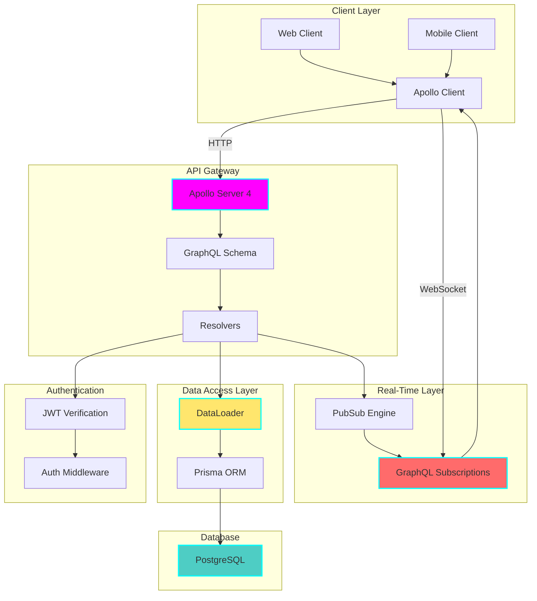
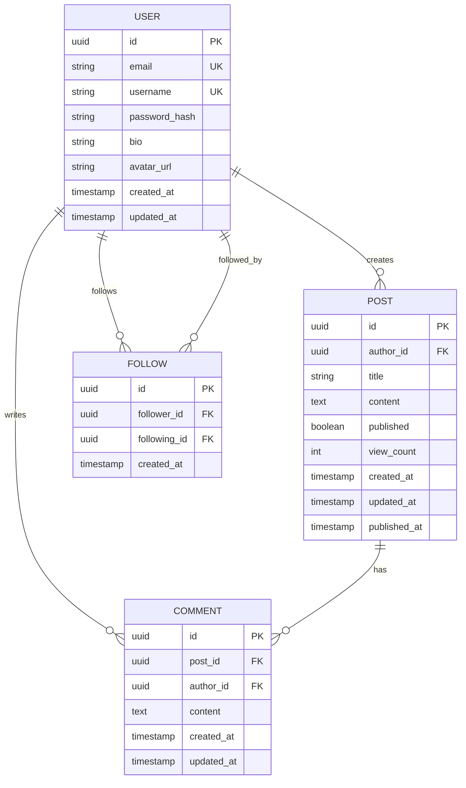

# 🚀 GraphQL API with Real-Time Subscriptions

**Status:** 🧪 Experimental

**Tech Stack:**
- **Backend:** Node.js 20+ / TypeScript
- **GraphQL Server:** Apollo Server 4
- **Database:** PostgreSQL 15+
- **Real-Time:** GraphQL Subscriptions (WebSockets)
- **ORM:** Prisma
- **Authentication:** JWT
- **Containerization:** Docker & Docker Compose

**Features:**
- ✅ Queries, Mutations, and Subscriptions
- ✅ DataLoader for N+1 query prevention
- ✅ Authentication middleware
- ✅ Real-time updates via WebSockets
- ✅ Schema-first design
- ✅ Type safety with TypeScript

---

## 📋 Table of Contents

- [Architecture Overview](#architecture-overview)
- [Database Schema](#database-schema)
- [GraphQL Schema](#graphql-schema)
- [Query Examples](#query-examples)
- [Mutation Examples](#mutation-examples)
- [Subscription Examples](#subscription-examples)
- [DataLoader Pattern](#dataloader-pattern)
- [Authentication](#authentication)
- [Environment Setup](#environment-setup)
- [Graduation Criteria](#graduation-criteria)

---

## 🏗️ Architecture Overview



### System Components

1. **Apollo Server 4** - Modern GraphQL server with TypeScript support
2. **GraphQL Schema** - Type-safe API contract
3. **Resolvers** - Business logic layer
4. **DataLoader** - Batching and caching for N+1 prevention
5. **Prisma ORM** - Type-safe database access
6. **PubSub** - Real-time event broadcasting
7. **JWT Authentication** - Secure API access

### Why GraphQL?

**Advantages over REST:**
- **Single endpoint** - `/graphql` instead of multiple endpoints
- **Client-specified queries** - Fetch exactly what you need
- **Strong typing** - Schema-driven development
- **Real-time updates** - Built-in subscriptions
- **Introspection** - Self-documenting API
- **Efficient data loading** - DataLoader prevents N+1 queries

---

## 📊 Database Schema



### Prisma Schema

```prisma
// schema.prisma

datasource db {
  provider = "postgresql"
  url      = env("DATABASE_URL")
}

generator client {
  provider = "prisma-client-js"
}

model User {
  id            String    @id @default(uuid())
  email         String    @unique
  username      String    @unique
  passwordHash  String    @map("password_hash")
  bio           String?
  avatarUrl     String?   @map("avatar_url")
  createdAt     DateTime  @default(now()) @map("created_at")
  updatedAt     DateTime  @updatedAt @map("updated_at")

  posts         Post[]
  comments      Comment[]
  followers     Follow[]  @relation("Following")
  following     Follow[]  @relation("Follower")

  @@map("users")
}

model Post {
  id           String    @id @default(uuid())
  authorId     String    @map("author_id")
  title        String
  content      String
  published    Boolean   @default(false)
  viewCount    Int       @default(0) @map("view_count")
  createdAt    DateTime  @default(now()) @map("created_at")
  updatedAt    DateTime  @updatedAt @map("updated_at")
  publishedAt  DateTime? @map("published_at")

  author       User      @relation(fields: [authorId], references: [id])
  comments     Comment[]

  @@index([authorId])
  @@index([published, createdAt])
  @@map("posts")
}

model Comment {
  id        String   @id @default(uuid())
  postId    String   @map("post_id")
  authorId  String   @map("author_id")
  content   String
  createdAt DateTime @default(now()) @map("created_at")
  updatedAt DateTime @updatedAt @map("updated_at")

  post      Post     @relation(fields: [postId], references: [id])
  author    User     @relation(fields: [authorId], references: [id])

  @@index([postId])
  @@index([authorId])
  @@map("comments")
}

model Follow {
  id          String   @id @default(uuid())
  followerId  String   @map("follower_id")
  followingId String   @map("following_id")
  createdAt   DateTime @default(now()) @map("created_at")

  follower    User     @relation("Follower", fields: [followerId], references: [id])
  following   User     @relation("Following", fields: [followingId], references: [id])

  @@unique([followerId, followingId])
  @@index([followerId])
  @@index([followingId])
  @@map("follows")
}
```

---

## 📝 GraphQL Schema

```graphql
# ============================================================================
# Types
# ============================================================================

type User {
  id: ID!
  email: String!
  username: String!
  bio: String
  avatarUrl: String
  posts: [Post!]!
  comments: [Comment!]!
  followers: [User!]!
  following: [User!]!
  followerCount: Int!
  followingCount: Int!
  createdAt: DateTime!
  updatedAt: DateTime!
}

type Post {
  id: ID!
  title: String!
  content: String!
  published: Boolean!
  viewCount: Int!
  author: User!
  comments: [Comment!]!
  commentCount: Int!
  createdAt: DateTime!
  updatedAt: DateTime!
  publishedAt: DateTime
}

type Comment {
  id: ID!
  content: String!
  post: Post!
  author: User!
  createdAt: DateTime!
  updatedAt: DateTime!
}

type AuthPayload {
  token: String!
  user: User!
}

# ============================================================================
# Inputs
# ============================================================================

input SignupInput {
  email: String!
  username: String!
  password: String!
}

input LoginInput {
  email: String!
  password: String!
}

input CreatePostInput {
  title: String!
  content: String!
  published: Boolean
}

input UpdatePostInput {
  title: String
  content: String
  published: Boolean
}

input CreateCommentInput {
  postId: ID!
  content: String!
}

# ============================================================================
# Queries
# ============================================================================

type Query {
  # User queries
  me: User
  user(id: ID!): User
  users(limit: Int, offset: Int): [User!]!

  # Post queries
  post(id: ID!): Post
  posts(published: Boolean, limit: Int, offset: Int): [Post!]!
  postsByAuthor(authorId: ID!, limit: Int, offset: Int): [Post!]!
  feed(limit: Int, offset: Int): [Post!]!  # Posts from followed users

  # Comment queries
  comment(id: ID!): Comment
  commentsByPost(postId: ID!, limit: Int, offset: Int): [Comment!]!
}

# ============================================================================
# Mutations
# ============================================================================

type Mutation {
  # Authentication
  signup(input: SignupInput!): AuthPayload!
  login(input: LoginInput!): AuthPayload!

  # User mutations
  updateProfile(bio: String, avatarUrl: String): User!
  followUser(userId: ID!): User!
  unfollowUser(userId: ID!): User!

  # Post mutations
  createPost(input: CreatePostInput!): Post!
  updatePost(id: ID!, input: UpdatePostInput!): Post!
  deletePost(id: ID!): Boolean!
  publishPost(id: ID!): Post!

  # Comment mutations
  createComment(input: CreateCommentInput!): Comment!
  updateComment(id: ID!, content: String!): Comment!
  deleteComment(id: ID!): Boolean!
}

# ============================================================================
# Subscriptions
# ============================================================================

type Subscription {
  # Real-time post updates
  postCreated: Post!
  postUpdated(postId: ID!): Post!
  postDeleted: ID!

  # Real-time comment updates
  commentAdded(postId: ID!): Comment!
  commentUpdated(commentId: ID!): Comment!

  # User activity
  userFollowed(userId: ID!): User!
}

# ============================================================================
# Scalar Types
# ============================================================================

scalar DateTime
```

---

## 🔍 Query Examples

### 1. Get Current User Profile

```graphql
query Me {
  me {
    id
    username
    email
    bio
    followerCount
    followingCount
    posts {
      id
      title
      published
      commentCount
    }
  }
}
```

**Response:**
```json
{
  "data": {
    "me": {
      "id": "123e4567-e89b-12d3-a456-426614174000",
      "username": "johndoe",
      "email": "john@example.com",
      "bio": "Software engineer and writer",
      "followerCount": 42,
      "followingCount": 15,
      "posts": [
        {
          "id": "987fcdeb-51a2-43d1-b789-123456789abc",
          "title": "Getting Started with GraphQL",
          "published": true,
          "commentCount": 8
        }
      ]
    }
  }
}
```

---

### 2. Get Post with Comments (N+1 Prevention)

```graphql
query GetPost($id: ID!) {
  post(id: $id) {
    id
    title
    content
    viewCount
    author {
      id
      username
      avatarUrl
    }
    comments {
      id
      content
      createdAt
      author {
        id
        username
        avatarUrl
      }
    }
  }
}
```

**Variables:**
```json
{
  "id": "987fcdeb-51a2-43d1-b789-123456789abc"
}
```

---

### 3. Get Feed (Posts from Followed Users)

```graphql
query Feed($limit: Int, $offset: Int) {
  feed(limit: $limit, offset: $offset) {
    id
    title
    content
    publishedAt
    author {
      username
      avatarUrl
    }
    commentCount
  }
}
```

---

## ✏️ Mutation Examples

### 1. Sign Up

```graphql
mutation Signup($input: SignupInput!) {
  signup(input: $input) {
    token
    user {
      id
      username
      email
    }
  }
}
```

**Variables:**
```json
{
  "input": {
    "email": "newuser@example.com",
    "username": "newuser",
    "password": "securepassword123"
  }
}
```

---

### 2. Create Post

```graphql
mutation CreatePost($input: CreatePostInput!) {
  createPost(input: $input) {
    id
    title
    content
    published
    createdAt
    author {
      username
    }
  }
}
```

**Variables:**
```json
{
  "input": {
    "title": "My First GraphQL Post",
    "content": "This is the content of my post...",
    "published": true
  }
}
```

---

### 3. Add Comment

```graphql
mutation AddComment($input: CreateCommentInput!) {
  createComment(input: $input) {
    id
    content
    createdAt
    author {
      username
    }
    post {
      id
      commentCount
    }
  }
}
```

**Variables:**
```json
{
  "input": {
    "postId": "987fcdeb-51a2-43d1-b789-123456789abc",
    "content": "Great post! Very informative."
  }
}
```

---

## 📡 Subscription Examples

### 1. Subscribe to New Comments on a Post

```graphql
subscription OnCommentAdded($postId: ID!) {
  commentAdded(postId: $postId) {
    id
    content
    createdAt
    author {
      id
      username
      avatarUrl
    }
  }
}
```

**Variables:**
```json
{
  "postId": "987fcdeb-51a2-43d1-b789-123456789abc"
}
```

**Client receives real-time updates:**
```json
{
  "data": {
    "commentAdded": {
      "id": "new-comment-id",
      "content": "Just added this comment!",
      "createdAt": "2025-11-16T10:30:00Z",
      "author": {
        "id": "author-id",
        "username": "commenter",
        "avatarUrl": "https://example.com/avatar.jpg"
      }
    }
  }
}
```

---

### 2. Subscribe to New Posts

```graphql
subscription OnPostCreated {
  postCreated {
    id
    title
    publishedAt
    author {
      username
    }
  }
}
```

---

## 🎯 DataLoader Pattern (N+1 Prevention)

### The N+1 Problem

**Without DataLoader:**
```typescript
// This causes N+1 queries!
const posts = await prisma.post.findMany();  // 1 query

for (const post of posts) {
  const author = await prisma.user.findUnique({  // N queries
    where: { id: post.authorId }
  });
}
// Total: 1 + N queries 😱
```

**With DataLoader:**
```typescript
import DataLoader from 'dataloader';

// Batch load users by IDs
const userLoader = new DataLoader(async (ids: string[]) => {
  const users = await prisma.user.findMany({
    where: { id: { in: ids } }
  });

  // Return users in same order as requested IDs
  const userMap = new Map(users.map(user => [user.id, user]));
  return ids.map(id => userMap.get(id));
});

// Usage in resolver
const posts = await prisma.post.findMany();  // 1 query

for (const post of posts) {
  const author = await userLoader.load(post.authorId);  // Batched!
}
// Total: 2 queries (1 for posts, 1 batched for all authors) ✅
```

### DataLoader Context

```typescript
// context.ts
export interface Context {
  userId?: string;
  prisma: PrismaClient;
  loaders: {
    user: DataLoader<string, User>;
    post: DataLoader<string, Post>;
    commentsByPost: DataLoader<string, Comment[]>;
  };
}

export function createContext({ req }): Context {
  return {
    userId: getUserIdFromToken(req),
    prisma,
    loaders: {
      user: createUserLoader(),
      post: createPostLoader(),
      commentsByPost: createCommentsByPostLoader(),
    },
  };
}
```

### Resolver with DataLoader

```typescript
// resolvers/Post.ts
export const Post = {
  author: async (parent, args, context: Context) => {
    // Uses DataLoader - batches and caches
    return context.loaders.user.load(parent.authorId);
  },

  comments: async (parent, args, context: Context) => {
    // Batches comment queries by post ID
    return context.loaders.commentsByPost.load(parent.id);
  },
};
```

---

## 🔐 Authentication

### JWT-Based Authentication

```typescript
// middleware/auth.ts
import jwt from 'jsonwebtoken';

export interface JWTPayload {
  userId: string;
  email: string;
}

export function generateToken(user: User): string {
  return jwt.sign(
    { userId: user.id, email: user.email },
    process.env.JWT_SECRET!,
    { expiresIn: '7d' }
  );
}

export function verifyToken(token: string): JWTPayload {
  return jwt.verify(token, process.env.JWT_SECRET!) as JWTPayload;
}

export function getUserFromContext(context: Context): User {
  if (!context.userId) {
    throw new Error('Not authenticated');
  }
  return context.prisma.user.findUniqueOrThrow({
    where: { id: context.userId }
  });
}
```

### Protected Resolvers

```typescript
// resolvers/Mutation.ts
export const Mutation = {
  createPost: async (parent, { input }, context: Context) => {
    // Require authentication
    const user = await getUserFromContext(context);

    return context.prisma.post.create({
      data: {
        ...input,
        authorId: user.id,
      },
    });
  },

  updatePost: async (parent, { id, input }, context: Context) => {
    const user = await getUserFromContext(context);

    // Verify ownership
    const post = await context.prisma.post.findUnique({ where: { id } });
    if (post?.authorId !== user.id) {
      throw new Error('Not authorized to update this post');
    }

    return context.prisma.post.update({
      where: { id },
      data: input,
    });
  },
};
```

### Client Authorization Header

```typescript
import { ApolloClient, InMemoryCache, createHttpLink } from '@apollo/client';
import { setContext } from '@apollo/client/link/context';

const httpLink = createHttpLink({
  uri: 'http://localhost:4000/graphql',
});

const authLink = setContext((_, { headers }) => {
  const token = localStorage.getItem('token');
  return {
    headers: {
      ...headers,
      authorization: token ? `Bearer ${token}` : '',
    }
  };
});

const client = new ApolloClient({
  link: authLink.concat(httpLink),
  cache: new InMemoryCache(),
});
```

---

## ⚙️ Environment Setup

### Prerequisites

- Node.js 20+
- PostgreSQL 15+
- Docker & Docker Compose (optional)

### Installation Steps

1. **Navigate to Project:**
```bash
cd /home/user/fantastic-engine/projects/graphql-api
```

2. **Install Dependencies:**
```bash
npm install
```

3. **Configure Environment:**
```bash
cp .env.example .env
# Edit .env with your database URL and secrets
```

4. **Generate Prisma Client:**
```bash
npx prisma generate
```

5. **Run Database Migrations:**
```bash
npx prisma migrate dev --name init
```

6. **Seed Database (Optional):**
```bash
npx prisma db seed
```

7. **Start Development Server:**
```bash
npm run dev
```

---

## 🏃 Running the Application

### Development Mode

```bash
npm run dev
```

**Access:**
- GraphQL Playground: http://localhost:4000/graphql
- Subscriptions: ws://localhost:4000/graphql

---

### Production Mode

```bash
npm run build
npm start
```

---

### Docker Compose

```bash
docker-compose up -d
```

---

## 🧪 Testing Queries

### Using Apollo Studio

1. Open http://localhost:4000/graphql
2. Explore schema documentation
3. Run queries with autocomplete
4. Test subscriptions in real-time

### Using curl

```bash
# Query
curl -X POST http://localhost:4000/graphql \
  -H "Content-Type: application/json" \
  -d '{
    "query": "{ users { id username } }"
  }'

# Mutation with authentication
curl -X POST http://localhost:4000/graphql \
  -H "Content-Type: application/json" \
  -H "Authorization: Bearer YOUR_JWT_TOKEN" \
  -d '{
    "query": "mutation { createPost(input: { title: \"Test\", content: \"Content\" }) { id } }"
  }'
```

---

## 🎓 Graduation Criteria

**This project is ready to graduate when:**

### ✅ Functionality
- [x] Queries for all entities
- [x] Mutations with validation
- [x] Real-time subscriptions
- [x] JWT authentication
- [x] Authorization (ownership checks)
- [x] DataLoader implementation

### ✅ Performance
- [ ] DataLoader prevents N+1 queries (verified)
- [ ] Query complexity limiting implemented
- [ ] Rate limiting per user
- [ ] Database indexes optimized
- [ ] Response time < 100ms for simple queries

### ✅ Production Readiness
- [ ] Error handling and logging
- [ ] Input validation with Zod
- [ ] CORS configuration
- [ ] Security headers
- [ ] Depth limiting
- [ ] Query cost analysis
- [ ] Persisted queries (optional)

### ✅ Real-Time
- [ ] WebSocket connection handling
- [ ] Subscription filtering
- [ ] Connection authentication
- [ ] Graceful disconnection handling
- [ ] PubSub scalability (Redis adapter)

### ✅ Testing
- [ ] Unit tests for resolvers
- [ ] Integration tests for GraphQL operations
- [ ] Subscription testing
- [ ] Load testing
- [ ] Security testing

### ✅ Documentation
- [x] Schema documentation
- [x] Query examples
- [x] Mutation examples
- [x] Subscription examples
- [x] Authentication guide

---

## 📚 Learning Resources

**GraphQL Concepts:**
- Schema design best practices
- Resolver patterns
- DataLoader batching and caching
- Subscription lifecycle
- N+1 query problem

**Apollo Server:**
- Context creation
- Plugin system
- Error handling
- Performance monitoring
- Schema directives

**TypeScript + GraphQL:**
- Code generation (GraphQL Code Generator)
- Type safety end-to-end
- Schema-first vs code-first

---

## 🔗 Related Projects

- **realtime-chat** - WebSocket real-time communication
- **url-shortener** - REST API patterns (comparison)

---

## 📝 Learning Log

### What I Learned
- (Document your learnings here)

### Challenges Faced
- (Document challenges and solutions)

### Next Steps
- (Document future improvements)

---

**Created:** 2025-11-16
**Last Updated:** 2025-11-16
**Owner:** Backend Engineering Practice
