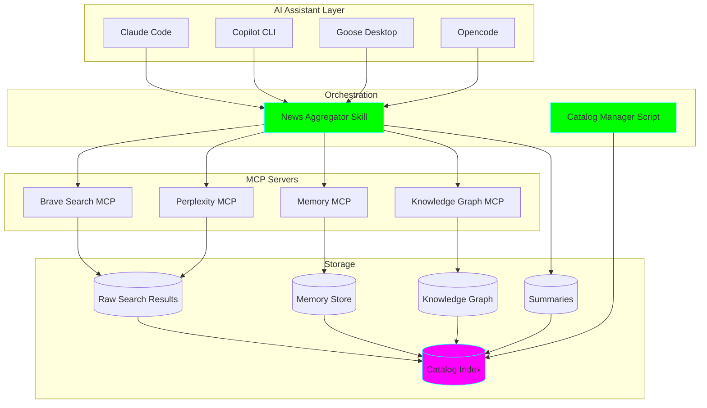
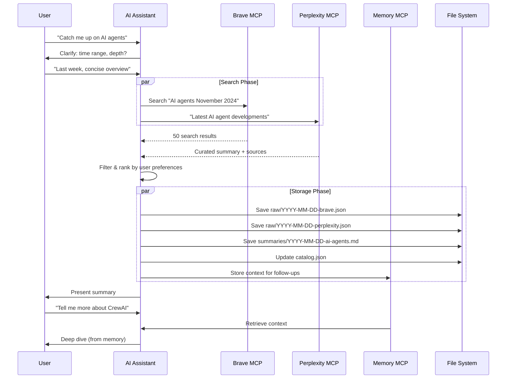

# 📰 Industry News Aggregator

**Status**: 🚧 In Progress
**Version**: 1.0.0
**Created**: 2025-11-08

Stay current with AI and software industry news without the overwhelm. This tool searches, filters, and summarizes news based on YOUR specific interests, using AI assistants you already use.

## 🎯 Problem It Solves

As a busy developer with ADHD, you need to:
- ✅ Stay current with industry trends
- ✅ Filter signal from noise
- ✅ Quick, scannable summaries
- ✅ Easy access to source material when you want to dive deep
- ✅ Context for follow-up questions

**Not:**
- ❌ Hours scrolling through feeds
- ❌ Tab overload syndrome
- ❌ Missing important developments
- ❌ Re-searching for that article you saw yesterday

## 🏗️ Architecture



## 🚀 Quick Start

### 1. Install MCP Servers

```bash
# Set up API keys
export BRAVE_API_KEY="your-brave-api-key"
export PERPLEXITY_API_KEY="your-perplexity-api-key"

# MCP servers will auto-install via npx on first use
```

See [.mcp/README.md](.mcp/README.md) for detailed setup instructions.

### 2. Configure Your AI Tool

The tool works with multiple AI assistants. Choose your preferred one:

#### Claude Code (Recommended)

```bash
# Add to ~/.config/claude/config.json
# See .mcp/README.md for full config
```

#### Goose Desktop

```bash
# Add to Goose configuration
# See .mcp/README.md for YAML config
```

### 3. Use the Aggregator

#### Option A: Via Claude Code Skill (Easiest)

```bash
# In Claude Code
"Use the industry-news-aggregator skill to catch me up on LLM developments this week"
```

#### Option B: Direct Prompt

```
I want to catch up on [topic] from the last [time period].
Please:
1. Search using Brave and Perplexity MCP
2. Filter for my interests (check user-preferences.json)
3. Create a scannable summary
4. Store everything in the catalog
```

#### Option C: Using Helper Scripts

```bash
# Generate a catalog report
./scripts/catalog_manager.py report

# Search past summaries
./scripts/catalog_manager.py search --query "LLM" --since "2025-11-01"

# Get specific entry
./scripts/catalog_manager.py get 2025-11-08-143022-llm-reasoning --summary
```

## 📊 Workflow



## 📁 Project Structure

```
industry-news-aggregator/
├── .mcp/                          # MCP server configurations
│   ├── config.json               # Server definitions
│   └── README.md                 # Setup instructions
│
├── data/                         # All persistent data (git-tracked!)
│   ├── memory/                   # Memory MCP storage
│   │   ├── .gitkeep
│   │   └── knowledge-graph.json  # Topic relationships
│   ├── raw/                      # Raw search results
│   │   ├── YYYY-MM-DD-HHMMSS-topic-brave.json
│   │   └── YYYY-MM-DD-HHMMSS-topic-perplexity.json
│   ├── summaries/                # Processed summaries
│   │   └── YYYY-MM-DD-HHMMSS-topic.md
│   ├── outputs/                  # Legacy/organized outputs
│   └── catalog.json              # Master index
│
├── .claude/
│   └── skills/
│       └── news-aggregator/
│           └── skill.md          # Main aggregator skill
│
├── scripts/
│   └── catalog_manager.py        # Catalog management CLI
│
├── user-preferences.json         # Your interests & preferences
├── README.md                     # This file
└── .python-version              # Python 3.11+
```

## 🎨 Output Format

Summaries are formatted for ADHD-friendly reading:

```markdown
# Industry News Summary: [Topic]
**Date**: 2025-11-08
**Coverage**: Last 7 days
**Sources**: 15 articles from 8 sources

## 🔥 Top Highlights (Must Read)
- **Claude 3.5 Sonnet Released** (Anthropic Blog, Nov 6)
  - New computer use capabilities for AI agents
  - 2x faster than previous version
  - Why it matters: Game-changer for automation workflows
  - [Read more](https://example.com)

## 📊 Trend Analysis
Seeing major focus on AI agents and orchestration this week.
3 frameworks launched. Industry moving toward multi-agent systems.

## 🎯 Relevant to Your Interests
[Filtered based on user-preferences.json]
- AI Agents ⭐⭐⭐⭐⭐
- LLM Reasoning ⭐⭐⭐⭐
- Development Tools ⭐⭐⭐

## 🤔 Follow-up Questions to Explore
- How do these agent frameworks compare?
- What are the security implications?
- Can I integrate with my existing tools?

## 📚 Source Material
Full list with links for deep-dive later...
```

## ⚙️ Customization

### User Preferences

Edit `user-preferences.json` to customize:

```json
{
  "interests": {
    "primary_topics": ["AI", "web dev", "devops"],
    "specific_interests": ["Claude AI", "React", "Python"]
  },
  "preferences": {
    "summary_length": "concise",  // or "detailed"
    "technical_depth": "intermediate",
    "max_articles_per_topic": 10
  },
  "adhd_optimizations": {
    "use_bullet_points": true,
    "highlight_key_takeaways": true,
    "include_tldr": true
  }
}
```

### Search Strategy

The aggregator uses both MCP servers:

- **Brave Search**: Fresh results, broad coverage
- **Perplexity**: Curated insights, trend analysis

You can weight these in your prompts:
- "Quick overview" → More Perplexity (faster)
- "Comprehensive scan" → More Brave (thorough)

## 🔍 Using the Catalog

### Search Past Summaries

```bash
# Find all AI-related summaries
./scripts/catalog_manager.py search --query "AI"

# Find recent high-relevance entries
./scripts/catalog_manager.py search --since "2025-11-01" --min-relevance 8.0

# Filter by tags
./scripts/catalog_manager.py search --tags ai llm
```

### Retrieve Source Material

```bash
# Get raw search results for an entry
./scripts/catalog_manager.py get 2025-11-08-143022-llm-reasoning --sources

# Read the summary
./scripts/catalog_manager.py get 2025-11-08-143022-llm-reasoning --summary
```

### Generate Reports

```bash
# View catalog summary
./scripts/catalog_manager.py topics

# Full report
./scripts/catalog_manager.py report --output reports/monthly-$(date +%Y-%m).md
```

## 🔄 Rebuilding Memory

If you need to rebuild the memory/knowledge graph:

```bash
# The catalog is your source of truth
./scripts/catalog_manager.py rebuild

# Memory MCP will auto-rebuild from catalog entries
```

## 💡 Usage Tips

### For ADHD-Friendly Experience

1. **Time-box your catch-ups**: "News from last 3 days" not "everything I missed"
2. **Use the catalog**: Don't re-search, reference past summaries
3. **Trust the filtering**: Let the AI prioritize based on your preferences
4. **Follow-up later**: Just ask "more on X from yesterday's summary"

### Example Prompts

```
# Daily catch-up
"Quick overview of AI news from yesterday"

# Weekly deep-dive
"Comprehensive summary of LLM developments this week"

# Topic-specific
"What's new with Claude AI and Anthropic this month?"

# Follow-up
"Show me the full articles about [topic] from today's summary"

# Comparative
"How does this compare to what we saw last month?"
```

## 🛠️ Tech Stack

- **MCP Servers**: Brave Search, Perplexity, Memory, Knowledge Graph
- **AI Assistants**: Claude Code, Copilot CLI, Goose, Opencode
- **Storage**: JSON (catalog), Markdown (summaries), JSON (raw data)
- **Scripts**: Python 3.11+
- **Version Control**: Git (all data is tracked!)

## 📈 Success Metrics

You'll know it's working when:
- ✅ You catch up on industry news in < 5 minutes
- ✅ You can find that article you remember from last week
- ✅ Follow-up questions work seamlessly (memory is persisting)
- ✅ You're not drowning in tabs and bookmarks
- ✅ You actually feel informed, not overwhelmed

## 🎓 Learning Log

### What I Learned
- MCP servers can be chained together for powerful workflows
- File-based storage + git = perfect for AI context management
- ADHD-optimized output format makes a huge difference

### Challenges
- Balancing thoroughness vs. information overload
- Tuning relevance scoring to match interests
- Deciding what to commit to git (answer: everything!)

### Next Steps
- [ ] Add email digest feature
- [ ] Create Slack/Discord integration
- [ ] Build trend visualization dashboard
- [ ] Add RSS feed support
- [ ] Implement smart notifications for breaking news

## 📦 Graduation Criteria

This project will graduate to its own repo when:
- [ ] Used successfully for 30 days
- [ ] Works reliably across 3+ AI assistants
- [ ] Catalog has 100+ entries
- [ ] Clear documentation for new users
- [ ] Basic test coverage for scripts
- [ ] GitHub Action for automated daily digests

## 🤝 Contributing

This is a personal learning project, but ideas welcome! File issues or PRs in the main fantastic-engine repo.

## 📝 License

MIT (or whatever the parent repo uses)

---

**Created with**: Claude Code + lots of coffee ☕
**Maintained by**: Future you (thanks, past you!)
**Last Updated**: 2025-11-08
