# 🔄 LangGraph Pattern Library

**Status:** 🧪 Experimental

**Tech Stack:** Python 3.11+ | LangGraph | LangChain | OpenAI/Anthropic

**Last Updated:** 2025-11-16

## Problem & Solution

### The Problem

Building LangGraph agents involves repeatedly implementing common patterns:

- **Reinventing the Wheel** - Same patterns written from scratch for each new agent
- **No Standard Patterns** - Hard to know best practices for common use cases
- **Debugging Complexity** - Graph state management and error handling are tricky
- **Learning Curve** - LangGraph concepts take time to grasp without good examples
- **Scattered Knowledge** - Patterns documented across docs, tutorials, and discussions

### The Solution

A **reusable pattern library** that:

- ✅ **Provides battle-tested patterns** - Common agent patterns ready to use
- ✅ **Teaches by example** - Each pattern includes full documentation and usage
- ✅ **Accelerates development** - Copy, customize, and deploy quickly
- ✅ **Promotes best practices** - Error handling, state management, observability
- ✅ **Includes generator CLI** - Bootstrap new agents from patterns instantly

```mermaid
graph LR
    A[😫 Building Agents] --> B{Current Problem}
    B -->|Repeated code| C[❌ Time waste]
    B -->|No standards| D[❌ Inconsistent quality]
    B -->|Complex debugging| E[❌ Hard to maintain]
    B -->|Steep learning| F[❌ Slow onboarding]

    G[🔄 Pattern Library] --> H{Solution}
    H --> I[✅ Reusable patterns]
    H --> J[✅ Best practices]
    H --> K[✅ Quick debugging]
    H --> L[✅ Fast learning]

    style A fill:#ff6b6b,stroke:#ffffff,stroke-width:2px
    style G fill:#51cf66,stroke:#ffffff,stroke-width:2px
    style B fill:#ff6b6b,stroke:#ffffff
    style H fill:#51cf66,stroke:#ffffff
```



## Pattern Catalog

### 1. ReAct Agent Pattern

**Use When:** You need an agent that reasons about which tools to call

**Pattern Features:**
- Reasoning loop: Think → Act → Observe → Think
- Tool selection based on context
- Multi-step problem solving
- Built-in error recovery

**Example Use Cases:**
- Research assistants
- Data analysis agents
- Customer support bots

**Code Example:**
```python
from langgraph_patterns import ReActPattern

# Initialize with your tools
agent = ReActPattern(
    tools=[search_tool, calculator_tool, email_tool],
    model="gpt-4",
    max_iterations=10
)

# Run with automatic reasoning loop
result = agent.run("Find the latest news on AI and email me a summary")
```

---

### 2. Multi-Step Reasoning Pattern

**Use When:** Complex tasks requiring explicit planning before execution

**Pattern Features:**
- Explicit planning phase
- Step-by-step execution
- Progress tracking
- Replanning on failure

**Example Use Cases:**
- Code generation with tests
- Research reports
- Multi-stage data pipelines

**Code Example:**
```python
from langgraph_patterns import MultiStepPattern

agent = MultiStepPattern(
    planner_model="gpt-4",
    executor_model="gpt-3.5-turbo",
    tools=[...]
)

result = agent.run(
    task="Build a REST API with authentication",
    verification_steps=True
)
```

---

### 3. Tool Routing Pattern

**Use When:** Different specialized agents/tools for different task types

**Pattern Features:**
- Intent classification
- Dynamic tool selection
- Specialized sub-agents
- Fallback handling

**Example Use Cases:**
- Multi-domain chatbots
- Task delegation systems
- Specialized processing pipelines

**Code Example:**
```python
from langgraph_patterns import ToolRoutingPattern

router = ToolRoutingPattern(
    routes={
        "code": code_agent,
        "research": research_agent,
        "creative": creative_agent
    },
    classifier_model="gpt-3.5-turbo"
)

result = router.run("Write a Python function to calculate fibonacci")
# Automatically routes to code_agent
```

---

### 4. State Management Pattern

**Use When:** Complex state needs to be maintained across agent turns

**Pattern Features:**
- Persistent state graph
- State validation
- State rollback on errors
- State visualization

**Example Use Cases:**
- Long-running conversations
- Multi-session workflows
- Stateful game agents

**Code Example:**
```python
from langgraph_patterns import StateManagementPattern

class ConversationState(TypedDict):
    messages: List[Message]
    user_profile: Dict
    context: Dict

agent = StateManagementPattern(
    state_schema=ConversationState,
    persistence="redis",  # or "file", "memory"
    checkpointing=True
)

# State automatically managed across calls
agent.run(session_id="user-123", message="Hello")
agent.run(session_id="user-123", message="Remember our last conversation?")
```

---

### 5. Error Handling & Recovery Pattern

**Use When:** Production agents that need robust error handling

**Pattern Features:**
- Graceful degradation
- Automatic retries with backoff
- Error categorization
- Human-in-the-loop fallback

**Example Use Cases:**
- Production chatbots
- Critical automation
- Customer-facing agents

**Code Example:**
```python
from langgraph_patterns import ErrorHandlingPattern

agent = ErrorHandlingPattern(
    base_agent=my_agent,
    retry_config={
        "max_retries": 3,
        "backoff_factor": 2,
        "retry_on": [RateLimitError, TimeoutError]
    },
    fallback_strategy="human_escalation",
    error_handlers={
        ValidationError: handle_validation,
        ToolError: handle_tool_error
    }
)
```

---

### 6. Streaming Response Pattern

**Use When:** Real-time feedback needed during long-running operations

**Pattern Features:**
- Token-by-token streaming
- Progress updates
- Partial results
- Cancellation support

**Example Use Cases:**
- Chat interfaces
- Long document generation
- Real-time analysis

**Code Example:**
```python
from langgraph_patterns import StreamingPattern

agent = StreamingPattern(
    model="gpt-4",
    streaming_config={
        "chunk_size": 1,
        "include_metadata": True
    }
)

for chunk in agent.stream("Write a long article about AI"):
    print(chunk.content, end="", flush=True)
    # Update progress bar, show partial results, etc.
```

---

### 7. Human-in-the-Loop Pattern

**Use When:** Decisions require human approval or input

**Pattern Features:**
- Approval gates
- Input requests
- Timeout handling
- Audit trail

**Example Use Cases:**
- Code deployment agents
- Financial transactions
- Content moderation

**Code Example:**
```python
from langgraph_patterns import HumanInLoopPattern

agent = HumanInLoopPattern(
    approval_required_for=["delete", "deploy", "purchase"],
    input_timeout=300,  # 5 minutes
    audit_log=True
)

# Agent will pause and request approval before executing sensitive actions
result = agent.run("Deploy the new version to production")
# → Waits for human approval before proceeding
```

---

### 8. Parallel Execution Pattern

**Use When:** Independent tasks can run concurrently

**Pattern Features:**
- Concurrent task execution
- Result aggregation
- Partial failure handling
- Rate limiting

**Example Use Cases:**
- Batch processing
- Multi-source data gathering
- Parallel API calls

**Code Example:**
```python
from langgraph_patterns import ParallelPattern

agent = ParallelPattern(
    max_concurrent=5,
    timeout_per_task=30,
    aggregation_strategy="merge"
)

results = agent.run_parallel([
    "Summarize article 1",
    "Summarize article 2",
    "Summarize article 3"
])
```

## Architecture


## Tech Stack Details

| Component | Technology | Purpose |
|-----------|------------|---------|
| **Framework** | LangGraph | Agent graph orchestration |
| **LLM Integration** | LangChain | Model abstraction layer |
| **Models** | OpenAI/Anthropic | LLM backends |
| **State Persistence** | SQLite/Redis | Checkpoint storage |
| **Visualization** | Mermaid | Graph visualization |
| **CLI** | Typer | Pattern generator interface |
| **Testing** | Pytest | Unit and integration tests |
| **Observability** | LangSmith | Tracing and debugging |

## Environment Setup

### Prerequisites

- Python 3.11 or higher
- uv package manager (or pip)
- API keys for OpenAI/Anthropic
- Optional: Redis for production state management

### Installation Steps

```bash
# 1. Navigate to project directory
cd /home/user/fantastic-engine/projects/langgraph-patterns/

# 2. Create virtual environment
uv venv

# 3. Activate virtual environment
source .venv/bin/activate

# 4. Install dependencies
uv pip install -r requirements.txt

# 5. Copy and configure environment variables
cp .env.example .env
# Edit .env with your API keys

# 6. Run pattern generator
python -m langgraph_patterns.cli
```

### Environment Variables

Create a `.env` file with:

```env
# LLM Provider API Keys
OPENAI_API_KEY=sk-...
ANTHROPIC_API_KEY=sk-ant-...

# Default Model Configuration
DEFAULT_MODEL=gpt-4
DEFAULT_TEMPERATURE=0.7
DEFAULT_MAX_TOKENS=2000

# State Persistence
STATE_BACKEND=sqlite  # sqlite, redis, memory
STATE_DB_PATH=./data/state.db
REDIS_URL=redis://localhost:6379  # if using Redis

# Observability
LANGSMITH_API_KEY=ls-...  # optional
LANGSMITH_PROJECT=langgraph-patterns
LANGSMITH_TRACING=true

# Pattern Generator
TEMPLATES_DIR=./templates
OUTPUT_DIR=./generated
```

## Project Structure

```
langgraph-patterns/
├── README.md                          # This file
├── requirements.txt                   # Python dependencies
├── .env.example                      # Environment template
├── .python-version                   # Python version (3.11)
├── langgraph_patterns/               # Main package
│   ├── __init__.py
│   ├── base.py                       # Base pattern class
│   ├── cli.py                        # Pattern generator CLI
│   ├── patterns/                     # Pattern implementations
│   │   ├── __init__.py
│   │   ├── react.py                  # ReAct pattern
│   │   ├── multi_step.py             # Multi-step reasoning
│   │   ├── tool_routing.py           # Tool routing
│   │   ├── state_management.py       # State management
│   │   ├── error_handling.py         # Error handling
│   │   ├── streaming.py              # Streaming responses
│   │   ├── human_in_loop.py          # Human-in-the-loop
│   │   └── parallel.py               # Parallel execution
│   ├── core/                         # Core utilities
│   │   ├── __init__.py
│   │   ├── state.py                  # State manager
│   │   ├── tools.py                  # Tool registry
│   │   ├── errors.py                 # Error handlers
│   │   └── streaming.py              # Streaming engine
│   └── utils/                        # Helper utilities
│       ├── __init__.py
│       ├── visualization.py          # Graph visualization
│       ├── testing.py                # Testing helpers
│       └── observability.py          # Tracing/logging
├── templates/                        # Pattern templates
│   ├── react_template.py
│   ├── multi_step_template.py
│   └── custom_template.py
├── examples/                         # Usage examples
│   ├── react_example.py
│   ├── multi_step_example.py
│   ├── tool_routing_example.py
│   ├── state_example.py
│   ├── error_handling_example.py
│   ├── streaming_example.py
│   ├── human_loop_example.py
│   └── parallel_example.py
├── tests/                            # Test suite
│   ├── test_patterns.py
│   ├── test_core.py
│   └── test_utils.py
└── docs/                             # Additional documentation
    ├── pattern_guide.md
    ├── best_practices.md
    └── contributing.md
```

## Usage

### Using Existing Patterns

```python
# Import the pattern you need
from langgraph_patterns import ReActPattern
from langgraph.tools import tool

# Define your tools
@tool
def search(query: str) -> str:
    """Search the web for information."""
    # Implementation
    return results

@tool
def calculator(expression: str) -> float:
    """Evaluate a mathematical expression."""
    # Implementation
    return result

# Create agent with pattern
agent = ReActPattern(
    tools=[search, calculator],
    model="gpt-4",
    max_iterations=10,
    verbose=True
)

# Run the agent
result = agent.run("What is the population of Tokyo times 2?")
print(result)
```

### Generating New Agents from Patterns

```bash
# Interactive pattern generator
python -m langgraph_patterns.cli generate

# Or use command line args
python -m langgraph_patterns.cli generate \
    --pattern react \
    --name my_agent \
    --output ./my_agents/

# This creates a fully configured agent ready to customize
```

### Pattern Decision Matrix

Use this to choose the right pattern:

| Use Case | Recommended Pattern | Alternative |
|----------|-------------------|-------------|
| General Q&A with tools | ReAct | Tool Routing |
| Complex planning tasks | Multi-Step | ReAct + State |
| Multiple specialized domains | Tool Routing | ReAct |
| Long conversations | State Management | All patterns support this |
| Production reliability | Error Handling | Wrap any pattern |
| Real-time interfaces | Streaming | Works with most patterns |
| Sensitive operations | Human-in-Loop | + Error Handling |
| Batch processing | Parallel | Multi-Step |

### Visualizing Your Agent Graph

```python
from langgraph_patterns import ReActPattern
from langgraph_patterns.utils import visualize_graph

agent = ReActPattern(...)

# Generate Mermaid diagram
diagram = visualize_graph(agent.graph)
print(diagram)

# Save as PNG (requires mermaid-cli)
visualize_graph(agent.graph, output="agent_graph.png")
```

## Dependencies

### Core Dependencies

```
langgraph>=0.0.30
langchain>=0.1.0
langchain-openai>=0.0.5
langchain-anthropic>=0.1.0
pydantic>=2.0.0
```

### Optional Dependencies

```
redis>=5.0.0              # For Redis state backend
langsmith>=0.1.0          # For observability
typer>=0.9.0             # For CLI
rich>=13.0.0             # For pretty CLI output
```

### Development Dependencies

```
pytest>=7.4.0
pytest-asyncio>=0.21.0
black>=23.0.0
ruff>=0.1.0
mypy>=1.7.0
```

## Pattern Examples

### Example: Building a Research Agent

```python
from langgraph_patterns import ReActPattern
from langchain.tools import DuckDuckGoSearchResults, WikipediaQueryRun
from langchain.utilities import WikipediaAPIWrapper

# Setup tools
search = DuckDuckGoSearchResults()
wikipedia = WikipediaQueryRun(api_wrapper=WikipediaAPIWrapper())

# Create research agent with ReAct pattern
research_agent = ReActPattern(
    tools=[search, wikipedia],
    model="gpt-4",
    max_iterations=5,
    system_message="""You are a research assistant.
    Use search and Wikipedia to find accurate information.
    Always cite your sources."""
)

# Use it
result = research_agent.run(
    "What are the latest developments in quantum computing?"
)

print(result["output"])
print(result["sources"])
```

### Example: Multi-Stage Code Generation

```python
from langgraph_patterns import MultiStepPattern

code_agent = MultiStepPattern(
    planner_model="gpt-4",
    executor_model="gpt-3.5-turbo",
    tools=[write_file, run_tests, lint_code],
    verification_steps=True
)

result = code_agent.run(
    task="""Create a Python REST API with:
    1. User authentication
    2. CRUD operations for todos
    3. Unit tests
    4. OpenAPI documentation
    """
)

# Agent automatically:
# 1. Plans the implementation steps
# 2. Generates code for each component
# 3. Runs tests after each step
# 4. Fixes issues if tests fail
# 5. Verifies everything works together
```

### Example: Customer Support Router

```python
from langgraph_patterns import ToolRoutingPattern

support_router = ToolRoutingPattern(
    routes={
        "billing": billing_agent,
        "technical": technical_agent,
        "general": general_agent
    },
    classifier_model="gpt-3.5-turbo",
    fallback_route="general"
)

# Automatically routes to the right specialized agent
response = support_router.run(
    "I was charged twice for my subscription"
)
# Routes to billing_agent
```

## Learning Log

### What I Learned

- [ ] LangGraph state management patterns
- [ ] Tool integration best practices
- [ ] Error handling strategies for LLM agents
- [ ] State persistence across agent runs
- [ ] Graph visualization techniques
- [ ] Testing strategies for non-deterministic agents
- [ ] Streaming response implementation
- [ ] Human-in-the-loop approval flows

### Challenges Faced

- [ ] Balancing flexibility vs. ease of use
- [ ] Designing intuitive pattern APIs
- [ ] Handling edge cases in error recovery
- [ ] State serialization for complex objects
- [ ] Testing non-deterministic behavior
- [ ] Documentation clarity for complex patterns

### Next Steps

- [ ] Implement all 8 core patterns
- [ ] Create comprehensive examples for each pattern
- [ ] Build pattern generator CLI
- [ ] Add visualization utilities
- [ ] Write testing helpers
- [ ] Set up observability with LangSmith
- [ ] Create pattern combination examples
- [ ] Add benchmarking suite
- [ ] Write best practices guide
- [ ] Create video tutorials for each pattern

## Graduation Criteria

This project is ready to graduate when:

- [ ] All 8 patterns fully implemented and tested
- [ ] Each pattern has 2+ working examples
- [ ] Pattern generator CLI working
- [ ] Comprehensive documentation complete
- [ ] Unit tests with >80% coverage
- [ ] Integration tests for each pattern
- [ ] Visualization tools working
- [ ] Published to PyPI as package
- [ ] Used in at least 3 real projects
- [ ] Community feedback incorporated
- [ ] CI/CD pipeline set up
- [ ] Benchmarking results documented

## Pattern Comparison


## Resources

### Documentation

- [LangGraph Documentation](https://langchain-ai.github.io/langgraph/)
- [LangChain Docs](https://python.langchain.com/)
- [Pattern Examples](./examples/)
- [Best Practices Guide](./docs/best_practices.md)

### Related Projects

- [LangGraph Examples](https://github.com/langchain-ai/langgraph/tree/main/examples)
- [LangSmith](https://smith.langchain.com/) - Observability platform

### Learning Resources

- [LangGraph Tutorials](https://langchain-ai.github.io/langgraph/tutorials/)
- [Agent Design Patterns](https://www.anthropic.com/research/building-effective-agents)

---

**Remember:** These patterns are starting points, not rigid templates. Customize and combine them to fit your specific use case! 🔄✨
