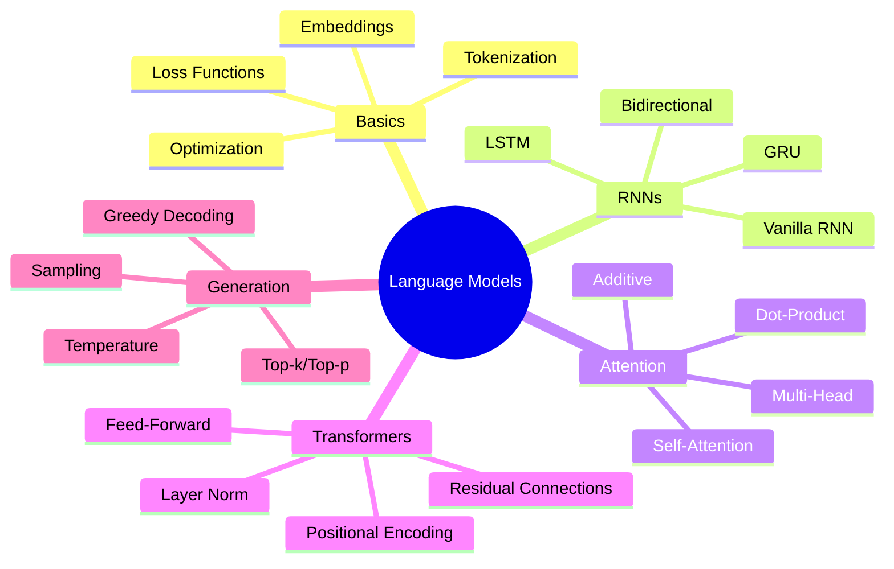

# 🧠 Language Models from Scratch - Educational Series

**Status:** 🚧 In Progress

**Purpose:** Build 5 language models with progressive complexity to learn how LLMs work from beginner to expert level.

## 🎯 Learning Objectives



```mermaid
graph LR
    A[Complete Beginner] --> B[Model 1: Char RNN]
    B --> C[Model 2: Word RNN]
    C --> D[Model 3: LSTM + Attention]
    D --> E[Model 4: Mini Transformer]
    E --> F[Model 5: GPT-style]
    F --> G[LLM Expert]

    style A fill:#ff00ff,stroke:#00ffff,stroke-width:2px
    style B fill:#9370db,stroke:#00ffff
    style C fill:#9370db,stroke:#00ffff
    style D fill:#9370db,stroke:#00ffff
    style E fill:#9370db,stroke:#00ffff
    style F fill:#9370db,stroke:#00ffff
    style G fill:#00ff00,stroke:#00ffff,stroke-width:2px
```

## 📚 The 5 Models

| Model | Complexity | Key Concepts | Time to Complete |
|-------|-----------|--------------|------------------|
| **1. Character-level RNN** | ⭐ Beginner | Sequences, RNN basics, char tokenization | 2-3 hours |
| **2. Word-level RNN** | ⭐⭐ Beginner+ | Word embeddings, vocab building | 3-4 hours |
| **3. LSTM + Attention** | ⭐⭐⭐ Intermediate | Long-term memory, attention mechanism | 4-6 hours |
| **4. Mini Transformer** | ⭐⭐⭐⭐ Advanced | Self-attention, positional encoding | 6-8 hours |
| **5. GPT-style Model** | ⭐⭐⭐⭐⭐ Expert | Decoder-only architecture, modern LLMs | 8-12 hours |

## 🗂️ Project Structure

```
language-models-from-scratch/
├── model-01-char-rnn/          # Character-level RNN
│   ├── train.py                # Training script
│   ├── model.py                # Model definition
│   ├── generate.py             # Text generation
│   └── README.md               # Model-specific docs
├── model-02-word-rnn/          # Word-level RNN with embeddings
├── model-03-lstm-attention/    # LSTM with attention mechanism
├── model-04-mini-transformer/  # Transformer from scratch
├── model-05-gpt-style/         # GPT-style autoregressive model
├── shared/
│   ├── data/                   # Shared datasets
│   │   ├── download.py         # Dataset download script
│   │   └── README.md           # Dataset documentation
│   └── utils/                  # Shared utilities
│       ├── tokenizers.py       # Tokenization utilities
│       └── visualize.py        # Visualization tools
├── docs/
│   ├── learning-path.md        # Structured learning path
│   ├── concepts.md             # Core concepts explained
│   └── troubleshooting.md      # Common issues and solutions
└── pyproject.toml              # Python dependencies
```

## 🚀 Quick Start

### 1. Setup Environment

```bash
# Navigate to project
cd projects/language-models-from-scratch

# Create virtual environment with uv
uv venv
source .venv/bin/activate  # On Windows: .venv\Scripts\activate

# Install dependencies
uv pip install -e .
```

### 2. Download Datasets

```bash
# Download all datasets
python shared/data/download.py
```

### 3. Start with Model 1

```bash
cd model-01-char-rnn

# Train the model (takes ~5-10 minutes on CPU)
python train.py

# Generate text
python generate.py --checkpoint checkpoints/best.pt --length 500
```

## 📖 Learning Path

### Stage 1: Foundation (Models 1-2)
**Goal:** Understand sequence modeling and neural network basics

**What you'll learn:**
- How neural networks process sequences
- Character vs. word tokenization
- Embedding layers and their purpose
- Training loops and optimization
- Text generation basics

**Time:** 5-7 hours total

### Stage 2: Advanced Techniques (Model 3)
**Goal:** Handle long-term dependencies and attention

**What you'll learn:**
- Why vanilla RNNs struggle with long sequences
- LSTM/GRU architecture
- Attention mechanism fundamentals
- Visualization of attention weights

**Time:** 4-6 hours

### Stage 3: Modern Architecture (Models 4-5)
**Goal:** Build transformer-based models

**What you'll learn:**
- Self-attention mechanism
- Positional encodings
- Multi-head attention
- Layer normalization
- Autoregressive generation
- Scaling considerations

**Time:** 14-20 hours

## 🎓 Concepts Covered



## 📊 Datasets Used

| Dataset | Size | Use Case | Source |
|---------|------|----------|--------|
| **Tiny Shakespeare** | 1MB (40K lines) | Models 1-3 | Karpathy's char-rnn |
| **WikiText-2** | 4MB | Models 4-5 | HuggingFace |
| **TinyStories** | ~500MB | Model 5 (optional) | HuggingFace |

## 🛠️ Running Models in CLI

Each model includes:
- **Training script** - Train from scratch
- **Generation script** - Generate text with trained model
- **Interactive mode** - Chat-like interface for experimentation

Example:
```bash
# Train
python train.py --epochs 20 --lr 0.001

# Generate
python generate.py --prompt "Once upon a time" --length 200

# Interactive (Models 4-5)
python interactive.py --checkpoint checkpoints/best.pt
```

## 🔬 Experimentation Ideas

- **Compare tokenization**: Char vs. Word vs. BPE
- **Visualize attention**: See what the model focuses on
- **Ablation studies**: Remove components to understand their impact
- **Custom datasets**: Train on your own text
- **Hyperparameter tuning**: Learn how changes affect performance

## 📈 Expected Results

### Model 1 (Char RNN)
- Training time: 5-10 min (CPU)
- Generated text: Somewhat readable, correct spelling
- Loss: ~1.5 after training

### Model 5 (GPT-style)
- Training time: 30-60 min (CPU) or 5-10 min (GPU)
- Generated text: Coherent sentences, basic reasoning
- Loss: ~0.8-1.2 after training

## 🎯 Graduation Criteria

This project will be ready to graduate to its own repository when:

- [x] All 5 models implemented
- [ ] Complete documentation with concepts
- [ ] Working CLI tools for all models
- [ ] Comprehensive learning path guide
- [ ] Troubleshooting guide
- [ ] Example outputs for each model
- [ ] Tutorial videos or notebooks
- [ ] Community tested and validated

## 🔗 References

- [Andrej Karpathy - The Unreasonable Effectiveness of RNNs](http://karpathy.github.io/2015/05/21/rnn-effectiveness/)
- [Attention Is All You Need](https://arxiv.org/abs/1706.03762)
- [minGPT by Karpathy](https://github.com/karpathy/minGPT)
- [The Illustrated Transformer](http://jalammar.github.io/illustrated-transformer/)

## 📝 Learning Log

### 2025-11-08
- ✅ Project structure created
- ✅ Dependencies defined
- ⏳ Model 1 implementation in progress

## 💡 Tips for ADHD-Friendly Learning

- **One model at a time** - Complete before moving to next
- **Set timers** - 25-min focus sessions with breaks
- **Visualize everything** - Use the visualization tools
- **Celebrate wins** - Mark checkboxes as you go
- **Experiment freely** - Break things to learn how they work
- **Document insights** - Keep notes of "aha!" moments

---

**Tech Stack:** Python 3.11, PyTorch, NumPy, Matplotlib

**License:** MIT (for educational purposes)
