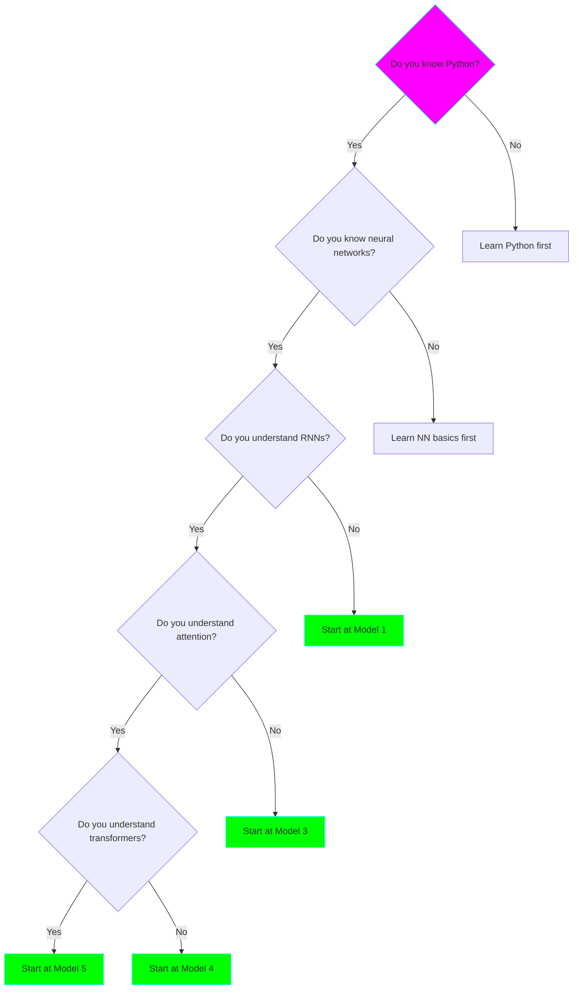

# 🎓 Learning Path: From Beginner to LLM Expert

This guide takes you from zero knowledge to understanding how modern LLMs like ChatGPT work!

## 📍 Where Are You?

Choose your starting point:

## 🗺️ Complete Learning Path

### Stage 1: Foundations (Week 1-2)

**Prerequisites:**
- Python basics
- Basic linear algebra (vectors, matrices)
- Basic calculus (derivatives)

**Models: 1 & 2**

#### Day 1-3: Model 1 - Character RNN
**Time:** 2-3 hours per day

**Day 1: Understanding**
- Read Model 1 README
- Understand character-level tokenization
- Learn what RNNs are and why they work for sequences
- **Exercise:** Draw the RNN unrolled through time

**Day 2: Implementation**
- Read through `model.py` line by line
- Understand embedding layers
- Run training script
- **Exercise:** Modify hidden size, observe changes

**Day 3: Experimentation**
- Generate text with different temperatures
- Try different sequence lengths
- Experiment with dataset
- **Exercise:** Train on your own text file

**Learning Goals:**
- ✅ Understand sequential processing
- ✅ Know what embeddings are
- ✅ Grasp the training loop
- ✅ Generate your first AI text!

#### Day 4-7: Model 2 - Word RNN
**Time:** 3-4 hours per day

**Day 4: Tokenization**
- Understand word vs. character tokenization
- Learn vocabulary building
- Understand unknown word handling
- **Exercise:** Build vocabulary from custom text

**Day 5: Embeddings Deep Dive**
- Word embeddings vs. character embeddings
- Why similar words have similar embeddings
- The power of learned representations
- **Exercise:** Visualize embeddings (t-SNE)

**Day 6: GRU vs. RNN**
- Why vanilla RNN struggles
- How GRU helps
- Gates and memory
- **Exercise:** Compare RNN vs. GRU performance

**Day 7: Model Comparison**
- Compare Model 1 vs. Model 2 outputs
- Understand perplexity metric
- Vocabulary coverage analysis
- **Exercise:** Write blog post explaining both models

**Milestone:** You understand sequence modeling! 🎉

### Stage 2: Attention Revolution (Week 3-4)

**Models: 3**

#### Day 8-10: Understanding Attention
**Time:** 4-6 hours per day

**Day 8: The Problem**
- Why fixed hidden states are limiting
- Long-term dependency problem
- The "information bottleneck"
- **Exercise:** Identify where Models 1&2 fail

**Day 9: Attention Mechanism**
- How attention solves the problem
- Query, Key, Value concept
- Attention weights
- **Exercise:** Calculate attention by hand (simple example)

**Day 10: LSTM Deep Dive**
- Cell state vs. hidden state
- Forget, input, output gates
- Why LSTM > GRU > RNN for long sequences
- **Exercise:** Implement LSTM cell from scratch (NumPy)

#### Day 11-14: Model 3 Implementation
**Day 11:** Train Model 3
**Day 12:** Visualize attention weights
**Day 13:** Compare with Model 2
**Day 14:** Experiment and document learnings

**Learning Goals:**
- ✅ Understand attention mechanism
- ✅ Know why attention is revolutionary
- ✅ Grasp LSTM architecture
- ✅ Visualize what models "pay attention" to

**Milestone:** You understand the foundation of transformers! 🚀

### Stage 3: Transformers (Week 5-6)

**Models: 4**

#### Day 15-18: Transformer Theory
**Time:** 6-8 hours per day

**Day 15: The Big Picture**
- "Attention Is All You Need" paper (read intro)
- Why transformers replaced RNNs
- Parallel processing advantage
- **Exercise:** Compare RNN vs. Transformer diagrams

**Day 16: Self-Attention**
- Attention applied to itself
- Q, K, V projections
- Scaled dot-product attention
- **Exercise:** Compute self-attention by hand

**Day 17: Multi-Head Attention**
- Why multiple attention heads?
- Different heads learn different patterns
- Concatenation and projection
- **Exercise:** Visualize different attention heads

**Day 18: The Full Architecture**
- Positional encoding (why and how)
- Feed-forward networks
- Residual connections
- Layer normalization
- **Exercise:** Draw complete transformer block

#### Day 19-21: Model 4 Implementation
**Day 19:** Train Model 4
**Day 20:** Compare with all previous models
**Day 21:** Analyze what you've learned

**Learning Goals:**
- ✅ Understand transformer architecture
- ✅ Know why it's better than RNNs
- ✅ Grasp multi-head attention
- ✅ Understand positional encoding

**Milestone:** You understand modern NLP! 🌟

### Stage 4: GPT & Production (Week 7-8)

**Models: 5**

#### Day 22-25: GPT Architecture
**Time:** 8-12 hours per day

**Day 22: GPT Paper**
- Read GPT-2 paper
- Understand decoder-only architecture
- Pre-training vs. fine-tuning
- **Exercise:** Summarize GPT innovations

**Day 23: BPE Tokenization**
- Subword tokenization
- Byte-Pair Encoding algorithm
- Why it's better than word-level
- **Exercise:** Apply BPE to custom text

**Day 24: Modern Techniques**
- Pre-norm vs. post-norm
- GELU vs. ReLU
- Weight tying
- AdamW optimizer
- **Exercise:** Ablation study (remove one technique)

**Day 25: Scaling Laws**
- Model size vs. performance
- Compute requirements
- Data requirements
- **Exercise:** Estimate training cost for GPT-3

#### Day 26-28: Model 5 & Beyond
**Day 26:** Train GPT-style model
**Day 27:** Compare all 5 models
**Day 28:** Plan your own project!

**Final Exercise:**
Write a comprehensive blog post or give a presentation explaining:
1. Journey from RNN to GPT
2. Key innovations at each step
3. What you learned
4. What's next (RLHF, prompt engineering, etc.)

**Learning Goals:**
- ✅ Understand GPT architecture
- ✅ Know production techniques
- ✅ Ready to build real applications
- ✅ Understand the path to ChatGPT

**🎓 Congratulations! You're now an LLM expert!**

## 📚 Study Strategies

### For ADHD-Friendly Learning

**✅ Do:**
- Set 25-minute timers (Pomodoro)
- Take frequent breaks
- Use the visualizations
- Experiment immediately after learning
- Keep a learning journal
- Celebrate small wins

**❌ Avoid:**
- Marathon sessions
- Skipping prerequisites
- Reading without doing
- Moving on before understanding

### Active Learning Techniques

1. **Feynman Technique**
   - Explain concept in simple terms
   - Identify gaps in understanding
   - Review and simplify

2. **Learning by Teaching**
   - Write blog posts
   - Create diagrams
   - Help others on forums

3. **Project-Based**
   - Modify existing code
   - Add features
   - Train on custom data

## 🎯 Knowledge Checkpoints

### After Model 1
- [ ] Can you explain RNNs to a friend?
- [ ] Can you implement a simple RNN from scratch?
- [ ] Do you understand the training loop?
- [ ] Can you generate text?

### After Model 2
- [ ] Can you explain embeddings?
- [ ] Do you understand vocabulary building?
- [ ] Can you explain perplexity?
- [ ] Do you know GRU vs. RNN differences?

### After Model 3
- [ ] Can you explain attention mechanism?
- [ ] Can you draw attention computation?
- [ ] Do you understand LSTM gates?
- [ ] Can you visualize attention?

### After Model 4
- [ ] Can you explain self-attention?
- [ ] Do you understand multi-head attention?
- [ ] Can you explain positional encoding?
- [ ] Do you know why transformers > RNNs?

### After Model 5
- [ ] Can you explain the full GPT architecture?
- [ ] Do you understand BPE tokenization?
- [ ] Can you explain pre-norm vs. post-norm?
- [ ] Do you know the path to ChatGPT?

## 🚀 Beyond This Course

### Next Steps

**1. Scale Up**
- Train larger models
- Use more data
- Try WikiText-103 or TinyStories

**2. Fine-Tuning**
- Instruction tuning
- RLHF (Reinforcement Learning from Human Feedback)
- LoRA and PEFT techniques

**3. Applications**
- Question answering
- Summarization
- Code generation
- Creative writing

**4. Advanced Topics**
- Multi-modal models (text + images)
- Retrieval-augmented generation (RAG)
- Agent systems
- Constitutional AI

### Recommended Resources

**Books:**
- "Deep Learning" by Goodfellow et al.
- "Natural Language Processing with Transformers"

**Courses:**
- Andrej Karpathy's Neural Networks: Zero to Hero
- Fast.ai courses
- Stanford CS224N

**Papers:**
- "Attention Is All You Need"
- "Language Models are Unsupervised Multitask Learners" (GPT-2)
- "BERT: Pre-training of Deep Bidirectional Transformers"

**Code:**
- nanoGPT by Karpathy
- Hugging Face Transformers
- PyTorch tutorials

## 💬 Community

**Share Your Progress:**
- Twitter/X with #LLMFromScratch
- GitHub (fork and extend!)
- Blog posts
- YouTube videos

**Get Help:**
- GitHub Issues
- Discord servers (AI/ML communities)
- Reddit r/MachineLearning

---

**Remember:** Everyone starts as a beginner. The key is consistent, focused practice!

You've got this! 🚀
