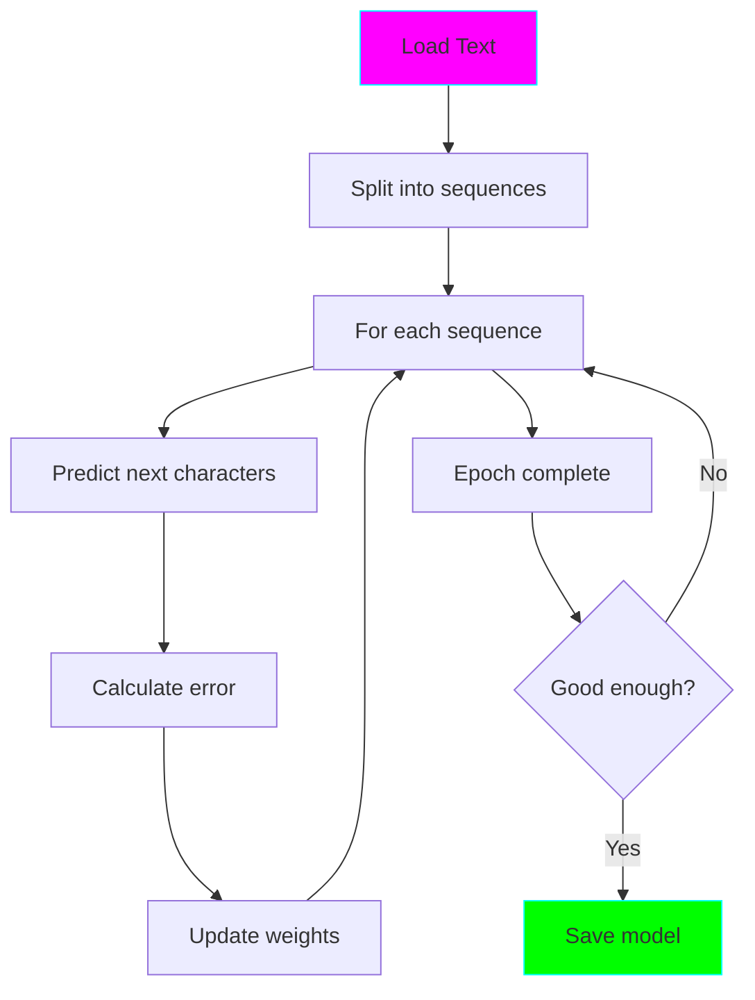

# Model 1: Character-level RNN 📝

**Complexity:** ⭐ Beginner
**Time to Complete:** 2-3 hours
**Status:** ✅ Complete

## 🎯 What You'll Learn

This is your first language model! It's simple but teaches the fundamental concepts:

- **Character-level tokenization** - treating text as a sequence of characters
- **Recurrent Neural Networks (RNNs)** - processing sequences one step at a time
- **Hidden state** - how models remember previous context
- **Text generation** - sampling from probability distributions
- **Training loops** - the basics of deep learning

## 🏗️ Architecture


**How it works:**

1. **Input**: A character (e.g., 'h')
2. **Embedding**: Convert to dense vector [0.2, -0.5, 0.8, ...]
3. **RNN Processing**: Update hidden state based on input and previous hidden state
4. **Output**: Probabilities for next character

**Example:**
```
Input:  "To be or not to b"
        ↓
Model:  [Process character by character]
        ↓
Output: "e" (predicted next character)
```

## 📊 Model Details

| Component | Value | Explanation |
|-----------|-------|-------------|
| **Vocabulary** | 65 chars | All unique characters in Shakespeare |
| **Hidden Size** | 256 | Size of RNN's memory |
| **Layers** | 2 | Number of stacked RNN layers |
| **Parameters** | ~200K | Total trainable numbers |
| **Input** | Character index (0-64) | e.g., 'a' = 10 |
| **Output** | 65 probabilities | Next character distribution |

## 🚀 Quick Start

### 1. Train the Model

```bash
# Make sure you're in the model directory
cd model-01-char-rnn

# Train (takes ~5-10 minutes on CPU)
python train.py
```

**What happens:**
- Downloads data automatically (if needed)
- Trains for 30 epochs
- Saves best model to `checkpoints/best.pt`
- Shows sample generations every 5 epochs

**Expected output:**
```
Epoch 1/30
  Train Loss: 2.1234
  Val Loss: 2.0123

Epoch 30/30
  Train Loss: 1.4567
  Val Loss: 1.5234
```

### 2. Generate Text

```bash
# Generate 500 characters
python generate.py

# With a custom prompt
python generate.py --prompt "To be or not to be" --length 300

# Interactive mode
python generate.py --interactive
```

**Example output:**
```
ROMEO:
What say you, sir?

JULIET:
I do beseech you, sir, have patience.
Your looks are pale and wild and do import
Some misadventure.
```

## 🔬 Experimentation

### Temperature Control

Temperature controls randomness in generation:

```bash
# Conservative (boring but correct)
python generate.py --temperature 0.5

# Balanced (good mix)
python generate.py --temperature 0.8

# Creative (weird but interesting)
python generate.py --temperature 1.5
```

**What happens:**
- **Low (0.5)**: Always picks most likely character → repetitive
- **Medium (0.8)**: Good balance → readable and varied
- **High (1.5)**: More random sampling → creative but less coherent

### Custom Training

Edit `train.py` to experiment:

```python
# Try different hyperparameters
HIDDEN_SIZE = 512      # Bigger model (more memory)
NUM_LAYERS = 3         # Deeper model (more capacity)
LEARNING_RATE = 0.001  # Slower learning (more stable)
SEQ_LENGTH = 150       # Longer sequences (more context)
```

## 📚 Key Concepts Explained

### 1. Character-level vs. Word-level

**Character-level (this model):**
- Vocabulary: ~65 characters (a-z, A-Z, punctuation)
- Never sees unknown characters
- Can spell any word
- Must learn spelling from scratch

**Word-level (Model 2):**
- Vocabulary: ~5,000 words
- Can have unknown words
- Already knows spelling
- Faster to learn grammar

### 2. Why RNN?

RNNs are designed for sequences because they have **memory**:

```
Input:  T  h  e     c  a  t
        ↓  ↓  ↓  ↓  ↓  ↓  ↓
Hidden: h₁→h₂→h₃→h₄→h₅→h₆→h₇
        ↓  ↓  ↓  ↓  ↓  ↓  ↓
Output: h  e  _  c  a  t  [?]
```

Each hidden state `h` carries information about all previous characters!

### 3. Training Process



### 4. Why Embedding Layer?

Instead of one-hot encoding (wasteful):
```
'a' = [1, 0, 0, 0, ..., 0]  (65 numbers, all zeros except one!)
```

We use embeddings (efficient):
```
'a' = [0.2, -0.5, 0.8, 0.1, ...]  (256 meaningful numbers)
```

The model **learns** these numbers during training!

## 🐛 Troubleshooting

### Model generates garbage

**Problem:** Output looks like random characters
**Solution:** Train longer or check if model is loading correctly

### Loss not decreasing

**Problem:** Loss stays around 2.0-2.5
**Solution:**
- Check learning rate (try 0.001)
- Ensure data is loading correctly
- Try smaller batch size

### Out of memory

**Problem:** CUDA out of memory error
**Solution:**
- Reduce `BATCH_SIZE` (try 32)
- Reduce `HIDDEN_SIZE` (try 128)
- Use CPU instead

### Training too slow

**Problem:** Takes forever on CPU
**Solution:**
- Reduce `NUM_EPOCHS` (try 20)
- Reduce `SEQ_LENGTH` (try 50)
- Consider using Google Colab with GPU

## 📈 What to Expect

After training, your model should:

- ✅ Generate Shakespeare-like text structure
- ✅ Spell words correctly (mostly)
- ✅ Use proper punctuation
- ✅ Format dialogue correctly (names, colons)
- ❌ Not make logical sense (that comes in later models!)
- ❌ Not maintain long-term coherence

**Good example:**
```
ROMEO:
What say you to this part of the world?

JULIET:
I do not know what you would have me say.
```

**Still learning (more training needed):**
```
ROM:
Whas yoo tothis prt?

JUL:
I dnot.
```

## 🎓 Quiz Yourself

After completing this model, you should understand:

1. What is a character-level language model?
2. How does an RNN maintain context?
3. What is the hidden state?
4. Why do we use embeddings instead of one-hot encoding?
5. What does temperature do in text generation?
6. What's the difference between training loss and validation loss?

## ➡️ Next Steps

Once you're comfortable with this model, move to **Model 2: Word-level RNN** to learn:

- Word tokenization
- Handling vocabulary
- Word embeddings (Word2Vec concepts)
- Unknown word handling

---

**Estimated training time:** 5-10 minutes (CPU) or 1-2 minutes (GPU)
**Dataset:** Tiny Shakespeare (1MB)
**Final model size:** ~1MB
