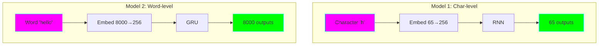
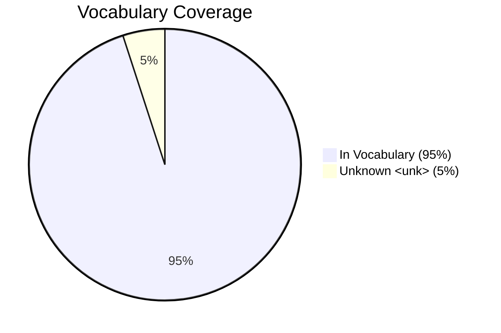

# Model 2: Word-level RNN 📚

**Complexity:** ⭐⭐ Beginner+
**Time to Complete:** 3-4 hours
**Status:** ✅ Complete

## 🎯 What You'll Learn

Building on Model 1, this introduces word-level processing:

- **Word tokenization** - splitting text into words vs. characters
- **Vocabulary management** - handling thousands of unique words
- **Unknown word handling** - dealing with words not in vocabulary
- **Word embeddings** - learned vector representations of words
- **GRU cells** - a better RNN (preview of Model 3)
- **Perplexity** - a better metric for language models

## 🏗️ Architecture Comparison



**Key Differences:**

| Aspect | Char-level (Model 1) | Word-level (Model 2) |
|--------|---------------------|---------------------|
| **Vocab Size** | ~65 | ~8,000 |
| **Token** | Single character | Whole word |
| **Sequence** | "hello" = 5 tokens | "hello" = 1 token |
| **Can spell?** | ✅ Learns spelling | ❌ Fixed vocabulary |
| **Unknown** | Never | <unk> token |
| **Parameters** | ~200K | ~5M |
| **Speed** | Slower (more steps) | Faster (fewer steps) |

## 📊 Model Details

| Component | Value | Explanation |
|-----------|-------|-------------|
| **Vocabulary** | 8,000 words | Most frequent words in Shakespeare |
| **Embedding Dim** | 256 | Size of word vectors |
| **Hidden Size** | 512 | Larger than Model 1 |
| **Layers** | 2 | GRU layers |
| **Parameters** | ~5M | Much larger than Model 1 |
| **Special Tokens** | `<pad>`, `<unk>`, `<eos>` | For padding, unknowns, end of sentence |

## 🚀 Quick Start

### 1. Train the Model

```bash
cd model-02-word-rnn
python train.py
```

**Training output:**
```
Built vocabulary:
  Total unique words: 23,568
  Vocabulary size: 8,000
  Coverage: 95.23%

Epoch 1/25
  Train Loss: 6.1234
  Val Loss: 5.9123
  Perplexity: 370.45

Epoch 25/25
  Train Loss: 4.1567
  Val Loss: 4.3234
  Perplexity: 75.23
```

**What's Perplexity?**
- Lower is better
- ~100 = decent
- ~50 = good
- ~25 = very good

### 2. Generate Text

```bash
# Generate from prompt
python generate.py --prompt "To be or not to be" --length 50

# Interactive mode
python generate.py --interactive
```

**Example output:**
```
to be or not to be a man of the world and
the other side of my life is a good thing
to do with the king of england
```

Notice: Word-level is more coherent than char-level, but still struggles with long-term meaning!

## 🔬 Key Concepts

### 1. Word Tokenization

**Simple approach** (what we use):
```python
text = "Hello, world!"
# Regex: keep words and punctuation separate
tokens = ["hello", ",", "world", "!"]
```

**Why it matters:**
- Punctuation becomes its own "word"
- Case-insensitive (all lowercase)
- Fast and simple for learning

**Advanced (not yet):** Byte-Pair Encoding (BPE) - we'll use in Model 5!

### 2. Vocabulary Coverage



With 8,000 words, we cover ~95% of Shakespeare!

**How it works:**
1. Count all words in training data
2. Keep most frequent 8,000
3. Replace rare words with `<unk>`

**Trade-off:**
- Larger vocab = better coverage, more parameters
- Smaller vocab = faster training, more `<unk>`

### 3. Word Embeddings

Instead of one-hot encoding:
```
"king" = [1, 0, 0, ..., 0]  (8000 numbers!)
```

We learn dense embeddings:
```
"king" = [0.2, -0.5, 0.8, 0.1, ...]  (256 meaningful numbers)
```

**Magic:** Similar words get similar vectors!
```
"king" ≈ "queen" ≈ "prince"
"king" ≠ "apple" ≠ "run"
```

### 4. Why GRU instead of RNN?

**Vanilla RNN** (Model 1):
- Simple but forgets quickly
- Struggles with long sequences
- Gradients vanish/explode

**GRU** (Model 2):
- Has "gates" to control memory
- Better at long-term dependencies
- More stable training

**Preview:** Model 3 will explain this in detail!

### 5. Unknown Word Handling

What happens with words not in vocabulary?

```python
# Training: "The king sat on the throne"
vocab = ["the", "king", "sat", "on", ...]

# Generation: model outputs "The monarch sat on the throne"
# "monarch" not in vocab → replaced with "<unk>"
# Result: "The <unk> sat on the throne"
```

**Why this matters:**
- Can't generate new words
- Limits creativity
- Trade-off: bigger vocab = more parameters

## 🔬 Experimentation

### Compare Vocabulary Sizes

Edit `train.py`:
```python
# Small vocabulary (faster, worse quality)
MAX_VOCAB_SIZE = 3000

# Medium (balanced)
MAX_VOCAB_SIZE = 8000

# Large (slower, better quality)
MAX_VOCAB_SIZE = 15000
```

**Observe:**
- How does perplexity change?
- How often do you see `<unk>`?
- How does training time scale?

### Temperature Effects

```bash
# Conservative (repetitive)
python generate.py --prompt "The king" --temp 0.3

# Balanced
python generate.py --prompt "The king" --temp 0.8

# Creative (random)
python generate.py --prompt "The king" --temp 1.5
```

## 📈 Expected Results

After training:

**Metrics:**
- Train loss: ~4.0-4.5
- Val loss: ~4.2-4.8
- Perplexity: ~60-120
- Coverage: ~95%

**Generation quality:**
- ✅ Grammatically correct (mostly)
- ✅ Uses appropriate words
- ✅ Maintains some context (10-20 words)
- ⚠️ Can be repetitive
- ❌ Loses long-term coherence
- ❌ Limited to vocabulary words

**Good example:**
```
the king of england and the other side of the world is a
good thing to do with my heart and my soul
```

**Needs more training:**
```
the king the king the king of the the the world
and and and the good good thing
```

## 🐛 Troubleshooting

### Too many `<unk>` tokens

**Problem:** Generation full of `<unk>`
**Solution:**
- Increase `MAX_VOCAB_SIZE`
- Decrease `MIN_WORD_FREQ`
- Check if model trained properly

### Repetitive output

**Problem:** "the the the king king king"
**Solution:**
- Train longer
- Increase `HIDDEN_SIZE`
- Try different `temperature`

### Low vocabulary coverage

**Problem:** Coverage < 90%
**Solution:**
- Increase `MAX_VOCAB_SIZE`
- Decrease `MIN_WORD_FREQ` (include rarer words)

## 📚 Understanding Perplexity

**Perplexity = exp(loss)**

**Intuition:** "How perplexed is the model by the next word?"

```
Perplexity of 100 means:
  On average, the model is as confused as if it had to
  choose randomly from 100 equally likely words.
```

**Good values:**
- Random guessing (vocab=8000): 8000
- Bad model: 500-1000
- Decent model: 100-200
- Good model: 50-100
- Great model: 20-50

## 🎓 Quiz Yourself

1. Why do we use embeddings instead of one-hot encoding?
2. What is the `<unk>` token and when does it appear?
3. How does vocabulary coverage affect model quality?
4. What's the difference between loss and perplexity?
5. Why is GRU better than vanilla RNN?
6. What are the trade-offs between char-level and word-level models?

## ➡️ Next Steps

Ready for **Model 3: LSTM + Attention**? You'll learn:

- LSTM vs. GRU (detailed comparison)
- Attention mechanism (the foundation of transformers!)
- Visualizing attention weights
- Better long-term coherence

---

**Estimated training time:** 10-15 minutes (CPU) or 2-3 minutes (GPU)
**Dataset:** Tiny Shakespeare (1MB)
**Final model size:** ~20MB
