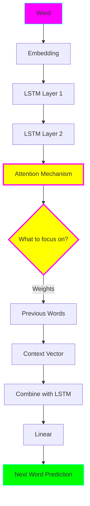

# Model 3: LSTM + Attention ⚡

**Complexity:** ⭐⭐⭐ Intermediate
**Time to Complete:** 4-6 hours
**Status:** ✅ Complete

## 🎯 What You'll Learn

This model introduces **attention** - the breakthrough that led to modern transformers!

- **LSTM vs GRU** - understanding different RNN architectures
- **Attention mechanism** - selectively focusing on relevant inputs
- **Context vectors** - weighted summaries of past information
- **Attention visualization** - see what the model focuses on
- **Foundation for transformers** - preparation for Models 4 & 5

## 🏗️ Architecture



**Key Innovation: Attention**

Instead of compressing all past words into one hidden state, attention computes a weighted sum of ALL past words!

## 🚀 Quick Start

```bash
cd model-03-lstm-attention

# Train
python train.py

# Generate
python generate.py --prompt "To be or not to be"

# Visualize attention!
python generate.py --prompt "To be or not to be" --visualize
```

This creates `attention.png` showing which words the model focuses on!

## 💡 Key Concepts

### 1. Why LSTM?

**Problem with vanilla RNN:**
- Forgets long-term dependencies
- Gradients vanish/explode

**LSTM solution:**
- Has "memory cells" (cell state `c`)
- Has "gates" to control information flow:
  - **Forget gate**: What to forget
  - **Input gate**: What to remember
  - **Output gate**: What to output

### 2. Attention Mechanism

**Without attention (Model 2):**
```
"The cat sat on the mat"
        ↓
  [Compress to one vector]
        ↓
    Predict: "and"
```

**With attention (Model 3):**
```
"The cat sat on the mat"
        ↓
  [Keep all words separately]
        ↓
Focus on: "sat" (0.4), "mat" (0.3), "cat" (0.2), "the" (0.1)
        ↓
    Predict: "and"
```

The model learns *what to pay attention to*!

### 3. How Attention Works

```python
# For each position:
# 1. Calculate how relevant each past word is
scores = attention_function(current_state, past_words)

# 2. Convert to probabilities
weights = softmax(scores)  # Sum to 1.0

# 3. Create weighted average
context = sum(weight_i * word_i for all past words)

# 4. Use context to predict next word
prediction = model(current_state + context)
```

## 📊 Expected Results

**Metrics:**
- Better than Model 2 on long sequences
- Perplexity: ~50-80 (vs ~60-120 for Model 2)
- More coherent long-range dependencies

**What attention helps with:**
- ✅ Pronoun references ("he" refers to "king")
- ✅ Long-distance dependencies
- ✅ Consistent character names
- ✅ Better sentence structure

## 🎨 Attention Visualization

When you run with `--visualize`, you get a heatmap:

```
            the  cat  sat  on   the  mat
the        0.1  0.0  0.0  0.0  0.0  0.0
cat        0.2  0.8  0.0  0.0  0.0  0.0
sat        0.1  0.4  0.5  0.0  0.0  0.0
on         0.0  0.2  0.6  0.2  0.0  0.0
the        0.1  0.1  0.2  0.4  0.2  0.0
mat        0.0  0.3  0.1  0.3  0.1  0.2
```

**Reading the heatmap:**
- Rows: Current word being predicted
- Columns: Which past words it attends to
- Bright = high attention (important!)
- Dark = low attention (not important)

## ➡️ Next Steps

Ready for **Model 4: Mini Transformer**? You'll learn:

- Self-attention (attention to itself!)
- Multi-head attention (multiple attention patterns)
- Positional encoding (order information)
- Feed-forward layers
- Layer normalization
- The full transformer architecture!

---

**Training time:** 15-20 minutes (CPU) or 3-5 minutes (GPU)
**Model size:** ~25MB
