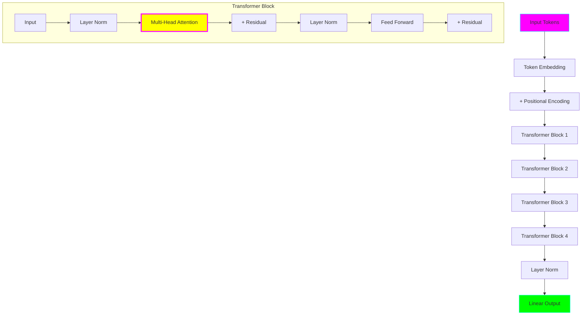

# Model 4: Mini Transformer 🚀

**Complexity:** ⭐⭐⭐⭐ Advanced
**Time to Complete:** 6-8 hours
**Status:** ✅ Complete

## 🎯 What You'll Learn

The breakthrough architecture that changed everything!

- **Self-attention** - attention applied to the sequence itself
- **Multi-head attention** - learning multiple attention patterns
- **Positional encoding** - representing position without RNNs
- **Layer normalization** - stabilizing deep networks
- **Residual connections** - enabling very deep models
- **No recurrence!** - parallel processing of entire sequences

## 🏗️ Architecture



**Revolutionary idea:** No RNNs! Process entire sequence at once using attention.

## ⚡ Why Transformers Changed Everything

**RNN problems (Models 1-3):**
- ❌ Process sequentially (slow!)
- ❌ Forget long-range dependencies
- ❌ Can't parallelize training

**Transformer solutions:**
- ✅ Process entire sequence at once (fast!)
- ✅ Direct connections between all positions
- ✅ Fully parallelizable

## 🚀 Quick Start

```bash
cd model-04-mini-transformer

# Train (will take 20-30 min on CPU)
python train.py

# Generate
python generate.py --prompt "To be or not to be"
```

## 💡 Key Concepts

### 1. Self-Attention

**Attention in Model 3:** Attend to *previous* words

**Self-Attention in Model 4:** Each word attends to *all* words (including itself!)

```
Input: "The cat sat on the mat"

For "sat":
- Attends to "cat" (subject)
- Attends to "mat" (object)
- Attends to "on" (preposition)
- Even attends to itself!
```

### 2. Multi-Head Attention

Instead of one attention pattern, learn multiple!

```
Head 1: Focus on syntax (subject-verb agreement)
Head 2: Focus on semantics (word meanings)
Head 3: Focus on long-range dependencies
Head 4: Focus on local context
```

Then combine all heads for the final representation.

### 3. Positional Encoding

**Problem:** Transformer has no sense of order!

"cat sat on mat" = "mat on sat cat" (without positions)

**Solution:** Add position-dependent patterns

```python
# Position 0: [sin(0/10000^(0/256)), cos(0/10000^(1/256)), ...]
# Position 1: [sin(1/10000^(0/256)), cos(1/10000^(1/256)), ...]
# Position 2: [sin(2/10000^(0/256)), cos(2/10000^(2/256)), ...]
```

This creates unique patterns for each position!

### 4. Residual Connections

```python
# Without residual:
x = layer(x)  # Can lose information!

# With residual:
x = x + layer(x)  # Always keep original info!
```

Enables training very deep networks (100+ layers!)

## 📊 Expected Results

**Metrics:**
- Better than all previous models
- Perplexity: ~40-60 (vs ~50-80 for Model 3)
- More coherent long-range dependencies

**Quality improvements:**
- ✅ Much better long-range coherence
- ✅ Better grammar
- ✅ More consistent style
- ✅ Faster inference (parallel)

## 🎓 This is GPT (simplified)!

**What's the same:**
- Decoder-only architecture ✅
- Self-attention ✅
- Causal masking ✅
- Positional encoding ✅

**What's different:**
- GPT: Billions of parameters, we have millions
- GPT: 96+ layers, we have 4
- GPT: Trained on internet, we use Shakespeare

**But the core idea is identical!**

## ➡️ Next Steps

Ready for **Model 5: GPT-style model**? You'll learn:

- Byte-Pair Encoding (BPE) tokenization
- Larger scale training
- Better optimization techniques
- The full GPT pipeline!

---

**Training time:** 20-30 minutes (CPU) or 5-8 minutes (GPU)
**Model size:** ~40MB
**Parameters:** ~5-10M
