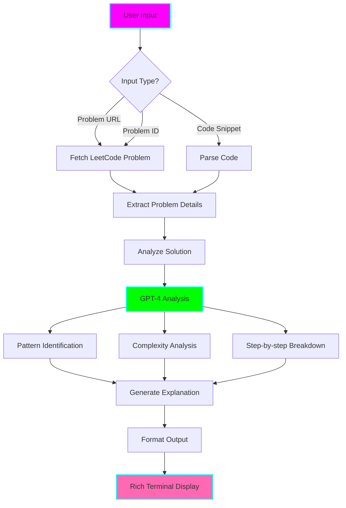

# 🧠 LeetCode Solution Explainer Agent

**Status:** 🧪 Experimental
**Tech Stack:** Python 3.12, OpenAI GPT-4, Rich (for terminal UI), LeetCode API
**Purpose:** AI-powered solution explainer that breaks down LeetCode solutions into digestible, ADHD-friendly explanations

## Problem Statement

LeetCode solutions can be overwhelming, especially when:
- Solutions use unfamiliar patterns or algorithms
- Code lacks proper explanation of the "why" behind each step
- Multiple approaches exist and it's unclear which to learn
- Time/space complexity analysis feels abstract
- You need to understand the intuition, not just the code

## Solution

An AI agent that takes any LeetCode solution and provides:
- **Multi-level explanations** (ELI5 → Intermediate → Expert)
- **Step-by-step code walkthrough** with visual trace
- **Pattern identification** (what algorithmic pattern is this?)
- **Alternative approaches** with trade-off analysis
- **Common mistakes** to avoid
- **Follow-up problems** to reinforce learning

## Architecture



## Features

### Core Features

1. **Multi-Level Explanations**
   - **Level 1 (ELI5)**: Simple analogy-based explanation
   - **Level 2 (Beginner)**: Basic algorithm explanation
   - **Level 3 (Intermediate)**: Technical details with examples
   - **Level 4 (Advanced)**: Edge cases, optimizations, variants
   - **Level 5 (Expert)**: Mathematical proofs, complexity analysis

2. **Code Trace Walkthrough**
   ```python
   # Example: Two Sum
   # Step 1: Initialize hash map → {}
   # Step 2: Iterate nums[0]=2 → seen={2:0}
   # Step 3: Iterate nums[1]=7 → target-7=2 found! → [0,1]
   ```

3. **Pattern Recognition**
   - Identifies algorithmic patterns (Sliding Window, Two Pointers, etc.)
   - Links to pattern learning resources
   - Shows similar problems using the same pattern

4. **Complexity Analysis**
   - Time complexity breakdown by code section
   - Space complexity with memory allocation explanation
   - Best/average/worst case analysis

5. **Alternative Solutions**
   - Compares brute force vs optimized approaches
   - Trade-offs between different solutions
   - When to use which approach

### ADHD-Friendly Features

- **Visual Progress Indicators**: See which explanation section you're on
- **Chunked Information**: Break down long explanations into digestible parts
- **Color-Coded Output**: Syntax highlighting and visual organization
- **Quick Summary**: Get the TLDR before diving deep
- **Bookmarking**: Save explanations for later review
- **Interactive Mode**: Ask follow-up questions about the explanation

## Installation

```bash
# Navigate to project
cd /home/user/fantastic-engine/projects/leetcode-explainer

# Create virtual environment with uv
uv venv
source .venv/bin/activate

# Install dependencies
uv pip install -r requirements.txt

# Setup environment variables
cp .env.example .env
# Edit .env and add your OpenAI API key
```

## Usage

### Basic Usage

```bash
# Explain by LeetCode URL
python explainer.py --url "https://leetcode.com/problems/two-sum/"

# Explain by problem ID
python explainer.py --id 1

# Explain custom code snippet
python explainer.py --code solution.py

# Interactive mode
python explainer.py --interactive
```

### Advanced Usage

```bash
# Specify explanation level (1-5)
python explainer.py --id 1 --level 3

# Compare multiple solutions
python explainer.py --id 1 --compare

# Focus on specific aspect
python explainer.py --id 1 --focus complexity
python explainer.py --id 1 --focus patterns
python explainer.py --id 1 --focus alternatives

# Export explanation to markdown
python explainer.py --id 1 --export explanation.md

# Use with gamification tracker
python explainer.py --id 1 --track-session
```

### Python API

```python
from explainer import LeetCodeExplainer

# Initialize
explainer = LeetCodeExplainer(api_key="your-openai-key")

# Explain a solution
explanation = explainer.explain(
    problem_id=1,
    code=solution_code,
    level=3,
    focus="patterns"
)

# Print formatted explanation
explainer.display(explanation)

# Get specific sections
print(explanation.quick_summary)
print(explanation.pattern)
print(explanation.complexity)
print(explanation.step_by_step)
```

## Example Output

```
╔══════════════════════════════════════════════════════════════════╗
║  🧠 LeetCode Solution Explainer                                  ║
║  Problem #1: Two Sum                                             ║
╚══════════════════════════════════════════════════════════════════╝

📊 QUICK SUMMARY
━━━━━━━━━━━━━━━━━━━━━━━━━━━━━━━━━━━━━━━━━━━━━━━━━━━━━━━━━━━━━━━━━
Pattern:      Hash Table Lookup
Difficulty:   Easy
Time:         O(n)
Space:        O(n)
Key Insight:  Trade space for time by storing complements

🎯 EXPLANATION (Level 3: Intermediate)
━━━━━━━━━━━━━━━━━━━━━━━━━━━━━━━━━━━━━━━━━━━━━━━━━━━━━━━━━━━━━━━━━

The problem asks us to find two numbers that add up to a target.

Instead of checking every pair (O(n²)), we use a hash table to:
1. Store each number and its index as we iterate
2. For each number, check if (target - number) exists in our hash table
3. If it exists, we found our pair!

This is the "complement pattern" - instead of looking for pairs,
look for complements.

🔍 STEP-BY-STEP TRACE
━━━━━━━━━━━━━━━━━━━━━━━━━━━━━━━━━━━━━━━━━━━━━━━━━━━━━━━━━━━━━━━━━

nums = [2, 7, 11, 15], target = 9

Step 1: seen = {}, i=0, num=2
        complement = 9-2 = 7
        7 not in seen → add 2:0 to seen
        seen = {2: 0}

Step 2: seen = {2:0}, i=1, num=7
        complement = 9-7 = 2
        2 IS in seen! → found at index 0
        return [0, 1] ✓

⏱️  COMPLEXITY ANALYSIS
━━━━━━━━━━━━━━━━━━━━━━━━━━━━━━━━━━━━━━━━━━━━━━━━━━━━━━━━━━━━━━━━━

Time Complexity: O(n)
  - Single pass through array: O(n)
  - Hash table lookup: O(1) per element
  - Total: O(n)

Space Complexity: O(n)
  - Hash table stores up to n elements: O(n)
  - Constant extra variables: O(1)
  - Total: O(n)

🎨 PATTERN: Hash Table Lookup
━━━━━━━━━━━━━━━━━━━━━━━━━━━━━━━━━━━━━━━━━━━━━━━━━━━━━━━━━━━━━━━━━

When to use this pattern:
✓ Need to find pairs/complements
✓ Need O(1) lookup time
✓ Can trade space for time
✓ Working with array/list problems

Similar problems:
- #167: Two Sum II
- #170: Two Sum III
- #653: Two Sum IV (BST)

🔄 ALTERNATIVE APPROACHES
━━━━━━━━━━━━━━━━━━━━━━━━━━━━━━━━━━━━━━━━━━━━━━━━━━━━━━━━━━━━━━━━━

1. Brute Force (O(n²) time, O(1) space)
   - Check every pair
   - Use when: Array is very small

2. Hash Table (O(n) time, O(n) space) ⭐ CURRENT
   - One pass with complement lookup
   - Use when: Default approach, need speed

3. Two Pointers (O(n log n) time, O(1) space)
   - Sort then use two pointers
   - Use when: Memory constrained, array can be modified

⚠️  COMMON MISTAKES
━━━━━━━━━━━━━━━━━━━━━━━━━━━━━━━━━━━━━━━━━━━━━━━━━━━━━━━━━━━━━━━━━

❌ Using the same element twice
   Example: nums=[3,2,3], target=6
   Wrong: return [0,0]
   Right: return [0,2]

❌ Not handling duplicates
   Example: nums=[3,3], target=6
   Edge case: Both 3's can be used

❌ Assuming sorted input
   The array is NOT sorted by default

💡 LEARNING TIPS
━━━━━━━━━━━━━━━━━━━━━━━━━━━━━━━━━━━━━━━━━━━━━━━━━━━━━━━━━━━━━━━━━

✓ Practice the "complement" thinking pattern
✓ Remember: Hash tables trade space for O(1) lookup
✓ Always check for edge cases (duplicates, same element)
✓ Try implementing all 3 approaches for practice

Next steps:
1. Implement without looking at solution
2. Try Two Sum II (#167) with two pointers
3. Review hash table pattern problems
```

## Integration with Other Tools

### With Pattern Trainer
```python
# After explanation, practice the pattern
explainer.explain(problem_id=1)
# → Identifies "Hash Table" pattern
# → Launches pattern-trainer for Hash Table drills
```

### With Session Analyzer
```python
# Track which problems you've had explained
explainer.explain(problem_id=1, track_session=True)
# → Logs to session-analyzer database
# → Shows in your learning timeline
```

### With Hint System
```python
# Instead of full explanation, get progressive hints
explainer.get_hints(problem_id=1)
# → Launches progressive hint system
# → Only shows explanation after hints exhausted
```

### With Mistake Analyzer
```python
# Analyze your failed attempt
explainer.explain_mistakes(
    problem_id=1,
    your_code=failed_solution,
    error_message=error
)
# → Compares with correct solution
# → Identifies what went wrong
```

## Configuration

### .env Configuration

```bash
# Required
OPENAI_API_KEY=sk-...

# Optional
OPENAI_MODEL=gpt-4-turbo-preview  # or gpt-4, gpt-3.5-turbo
LEETCODE_SESSION=your-session-cookie  # for fetching solutions
DEFAULT_EXPLANATION_LEVEL=3  # 1-5
ENABLE_CACHING=true  # cache explanations locally
CACHE_DIR=.cache/explanations

# Integration
GAMIFICATION_ENDPOINT=http://localhost:8000  # for tracking
SESSION_ANALYZER_DB=../leetcode-session-analyzer/sessions.db
```

## Data Models

```python
@dataclass
class Explanation:
    problem_id: int
    problem_title: str
    difficulty: str
    quick_summary: str
    pattern: Pattern
    explanation_levels: Dict[int, str]  # 1-5
    step_by_step: List[TraceStep]
    complexity: ComplexityAnalysis
    alternatives: List[Alternative]
    common_mistakes: List[str]
    similar_problems: List[int]
    learning_tips: List[str]
    timestamp: datetime

@dataclass
class Pattern:
    name: str
    description: str
    when_to_use: List[str]
    related_patterns: List[str]

@dataclass
class TraceStep:
    step_number: int
    code_line: str
    state: Dict[str, Any]
    explanation: str
```

## ADHD Benefits

1. **Reduced Cognitive Load**: Breaks complex solutions into digestible chunks
2. **Visual Organization**: Color-coded, structured output reduces overwhelm
3. **Progressive Disclosure**: Choose your explanation depth (1-5 levels)
4. **Pattern Recognition**: Links problems to patterns for better retention
5. **Multiple Angles**: Different explanation styles for different learning modes
6. **Quick Wins**: Get the TLDR first, dive deeper if interested
7. **Context Switching**: Bookmarks and exports for "I'll read this later"

## Graduation Criteria

- [ ] Support for all major programming languages (Python, Java, C++, JavaScript)
- [ ] LeetCode API integration for fetching official solutions
- [ ] Caching system to avoid re-generating explanations
- [ ] User preference learning (adapt explanations to user's level)
- [ ] Browser extension for inline explanations
- [ ] Community sharing (share/rate explanations)
- [ ] Offline mode with pre-generated explanations for top 100 problems
- [ ] Integration with spaced repetition system

## Learning Log

### Challenges
- LeetCode API is unofficial/limited - may need scraping
- GPT-4 cost can add up - need caching and prompt optimization
- Different programming languages need different trace formats
- Balancing detail vs conciseness for ADHD-friendly output

### Key Learnings
- The "explanation level" system prevents information overload
- Visual trace is more helpful than just text explanation
- Pattern identification is the key to transferable learning
- Users need both "what" and "why" for each step

### Next Steps
1. Build MVP with Python solutions only
2. Add caching layer to reduce API costs
3. Test with real users for explanation quality
4. Add interactive Q&A mode
5. Integrate with other LeetCode tools

## Resources

- [LeetCode API Documentation](https://github.com/leetcode/leetcode-api)
- [OpenAI Prompt Engineering](https://platform.openai.com/docs/guides/prompt-engineering)
- [Rich Terminal Library](https://rich.readthedocs.io/)
- [Algorithmic Patterns Guide](https://seanprashad.com/leetcode-patterns/)

## License

MIT

---

**Remember:** Understanding > Memorization. This tool helps you build intuition, not just copy solutions! 🚀
