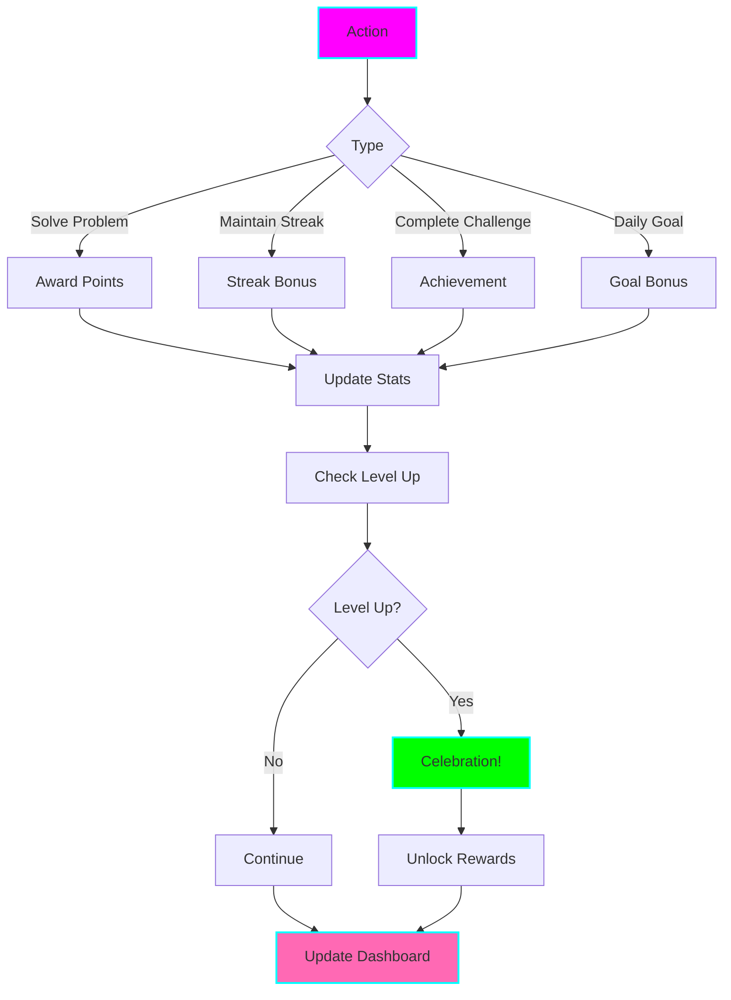

# 🎮 LeetCode Gamification & Streak Tracker

**Status:** 🧪 Experimental
**Tech Stack:** Python 3.12, SQLite, Rich, FastAPI (API), OpenAI GPT-4
**Purpose:** Transform LeetCode practice into an engaging game with streaks, achievements, levels, and rewards - specifically designed for ADHD brains that thrive on dopamine hits and visible progress

## Problem Statement

Consistent LeetCode practice is hard because:
- **Delayed gratification** - no immediate reward for solving
- **No visible progress** - numbers on a screen don't feel real
- **Easy to skip** - nothing holds you accountable
- **Boring grind** - feels like homework, not fun
- **No celebration** - solved a hard problem? Cool, next.
- **ADHD nightmare** - long-term goals without short-term rewards

## Solution

A comprehensive gamification system that:
- **Tracks streaks** - daily practice chains with fire emoji 🔥
- **Awards points** - instant dopamine for every action
- **Unlocks achievements** - 50+ badges to collect
- **Levels up** - visible progression from Newbie to Legend
- **Competes** - leaderboards and challenges
- **Celebrates** - animations and confetti for wins
- **Rewards** - unlock features, themes, titles

## Architecture



## Core Features

### 1. Streak Tracking

```
╔══════════════════════════════════════════════════════════════════╗
║  🔥 Current Streak: 14 Days                                      ║
║  🏆 Longest Streak: 28 Days                                      ║
╚══════════════════════════════════════════════════════════════════╝

STREAK CALENDAR
━━━━━━━━━━━━━━━━━━━━━━━━━━━━━━━━━━━━━━━━━━━━━━━━━━━━━━━━━━━━━━━━━

November 2025
Mo Tu We Th Fr Sa Su
                1  2
🔥 🔥 🔥 🔥 🔥 🔥 🔥   Week 1: Perfect!
10 11 12 13 14 15 16
🔥 🔥 🔥 🔥 🔥 🔥 🔥   Week 2: Perfect!
17 18 19 20 21 22 23
⬜ ⬜ ⬜ ⬜ 🔥 ⬜ ⬜   Week 3: Keep going!

🔥 = Practice day
⬜ = No practice
💀 = Streak broken

STREAK MILESTONES
━━━━━━━━━━━━━━━━━━━━━━━━━━━━━━━━━━━━━━━━━━━━━━━━━━━━━━━━━━━━━━━━━
✅  7 days   - Week Warrior (Unlocked)
✅ 14 days   - Two Week Champion (Unlocked)
🔒 21 days   - Triple Week Legend (6 days away!)
🔒 30 days   - Monthly Master
🔒 90 days   - Quarter King
🔒 365 days  - Year of Code

STREAK BONUSES
━━━━━━━━━━━━━━━━━━━━━━━━━━━━━━━━━━━━━━━━━━━━━━━━━━━━━━━━━━━━━━━━━
Current: +40% XP bonus (14 day streak)
Next level: +50% XP at 21 days

Daily reminder: 7:00 AM
Streak freeze: 2 available (save a broken streak!)
```

### 2. Points & Experience System

```
╔══════════════════════════════════════════════════════════════════╗
║  ⭐ Level 12: Algorithm Apprentice                               ║
║  Experience: 2,450 / 3,000 XP (82%)                              ║
╚══════════════════════════════════════════════════════════════════╝

XP BREAKDOWN
━━━━━━━━━━━━━━━━━━━━━━━━━━━━━━━━━━━━━━━━━━━━━━━━━━━━━━━━━━━━━━━━━
Base Points:
  Easy problem:         50 XP
  Medium problem:      150 XP
  Hard problem:        300 XP

Bonuses:
  First attempt:       +50%
  No hints used:       +25%
  Under target time:   +20%
  Perfect streak:      +40%

Multipliers:
  Weekend warrior:     x1.5
  Early bird (7AM):    x1.2
  Night owl (9PM):     x1.1

Example:
  Medium problem (150 XP)
  × First attempt (1.5)
  × No hints (1.25)
  × 14-day streak (1.4)
  = 393 XP! 🎉

TODAY'S EARNINGS
━━━━━━━━━━━━━━━━━━━━━━━━━━━━━━━━━━━━━━━━━━━━━━━━━━━━━━━━━━━━━━━━━
Problem #1 (Easy):       75 XP
Problem #15 (Medium):   393 XP
Daily goal completed:   100 XP
Pattern practice:        50 XP
──────────────────────────────
Total today:            618 XP

550 XP to Level 13! (Algorithm Adept)
```

### 3. Achievements & Badges

```
╔══════════════════════════════════════════════════════════════════╗
║  🏆 Achievements: 23 / 50 Unlocked                               ║
╚══════════════════════════════════════════════════════════════════╝

RECENTLY UNLOCKED
━━━━━━━━━━━━━━━━━━━━━━━━━━━━━━━━━━━━━━━━━━━━━━━━━━━━━━━━━━━━━━━━━
🎉 Two Week Streak       (14 consecutive days)
🎯 Pattern Master: Hash  (95% mastery on Hash Table)
⚡ Speed Demon           (Solved Easy in < 10 minutes)

STREAKS & CONSISTENCY
━━━━━━━━━━━━━━━━━━━━━━━━━━━━━━━━━━━━━━━━━━━━━━━━━━━━━━━━━━━━━━━━━
✅ 🔥 First Flame         (1 day streak)
✅ 🔥 Week Warrior        (7 day streak)
✅ 🔥 Two Week Champion   (14 day streak)
🔒 🔥 Triple Week Legend  (21 day streak)
🔒 🔥 Monthly Master      (30 day streak)
🔒 🔥 Quarter King        (90 day streak)
🔒 🔥 Year of Code        (365 day streak)

PROBLEM SOLVING
━━━━━━━━━━━━━━━━━━━━━━━━━━━━━━━━━━━━━━━━━━━━━━━━━━━━━━━━━━━━━━━━━
✅ 👶 First Steps         (Solve 1 problem)
✅ 🎯 Double Digits       (Solve 10 problems)
✅ 💯 Century Club        (Solve 100 problems)
🔒 🎓 Problem Solver      (Solve 500 problems)
🔒 🏆 LeetCode Legend     (Solve 1000 problems)

PATTERNS
━━━━━━━━━━━━━━━━━━━━━━━━━━━━━━━━━━━━━━━━━━━━━━━━━━━━━━━━━━━━━━━━━
✅ 🎯 Pattern Master: Hash Table
✅ 🎯 Pattern Master: Two Pointers
🔒 🎯 Pattern Master: Binary Search
🔒 🎯 Pattern Grandmaster (All 15 patterns)

SPEED & EFFICIENCY
━━━━━━━━━━━━━━━━━━━━━━━━━━━━━━━━━━━━━━━━━━━━━━━━━━━━━━━━━━━━━━━━━
✅ ⚡ Speed Demon          (Easy < 10 min)
🔒 ⚡ Lightning Fast       (Medium < 20 min)
🔒 ⚡ Optimization King    (10 O(n²) → O(n))

CHALLENGES
━━━━━━━━━━━━━━━━━━━━━━━━━━━━━━━━━━━━━━━━━━━━━━━━━━━━━━━━━━━━━━━━━
✅ 🎯 No Hints Hero        (Solve 10 without hints)
✅ 🧠 First Try Fred       (Solve 5 on first attempt)
🔒 🏆 Perfect Week         (7/7 days completed)

FUN & SPECIAL
━━━━━━━━━━━━━━━━━━━━━━━━━━━━━━━━━━━━━━━━━━━━━━━━━━━━━━━━━━━━━━━━━
✅ 🌅 Early Bird           (Solve at 7 AM, 5 times)
✅ 🦉 Night Owl            (Solve at 11 PM, 5 times)
🔒 🎉 Birthday Coder       (Code on your birthday)
🔒 🎄 Holiday Grind        (Code on Christmas)

Next achievement: Triple Week Legend (6 days away!)
```

### 4. Levels & Progression

```
╔══════════════════════════════════════════════════════════════════╗
║  ⬆️ Level Progression                                            ║
╚══════════════════════════════════════════════════════════════════╝

YOUR JOURNEY
━━━━━━━━━━━━━━━━━━━━━━━━━━━━━━━━━━━━━━━━━━━━━━━━━━━━━━━━━━━━━━━━━

Level  1: 👶 Code Newbie
Level  5: 🎓 Algorithm Student
Level 10: 💻 Code Apprentice
Level 12: ⚡ Algorithm Apprentice  ← You are here!
Level 15: 🎯 Problem Solver
Level 20: 💪 Algorithm Expert
Level 25: 🏆 LeetCode Master
Level 30: 👑 Coding Legend
Level 50: 🔥 FAANG Ready
Level 75: 🌟 Algorithm God
Level 99: 💎 Ultimate Champion

LEVEL 13 UNLOCKS
━━━━━━━━━━━━━━━━━━━━━━━━━━━━━━━━━━━━━━━━━━━━━━━━━━━━━━━━━━━━━━━━━
🎨 New theme: Cyberpunk
🏷️  Title: "Algorithm Adept"
✨ Effect: +5% XP bonus
🎁 Reward: 1 streak freeze
```

### 5. Daily Challenges

```
╔══════════════════════════════════════════════════════════════════╗
║  🎯 Daily Challenges - November 21, 2025                         ║
╚══════════════════════════════════════════════════════════════════╝

DAILY QUEST (Resets in 4h 23m)
━━━━━━━━━━━━━━━━━━━━━━━━━━━━━━━━━━━━━━━━━━━━━━━━━━━━━━━━━━━━━━━━━

📋 EASY CHALLENGES
━━━━━━━━━━━━━━━━━━━━━━━━━━━━━━━━━━━━━━━━━━━━━━━━━━━━━━━━━━━━━━━━━
✅ Solve 1 Easy problem      +50 XP
✅ Solve 1 Medium problem    +150 XP
🔲 Maintain streak           +100 XP
🔲 Practice 1 pattern        +50 XP

🎯 BONUS CHALLENGES
━━━━━━━━━━━━━━━━━━━━━━━━━━━━━━━━━━━━━━━━━━━━━━━━━━━━━━━━━━━━━━━━━
🔲 Solve without hints       +100 XP
🔲 Solve in < 30 minutes     +50 XP
🔲 Perfect first attempt     +200 XP

🏆 WEEKLY CHALLENGE
━━━━━━━━━━━━━━━━━━━━━━━━━━━━━━━━━━━━━━━━━━━━━━━━━━━━━━━━━━━━━━━━━
Complete 15 problems this week
Progress: ████████░░ 12/15 (80%)
Reward: 500 XP + "Week Warrior" badge

Progress: 350 / 950 XP from challenges today
```

### 6. Leaderboard

```
╔══════════════════════════════════════════════════════════════════╗
║  🏆 Leaderboard - This Week                                      ║
╚══════════════════════════════════════════════════════════════════╝

GLOBAL
━━━━━━━━━━━━━━━━━━━━━━━━━━━━━━━━━━━━━━━━━━━━━━━━━━━━━━━━━━━━━━━━━
1. 🥇 CodeMaster99     2,450 XP    Level 28    🔥 45 days
2. 🥈 AlgoQueen        2,180 XP    Level 26    🔥 32 days
3. 🥉 DevWarrior       1,920 XP    Level 24    🔥 28 days
...
47. ⭐ You              618 XP     Level 12    🔥 14 days
...

FRIENDS
━━━━━━━━━━━━━━━━━━━━━━━━━━━━━━━━━━━━━━━━━━━━━━━━━━━━━━━━━━━━━━━━━
1. 🥇 Sarah            890 XP     Level 15    🔥 21 days
2. 🥈 You              618 XP     Level 12    🔥 14 days
3. 🥉 Mike             450 XP     Level 11    🔥 7 days

PATTERN MASTERS (Hash Table)
━━━━━━━━━━━━━━━━━━━━━━━━━━━━━━━━━━━━━━━━━━━━━━━━━━━━━━━━━━━━━━━━━
1. You - 95% mastery
2. Sarah - 92% mastery
3. Mike - 85% mastery
```

## Installation

```bash
cd /home/user/fantastic-engine/projects/leetcode-gamification

uv venv
source .venv/bin/activate
uv pip install -r requirements.txt

python tracker.py --init

cp .env.example .env
```

## Usage

```bash
# View dashboard
python tracker.py --dashboard

# Log activity
python tracker.py --log-solve 1 --difficulty Easy --time 15

# Check streak
python tracker.py --streak

# View achievements
python tracker.py --achievements

# Daily challenges
python tracker.py --daily

# Leaderboard
python tracker.py --leaderboard
```

## Python API

```python
from tracker import GamificationTracker

tracker = GamificationTracker(user_id="user123")

# Log solved problem
tracker.log_solve(
    problem_id=1,
    difficulty="Easy",
    time_spent=15,
    first_attempt=True,
    hints_used=0
)

# Check for achievements
achievements = tracker.check_achievements()
for achievement in achievements:
    print(f"🏆 Unlocked: {achievement.name}")

# Get current stats
stats = tracker.get_stats()
print(f"Level: {stats.level}")
print(f"XP: {stats.xp}")
print(f"Streak: {stats.streak}")
```

## ADHD Benefits

1. **Instant Gratification**: XP and points after every action
2. **Visual Progress**: Levels and bars show tangible growth
3. **Dopamine Hits**: Achievements unlock frequently
4. **Streak Motivation**: External accountability
5. **Celebration**: Confetti and animations for wins
6. **Variety**: Multiple goals prevent boredom
7. **Competition**: Leaderboards add social pressure
8. **Collectibles**: Badges satisfy collection urge
9. **Short-Term Goals**: Daily challenges vs long-term grind
10. **Rewards**: Unlock themes, titles, features

## Integration with All Tools

```python
# Explainer
explainer.explain(1)
→ +50 XP for learning

# Pattern Trainer
trainer.complete_drill()
→ +30 XP per drill

# Session Analyzer
analyzer.log_problem()
→ Auto-tracked for XP

# Hints
hints.get_hint(level=1)
→ -25% XP bonus (used hints)

# Study Planner
planner.complete_day()
→ +100 XP daily goal bonus

# Pair Bot
pair_bot.complete_session()
→ +50 XP pair programming bonus

# Mistake Analyzer
analyzer.fix_mistake_pattern()
→ +200 XP improvement achievement
```

## Configuration

```bash
# .env
DATABASE_PATH=gamification.db

# XP Rates
EASY_XP=50
MEDIUM_XP=150
HARD_XP=300

# Bonuses
FIRST_ATTEMPT_BONUS=0.50
NO_HINTS_BONUS=0.25
STREAK_MULTIPLIER_PER_DAY=0.02

# Features
ENABLE_LEADERBOARD=true
ENABLE_ACHIEVEMENTS=true
ENABLE_CONFETTI=true
DAILY_REMINDER=true
REMINDER_TIME=07:00

# Social
SHARE_ACHIEVEMENTS=true
SHOW_ON_LEADERBOARD=true
```

## Achievements List (50+)

**Streaks:** 7-day, 14-day, 21-day, 30-day, 90-day, 365-day
**Problems:** 1, 10, 50, 100, 250, 500, 1000 solved
**Patterns:** Master each of 15 patterns
**Speed:** Solve Easy < 10m, Medium < 20m, Hard < 45m
**Efficiency:** Solve without hints, first attempt
**Consistency:** Perfect week, month
**Special:** Birthday code, holiday code, early bird, night owl
**Milestones:** Level 10, 25, 50, 75, 99

## Graduation Criteria

- [ ] Mobile app with push notifications
- [ ] Social features (follow friends)
- [ ] Team competitions
- [ ] Seasonal events
- [ ] Physical rewards (swag for milestones)
- [ ] Integration with LeetCode official
- [ ] Blockchain achievements (NFTs)

## License

MIT

---

**Remember:** Make it fun, and you'll keep doing it! 🎮
