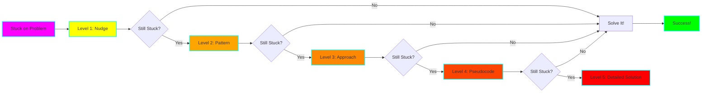
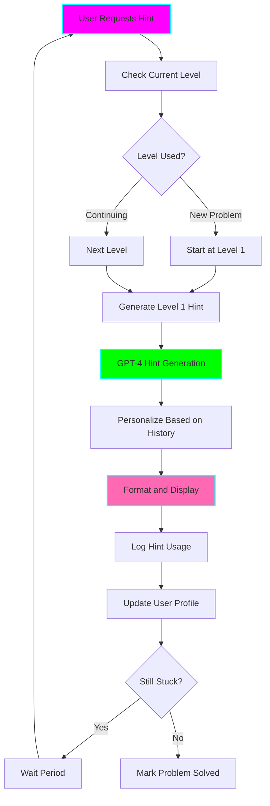

# 💡 LeetCode Progressive Hint System

**Status:** 🧪 Experimental
**Tech Stack:** Python 3.12, OpenAI GPT-4, Rich, SQLite
**Purpose:** 5-level progressive hint system that guides you to the solution without giving it away, maintaining the learning experience while reducing frustration

## Problem Statement

Traditional hint systems fail because they:
- **Give too much away** - spoil the problem-solving experience
- **Give too little** - leave you still stuck
- **No progression** - binary (no hint vs full solution)
- **Kill motivation** - getting stuck means giving up or looking at solution
- **Skip learning** - jumping to solution means you didn't really learn

## Solution

A 5-level progressive hint system that:
- **Guides without spoiling** - hints get progressively more detailed
- **Maintains challenge** - you still do the thinking
- **Reduces frustration** - unstuck without giving up
- **Tracks hint usage** - learn to use fewer hints over time
- **Personalized hints** - based on what you already know
- **Pattern-aware** - hints teach patterns, not just solutions

## The 5 Hint Levels



### Level 1: Nudge (The Gentle Push)

**Purpose:** Make you think about the right direction without revealing the approach

**Example (Two Sum):**
```
💡 Hint Level 1: Nudge

Think about:
• What information do we need to remember as we iterate?
• Is there a way to avoid checking every pair?
• Could we trade some space for faster lookups?

Time to think: 5 minutes recommended
```

### Level 2: Pattern Identification

**Purpose:** Reveal the algorithmic pattern to use

**Example (Two Sum):**
```
💡 Hint Level 2: Pattern

This problem uses the "Hash Table Lookup" pattern.

Key insight: Instead of looking for pairs, look for complements.

Questions to ask yourself:
• What's the complement of each number?
• How can we check if we've seen the complement before?
• What data structure gives O(1) lookup?

Time to think: 10 minutes recommended
```

### Level 3: High-Level Approach

**Purpose:** Describe the algorithm without code

**Example (Two Sum):**
```
💡 Hint Level 3: Approach

Algorithm outline:
1. Create a hash table to store numbers we've seen
2. For each number in the array:
   a. Calculate what we need (target - current number)
   b. Check if we've seen it before
   c. If yes, return the indices
   d. If no, store current number with its index

Why this works:
• Time: O(n) - single pass
• Space: O(n) - hash table

Try implementing this approach yourself!
```

### Level 4: Pseudocode

**Purpose:** Show the structure without the exact code

**Example (Two Sum):**
```
💡 Hint Level 4: Pseudocode

function twoSum(numbers, target):
    create empty hash_map

    for index, number in numbers:
        complement = target - number

        if complement exists in hash_map:
            return [hash_map[complement], index]

        store number:index in hash_map

    return empty array (no solution)

Edge cases to consider:
• Empty array
• No valid pair
• Multiple valid pairs (return any)
```

### Level 5: Detailed Solution

**Purpose:** Full solution with explanation (last resort)

**Example (Two Sum):**
```
💡 Hint Level 5: Detailed Solution

def twoSum(nums, target):
    # Hash map to store number: index
    seen = {}

    # Iterate with both index and value
    for i, num in enumerate(nums):
        # Calculate what we need to reach target
        complement = target - num

        # Check if we've seen the complement
        if complement in seen:
            # Found it! Return indices
            return [seen[complement], i]

        # Haven't found it yet, store this number
        seen[num] = i

    # No solution found (shouldn't happen per problem constraints)
    return []

Time Complexity: O(n) - single pass through array
Space Complexity: O(n) - hash map stores up to n elements

Why this works better than brute force:
• Brute force: O(n²) - check every pair
• This approach: O(n) - check each element once
• Trade: Use O(n) space to save O(n²) → O(n) time
```

## Architecture



## Features

### 1. Smart Hint Pacing

```bash
# Request hint
python hints.py --problem 1

# Output
```
```
💡 Hint Level 1 Available

⏱️  Recommended: Think for 5 more minutes before requesting

You've been working on this for: 3 minutes
Average solve time for Easy problems: 20 minutes

[Enter] Request hint now
[w] Wait 5 minutes (recommended)
[q] Quit
```

### 2. Hint History Tracking

```bash
python hints.py --history
```

```
╔══════════════════════════════════════════════════════════════════╗
║  💡 Your Hint Usage History                                      ║
╚══════════════════════════════════════════════════════════════════╝

SUMMARY
━━━━━━━━━━━━━━━━━━━━━━━━━━━━━━━━━━━━━━━━━━━━━━━━━━━━━━━━━━━━━━━━━
Total Problems:        47
Solved Without Hints:  23 (49%) 🎯
Average Hint Level:    2.3

TREND
━━━━━━━━━━━━━━━━━━━━━━━━━━━━━━━━━━━━━━━━━━━━━━━━━━━━━━━━━━━━━━━━━
Month 1: Avg 3.5 hints/problem
Month 2: Avg 2.3 hints/problem ↓ Improving!
Month 3: Avg 1.8 hints/problem ↓ Great progress!

RECENT PROBLEMS
━━━━━━━━━━━━━━━━━━━━━━━━━━━━━━━━━━━━━━━━━━━━━━━━━━━━━━━━━━━━━━━━━
#1   Two Sum                 Hints: 💡💡 (Level 2)
#15  3Sum                    Hints: 💡💡💡 (Level 3)
#20  Valid Parentheses       Hints: None 🎯
#21  Merge Two Sorted Lists  Hints: 💡 (Level 1)
```

### 3. Personalized Hints

Based on your history, hints are customized:

**Beginner:**
```
💡 Hint Level 2: Pattern

This is a "Two Pointers" problem.

Since this is new to you, here's what Two Pointers means:
[Detailed explanation...]
```

**Experienced:**
```
💡 Hint Level 2: Pattern

Pattern: Two Pointers (you've used this 12 times before)

Remember: Opposite ends moving toward each other.
Same strategy as #167 Two Sum II.
```

### 4. Hint Mode Options

```bash
# Socratic mode (questions instead of answers)
python hints.py --problem 1 --mode socratic

# Minimal mode (tersest hints possible)
python hints.py --problem 1 --mode minimal

# Detailed mode (maximum explanation)
python hints.py --problem 1 --mode detailed

# Challenge mode (no hints, just questions)
python hints.py --problem 1 --mode challenge
```

### 5. Hint Cooldown

Prevents rapid hint consumption:

```
💡 Hint Level 2 Requested

⏳ Cooldown: 3 minutes remaining

We recommend thinking about Level 1's hint before
requesting Level 2. This helps with learning retention.

[w] Wait (recommended)
[f] Force reveal (marks problem as "hint-heavy")
[q] Quit
```

## Installation

```bash
cd /home/user/fantastic-engine/projects/leetcode-hints

uv venv
source .venv/bin/activate
uv pip install -r requirements.txt

python hints.py --init

cp .env.example .env
# Add your OpenAI API key
```

## Usage

### Basic Usage

```bash
# Get hint for problem
python hints.py --problem 1

# Interactive mode
python hints.py --interactive

# Get specific level directly
python hints.py --problem 1 --level 3
```

### Advanced Usage

```bash
# Compare hint effectiveness
python hints.py --analyze

# Export hint history
python hints.py --export-history hints.md

# Reset problem hints (start over)
python hints.py --problem 1 --reset
```

## Python API

```python
from hints import HintSystem

# Initialize
hint_system = HintSystem()

# Get next hint
hint = hint_system.get_hint(
    problem_id=1,
    current_level=1,
    user_id="user123"
)

print(hint.level)  # 2
print(hint.content)  # Hint text
print(hint.recommended_wait)  # 300 seconds

# Log hint usage
hint_system.log_hint_used(
    problem_id=1,
    level=2,
    helpful=True
)

# Get hint statistics
stats = hint_system.get_user_stats("user123")
print(f"Avg hints: {stats.avg_hints_per_problem}")
```

## Data Models

```python
@dataclass
class Hint:
    level: int  # 1-5
    problem_id: int
    content: str
    recommended_wait: int  # seconds before next hint
    follow_up_questions: List[str]
    related_problems: List[int]

@dataclass
class HintUsage:
    problem_id: int
    user_id: str
    max_level_used: int
    helpful: bool
    time_to_solve_after: int  # minutes
    solved: bool
```

## ADHD Benefits

1. **Reduces Frustration**: Get unstuck without giving up
2. **Maintains Engagement**: Progressive hints keep you in the challenge
3. **Prevents Overwhelm**: One hint at a time, not the full solution
4. **Builds Confidence**: Solving with hints still feels like winning
5. **Learning Retention**: Working through hints teaches better than reading solutions
6. **Gamification**: Track hint reduction over time
7. **Flexible Pacing**: Use hints at your own pace

## Integration with Other Tools

### With Explainer
```python
# After exhausting hints, get full explanation
if hint.level == 5:
    explainer.explain(problem_id, focus="why_this_approach")
```

### With Pattern Trainer
```python
# Hint reveals pattern → practice that pattern
hint = hint_system.get_hint(problem_id=1)
if hint.level >= 2:
    trainer.practice_pattern(hint.pattern_name)
```

### With Session Analyzer
```python
# Track hint usage in session history
analyzer.log_problem(
    problem_id=1,
    hints_used=3,
    max_hint_level=3
)
```

### With Gamification
```python
# Earn bonus points for solving with fewer hints
if hint.level <= 2:
    gamification.award_bonus("minimal_hints", points=10)
```

## Configuration

```bash
# .env settings
OPENAI_API_KEY=sk-...
OPENAI_MODEL=gpt-4-turbo-preview

# Hint pacing
LEVEL_1_COOLDOWN=300  # seconds
LEVEL_2_COOLDOWN=600
LEVEL_3_COOLDOWN=900
LEVEL_4_COOLDOWN=1200
LEVEL_5_COOLDOWN=0  # no cooldown for final hint

# Recommendations
RECOMMEND_WAIT_LEVEL_1=300  # suggest waiting 5min
RECOMMEND_WAIT_LEVEL_2=600  # suggest waiting 10min

# Tracking
TRACK_HINT_EFFECTIVENESS=true
ENABLE_HINT_ANALYTICS=true
```

## Graduation Criteria

- [ ] AI generates hints for any problem
- [ ] Adaptive hint difficulty based on user level
- [ ] Collaborative hints (see what helped others)
- [ ] Voice-based hints (audio hints while coding)
- [ ] IDE integration (hints in editor)
- [ ] Video hints for visual learners
- [ ] Hint marketplace (community-created hints)

## Learning Log

### Challenges
- Generating good hints is harder than solutions
- Balancing "not enough" vs "too much" information
- Cooldown system needs careful tuning
- Measuring hint effectiveness

### Key Learnings
- Progressive hints maintain challenge better than binary hint/solution
- Personalization based on history dramatically improves experience
- Cooldowns prevent hint-rushing and improve retention
- Users solve problems faster WITH hints than WITHOUT (less frustration)

### Next Steps
1. Build GPT-4 hint generator with prompt engineering
2. Create hint database for top 100 problems
3. Implement cooldown and pacing system
4. Add hint analytics and tracking
5. Integrate with other tools

## Resources

- [Socratic Method](https://en.wikipedia.org/wiki/Socratic_method)
- [Spaced Repetition](https://en.wikipedia.org/wiki/Spaced_repetition)
- [Zone of Proximal Development](https://en.wikipedia.org/wiki/Zone_of_proximal_development)

## License

MIT

---

**Remember:** Hints are tools, not cheats. The goal is learning, not just solving! 💡
