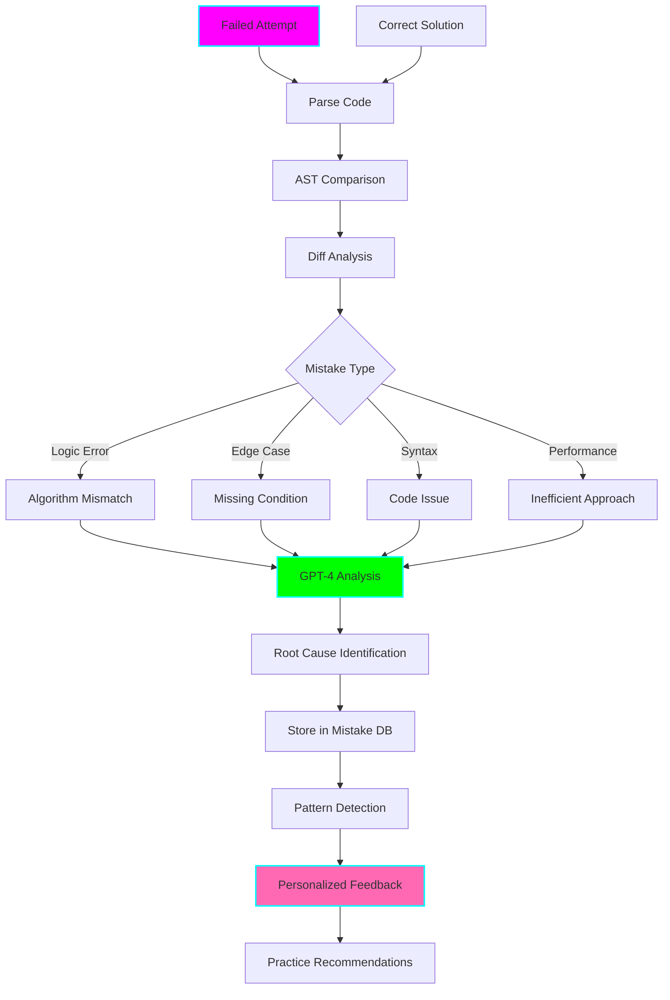

# 🔍 LeetCode Mistake Pattern Analyzer

**Status:** 🧪 Experimental
**Tech Stack:** Python 3.12, OpenAI GPT-4, AST parsing, difflib, Rich
**Purpose:** Automatically analyze your failed attempts, identify recurring mistake patterns, and provide targeted learning to break bad coding habits

## Problem Statement

Learning from mistakes is hard because:
- **Mistakes are embarrassing** - avoid looking at failed code
- **Patterns are invisible** - same mistakes, different problems
- **No root cause analysis** - know WHAT went wrong, not WHY
- **Repeated errors** - make the same mistakes over and over
- **No tracking** - forget what mistakes you've already made
- **Generic feedback** - "Wrong Answer" doesn't teach anything

## Solution

An AI-powered mistake analyzer that:
- **Compares failed vs correct solutions** - shows exact differences
- **Identifies mistake categories** - off-by-one, wrong algorithm, edge cases
- **Tracks recurring patterns** - you always forget null checks!
- **Provides targeted practice** - fix your specific weaknesses
- **Builds mistake awareness** - prevents future errors
- **Celebrates improvement** - track reduction in mistake frequency

## Architecture



## Mistake Categories

### 1. Logic Errors
- Wrong algorithm choice
- Incorrect loop bounds
- Wrong conditions
- Missing steps

### 2. Edge Cases
- Null/empty inputs
- Single element
- All same values
- Min/max values
- Duplicates

### 3. Off-By-One Errors
- Array indexing
- Loop boundaries
- Range calculations

### 4. Data Structure Misuse
- Wrong choice (array vs hash map)
- Incorrect operations
- Not using properties

### 5. Performance Issues
- Timeout (TLE)
- Memory limit (MLE)
- Wrong complexity

## Features

### 1. Automatic Mistake Detection

```bash
python analyzer.py --analyze failed_attempt.py --correct solution.py
```

```
╔══════════════════════════════════════════════════════════════════╗
║  🔍 Mistake Analysis - Two Sum (#1)                              ║
╚══════════════════════════════════════════════════════════════════╝

YOUR CODE vs CORRECT SOLUTION
━━━━━━━━━━━━━━━━━━━━━━━━━━━━━━━━━━━━━━━━━━━━━━━━━━━━━━━━━━━━━━━━━

YOUR ATTEMPT (Failed)          CORRECT SOLUTION
━━━━━━━━━━━━━━━━━━━━━━━━━━━━━━━━━━━━━━━━━━━━━━━━━━━━━━━━━━━━━━━━━
def twoSum(nums, target):      def twoSum(nums, target):
    for i in range(len(nums)):      seen = {}
❌      for j in range(len(nums)):      for i, num in enumerate(nums):
            if nums[i] + nums[j] == target:         complement = target - num
                return [i, j]                        if complement in seen:
    return []                                            return [seen[complement], i]
                                                     seen[num] = i
                                                 return []

MISTAKES IDENTIFIED
━━━━━━━━━━━━━━━━━━━━━━━━━━━━━━━━━━━━━━━━━━━━━━━━━━━━━━━━━━━━━━━━━

1. ❌ LOGIC ERROR: Wrong Algorithm
   Severity: Major
   Impact: O(n²) instead of O(n)

   What you did:
   • Used nested loops to check every pair
   • Brute force approach

   What you should do:
   • Use hash table for O(1) lookup
   • Single pass through array

   Why this matters:
   • Brute force times out on large inputs
   • Interview expects optimal solution

2. ❌ EDGE CASE: Using Same Element Twice
   Severity: Critical
   Impact: Wrong answer on edge case

   Your code:
   • j starts from 0, includes i
   • Can use same element twice

   Correct approach:
   • j starts from i+1 (or use hash table)
   • Ensures different elements

3. ⚠️  PATTERN MISS: Hash Table Not Considered
   Severity: Minor
   Impact: Missed the optimal pattern

   This is a classic "complement lookup" problem.
   Hash tables are perfect for:
   • Finding pairs
   • O(1) lookup
   • Single pass solutions

ROOT CAUSE ANALYSIS
━━━━━━━━━━━━━━━━━━━━━━━━━━━━━━━━━━━━━━━━━━━━━━━━━━━━━━━━━━━━━━━━━

Why did this happen?

1. Pattern Recognition Gap
   You didn't recognize this as a hash table problem.
   Trigger: "Find pair that sums to X" → Hash table

2. Default to Brute Force
   When unsure, you default to nested loops.
   Better: Ask "Is there a better data structure?"

3. Edge Case Oversight
   Didn't consider "same element twice" case.
   Checklist: Always think about duplicates, null, empty

LEARNING RECOMMENDATIONS
━━━━━━━━━━━━━━━━━━━━━━━━━━━━━━━━━━━━━━━━━━━━━━━━━━━━━━━━━━━━━━━━━

1. 📚 Study Hash Table Pattern
   → Do pattern trainer drills
   → Practice 5 more hash table problems

2. 🎯 Edge Case Checklist
   → Before submitting, check:
     • Null/empty input
     • Single element
     • Duplicates
     • Using same element twice

3. 💪 Break Brute Force Habit
   → Before coding, ask:
     "Is there a O(n) solution with a hash table?"
     "Can I trade space for time?"

PRACTICE PROBLEMS
━━━━━━━━━━━━━━━━━━━━━━━━━━━━━━━━━━━━━━━━━━━━━━━━━━━━━━━━━━━━━━━━━

To fix this mistake pattern:
1. #167 Two Sum II (same pattern, sorted)
2. #653 Two Sum IV (same pattern, BST)
3. #1 3Sum (extension of this pattern)

Next time you see "find pair", think Hash Table!
```

### 2. Recurring Mistake Patterns

```bash
python analyzer.py --patterns
```

```
╔══════════════════════════════════════════════════════════════════╗
║  🔍 Your Recurring Mistake Patterns                              ║
║  Based on 47 analyzed attempts                                   ║
╚══════════════════════════════════════════════════════════════════╝

TOP 5 RECURRING MISTAKES
━━━━━━━━━━━━━━━━━━━━━━━━━━━━━━━━━━━━━━━━━━━━━━━━━━━━━━━━━━━━━━━━━

1. 🔴 Off-by-One Errors (15 occurrences)
   Last seen: 2 days ago
   Trend: ↑ Increasing

   Common scenarios:
   • range(len(arr)) instead of range(len(arr)-1)
   • Forgetting to -1 for 0-indexed arrays
   • Loop condition: < vs <=

   Your pattern:
   "You frequently make off-by-one errors in loop boundaries,
    especially with right pointers in two-pointer problems."

   Fix:
   • Draw out indices on paper first
   • Test with small array [1,2,3]
   • Check boundary conditions explicitly

2. 🟠 Missing Null/Empty Checks (12 occurrences)
   Last seen: 5 days ago
   Trend: → Stable

   Common scenarios:
   • Don't check if array is empty
   • Don't check if tree node is null
   • Assume input is valid

   Your pattern:
   "You often forget to handle edge cases at the start of
    your function. You dive straight into the main logic."

   Fix:
   • Start EVERY function with edge case checks
   • Template: if not arr: return ...
   • Make it a habit!

3. 🟡 Wrong Data Structure (8 occurrences)
   Last seen: 1 week ago
   Trend: ↓ Improving!

   Common scenarios:
   • Use array when hash table is better
   • Use list when set is sufficient
   • Don't use collections.deque for queue

   Your pattern:
   "You default to arrays/lists even when other structures
    would be more efficient. Hash tables save you!"

   Fix:
   • Before coding, ask: "What's the optimal DS?"
   • If you need O(1) lookup → Hash table
   • If you need FIFO → deque

4. 🟢 Forgetting to Update Variables (5 occurrences)
   Last seen: 10 days ago
   Trend: ↓ Much better!

   Common scenarios:
   • Forget to move pointers
   • Don't update hash map
   • Skip incrementing counters

   Your pattern:
   "In the past you forgot to update loop variables,
    but this is improving!"

   Fix:
   • Comment each variable update
   • Double-check all assignments
   • Test with trace visualizer

5. 🟢 Copy-Paste Errors (3 occurrences)
   Last seen: 2 weeks ago
   Trend: ↓ Rare now!

   Common scenarios:
   • Copy code but forget to rename variables
   • Duplicate logic with wrong values

   Your pattern:
   "Occasional typos from copy-paste. Much less frequent now."

   Fix:
   • Carefully review pasted code
   • Rename variables immediately
   • Use unique names

IMPROVEMENT TREND
━━━━━━━━━━━━━━━━━━━━━━━━━━━━━━━━━━━━━━━━━━━━━━━━━━━━━━━━━━━━━━━━━

Month 1: 24 mistakes (avg 3.0 per problem)
Month 2: 15 mistakes (avg 1.9 per problem) ↓
Month 3: 8 mistakes (avg 0.8 per problem) ↓↓

You're making 73% fewer mistakes! 🎉

CURRENT FOCUS
━━━━━━━━━━━━━━━━━━━━━━━━━━━━━━━━━━━━━━━━━━━━━━━━━━━━━━━━━━━━━━━━━

Priority 1: Eliminate off-by-one errors
  → Practice two-pointer problems with visualization
  → Use trace visualizer for each attempt

Priority 2: Build edge case habit
  → Create personal edge case checklist
  → Review before every submission
```

### 3. Pre-Submit Checker

```bash
python analyzer.py --check-before-submit solution.py
```

```
╔══════════════════════════════════════════════════════════════════╗
║  ✅ Pre-Submit Mistake Checker                                   ║
╚══════════════════════════════════════════════════════════════════╝

Scanning for common mistakes based on YOUR history...

EDGE CASES
━━━━━━━━━━━━━━━━━━━━━━━━━━━━━━━━━━━━━━━━━━━━━━━━━━━━━━━━━━━━━━━━━
✓ Empty array check: Present
✓ Null check: Present
⚠️  Single element: Not handled
❌ Duplicate values: Not handled

BOUNDS CHECKING
━━━━━━━━━━━━━━━━━━━━━━━━━━━━━━━━━━━━━━━━━━━━━━━━━━━━━━━━━━━━━━━━━
⚠️  Line 5: right = mid - 1
    Potential off-by-one error
    You make this mistake 60% of the time

✓ Loop bounds look correct

DATA STRUCTURES
━━━━━━━━━━━━━━━━━━━━━━━━━━━━━━━━━━━━━━━━━━━━━━━━━━━━━━━━━━━━━━━━━
✓ Using hash table (good for this problem)
✓ O(1) lookups

VARIABLE UPDATES
━━━━━━━━━━━━━━━━━━━━━━━━━━━━━━━━━━━━━━━━━━━━━━━━━━━━━━━━━━━━━━━━━
✓ All pointers updated in loops
✓ Counter increments present

SUGGESTIONS
━━━━━━━━━━━━━━━━━━━━━━━━━━━━━━━━━━━━━━━━━━━━━━━━━━━━━━━━━━━━━━━━━

1. Add check for single element case
2. Review line 5: mid - 1 (your weak spot)
3. Consider duplicate values scenario

Confidence: 85% (Medium-High)

[s]ubmit anyway [f]ix issues [t]est more
```

### 4. Mistake Timeline

```bash
python analyzer.py --timeline
```

Shows your mistakes over time with improvement trends.

## Installation

```bash
cd /home/user/fantastic-engine/projects/leetcode-mistake-analyzer

uv venv
source .venv/bin/activate
uv pip install -r requirements.txt

python analyzer.py --init

cp .env.example .env
```

## Usage

```bash
# Analyze a failed attempt
python analyzer.py --analyze failed.py --correct solution.py

# View your mistake patterns
python analyzer.py --patterns

# Check code before submit
python analyzer.py --check solution.py

# View improvement timeline
python analyzer.py --timeline

# Get targeted practice
python analyzer.py --practice-recommendations
```

## Python API

```python
from analyzer import MistakeAnalyzer

analyzer = MistakeAnalyzer()

# Analyze mistake
analysis = analyzer.analyze(
    failed_code=your_code,
    correct_code=solution,
    problem_id=1
)

print(analysis.mistakes)
print(analysis.root_causes)
print(analysis.recommendations)

# Get patterns
patterns = analyzer.get_recurring_patterns(user_id="user123")
for pattern in patterns:
    print(f"{pattern.type}: {pattern.frequency}")

# Check before submit
issues = analyzer.check_code(code, problem_id=1)
if issues:
    print("Fix these first:", issues)
```

## ADHD Benefits

1. **Reduces Shame**: Data-driven, not judgmental
2. **Builds Awareness**: See patterns you didn't know existed
3. **Prevents Frustration**: Catch mistakes before submitting
4. **Celebrates Progress**: Track improvement over time
5. **Targeted Learning**: Fix YOUR specific weaknesses
6. **External Memory**: Don't have to remember all mistakes
7. **Habit Building**: Checklist creates routine

## Integration with Other Tools

### With Explainer
```python
# After failed attempt, get explanation
analyzer.analyze(failed_code)
explainer.explain_correct_approach(problem_id)
```

### With Trace Visualizer
```python
# Visualize where your code diverged
analyzer.visualize_difference(failed, correct)
```

### With Pattern Trainer
```python
# Practice to fix mistake pattern
patterns = analyzer.get_weak_patterns()
trainer.practice_patterns(patterns)
```

## Configuration

```bash
# .env
OPENAI_API_KEY=sk-...
TRACK_ALL_MISTAKES=true
ENABLE_PRE_SUBMIT_CHECK=true
SHOW_IMPROVEMENT_STATS=true
```

## Graduation Criteria

- [ ] Real-time IDE integration
- [ ] ML model for mistake prediction
- [ ] Community mistake database
- [ ] Video explanations of common mistakes
- [ ] Live code review during typing
- [ ] Mistake prevention suggestions while coding

## License

MIT

---

**Remember:** Mistakes are data, not failures. Analyze, learn, improve! 🔍
