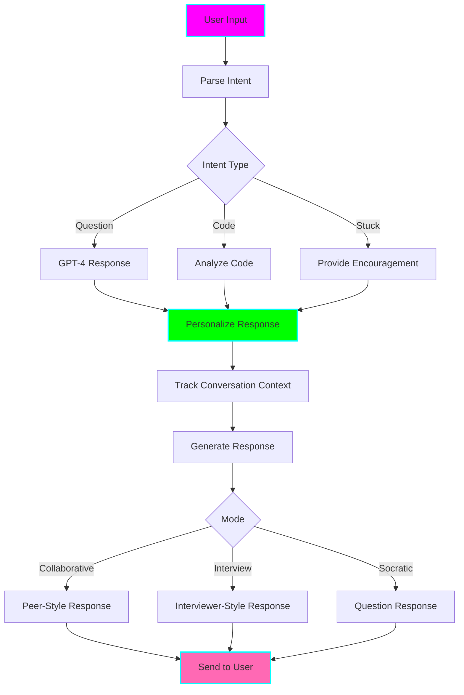

# 🤝 LeetCode AI Pair Programming Bot

**Status:** 🧪 Experimental
**Tech Stack:** Python 3.12, OpenAI GPT-4, WebSockets (real-time), Rich
**Purpose:** AI pair programming partner that guides you through problems using Socratic method, provides encouragement, and simulates real interview conversations

## Problem Statement

Practicing alone is hard because:
- **No accountability** - easy to give up when stuck
- **No feedback loop** - don't know if your approach is right until you submit
- **Missing social element** - coding is more fun with someone
- **Can't practice communication** - interviews require explaining your thinking
- **No encouragement** - get frustrated and quit
- **Bad for ADHD** - need external engagement and body doubling

## Solution

An AI pair programming bot that:
- **Acts as your coding partner** - not a tutor, a peer
- **Uses Socratic method** - asks questions instead of giving answers
- **Provides real-time feedback** - as you type/think
- **Simulates interviews** - practice explaining your approach
- **Offers encouragement** - celebrates wins, motivates through struggles
- **Adapts to your pace** - patient when you need time, nudges when stuck
- **Body doubling effect** - presence helps maintain focus (ADHD benefit)

## Interaction Modes

### 1. Collaborative Solving Mode

```
╔══════════════════════════════════════════════════════════════════╗
║  🤝 Pair Programming - Two Sum (#1)                              ║
║  Mode: Collaborative                                             ║
╚══════════════════════════════════════════════════════════════════╝

AI Partner: Hey! Ready to tackle Two Sum together?

You: Yeah, let's do it!

AI Partner: Great! Let's start by understanding the problem.
            What are we trying to find?

You: Two numbers that add up to a target.

AI Partner: Perfect! And what do we need to return?

You: The indices of those two numbers.

AI Partner: Exactly! Now, what's the first approach that comes
            to mind? No wrong answers - just brainstorm with me.

You: Check every pair of numbers?

AI Partner: That's a totally valid starting point! Brute force.
            What would the time complexity be for that?

You: O(n²) because nested loops.

AI Partner: 👍 Exactly right! That works, but...
            🤔 Is there a way we could do better?
            Hint: What if we could look up complements faster?

You: Maybe use a hash map?

AI Partner: 🎉 YES! Now we're talking! That's the key insight.
            Why don't you start coding it and I'll watch.
            Talk through your approach as you go!

You: [starts coding]
     def twoSum(nums, target):
         seen = {}

AI Partner: Great start! I like that you're creating a hash map.
            What are you planning to store in it?

You: The numbers and their indices?

AI Partner: Perfect! Keep going, this is looking good...

You: [continues coding]
     for i, num in enumerate(nums):
         complement = target - num

AI Partner: 🎯 Nice! I see where you're going.
            What's the next step after calculating the complement?

You: Check if it's in the hash map?

AI Partner: Exactly! Go ahead and code that check.

[... continues throughout the problem ...]

AI Partner: 🎉 YES! That's it! You nailed it!
            Let's review what you did:
            • O(n) time by using hash map
            • Single pass through the array
            • Smart complement thinking

            How do you feel about this solution?

You: Pretty good! Didn't think of hash map at first.

AI Partner: That's totally normal! The key is you got there.
            Want to try a similar problem to reinforce this?

You: Sure!

AI Partner: Let's do Two Sum II next. It's similar but sorted.
            Ready when you are!
```

### 2. Interview Simulation Mode

```
╔══════════════════════════════════════════════════════════════════╗
║  🎤 Mock Interview - Merge Intervals (#56)                       ║
║  Time: 30 minutes                                                ║
╚══════════════════════════════════════════════════════════════════╝

Interviewer: Hi! Thanks for joining today.
             Ready to get started?

You: Yes, ready!

Interviewer: Great. Here's the problem...

             [Presents problem description]

             Take a moment to read it and let me know when
             you're ready to discuss your approach.

You: [reads problem]
     Okay, I think I understand it.

Interviewer: Perfect. Can you explain the problem back to me
             in your own words? Just to make sure we're aligned.

You: We need to merge overlapping intervals...

Interviewer: Good! Now, before jumping to code, can you walk me
             through your high-level approach?

             Remember: I care more about your thought process
             than the perfect solution.

You: I think we should... sort the intervals first?

Interviewer: Interesting! Why sort them?

You: So we can easily find overlaps?

Interviewer: Good thinking! Sorting helps with overlap detection.
             What would you sort by?

You: The start time of each interval.

Interviewer: 👍 Perfect! That's the key insight.
             What's the time complexity of that approach?

You: O(n log n) for sorting, then O(n) to merge...
     So O(n log n) overall?

Interviewer: Excellent analysis! That's optimal for this problem.
             Now, let's see the code. Start with the function
             signature and talk through it as you go.

[... continues with typical interview flow ...]

Interviewer: [After solving]
             Great job! Let me give you some feedback:

             Strengths:
             ✓ Clear communication of approach
             ✓ Correct time complexity analysis
             ✓ Handled edge cases
             ✓ Clean, readable code

             Areas to improve:
             • Could have mentioned space complexity
             • Slightly long variable names (minor)

             Overall: Strong performance! You'd pass this round.

             Any questions for me about the problem or approach?
```

### 3. Encouragement Mode

When you're stuck or frustrated:

```
AI Partner: Hey, I notice you've been on this line for a while.
            Want to talk through what you're thinking?

You: I'm stuck. I don't know what to do next.

AI Partner: That's totally okay! Being stuck is part of learning.
            Let's take a step back.

            You've already figured out:
            ✓ The pattern (hash table)
            ✓ The main loop structure
            ✓ How to calculate the complement

            That's actually most of the hard work!

            The only thing left is: what do we do when we
            find the complement in our hash map?

You: Return the indices?

AI Partner: 🎯 Exactly! You've got this!
            You were closer than you thought.

            Deep breath, and let's code that return statement.
            I'm right here with you.

[After completing the problem]

AI Partner: 🎉 YOU DID IT!
            And you did it even after feeling stuck.
            That's a real skill - pushing through!

            You know what this means?
            You just learned the Hash Table pattern.
            That unlocks like 50+ problems!

            Take a moment and feel good about this.
            You earned it! 🎉

            Want to celebrate by trying an easier one,
            or challenge yourself with a medium?

You: Let's try a medium!

AI Partner: 🔥 That's the spirit! I love your confidence.
            Let's do 3Sum. It uses the same pattern!
```

### 4. Socratic Mode (Teaching Through Questions)

```
AI Partner: Okay, so you want to find a pair that sums to target.
            I won't give you hints - let's figure this out together
            through questions. Ready?

You: Ready.

AI Partner: Question 1: If you pick a number, say 2, and the
            target is 9, what number do you need to find?

You: 7.

AI Partner: Right! And that number (7) has a special name relative
            to 2. What do we call target - current_number?

You: The complement?

AI Partner: 🎯 Perfect! So for each number, we need its complement.

            Question 2: You could check every other number to find
            the complement. But what data structure gives you
            O(1) lookup to check "have I seen this number before?"

You: A hash table!

AI Partner: Excellent! You're connecting the dots.

            Question 3: As you iterate through the array, when
            should you check the hash table, and when should
            you add to it?

You: Check first... then add?

AI Partner: Why check first? What would happen if you added first?

You: Oh! You might use the same element twice!

AI Partner: 🎉 EXACTLY! You just discovered the edge case yourself!

            You now have all the pieces:
            • Calculate complement
            • Check hash table for complement
            • Add current number if not found

            You figured this out! Want to code it?
```

## Architecture



## Features

### 1. Real-Time Interaction

```bash
# Start pairing session
python pair_bot.py --problem 1 --mode collaborative

# Interview simulation
python pair_bot.py --problem 1 --mode interview --time 30

# Socratic teaching
python pair_bot.py --problem 1 --mode socratic

# Voice mode (optional)
python pair_bot.py --problem 1 --voice
```

### 2. Personality Customization

```
AI Partner Personalities:

1. 🎓 The Teacher
   - Patient and encouraging
   - Asks guiding questions
   - Celebrates every win

2. 💪 The Coach
   - Motivating and energetic
   - Pushes you to think harder
   - High-fives for successes

3. 🤝 The Peer
   - Casual and friendly
   - "Figures it out" with you
   - Shares "thinking out loud"

4. 🎤 The Interviewer
   - Professional and evaluative
   - Realistic interview experience
   - Constructive feedback

5. 🧘 The Zen Master
   - Calm and philosophical
   - Reduces anxiety
   - "The journey matters"
```

### 3. Progress Tracking

```bash
python pair_bot.py --stats
```

```
╔══════════════════════════════════════════════════════════════════╗
║  📊 Pair Programming Statistics                                  ║
╚══════════════════════════════════════════════════════════════════╝

SESSIONS
━━━━━━━━━━━━━━━━━━━━━━━━━━━━━━━━━━━━━━━━━━━━━━━━━━━━━━━━━━━━━━━━━
Total Sessions:      47
Total Time:          24h 15m
Avg Session:         31m
Problems Solved:     42 (89% success rate)

WITH AI PARTNER VS ALONE
━━━━━━━━━━━━━━━━━━━━━━━━━━━━━━━━━━━━━━━━━━━━━━━━━━━━━━━━━━━━━━━━━
                    With AI     Alone       Difference
Success Rate:       89%         68%         +21% 🎉
Avg Time:           31m         45m         -14m ⚡
Frustration Level:  Low         Medium      Better 😊
Giving Up Rate:     5%          25%         -20% 💪

FAVORITE MODE
━━━━━━━━━━━━━━━━━━━━━━━━━━━━━━━━━━━━━━━━━━━━━━━━━━━━━━━━━━━━━━━━━
Collaborative: 32 sessions (68%)
Interview:     10 sessions (21%)
Socratic:      5 sessions (11%)

IMPROVEMENT
━━━━━━━━━━━━━━━━━━━━━━━━━━━━━━━━━━━━━━━━━━━━━━━━━━━━━━━━━━━━━━━━━
Communication skills: ████████░░ 80% (↑15% this month)
Problem solving:      ████████░░ 85% (↑10% this month)
Confidence:           ████████████ 90% (↑25% this month!)
```

## Installation

```bash
cd /home/user/fantastic-engine/projects/leetcode-pair-bot

uv venv
source .venv/bin/activate
uv pip install -r requirements.txt

python pair_bot.py --init

cp .env.example .env
```

## Usage

```bash
# Start session
python pair_bot.py --problem 1

# Choose mode
python pair_bot.py --problem 1 --mode interview

# Choose personality
python pair_bot.py --problem 1 --personality coach

# Voice interaction (requires mic)
python pair_bot.py --problem 1 --voice

# Review past session
python pair_bot.py --review-session 42
```

## Python API

```python
from pair_bot import PairBot

# Initialize
bot = PairBot(personality="peer", mode="collaborative")

# Start session
session = bot.start_session(problem_id=1)

# Send message
response = bot.send_message("I think we should use a hash map")

# Get encouragement
encouragement = bot.encourage()

# End session
summary = bot.end_session()
print(summary.problems_solved)
print(summary.key_learnings)
```

## ADHD Benefits

1. **Body Doubling**: AI presence helps maintain focus
2. **External Motivation**: Encouragement prevents giving up
3. **Reduced Anxiety**: Friendly AI less scary than human judge
4. **Flexible Pacing**: Takes breaks when you need
5. **Celebration**: Acknowledges every small win
6. **Accountability**: Commits to session with you
7. **Reduces Overwhelm**: Breaks problem into small questions
8. **Engagement**: Conversation more engaging than solo
9. **Safe Practice**: No judgment for mistakes
10. **Immediate Feedback**: Validates thinking in real-time

## Integration with Other Tools

### With Hint System
```python
# Bot can request hints for you
bot: "Want me to get a hint for this part?"
user: "Yes please"
bot: [retrieves hint level 2]
```

### With Trace Visualizer
```python
# Bot can show visual trace
bot: "Let's visualize what your code does"
visualizer.show_trace(your_code)
```

### With Mistake Analyzer
```python
# Bot learns from your mistake patterns
bot: "I notice you often forget null checks. Want me to remind you?"
```

### With Gamification
```python
# Pair sessions earn bonus points
gamification.award("pair_programming_streak", days=7)
```

## Configuration

```bash
# .env
OPENAI_API_KEY=sk-...
BOT_PERSONALITY=peer
DEFAULT_MODE=collaborative

# Voice settings
ENABLE_VOICE=false
VOICE_SPEED=1.0
VOICE_GENDER=neutral

# Behavior
ENCOURAGEMENT_FREQUENCY=medium
ALLOW_DIRECT_ANSWERS=false  # Socratic only
CELEBRATION_LEVEL=high
```

## Graduation Criteria

- [ ] Voice-to-voice conversation (no typing)
- [ ] Video avatar for visual presence
- [ ] Multi-user pair programming
- [ ] Long-term memory of your progress
- [ ] Emotion detection (when you're frustrated)
- [ ] Integration with video calls
- [ ] Mobile app support

## License

MIT

---

**Remember:** You're never alone when you have an AI pair partner! 🤝
