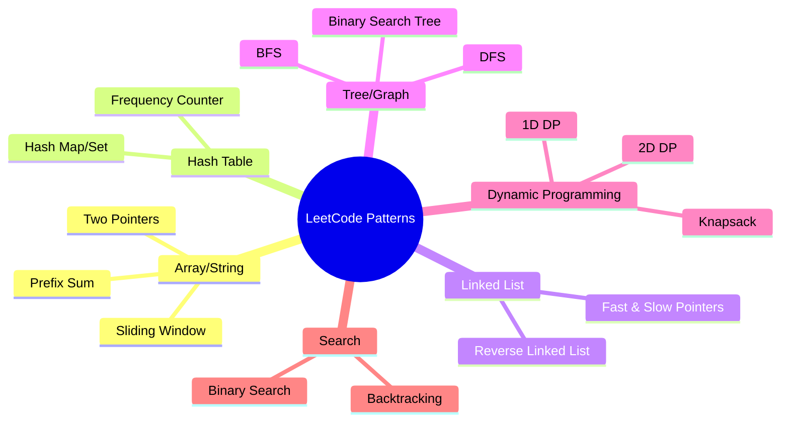
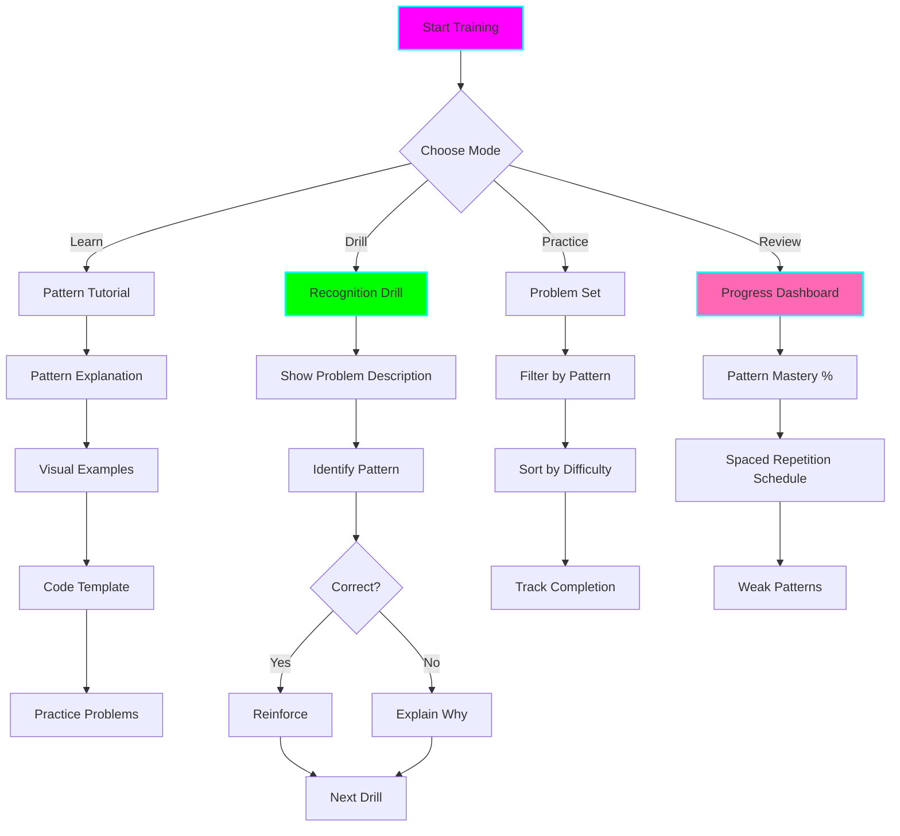

# 🎯 LeetCode Pattern Recognition Trainer

**Status:** 🧪 Experimental
**Tech Stack:** Python 3.12, OpenAI GPT-4, Rich (terminal UI), SQLite (progress tracking)
**Purpose:** Master the 15 core algorithmic patterns that solve 80% of LeetCode problems through spaced repetition and deliberate practice

## Problem Statement

Most LeetCode beginners struggle because they:
- Try to memorize solutions instead of patterns
- Don't recognize when to apply which pattern
- Practice randomly without reinforcing pattern recognition
- Give up when stuck because they don't know which approach to try
- Can't transfer knowledge from one problem to another

## Solution

A systematic pattern recognition training system that:
- **Teaches 15 core patterns** that cover ~80% of LeetCode problems
- **Provides pattern recognition drills** to identify patterns in problem descriptions
- **Uses spaced repetition** to reinforce pattern recall
- **Tracks mastery** of each pattern with progression metrics
- **Generates practice problems** organized by pattern
- **Builds pattern intuition** through guided exercises

## The 15 Core Patterns



### Pattern Catalog

| # | Pattern | Difficulty | Key Indicator | Example Problems |
|---|---------|------------|---------------|------------------|
| 1 | **Two Pointers** | Easy | "Find pair/triplet", "sorted array", "opposite ends" | Two Sum II, 3Sum, Container With Most Water |
| 2 | **Sliding Window** | Medium | "Contiguous subarray/substring", "max/min length" | Longest Substring Without Repeating, Max Sum Subarray |
| 3 | **Fast & Slow Pointers** | Medium | "Linked list cycle", "find middle", "detect pattern" | Linked List Cycle, Find Duplicate Number |
| 4 | **Hash Map/Set** | Easy | "Need O(1) lookup", "count frequency", "find duplicates" | Two Sum, Group Anagrams, Valid Anagram |
| 5 | **Binary Search** | Medium | "Sorted array", "find in log time", "search space" | Search Insert Position, Find Peak Element |
| 6 | **BFS (Breadth-First Search)** | Medium | "Shortest path", "level-order", "nearest" | Binary Tree Level Order, Word Ladder |
| 7 | **DFS (Depth-First Search)** | Medium | "Explore all paths", "tree traversal", "backtrack" | Number of Islands, Path Sum |
| 8 | **Backtracking** | Hard | "Generate all", "combinations", "permutations" | N-Queens, Generate Parentheses, Subsets |
| 9 | **Dynamic Programming (1D)** | Medium | "Optimal substructure", "overlapping subproblems" | Climbing Stairs, House Robber, Coin Change |
| 10 | **Dynamic Programming (2D)** | Hard | "Grid problems", "string matching", "two sequences" | Longest Common Subsequence, Edit Distance |
| 11 | **Prefix Sum** | Easy | "Range sum queries", "subarray sum" | Range Sum Query, Subarray Sum Equals K |
| 12 | **Binary Search Tree** | Medium | "BST property", "inorder traversal" | Validate BST, Kth Smallest Element |
| 13 | **Knapsack** | Hard | "0/1 choice", "maximize/minimize with constraint" | Partition Equal Subset Sum, Target Sum |
| 14 | **Reverse Linked List** | Easy | "Reverse list/sublist", "reorder nodes" | Reverse Linked List, Reverse Nodes in k-Group |
| 15 | **Frequency Counter** | Easy | "Count occurrences", "most/least frequent" | Top K Frequent Elements, Valid Anagram |

## Architecture



## Features

### 1. Pattern Learning Mode

For each pattern, provides:
- **Intuitive Explanation**: When and why to use this pattern
- **Visual Representation**: Diagrams showing how the pattern works
- **Code Template**: Reusable skeleton code
- **Time/Space Complexity**: Typical complexity for this pattern
- **Variations**: Common variants of the pattern
- **Pitfalls**: Common mistakes to avoid

Example:
```
╔══════════════════════════════════════════════════════════════════╗
║  🎯 Pattern #1: Two Pointers                                     ║
╚══════════════════════════════════════════════════════════════════╝

📖 WHAT IS IT?
━━━━━━━━━━━━━━━━━━━━━━━━━━━━━━━━━━━━━━━━━━━━━━━━━━━━━━━━━━━━━━━━━
Two pointers moving through data from different positions/speeds
to find relationships between elements.

🎬 VISUAL EXAMPLE
━━━━━━━━━━━━━━━━━━━━━━━━━━━━━━━━━━━━━━━━━━━━━━━━━━━━━━━━━━━━━━━━━
Problem: Find pair that sums to target in sorted array

   [1, 2, 3, 4, 6, 8, 9]  target=10
    ↑                 ↑
   left             right

   1 + 9 = 10  ✓ Found!

💻 CODE TEMPLATE
━━━━━━━━━━━━━━━━━━━━━━━━━━━━━━━━━━━━━━━━━━━━━━━━━━━━━━━━━━━━━━━━━
def two_pointers_template(arr):
    left, right = 0, len(arr) - 1

    while left < right:
        # Check condition
        if condition_met(arr[left], arr[right]):
            return [left, right]

        # Move pointers based on logic
        if arr[left] + arr[right] < target:
            left += 1   # Need larger sum
        else:
            right -= 1  # Need smaller sum

    return None

⏱️  COMPLEXITY
━━━━━━━━━━━━━━━━━━━━━━━━━━━━━━━━━━━━━━━━━━━━━━━━━━━━━━━━━━━━━━━━━
Time:  O(n) - single pass through data
Space: O(1) - only two pointer variables

🎯 WHEN TO USE
━━━━━━━━━━━━━━━━━━━━━━━━━━━━━━━━━━━━━━━━━━━━━━━━━━━━━━━━━━━━━━━━━
✓ Array/string is sorted or can be sorted
✓ Need to find pairs/triplets with certain property
✓ Problem mentions "two elements" or "pair"
✓ Can reduce O(n²) brute force to O(n)

🚫 WHEN NOT TO USE
━━━━━━━━━━━━━━━━━━━━━━━━━━━━━━━━━━━━━━━━━━━━━━━━━━━━━━━━━━━━━━━━━
✗ Data is unsorted and can't be sorted
✗ Need to maintain original order
✗ Problem requires visiting all pairs
```

### 2. Pattern Recognition Drills

Interactive drills to build pattern recognition:

```
╔══════════════════════════════════════════════════════════════════╗
║  🎯 Pattern Recognition Drill                                    ║
║  Progress: 12/20 | Accuracy: 85% | Time: 2:34                   ║
╚══════════════════════════════════════════════════════════════════╝

Problem #13:

  "Given a sorted array of integers, find two numbers that add up
   to a specific target number."

Which pattern would you use?

1. Two Pointers
2. Sliding Window
3. Hash Map
4. Binary Search
5. DFS

Your answer: _
```

**Drill Features:**
- **Timed drills** (optional) for building quick recognition
- **Progressive difficulty** (easy → medium → hard)
- **Spaced repetition** - see problems you got wrong more often
- **Instant feedback** with explanation of why that pattern works
- **Pattern hints** if you're stuck

### 3. Spaced Repetition System

Uses the SM-2 algorithm (like Anki) for optimal retention:

```
╔══════════════════════════════════════════════════════════════════╗
║  📅 Today's Pattern Review                                       ║
╚══════════════════════════════════════════════════════════════════╝

Due for review today:

🔴 Two Pointers (Mastery: 45% - Struggling)
   → 5 drills due
   → Last reviewed: 2 days ago
   → Success rate: 40%

🟡 Sliding Window (Mastery: 70% - Learning)
   → 3 drills due
   → Last reviewed: 4 days ago
   → Success rate: 70%

🟢 Hash Map (Mastery: 95% - Mastered)
   → 1 drill due
   → Last reviewed: 14 days ago
   → Success rate: 95%

Start review session? [Y/n]
```

### 4. Progress Dashboard

Visual tracking of pattern mastery:

```
╔══════════════════════════════════════════════════════════════════╗
║  📊 Pattern Mastery Dashboard                                    ║
╚══════════════════════════════════════════════════════════════════╝

Overall Progress: 58% (8.7/15 patterns mastered)

Pattern Mastery:
━━━━━━━━━━━━━━━━━━━━━━━━━━━━━━━━━━━━━━━━━━━━━━━━━━━━━━━━━━━━━━━━━

Hash Map/Set          ████████████████████ 100% ⭐ Mastered
Two Pointers          ██████████████░░░░░░  70% 🎯 Learning
Binary Search         ████████████░░░░░░░░  60% 🎯 Learning
Sliding Window        ██████████░░░░░░░░░░  50% 📚 Novice
DFS                   ████████░░░░░░░░░░░░  40% 📚 Novice
BFS                   ████████░░░░░░░░░░░░  40% 📚 Novice
Fast/Slow Pointers    ██████░░░░░░░░░░░░░░  30% 📚 Novice
Dynamic Programming   ████░░░░░░░░░░░░░░░░  20% 🔴 Struggling
Backtracking          ░░░░░░░░░░░░░░░░░░░░   0% ⚪ Not Started

Recent Activity:
━━━━━━━━━━━━━━━━━━━━━━━━━━━━━━━━━━━━━━━━━━━━━━━━━━━━━━━━━━━━━━━━━
✓ Completed 15 drills today
✓ Solved 3 pattern-based problems
✓ Reviewed 2 patterns
🔥 7 day streak!

Recommended Focus:
━━━━━━━━━━━━━━━━━━━━━━━━━━━━━━━━━━━━━━━━━━━━━━━━━━━━━━━━━━━━━━━━━
1. Complete Dynamic Programming tutorial (0% → 20%)
2. Review Two Pointers (maintain mastery)
3. Practice Sliding Window drills (50% → 70%)
```

### 5. Pattern-Based Problem Sets

Curated problems organized by pattern:

```bash
# List all problems for a pattern
python trainer.py --pattern "Two Pointers" --list

# Practice problems from easiest to hardest
python trainer.py --pattern "Two Pointers" --practice

# Only unsolved problems
python trainer.py --pattern "Two Pointers" --unsolved

# Mixed practice (multiple patterns)
python trainer.py --mixed --count 10
```

## Installation

```bash
# Navigate to project
cd /home/user/fantastic-engine/projects/leetcode-pattern-trainer

# Create virtual environment
uv venv
source .venv/bin/activate

# Install dependencies
uv pip install -r requirements.txt

# Initialize database
python trainer.py --init

# Setup environment variables
cp .env.example .env
```

## Usage

### Learning Patterns

```bash
# Learn a specific pattern
python trainer.py --learn "Two Pointers"

# Learn all patterns (tutorial mode)
python trainer.py --learn-all

# Show pattern cheatsheet
python trainer.py --cheatsheet "Two Pointers"
```

### Pattern Recognition Drills

```bash
# Start drill session (20 random problems)
python trainer.py --drill

# Drill specific pattern
python trainer.py --drill --pattern "Two Pointers"

# Timed drill (adds time pressure)
python trainer.py --drill --timed

# Review drills you got wrong
python trainer.py --drill --review-mistakes
```

### Spaced Repetition

```bash
# Show what's due today
python trainer.py --due-today

# Start review session
python trainer.py --review

# Adjust difficulty of a pattern
python trainer.py --adjust "Dynamic Programming" --difficulty easy
```

### Progress Tracking

```bash
# Show dashboard
python trainer.py --dashboard

# Pattern-specific stats
python trainer.py --stats "Two Pointers"

# Export progress report
python trainer.py --export-report progress.md
```

### Problem Practice

```bash
# Practice problems for a pattern
python trainer.py --practice "Two Pointers"

# Mixed practice (test pattern recognition)
python trainer.py --mixed --count 10

# Only easy problems for a pattern
python trainer.py --practice "Dynamic Programming" --easy

# Challenge mode (hard problems only)
python trainer.py --challenge
```

## Python API

```python
from trainer import PatternTrainer, Pattern

# Initialize trainer
trainer = PatternTrainer()

# Load a pattern
pattern = trainer.get_pattern("Two Pointers")

# Get pattern tutorial
tutorial = pattern.get_tutorial()
print(tutorial.explanation)
print(tutorial.code_template)

# Start drill
drill = trainer.start_drill(pattern="Two Pointers", count=10)
for question in drill:
    print(question.description)
    answer = input("Pattern: ")
    result = drill.submit_answer(answer)
    print(result.feedback)

# Check progress
progress = trainer.get_progress()
print(f"Overall mastery: {progress.overall_percentage}%")

# Get spaced repetition schedule
due = trainer.get_due_reviews()
for item in due:
    print(f"{item.pattern}: {item.due_count} drills")
```

## Pattern Data Structure

```python
@dataclass
class Pattern:
    id: int
    name: str
    category: str  # Array, Tree, DP, etc.
    difficulty: str
    explanation: str
    visual_example: str
    code_template: str
    time_complexity: str
    space_complexity: str
    when_to_use: List[str]
    when_not_to_use: List[str]
    variations: List[str]
    common_mistakes: List[str]
    related_patterns: List[str]
    example_problems: List[int]  # LeetCode problem IDs

@dataclass
class PatternProgress:
    pattern_id: int
    mastery_level: float  # 0-100
    total_drills: int
    correct_drills: int
    last_reviewed: datetime
    next_review: datetime
    ease_factor: float  # for SM-2 algorithm
    interval: int  # days until next review
```

## ADHD Benefits

1. **Pattern Recognition Over Memorization**: Reduces cognitive load by teaching transferable skills
2. **Spaced Repetition**: Automatic scheduling prevents cramming and burnout
3. **Progressive Mastery**: Clear progression from 0% → 100% provides dopamine feedback
4. **Visual Progress**: Color-coded dashboard makes progress tangible
5. **Focused Learning**: One pattern at a time instead of random problem-solving
6. **Quick Wins**: Easy drills build confidence before tackling hard problems
7. **Gamification**: Streaks and mastery levels maintain engagement
8. **Chunked Information**: 15 patterns instead of 1000+ problems

## Integration with Other Tools

### With Explainer
```python
# When viewing explanation, identify pattern and log practice
explanation = explainer.explain(problem_id=1)
trainer.log_pattern_practice(
    pattern=explanation.pattern.name,
    problem_id=1,
    success=True
)
```

### With Study Planner
```python
# Study planner recommends patterns to focus on
planner = StudyPlanner()
focus_patterns = planner.get_recommended_patterns()
# → ["Dynamic Programming", "Backtracking"]

trainer.create_study_plan(focus_patterns, days=7)
```

### With Session Analyzer
```python
# Track pattern recognition accuracy over time
analyzer = SessionAnalyzer()
stats = analyzer.get_pattern_accuracy(days=30)
# → Shows which patterns you consistently identify correctly
```

### With Gamification
```python
# Earn achievements for pattern mastery
gamification.check_achievement("pattern_master")
# → "🏆 Unlocked: Two Pointers Master (95% mastery)"
```

## Configuration

```bash
# .env settings
OPENAI_API_KEY=sk-...
DATABASE_PATH=progress.db

# Spaced repetition settings
SM2_INITIAL_INTERVAL=1  # days
SM2_GRADUATION_INTERVAL=4  # days
SM2_MAX_INTERVAL=365  # days
MASTERY_THRESHOLD=90  # percentage

# Drill settings
DEFAULT_DRILL_COUNT=20
ENABLE_TIMED_DRILLS=true
DRILL_TIME_LIMIT=30  # seconds per question

# Progress tracking
STREAK_RESET_HOURS=48
DAILY_DRILL_GOAL=10
```

## Graduation Criteria

- [ ] All 15 patterns implemented with tutorials
- [ ] Database of 500+ pattern recognition drills
- [ ] Spaced repetition algorithm working correctly
- [ ] Integration with LeetCode API for problem data
- [ ] Mobile app for on-the-go drills
- [ ] Community contributions (user-submitted patterns)
- [ ] ML-based pattern detection from problem text
- [ ] Personalized learning paths based on progress

## Learning Log

### Challenges
- Curating high-quality drills for each pattern
- Balancing pattern recognition with actual problem-solving
- SM-2 algorithm tuning for optimal retention
- Keeping problem data updated with LeetCode changes

### Key Learnings
- Pattern recognition is THE key skill for LeetCode success
- Spaced repetition dramatically improves retention
- Visual progress tracking increases motivation
- Starting with pattern, not problem, reduces anxiety

### Next Steps
1. Build core 15 patterns with tutorials
2. Create 50 drills per pattern (750 total)
3. Implement SM-2 spaced repetition
4. Add progress tracking and dashboard
5. Integrate with other tools in ecosystem

## Resources

- [Grokking the Coding Interview](https://www.educative.io/courses/grokking-the-coding-interview)
- [Sean Prashad's LeetCode Patterns](https://seanprashad.com/leetcode-patterns/)
- [SuperMemo SM-2 Algorithm](https://www.supermemo.com/en/archives1990-2015/english/ol/sm2)
- [14 Patterns to Ace Any Coding Interview](https://hackernoon.com/14-patterns-to-ace-any-coding-interview-question-c5bb3357f6ed)

## License

MIT

---

**Remember:** Master patterns, not problems. A single pattern unlocks dozens of problems! 🎯
