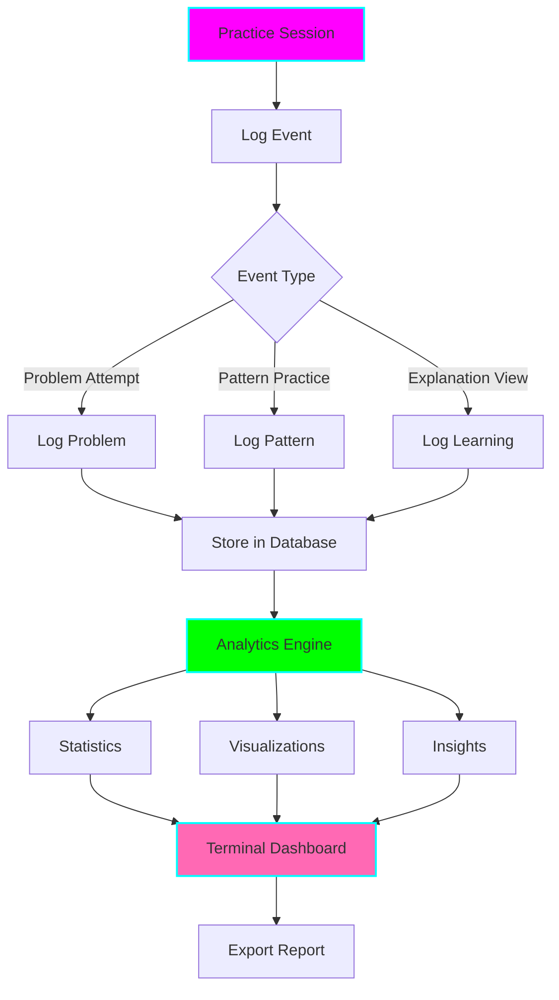

# 📈 LeetCode Session Analyzer

**Status:** 🧪 Experimental
**Tech Stack:** Python 3.12, SQLite, Pandas, Plotext (terminal graphs), Rich
**Purpose:** Track, analyze, and visualize your LeetCode practice sessions to identify patterns, maintain consistency, and measure improvement over time

## Problem Statement

LeetCode learners often struggle with:
- **Inconsistent practice** - no tracking of study sessions
- **Lack of progress visibility** - can't see improvement over time
- **Unknown weak areas** - which patterns/difficulties need more work?
- **No accountability** - easy to skip days without consequences
- **Wasted effort** - repeating same problems without spaced repetition
- **Burnout risk** - no data on practice intensity and rest needs

## Solution

A comprehensive session tracking and analytics system that:
- **Logs every practice session** with problem details, time, and outcome
- **Visualizes progress** with terminal-based graphs and charts
- **Identifies patterns** in your learning (best time of day, streak patterns)
- **Tracks weak areas** (which patterns need more practice)
- **Calculates statistics** (avg time per problem, success rate by difficulty)
- **Provides insights** using AI to analyze your learning patterns
- **Exports reports** for review and sharing

## Architecture



## Features

### 1. Session Logging

Track every interaction with LeetCode:

```python
# Log problem attempt
analyzer.log_problem(
    problem_id=1,
    title="Two Sum",
    difficulty="Easy",
    pattern="Hash Map",
    time_spent=15,  # minutes
    success=True,
    attempts=2,
    notes="Finally understood the complement pattern!"
)

# Log pattern practice
analyzer.log_pattern_drill(
    pattern="Two Pointers",
    correct=8,
    total=10,
    time_spent=12
)

# Log explanation viewed
analyzer.log_explanation_view(
    problem_id=1,
    level=3,
    time_spent=8
)
```

### 2. Progress Dashboard

Terminal-based visual dashboard:

```
╔══════════════════════════════════════════════════════════════════╗
║  📈 LeetCode Session Analyzer                                    ║
║  Week of Nov 10-16, 2025                                         ║
╚══════════════════════════════════════════════════════════════════╝

📊 WEEKLY SUMMARY
━━━━━━━━━━━━━━━━━━━━━━━━━━━━━━━━━━━━━━━━━━━━━━━━━━━━━━━━━━━━━━━━━
Total Sessions:      14
Problems Solved:     12
Success Rate:        75% (↑5% from last week)
Total Time:          6h 24m
Avg Time/Problem:    32m
Current Streak:      🔥 7 days

📈 PROBLEMS BY DIFFICULTY
━━━━━━━━━━━━━━━━━━━━━━━━━━━━━━━━━━━━━━━━━━━━━━━━━━━━━━━━━━━━━━━━━
Easy:    ████████░░ 8/10  (80% success)
Medium:  ██████░░░░ 4/10  (60% success)
Hard:    ░░░░░░░░░░ 0/5   (0% success)

🎯 PATTERNS PRACTICED
━━━━━━━━━━━━━━━━━━━━━━━━━━━━━━━━━━━━━━━━━━━━━━━━━━━━━━━━━━━━━━━━━
Two Pointers:     5 problems (100% success) ⭐
Hash Map:         4 problems (75% success)
Sliding Window:   2 problems (50% success)
Binary Search:    1 problem (0% success) ⚠️

📅 DAILY ACTIVITY (Last 7 Days)
━━━━━━━━━━━━━━━━━━━━━━━━━━━━━━━━━━━━━━━━━━━━━━━━━━━━━━━━━━━━━━━━━
Mon  ████░ 2 problems (45m)
Tue  ██████ 3 problems (68m)
Wed  ████░ 2 problems (51m)
Thu  ░░░░░ 0 problems (0m)
Fri  ████░ 2 problems (42m)
Sat  ██████ 3 problems (89m)
Sun  ████░ 2 problems (39m)

⏰ BEST PRACTICE TIME
━━━━━━━━━━━━━━━━━━━━━━━━━━━━━━━━━━━━━━━━━━━━━━━━━━━━━━━━━━━━━━━━━
Peak Performance: 9-11 AM (85% success rate)
Worst Time:       9-11 PM (45% success rate)

💡 INSIGHTS
━━━━━━━━━━━━━━━━━━━━━━━━━━━━━━━━━━━━━━━━━━━━━━━━━━━━━━━━━━━━━━━━━
✓ You're most productive on Saturdays (avg 30m/problem)
⚠️ Binary Search needs more practice (0% success)
✓ Morning sessions have 40% higher success rate
⚠️ Thursday is your weakest day (no practice)
✓ You solve Easy problems 2x faster than last month!
```

### 3. Analytics & Statistics

Comprehensive metrics:

```bash
# Overall statistics
python analyzer.py --stats

# Specific time period
python analyzer.py --stats --from 2025-11-01 --to 2025-11-30

# By difficulty
python analyzer.py --stats --difficulty Medium

# By pattern
python analyzer.py --stats --pattern "Dynamic Programming"

# Time analysis
python analyzer.py --time-analysis
```

Output:
```
OVERALL STATISTICS
━━━━━━━━━━━━━━━━━━━━━━━━━━━━━━━━━━━━━━━━━━━━━━━━━━━━━━━━━━━━━━━━━
Total Problems:           47
Success Rate:             68%
Total Time:               24h 32m
Avg Time per Problem:     31m
Fastest Solve:            8m (Two Sum)
Slowest Solve:            2h 15m (Median of Two Sorted Arrays)

BY DIFFICULTY
━━━━━━━━━━━━━━━━━━━━━━━━━━━━━━━━━━━━━━━━━━━━━━━━━━━━━━━━━━━━━━━━━
                Problems   Success%   Avg Time
Easy               24        83%        18m
Medium             20        55%        45m
Hard                3        33%        1h 24m

TOP 5 PATTERNS
━━━━━━━━━━━━━━━━━━━━━━━━━━━━━━━━━━━━━━━━━━━━━━━━━━━━━━━━━━━━━━━━━
1. Hash Map          12 problems (75% success)
2. Two Pointers       9 problems (89% success)
3. Sliding Window     7 problems (57% success)
4. Binary Search      6 problems (50% success)
5. DFS                5 problems (60% success)
```

### 4. Visualization

Terminal-based graphs using plotext:

```bash
# Progress over time
python analyzer.py --graph progress

# Success rate trend
python analyzer.py --graph success-rate

# Time spent by day of week
python analyzer.py --graph weekly-pattern

# Pattern distribution
python analyzer.py --graph patterns
```

### 5. AI-Powered Insights

GPT-4 analyzes your data and provides personalized recommendations:

```bash
python analyzer.py --insights
```

```
🤖 AI INSIGHTS FROM YOUR PRACTICE PATTERNS
━━━━━━━━━━━━━━━━━━━━━━━━━━━━━━━━━━━━━━━━━━━━━━━━━━━━━━━━━━━━━━━━━

STRENGTHS
✓ Consistent morning practice (7-day streak!)
✓ Strong grasp of Two Pointers (89% success)
✓ Improving speed on Easy problems (+40% faster)

AREAS FOR IMPROVEMENT
⚠️ Binary Search success rate is low (50%)
  → Recommendation: Review binary search fundamentals
  → Practice 5 easy binary search problems before medium ones

⚠️ Evening sessions have 30% lower success rate
  → Recommendation: Move practice to mornings when possible
  → If evening practice needed, start with easier problems

⚠️ Thursday is your skip day
  → Recommendation: Set a reminder for Thursday evening
  → Even 15 minutes maintains your streak

PERSONALIZED STUDY PLAN
━━━━━━━━━━━━━━━━━━━━━━━━━━━━━━━━━━━━━━━━━━━━━━━━━━━━━━━━━━━━━━━━━
Week 1: Focus on Binary Search pattern
  → Days 1-3: Easy binary search problems (704, 35, 278)
  → Days 4-5: Review and medium problems (33, 34)
  → Weekend: Mixed practice to test retention

Week 2: Strengthen Sliding Window
  → Address your 57% success rate
  → Practice variable-size window problems

OPTIMAL SCHEDULE (Based on your patterns)
━━━━━━━━━━━━━━━━━━━━━━━━━━━━━━━━━━━━━━━━━━━━━━━━━━━━━━━━━━━━━━━━━
Monday:     9-10 AM, 2 problems, Medium difficulty
Tuesday:    9-10 AM, 2 problems, 1 Easy + 1 Medium
Wednesday:  Rest day (maintain balance)
Thursday:   6-7 PM, 1 Easy problem (prevent skip)
Friday:     9-10 AM, 2 problems, Challenge yourself
Weekend:    Flexible timing, 3-4 problems, Mix difficulties
```

## Installation

```bash
cd /home/user/fantastic-engine/projects/leetcode-session-analyzer

uv venv
source .venv/bin/activate
uv pip install -r requirements.txt

# Initialize database
python analyzer.py --init

cp .env.example .env
```

## Usage

### Logging Sessions

```bash
# Manual logging
python analyzer.py --log \
  --problem 1 \
  --title "Two Sum" \
  --difficulty Easy \
  --pattern "Hash Map" \
  --time 15 \
  --success

# Interactive logging
python analyzer.py --log-interactive

# Batch import from CSV
python analyzer.py --import sessions.csv
```

### Viewing Dashboard

```bash
# Today's summary
python analyzer.py --today

# Weekly dashboard
python analyzer.py --week

# Monthly report
python analyzer.py --month

# Custom date range
python analyzer.py --from 2025-11-01 --to 2025-11-30
```

### Analytics

```bash
# Get statistics
python analyzer.py --stats

# Pattern analysis
python analyzer.py --pattern-stats

# Time analysis
python analyzer.py --time-analysis

# Streak info
python analyzer.py --streak
```

### Exporting Data

```bash
# Export to markdown
python analyzer.py --export report.md

# Export to CSV
python analyzer.py --export data.csv

# Export to JSON
python analyzer.py --export data.json
```

## Python API

```python
from analyzer import SessionAnalyzer

# Initialize
analyzer = SessionAnalyzer()

# Log a session
analyzer.log_problem(
    problem_id=1,
    title="Two Sum",
    difficulty="Easy",
    pattern="Hash Map",
    time_spent=15,
    success=True
)

# Get statistics
stats = analyzer.get_statistics()
print(f"Success rate: {stats.success_rate}%")

# Get insights
insights = analyzer.get_ai_insights()
print(insights.recommendations)

# Get streak
streak = analyzer.get_current_streak()
print(f"🔥 {streak} day streak!")
```

## Data Models

```python
@dataclass
class ProblemAttempt:
    id: int
    timestamp: datetime
    problem_id: int
    problem_title: str
    difficulty: str
    pattern: str
    time_spent: int  # minutes
    success: bool
    attempts: int
    hints_used: int
    notes: str

@dataclass
class Statistics:
    total_problems: int
    unique_problems: int
    success_rate: float
    total_time: int
    avg_time_per_problem: float
    current_streak: int
    longest_streak: int
    by_difficulty: Dict[str, DifficultyStats]
    by_pattern: Dict[str, PatternStats]
    by_day_of_week: Dict[str, int]
    by_time_of_day: Dict[str, float]
```

## Integration with Other Tools

### With Explainer
```python
# Automatically log when viewing explanations
explainer.explain(problem_id=1, track=True)
# → Logs to session analyzer
```

### With Pattern Trainer
```python
# Sync pattern practice to session history
trainer.complete_drill(pattern="Two Pointers")
# → Logs drill results
```

### With Gamification
```python
# Session data feeds into gamification
analyzer.log_problem(...)
# → Updates streak, unlocks achievements
```

## ADHD Benefits

1. **Visual Progress**: Seeing graphs and stats provides dopamine feedback
2. **Streak Tracking**: Gamifies consistency and prevents skipping days
3. **Best Time Insights**: Learn when you're most focused
4. **Quick Wins**: Daily summaries show immediate progress
5. **Pattern Recognition**: Identifies what's working vs what's not
6. **Accountability**: Hard to ignore data showing weak areas
7. **Celebration**: Automatically highlights improvements and successes

## Graduation Criteria

- [ ] Export to web dashboard with interactive charts
- [ ] Integration with LeetCode API for auto-import
- [ ] Mobile app for quick session logging
- [ ] Social features (compare with friends, leaderboards)
- [ ] Advanced ML insights (predict optimal study schedule)
- [ ] Integration with calendar apps
- [ ] Voice logging for hands-free tracking

## License

MIT
