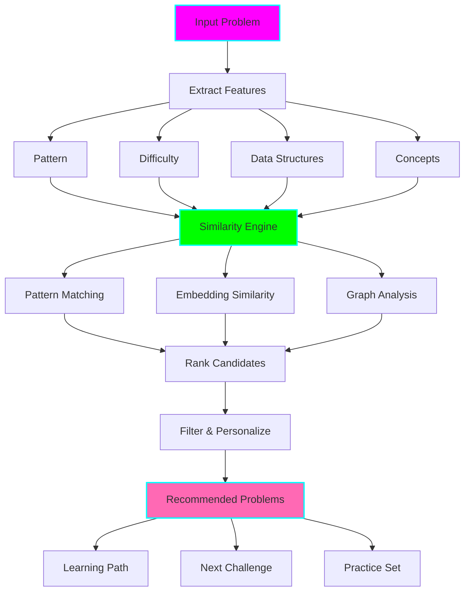

# 🔗 LeetCode Similar Problems Generator

**Status:** 🧪 Experimental
**Tech Stack:** Python 3.12, OpenAI GPT-4, scikit-learn (embeddings), NetworkX (graph analysis)
**Purpose:** Automatically find and recommend similar problems based on patterns, difficulty progression, and your learning path to reinforce concepts through deliberate practice

## Problem Statement

Finding the right next problem is hard because:
- **Random practice** - no systematic reinforcement of patterns
- **Too similar** - same problem with different numbers (boring)
- **Too different** - completely new concepts (overwhelming)
- **No progression** - jumping between Easy and Hard randomly
- **Can't find variants** - want to practice same pattern but can't find similar problems
- **Wasted time** - searching LeetCode for hours instead of practicing

## Solution

An AI-powered similar problems recommendation engine that:
- **Finds pattern-similar problems** - same algorithmic approach
- **Suggests progressive difficulty** - gradually harder variants
- **Identifies conceptual relatives** - similar but with a twist
- **Avoids exact duplicates** - filtered to prevent redundancy
- **Creates learning paths** - structured sequences of related problems
- **Personalizes recommendations** - based on your history and gaps

## Architecture



## Features

### 1. Similarity Types

**Pattern Similarity:**
```
Problem: Two Sum (#1)
Pattern: Hash Table Lookup

Similar by Pattern:
━━━━━━━━━━━━━━━━━━━━━━━━━━━━━━━━━━━━━━━━━━━━━━━━━━━━━━━━━━━━━━━━━
#167  Two Sum II               Easy    95% similar
#653  Two Sum IV (BST)         Easy    85% similar
#1    Two Sum                  Easy    100% similar (exact match)
#170  Two Sum III              Easy    90% similar
#15   3Sum                     Medium  75% similar (variant)
#18   4Sum                     Medium  70% similar (variant)

Why similar: All use hash table to find complements/pairs
Progression: Easy (2 variants) → Medium (k-sum variants)
```

**Difficulty Progression:**
```
Problem: Two Sum (#1) - Easy
You solved in: 15 minutes

Next Challenges:
━━━━━━━━━━━━━━━━━━━━━━━━━━━━━━━━━━━━━━━━━━━━━━━━━━━━━━━━━━━━━━━━━
#167  Two Sum II               Easy    (same pattern, sorted array)
#1    3Sum                     Medium  (same pattern, 3 numbers)
#454  4Sum II                  Medium  (4 arrays variant)

Recommended Next: #167 (reinforce pattern before difficulty jump)
```

**Conceptual Similarity:**
```
Problem: Binary Search (#704)
Concept: Divide and Conquer on Sorted Data

Conceptually Similar:
━━━━━━━━━━━━━━━━━━━━━━━━━━━━━━━━━━━━━━━━━━━━━━━━━━━━━━━━━━━━━━━━━
#35   Search Insert Position   Easy    (binary search application)
#278  First Bad Version        Easy    (binary search variant)
#33   Search Rotated Array     Medium  (modified binary search)
#162  Find Peak Element        Medium  (binary search on unsorted)

Learning Path: Master basic BS → variants → applications
```

### 2. Learning Paths

Generate structured sequences:

```bash
python similar.py --problem 1 --create-learning-path
```

```
╔══════════════════════════════════════════════════════════════════╗
║  🔗 Learning Path: Hash Table Mastery                            ║
║  Starting from: Two Sum (#1)                                     ║
╚══════════════════════════════════════════════════════════════════╝

PHASE 1: Fundamentals (3 problems)
━━━━━━━━━━━━━━━━━━━━━━━━━━━━━━━━━━━━━━━━━━━━━━━━━━━━━━━━━━━━━━━━━
Day 1:  #1   Two Sum                  Easy   ✓ Completed
Day 2:  #217 Contains Duplicate       Easy   ← Next
Day 3:  #242 Valid Anagram            Easy

PHASE 2: Applications (4 problems)
━━━━━━━━━━━━━━━━━━━━━━━━━━━━━━━━━━━━━━━━━━━━━━━━━━━━━━━━━━━━━━━━━
Day 4:  #49  Group Anagrams           Medium
Day 5:  #167 Two Sum II               Easy
Day 6:  #383 Ransom Note              Easy
Day 7:  #1   Two Sum                  Easy   (spaced repetition)

PHASE 3: Advanced Variants (3 problems)
━━━━━━━━━━━━━━━━━━━━━━━━━━━━━━━━━━━━━━━━━━━━━━━━━━━━━━━━━━━━━━━━━
Day 8:  #15  3Sum                     Medium
Day 9:  #18  4Sum                     Medium
Day 10: #454 4Sum II                  Medium

Estimated Time: 10 days (2-3 hours total)
Pattern Mastery: 90%+ after completion
```

### 3. Smart Filtering

Avoids bad recommendations:

```
Filtering out:
✗ #1   Two Sum (already solved)
✗ #560 Subarray Sum Equals K (too advanced - DP required)
✗ #923 3Sum With Multiplicity (too similar to 3Sum)
✗ #1010 Pairs of Songs (different pattern despite name)

Keeping:
✓ #167 Two Sum II (new constraint: sorted)
✓ #653 Two Sum IV (new data structure: BST)
✓ #15  3Sum (natural progression)
```

### 4. Problem Comparison

Side-by-side comparison:

```bash
python similar.py --compare 1 167
```

```
╔══════════════════════════════════════════════════════════════════╗
║  Problem Comparison                                              ║
╚══════════════════════════════════════════════════════════════════╝

TWO SUM (#1)                      TWO SUM II (#167)
━━━━━━━━━━━━━━━━━━━━━━━━━━━━━━━━━━━━━━━━━━━━━━━━━━━━━━━━━━━━━━━━━
Difficulty:  Easy                 Easy
Pattern:     Hash Table            Two Pointers

PROBLEM
Array:       Unsorted              ✨ Sorted (1-indexed)
Return:      Indices               Indices

APPROACH
Optimal:     Hash table O(n)       Two pointers O(n)
Space:       O(n)                  ✨ O(1) - no extra space!

KEY DIFFERENCE
━━━━━━━━━━━━━━━━━━━━━━━━━━━━━━━━━━━━━━━━━━━━━━━━━━━━━━━━━━━━━━━━━
#167 exploits sorted property:
  - No hash table needed
  - Two pointers from opposite ends
  - Same O(n) time, better O(1) space

LEARNING OBJECTIVE
━━━━━━━━━━━━━━━━━━━━━━━━━━━━━━━━━━━━━━━━━━━━━━━━━━━━━━━━━━━━━━━━━
Practice: When data is sorted, consider Two Pointers before Hash Table

Recommended Order:
1. Solve #1 (learn hash table approach)
2. Solve #167 (learn to optimize with sorted property)
```

### 5. Recommendation Engine

```bash
# Based on current problem
python similar.py --recommend --problem 1

# Based on pattern
python similar.py --recommend --pattern "Two Pointers"

# Based on your weak areas
python similar.py --recommend --weak-areas

# Mixed practice
python similar.py --recommend --mixed --count 10
```

Output:
```
╔══════════════════════════════════════════════════════════════════╗
║  🎯 Recommended Problems for You                                 ║
╚══════════════════════════════════════════════════════════════════╝

Based on your history:
• Strong in: Hash Table, Two Pointers
• Weak in: Binary Search, Dynamic Programming
• Last practiced: 2 days ago

TODAY'S RECOMMENDATIONS
━━━━━━━━━━━━━━━━━━━━━━━━━━━━━━━━━━━━━━━━━━━━━━━━━━━━━━━━━━━━━━━━━

1. 🎯 REINFORCE STRENGTH
   #167 Two Sum II (Easy)
   Why: Spaced repetition of Two Pointers pattern

2. 💪 IMPROVE WEAKNESS
   #704 Binary Search (Easy)
   Why: Start with easiest Binary Search to build confidence

3. 🔥 CHALLENGE
   #15  3Sum (Medium)
   Why: You're ready! Combines hash table + two pointers

4. 📚 NEW PATTERN
   #121 Best Time to Buy/Sell Stock (Easy)
   Why: Intro to DP with easy problem

Estimated time: 1-2 hours
Reward: +4 patterns practiced
```

## Installation

```bash
cd /home/user/fantastic-engine/projects/leetcode-similar-problems

uv venv
source .venv/bin/activate
uv pip install -r requirements.txt

python similar.py --init

cp .env.example .env
```

## Usage

### Find Similar Problems

```bash
# Similar to specific problem
python similar.py --problem 1

# Similar by pattern
python similar.py --pattern "Hash Table"

# Similar by difficulty
python similar.py --problem 1 --same-difficulty

# Progressive difficulty
python similar.py --problem 1 --progressive
```

### Learning Paths

```bash
# Create learning path
python similar.py --problem 1 --create-path

# Predefined paths
python similar.py --path "Arrays & Hashing"
python similar.py --path "Two Pointers"

# Custom path
python similar.py --create-custom-path
```

### Recommendations

```bash
# Daily recommendations
python similar.py --daily

# Based on weak areas
python similar.py --improve

# Mixed practice
python similar.py --mixed --count 5

# Challenge mode
python similar.py --challenge
```

## Python API

```python
from similar import SimilarityEngine, ProblemGraph

# Initialize
engine = SimilarityEngine()

# Find similar problems
similar = engine.find_similar(
    problem_id=1,
    top_k=10,
    same_pattern=True,
    difficulty_range=(0, 1)  # Easy to Medium
)

for problem in similar:
    print(f"{problem.id}: {problem.title} ({problem.similarity:.0%})")

# Create learning path
path = engine.create_learning_path(
    start_problem=1,
    target_pattern="Hash Table",
    length=10
)

# Get recommendations
recommendations = engine.recommend(
    user_id="user123",
    count=5,
    focus="weak_areas"
)
```

## Similarity Algorithm

**Three-Tier Similarity:**

1. **Pattern Similarity (40% weight)**
   - Exact pattern match: 100%
   - Related pattern: 70%
   - Same category: 40%

2. **Structural Similarity (30% weight)**
   - Data structures used
   - Time/space complexity
   - Input/output types

3. **Semantic Similarity (30% weight)**
   - GPT-4 embeddings of problem descriptions
   - Cosine similarity on embedding vectors

**Final Score:**
```python
similarity = (
    0.40 * pattern_similarity +
    0.30 * structural_similarity +
    0.30 * semantic_similarity
)
```

## ADHD Benefits

1. **Reduces Decision Fatigue**: No more "what should I practice?"
2. **Clear Progression**: See the path from where you are to mastery
3. **Maintains Interest**: Similar but not identical keeps it fresh
4. **Builds Confidence**: Progressive difficulty ensures success
5. **Pattern Reinforcement**: Spaced repetition of concepts
6. **Quick Wins**: Start each path with achievable problems
7. **Visible Progress**: See completion of learning paths

## Integration with Other Tools

### With Explainer
```python
# After solving, find similar to practice pattern
explanation = explainer.explain(problem_id=1)
similar = similar_engine.find_similar(1, same_pattern=True)
```

### With Pattern Trainer
```python
# Generate practice set for pattern
pattern = "Two Pointers"
problems = similar_engine.get_pattern_problems(pattern, difficulty="Easy")
```

### With Session Analyzer
```python
# Recommend based on practice history
stats = analyzer.get_statistics()
recommendations = similar_engine.recommend_for_user(stats)
```

### With Study Planner
```python
# Integrate similar problems into study plan
planner.add_learning_path(
    similar_engine.create_path(start=1, pattern="Hash Table")
)
```

## Configuration

```bash
# .env
OPENAI_API_KEY=sk-...
ENABLE_SEMANTIC_SIMILARITY=true

# Similarity weights
PATTERN_WEIGHT=0.40
STRUCTURAL_WEIGHT=0.30
SEMANTIC_WEIGHT=0.30

# Filtering
MIN_SIMILARITY=0.60
MAX_RESULTS=10
INCLUDE_SOLVED=false

# Learning paths
PATH_LENGTH=10
DIFFICULTY_PROGRESSION=gradual  # gradual, aggressive, mixed
```

## Graduation Criteria

- [ ] Database of 2000+ problems with metadata
- [ ] Real-time LeetCode API integration
- [ ] Community similarity ratings
- [ ] ML model for similarity (beyond GPT-4)
- [ ] Visual problem graph explorer
- [ ] Mobile app for recommendations
- [ ] Integration with LeetCode premium lists

## License

MIT

---

**Remember:** Deliberate practice on similar problems builds expertise faster than random practice! 🔗
