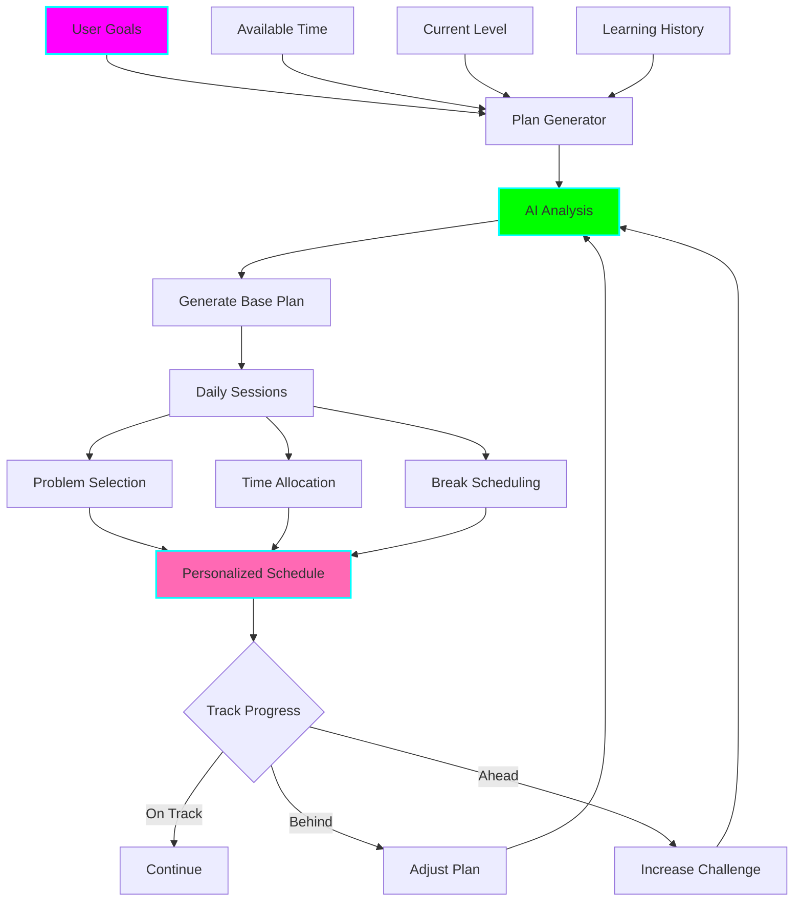

# 📅 LeetCode Personalized Study Planner

**Status:** 🧪 Experimental
**Tech Stack:** Python 3.12, OpenAI GPT-4, SQLite, iCal (calendar export)
**Purpose:** AI-powered personalized study plan generator that creates realistic, ADHD-friendly schedules based on your goals, time availability, and learning patterns

## Problem Statement

Generic LeetCode study plans fail because they:
- **Ignore your schedule** - assume unlimited time
- **One-size-fits-all** - don't adapt to your pace
- **Too ambitious** - lead to burnout and guilt
- **No flexibility** - life happens, plans don't adapt
- **Forget your context** - don't know what you've already learned
- **Not ADHD-friendly** - long sessions, no breaks, overwhelming

## Solution

A personalized study planner that:
- **Adapts to YOUR schedule** - considers your available time
- **Learns your pace** - adjusts based on actual completion rate
- **Sets realistic goals** - prevents burnout
- **Flexes with life** - reschedules when you miss days
- **Knows your level** - builds on what you know
- **ADHD-optimized** - short sessions, varied content, built-in breaks

## Architecture



## Features

### 1. Personalized Plan Generation

```bash
python planner.py --create-plan
```

```
╔══════════════════════════════════════════════════════════════════╗
║  📅 Personalized Study Plan Creator                              ║
╚══════════════════════════════════════════════════════════════════╝

Let's create your perfect LeetCode study plan!

YOUR GOAL
━━━━━━━━━━━━━━━━━━━━━━━━━━━━━━━━━━━━━━━━━━━━━━━━━━━━━━━━━━━━━━━━━
1. Interview prep (timeline: 3 months)
2. Master specific patterns
3. Improve problem-solving speed
4. General practice

Choice: 1

TIMELINE
━━━━━━━━━━━━━━━━━━━━━━━━━━━━━━━━━━━━━━━━━━━━━━━━━━━━━━━━━━━━━━━━
When do you need to be ready?
Date (YYYY-MM-DD): 2025-02-15

That's 90 days from now.

TIME AVAILABILITY
━━━━━━━━━━━━━━━━━━━━━━━━━━━━━━━━━━━━━━━━━━━━━━━━━━━━━━━━━━━━━━━━
How much time can you dedicate per day?

Mon-Fri: 1-2 hours
Weekend: 2-3 hours

Best time of day:
1. Morning (7-9 AM)
2. Lunch (12-2 PM)
3. Evening (6-9 PM)
4. Flexible

Choice: 1

CURRENT LEVEL
━━━━━━━━━━━━━━━━━━━━━━━━━━━━━━━━━━━━━━━━━━━━━━━━━━━━━━━━━━━━━━━━
Analyzing your history...

✓ Solved 47 problems
✓ Strong in: Hash Table, Two Pointers
✓ Weak in: Dynamic Programming, Backtracking
✓ Avg solve time: 32 minutes

ADHD PREFERENCES
━━━━━━━━━━━━━━━━━━━━━━━━━━━━━━━━━━━━━━━━━━━━━━━━━━━━━━━━━━━━━━━━
✓ Short sessions (max 45 minutes)
✓ Frequent breaks (Pomodoro: 25min work, 5min break)
✓ Varied content (don't repeat same pattern back-to-back)
✓ Flexible scheduling (can reschedule missed days)
✓ Daily reminders

Generating your personalized plan...
```

### 2. Generated Study Plan

```
╔══════════════════════════════════════════════════════════════════╗
║  📅 Your 90-Day LeetCode Study Plan                              ║
║  Goal: Interview Ready by Feb 15, 2025                           ║
╚══════════════════════════════════════════════════════════════════╝

OVERVIEW
━━━━━━━━━━━━━━━━━━━━━━━━━━━━━━━━━━━━━━━━━━━━━━━━━━━━━━━━━━━━━━━━━
Duration:         90 days (12 weeks)
Total Problems:   180 (2 per day avg)
Daily Time:       60-90 minutes
Rest Days:        Every 6th day
Review Sessions:  Every Sunday

Phase 1: Foundations (Weeks 1-4)
  Focus: Master fundamental patterns
  Problems: 60 (Easy: 40, Medium: 20)
  Patterns: Arrays, Hash Table, Two Pointers

Phase 2: Core Patterns (Weeks 5-8)
  Focus: Essential interview patterns
  Problems: 60 (Easy: 20, Medium: 35, Hard: 5)
  Patterns: Binary Search, DFS/BFS, DP Intro

Phase 3: Advanced (Weeks 9-12)
  Focus: Complex problems and optimization
  Problems: 60 (Medium: 40, Hard: 20)
  Patterns: DP, Backtracking, Graph Algorithms

WEEK 1 SCHEDULE (Nov 18-24)
━━━━━━━━━━━━━━━━━━━━━━━━━━━━━━━━━━━━━━━━━━━━━━━━━━━━━━━━━━━━━━━━━

Monday, Nov 18 (7:00-8:00 AM)
  🎯 Session 1: Hash Table Basics
  ├─ 25min: #1 Two Sum (review)
  ├─ 5min: Break
  ├─ 25min: #217 Contains Duplicate (new)
  └─ 5min: Review & notes

Tuesday, Nov 19 (7:00-8:00 AM)
  🎯 Session 2: Hash Table Applications
  ├─ 25min: #242 Valid Anagram
  ├─ 5min: Break
  ├─ 25min: #49 Group Anagrams
  └─ 5min: Review & notes

Wednesday, Nov 20 (7:00-8:00 AM)
  🎯 Session 3: Two Pointers Intro
  ├─ 25min: #125 Valid Palindrome
  ├─ 5min: Break
  ├─ 25min: #167 Two Sum II
  └─ 5min: Review & notes

Thursday, Nov 21 (7:00-8:00 AM)
  🎯 Session 4: Two Pointers Practice
  ├─ 25min: #15 3Sum
  ├─ 5min: Break
  ├─ 25min: #11 Container With Most Water
  └─ 5min: Review & notes

Friday, Nov 22 (7:00-8:30 AM)
  🎯 Session 5: Mixed Review
  ├─ 20min: Review mistakes from this week
  ├─ 5min: Break
  ├─ 30min: Weekly challenge problem
  └─ 5min: Week reflection

Saturday, Nov 23 (9:00-11:00 AM)
  🎯 Weekend Deep Dive
  ├─ 45min: #238 Product of Array Except Self
  ├─ 10min: Break
  ├─ 45min: #128 Longest Consecutive Sequence
  └─ 10min: Weekly summary

Sunday, Nov 24 - REST DAY
  📚 Optional: Review notes, watch pattern videos
  ✓ Prepare for Week 2

━━━━━━━━━━━━━━━━━━━━━━━━━━━━━━━━━━━━━━━━━━━━━━━━━━━━━━━━━━━━━━━━━
Week 1 Summary:
  Problems: 11 (7 new, 4 review)
  Patterns: Hash Table (6), Two Pointers (5)
  Time: 7 hours total
  Goals: Master Hash Table and Two Pointers basics
```

### 3. Daily View

```bash
python planner.py --today
```

```
╔══════════════════════════════════════════════════════════════════╗
║  📅 Today's Study Plan - Monday, Nov 18, 2025                    ║
║  Week 1, Day 1 of 90                                             ║
╚══════════════════════════════════════════════════════════════════╝

SCHEDULE: 7:00-8:00 AM (60 minutes)
━━━━━━━━━━━━━━━━━━━━━━━━━━━━━━━━━━━━━━━━━━━━━━━━━━━━━━━━━━━━━━━━━

🎯 FOCUS: Hash Table Basics

PROBLEM 1 (25 minutes)
━━━━━━━━━━━━━━━━━━━━━━━━━━━━━━━━━━━━━━━━━━━━━━━━━━━━━━━━━━━━━━━━━
  #1 Two Sum (Easy)
  Pattern: Hash Table Lookup
  Why today: Review to solidify understanding
  Hints available: Yes
  Target time: 15 minutes (you've solved this before)

☕ BREAK (5 minutes)
━━━━━━━━━━━━━━━━━━━━━━━━━━━━━━━━━━━━━━━━━━━━━━━━━━━━━━━━━━━━━━━━━
  Stand up, stretch, hydrate

PROBLEM 2 (25 minutes)
━━━━━━━━━━━━━━━━━━━━━━━━━━━━━━━━━━━━━━━━━━━━━━━━━━━━━━━━━━━━━━━━━
  #217 Contains Duplicate (Easy)
  Pattern: Hash Set
  Why today: Same pattern, different application
  Hints available: Yes
  Target time: 20 minutes (new problem)

📝 REVIEW (5 minutes)
━━━━━━━━━━━━━━━━━━━━━━━━━━━━━━━━━━━━━━━━━━━━━━━━━━━━━━━━━━━━━━━━━
  • What did you learn?
  • Any mistakes to remember?
  • Pattern recognition improved?
  • Log to session analyzer

REMINDERS
━━━━━━━━━━━━━━━━━━━━━━━━━━━━━━━━━━━━━━━━━━━━━━━━━━━━━━━━━━━━━━━━━
  ⏰ Start time: 7:00 AM (in 30 minutes)
  📱 Notification: Enabled
  ✅ Mark complete when done

[s]tart session [r]eschedule [c]ancel today
```

### 4. Adaptive Rescheduling

When you miss a day or fall behind:

```
╔══════════════════════════════════════════════════════════════════╗
║  📅 Plan Adjustment Needed                                       ║
╚══════════════════════════════════════════════════════════════════╝

CURRENT STATUS
━━━━━━━━━━━━━━━━━━━━━━━━━━━━━━━━━━━━━━━━━━━━━━━━━━━━━━━━━━━━━━━━━
You missed: Tuesday, Wednesday, Thursday (3 days)
Completed this week: 2/6 sessions

OPTIONS
━━━━━━━━━━━━━━━━━━━━━━━━━━━━━━━━━━━━━━━━━━━━━━━━━━━━━━━━━━━━━━━━━

1. LIGHT CATCH-UP (Recommended)
   • Focus on this week's key concepts only
   • Skip some review problems
   • Adjusted goal: 8/11 problems this week
   • Maintains momentum without overwhelm

2. FULL CATCH-UP
   • Do all missed problems
   • Extended weekend sessions
   • Risk: Burnout, further delays

3. RESCHEDULE
   • Extend timeline by 3 days (93 days total)
   • Keep same pace
   • Adjust target date to Feb 18

4. RESTART WEEK
   • Reset to Monday's plan
   • Fresh start mindset
   • No guilt, just action

Recommendation: Option 1 (Light Catch-Up)

[1] Light catch-up [2] Full [3] Reschedule [4] Restart
```

### 5. Progress Tracking

```bash
python planner.py --progress
```

```
╔══════════════════════════════════════════════════════════════════╗
║  📊 Study Plan Progress                                          ║
║  Week 4 of 12 - On Track!                                        ║
╚══════════════════════════════════════════════════════════════════╝

OVERALL PROGRESS
━━━━━━━━━━━━━━━━━━━━━━━━━━━━━━━━━━━━━━━━━━━━━━━━━━━━━━━━━━━━━━━━━
Timeline:  ████████░░░░░░░░░░░░ 33% (30/90 days)
Problems:  ████████████░░░░░░░░ 60% (36/60 Phase 1 problems)
Patterns:  ██████████░░░░░░░░░░ 50% (3/6 Phase 1 patterns)

Status: ✅ Ahead of schedule! (+6 problems)

PHASE 1 BREAKDOWN
━━━━━━━━━━━━━━━━━━━━━━━━━━━━━━━━━━━━━━━━━━━━━━━━━━━━━━━━━━━━━━━━━
Hash Table:      ████████████████ 100% Complete ⭐
Two Pointers:    ████████████████ 100% Complete ⭐
Arrays:          ████████░░░░░░░░ 50% In Progress

STATISTICS
━━━━━━━━━━━━━━━━━━━━━━━━━━━━━━━━━━━━━━━━━━━━━━━━━━━━━━━━━━━━━━━━━
Completion Rate:  85% (planned vs actual)
Avg Time/Problem: 28 minutes (faster than planned!)
Current Streak:   12 days 🔥
Longest Streak:   12 days

ACHIEVEMENTS
━━━━━━━━━━━━━━━━━━━━━━━━━━━━━━━━━━━━━━━━━━━━━━━━━━━━━━━━━━━━━━━━━
🏆 Week 1 Champion (completed all sessions)
🏆 Pattern Master: Hash Table
🏆 2-Week Streak
⭐ Early Bird (7 AM sessions streak)

NEXT MILESTONE
━━━━━━━━━━━━━━━━━━━━━━━━━━━━━━━━━━━━━━━━━━━━━━━━━━━━━━━━━━━━━━━━━
Complete Phase 1 (24 more problems)
ETA: Nov 30 (6 days)
Reward: Unlock Phase 2 patterns!
```

## Installation

```bash
cd /home/user/fantastic-engine/projects/leetcode-study-planner

uv venv
source .venv/bin/activate
uv pip install -r requirements.txt

python planner.py --init

cp .env.example .env
```

## Usage

### Create Plan

```bash
# Interactive plan creation
python planner.py --create

# Quick plan with defaults
python planner.py --create --quick --days 30

# Import from template
python planner.py --template "Interview Prep (3 months)"
```

### Daily Usage

```bash
# See today's plan
python planner.py --today

# Start session
python planner.py --start

# Mark problem complete
python planner.py --complete 1

# View this week
python planner.py --week
```

### Adjustments

```bash
# Reschedule today
python planner.py --reschedule

# Adjust overall plan
python planner.py --adjust

# Change difficulty
python planner.py --set-difficulty harder
```

### Export

```bash
# Export to calendar
python planner.py --export calendar.ics

# Export to markdown
python planner.py --export plan.md

# Share plan
python planner.py --export --share
```

## ADHD Benefits

1. **Realistic Scheduling**: Plans fit YOUR life, not ideal scenarios
2. **Short Sessions**: 25-45 minute sessions prevent overwhelm
3. **Built-in Breaks**: Pomodoro technique integrated
4. **Flexibility**: Life happens, plan adapts
5. **Visual Progress**: See completion, celebrate wins
6. **No Guilt**: Behind? Adjust, don't abandon
7. **Varied Content**: Different patterns prevent boredom
8. **Daily Reminders**: External accountability
9. **Rest Days**: Prevents burnout
10. **Quick Wins**: Early easy problems build momentum

## Integration with Other Tools

### With Session Analyzer
```python
# Auto-update plan based on actual performance
stats = analyzer.get_statistics()
planner.adjust_plan(stats)
```

### With Pattern Trainer
```python
# Schedule pattern drills in plan
planner.add_pattern_practice("Two Pointers", sessions=5)
```

### With Gamification
```python
# Earn rewards for following plan
planner.complete_day()
# → +10 points, maintain streak
```

## Configuration

```bash
# .env
SESSION_LENGTH=45  # minutes
BREAK_LENGTH=5
PROBLEMS_PER_SESSION=2
WEEKLY_REST_DAYS=1

# ADHD settings
MAX_SESSION_LENGTH=45
POMODORO_ENABLED=true
VARIED_CONTENT=true
DAILY_REMINDERS=true
FLEXIBLE_RESCHEDULING=true
```

## Graduation Criteria

- [ ] Mobile app with push notifications
- [ ] Calendar integration (Google, Outlook)
- [ ] Team/study group plans
- [ ] AI coach with daily check-ins
- [ ] Video call integration for pair programming
- [ ] Integration with LeetCode contests
- [ ] Habit tracking and analytics

## License

MIT

---

**Remember:** A plan you follow is better than a perfect plan you abandon! 📅
