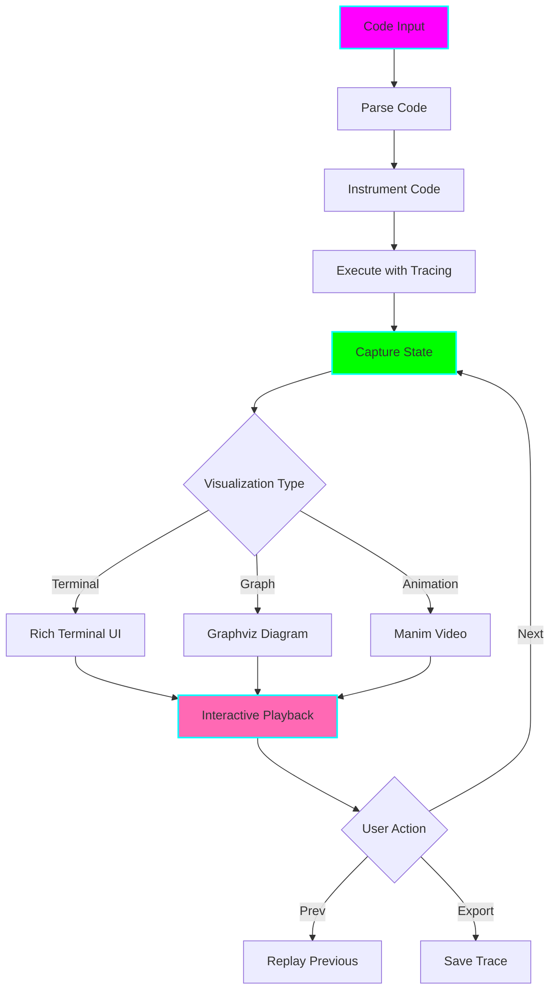

# 🎬 LeetCode Code Trace Visualizer

**Status:** 🧪 Experimental
**Tech Stack:** Python 3.12, Rich, Graphviz, Manim (animations), OpenAI GPT-4
**Purpose:** Step-by-step visual execution traces of code to understand how algorithms work, perfect for visual learners with ADHD

## Problem Statement

Understanding code execution is difficult because:
- **Abstract thinking required** - hard to visualize what's happening
- **Complex state changes** - variables changing, pointers moving, stacks growing
- **No visual feedback** - just reading code doesn't show the "movie" of execution
- **Debugging is tedious** - print statements everywhere clutters code
- **Can't see the pattern** - without visualization, algorithms feel like magic

## Solution

A visual debugger and code trace system that:
- **Animates code execution** step-by-step in the terminal
- **Visualizes data structures** (arrays, trees, graphs, stacks, queues)
- **Shows state changes** at each step with colors and highlights
- **Generates execution videos** for complex algorithms (optional)
- **Supports multiple languages** (Python, Java, C++, JavaScript)
- **Interactive mode** - step through, pause, rewind execution

## Architecture



## Features

### 1. Terminal-Based Step Execution

```
╔══════════════════════════════════════════════════════════════════╗
║  🎬 Code Trace Visualizer - Two Sum                              ║
║  Step 3 of 8                                                     ║
╚══════════════════════════════════════════════════════════════════╝

CODE                                    STATE
━━━━━━━━━━━━━━━━━━━━━━━━━━━━━━━━━━━━━━━━━━━━━━━━━━━━━━━━━━━━━━━━━
 1  def twoSum(nums, target):           nums = [2, 7, 11, 15]
 2      seen = {}                       target = 9
 3  ❯   for i, num in enumerate(nums):  seen = {2: 0}
 4          complement = target - num   i = 1
 5          if complement in seen:      num = 7
 6              return [seen[complement], i]
 7          seen[num] = i

VISUALIZATION
━━━━━━━━━━━━━━━━━━━━━━━━━━━━━━━━━━━━━━━━━━━━━━━━━━━━━━━━━━━━━━━━━
Array:  [2] [7] [11] [15]
         ↑   ↑
       prev current

Hash Map (seen):
  2 → index 0

EXPLANATION
━━━━━━━━━━━━━━━━━━━━━━━━━━━━━━━━━━━━━━━━━━━━━━━━━━━━━━━━━━━━━━━━━
Now iterating at index 1, with value 7.
We'll check if (target - 7 = 2) exists in our hash map.

[n]ext [p]rev [r]eplay [q]uit [e]xport
```

### 2. Data Structure Visualization

**Arrays:**
```
[2] [7] [11] [15]
 ↑   ↑
 i   j
```

**Linked Lists:**
```
1 → 2 → 3 → 4 → None
↑       ↑
slow   fast
```

**Trees:**
```
       10
      /  \
     5    15
    / \   / \
   3   7 12  20
  ↑         ↑
current   target
```

**Stacks/Queues:**
```
Stack:              Queue:
┌───┐              ┌───┬───┬───┐
│ 3 │  ← top       │ 1 │ 2 │ 3 │
├───┤              └───┴───┴───┘
│ 2 │               ↑       ↑
├───┤              front   rear
│ 1 │
└───┘
```

**Graphs:**
```
    A ─── B
    │     │
    │     │
    C ─── D
    ↑
 visited
```

### 3. Algorithm Animation

For complex algorithms, generate video explanations:

```bash
# Generate animation
python visualizer.py --animate binary_search.py --output search.mp4

# Quick Sort animation
python visualizer.py --animate quicksort.py --fps 2

# DFS traversal animation
python visualizer.py --animate dfs.py --with-narration
```

### 4. Interactive Debugging

```bash
# Start interactive trace
python visualizer.py --trace solution.py --interactive

# Breakpoint mode
python visualizer.py --trace solution.py --break-at "if complement in seen"

# Watch variables
python visualizer.py --trace solution.py --watch "seen,i,num"
```

### 5. Trace Comparison

Compare two implementations side-by-side:

```
╔══════════════════════════════════════════════════════════════════╗
║  Brute Force vs Hash Map - Step 3                                ║
╚══════════════════════════════════════════════════════════════════╝

BRUTE FORCE (O(n²))              HASH MAP (O(n))
━━━━━━━━━━━━━━━━━━━━━━━━━━━━━━━━━━━━━━━━━━━━━━━━━━━━━━━━━━━━━━━━━
for i in range(len(nums)):       for i, num in enumerate(nums):
❯   for j in range(i+1, len):  ❯     if (target-num) in seen:
        if nums[i]+nums[j]==:           return [seen[...], i]

i=0, j=2                         i=1, num=7, seen={2:0}
Checking: 2+11 = 13 ✗            Checking: 9-7=2 in seen ✓

Operations: 3                    Operations: 2
Time: O(n²)                      Time: O(n)
```

## Installation

```bash
cd /home/user/fantastic-engine/projects/leetcode-trace-visualizer

uv venv
source .venv/bin/activate
uv pip install -r requirements.txt

# Optional: Install Manim for animations
uv pip install manim

cp .env.example .env
```

## Usage

### Basic Tracing

```bash
# Trace Python code
python visualizer.py --trace solution.py

# Trace with specific input
python visualizer.py --trace solution.py --input "[2,7,11,15]" --target 9

# Trace a specific function
python visualizer.py --trace solution.py --function twoSum
```

### Interactive Mode

```bash
# Interactive step-through
python visualizer.py --trace solution.py --interactive

# Set breakpoints
python visualizer.py --trace solution.py --break-at 5 --break-at "seen[num]"

# Watch specific variables
python visualizer.py --trace solution.py --watch "i,j,seen"
```

### Visualization Options

```bash
# Terminal visualization (default)
python visualizer.py --trace solution.py --style terminal

# Generate static diagram
python visualizer.py --trace solution.py --style graph --output trace.png

# Generate animation video
python visualizer.py --trace solution.py --animate --output trace.mp4
```

### Comparison Mode

```bash
# Compare two solutions
python visualizer.py --compare solution1.py solution2.py

# Compare algorithms
python visualizer.py --compare-algos "bubble_sort" "quick_sort"
```

## Python API

```python
from visualizer import CodeTracer, Visualizer

# Create tracer
tracer = CodeTracer()

# Trace execution
trace = tracer.trace_function(
    function=two_sum,
    args=([2, 7, 11, 15], 9)
)

# Visualize in terminal
visualizer = Visualizer(style="terminal")
visualizer.play(trace, interactive=True)

# Export as video
visualizer.export_video(trace, "trace.mp4")

# Get specific step
step = trace.get_step(3)
print(step.line_number)
print(step.variables)
print(step.explanation)
```

## Example Traces

### Example 1: Binary Search

```python
def binary_search(arr, target):
    left, right = 0, len(arr) - 1

    while left <= right:
        mid = (left + right) // 2
        if arr[mid] == target:
            return mid
        elif arr[mid] < target:
            left = mid + 1
        else:
            right = mid - 1
    return -1
```

Visual trace:
```
Step 3:
[1, 3, 5, 7, 9, 11, 13, 15]
 ↑           ↑            ↑
left        mid         right

arr[mid] = 7 < target (9)
Action: Move left pointer to mid+1
```

### Example 2: Linked List Cycle

```python
def has_cycle(head):
    slow = fast = head
    while fast and fast.next:
        slow = slow.next
        fast = fast.next.next
        if slow == fast:
            return True
    return False
```

Visual trace:
```
Step 4:
1 → 2 → 3 → 4 → 5
    ↑       ↑   ↑
   slow    fast │
    └───────────┘

slow moved 2 steps
fast moved 4 steps
No collision yet...
```

## ADHD Benefits

1. **Visual Learning**: See the code run, don't just imagine it
2. **Reduced Cognitive Load**: Visualization removes mental overhead
3. **Interactive Engagement**: Step through at your own pace
4. **Immediate Feedback**: See what each line does instantly
5. **Pattern Recognition**: Visual patterns easier to remember than text
6. **Reduced Frustration**: No more "why doesn't this work?!"
7. **Replayable**: Review the same trace multiple times

## Integration with Other Tools

### With Explainer
```python
# Get explanation with trace
explanation = explainer.explain(problem_id=1)
trace = visualizer.trace_code(explanation.code)
# → See explanation + visual execution
```

### With Mistake Analyzer
```python
# Visualize where your code differs
analyzer.compare_solutions(
    your_code=failed_attempt,
    correct_code=solution
)
# → Shows visual diff of execution paths
```

### With Pattern Trainer
```python
# Learn pattern with visual examples
pattern = trainer.get_pattern("Two Pointers")
visualizer.visualize_pattern(pattern)
# → Shows animated example of pattern
```

## Configuration

```bash
# .env settings
ENABLE_ANIMATIONS=true
ANIMATION_FPS=2
TERMINAL_WIDTH=120
COLOR_SCHEME=cyberpunk

# Visualization
SHOW_LINE_NUMBERS=true
SHOW_VARIABLE_TYPES=true
HIGHLIGHT_CHANGED_VARS=true
MAX_ARRAY_SIZE_DISPLAY=20

# Export
VIDEO_QUALITY=high
VIDEO_FORMAT=mp4
DIAGRAM_FORMAT=png
```

## Supported Languages

- ✅ Python (full support)
- 🚧 JavaScript/TypeScript (basic support)
- 🚧 Java (basic support)
- 🚧 C++ (planned)
- 🚧 Go (planned)

## Graduation Criteria

- [ ] Support for all major languages
- [ ] Web-based interactive visualizer
- [ ] Real-time collaboration (share trace sessions)
- [ ] Auto-generate explanation from trace
- [ ] IDE integration (VS Code extension)
- [ ] Mobile app for viewing traces
- [ ] Community traces library

## Learning Log

### Challenges
- Parsing and instrumenting code is complex
- Different languages need different tracers
- Performance overhead from tracing
- Generating smooth animations

### Key Learnings
- Visual debugging is 10x better than print debugging
- Interactive playback enables deep understanding
- Comparisons show why one algo is better than another
- Animations work great for teaching

### Next Steps
1. Build Python tracer with AST instrumentation
2. Create rich terminal UI for step-through
3. Add data structure visualizers
4. Integrate with explainer tool
5. Add Manim animations for common algorithms

## Resources

- [Python AST Module](https://docs.python.org/3/library/ast.html)
- [Rich Library](https://rich.readthedocs.io/)
- [Manim](https://www.manim.community/)
- [Graphviz](https://graphviz.org/)
- [Algorithm Visualizer](https://algorithm-visualizer.org/)

## License

MIT

---

**Remember:** Understanding comes from seeing, not just reading! 🎬
