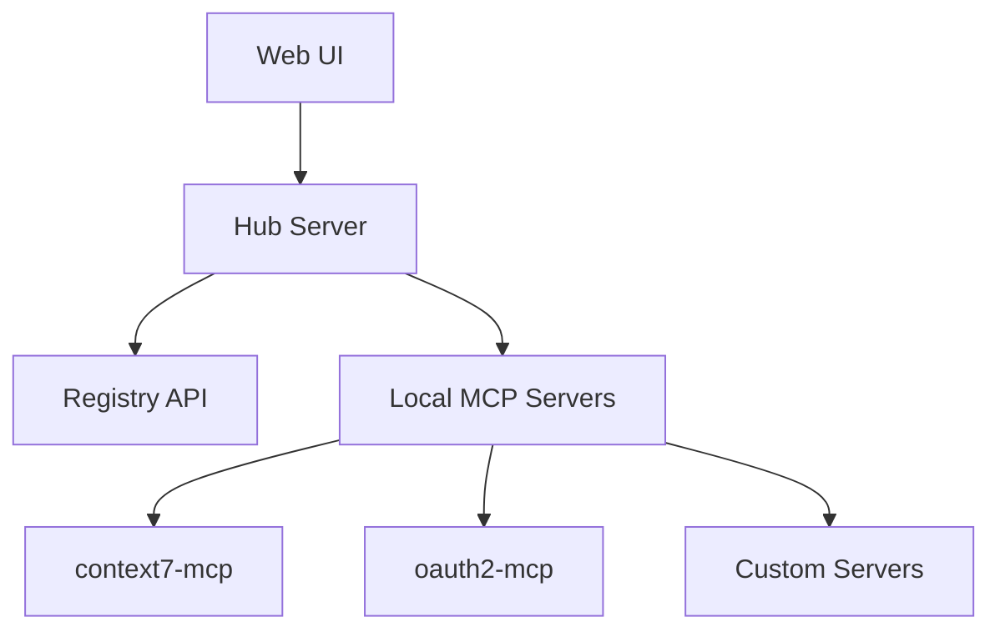

# 🔌 MCP Server Hub

**Status:** 🚧 In Progress | **Tech:** TypeScript/Node.js | **Builds On:** context7-mcp, oauth2-mcp

## Overview

Central hub to discover, install, configure, and test MCP servers. Visual connection mapper and custom server templates.

## Features

- **Discovery**: Browse public MCP servers
- **Installation**: One-click install and configure
- **Testing Playground**: Test MCP protocols without coding
- **Visual Mapper**: See all server connections
- **Templates**: Quick-start custom MCP servers
- **Documentation**: Auto-generate from schemas

## Quick Start

```bash
cd projects/mcp-server-hub
npm install
npm run dev
```

Visit: `http://localhost:3000`

## Architecture



## Graduation Criteria

- [ ] 10+ servers registered
- [ ] Testing playground functional
- [ ] Template generator working
- [ ] Used in production 30+ days
