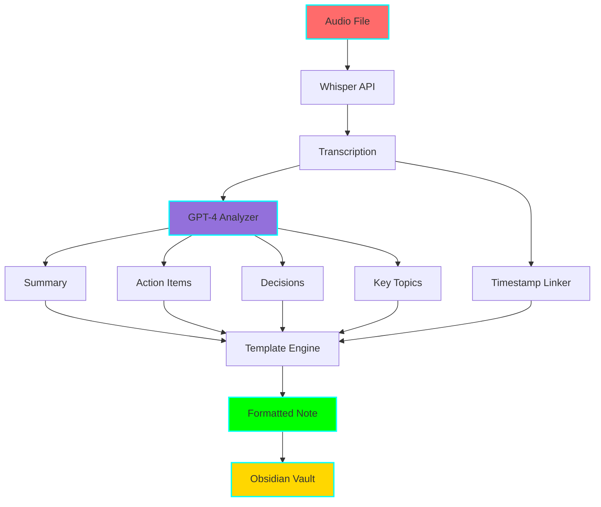
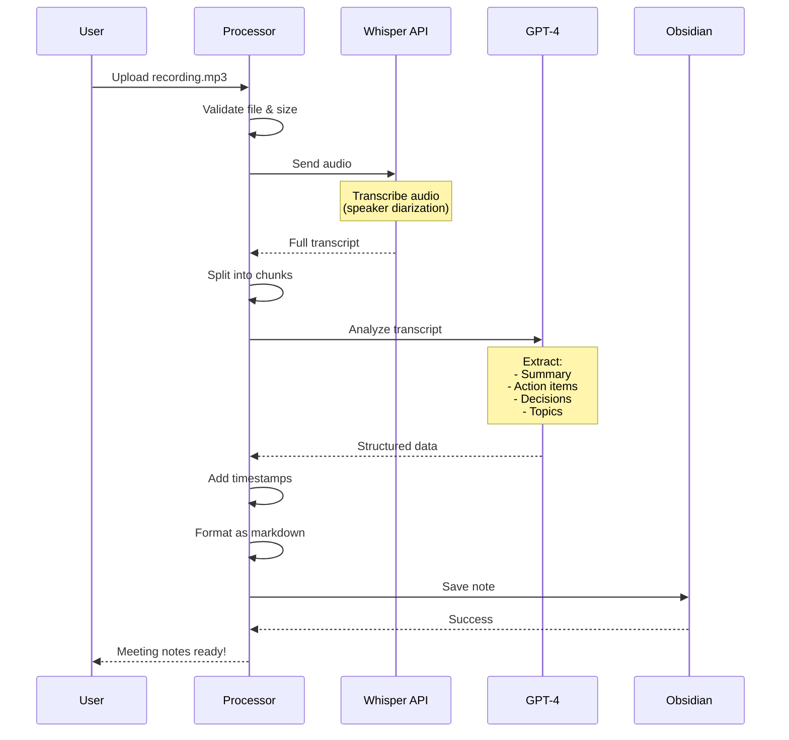

# 🎤 Meeting Notes Processor

**Status:** 🧪 Experimental
**Tech Stack:** Python 3.11+, OpenAI Whisper, GPT-4, Obsidian
**Purpose:** Convert meeting recordings to structured, actionable notes automatically

## 🎯 ADHD Benefits

- **🧠 Never Miss Details:** Audio captures everything, even when you zone out
- **✅ Automatic Action Items:** AI extracts todos so you don't have to remember
- **⏰ Save Time:** No more manual note-taking during meetings
- **🔍 Searchable Transcripts:** Find what was said with full-text search
- **📊 Better Focus:** Listen actively instead of frantically typing
- **🔗 Quick Reference:** Jump to specific parts with timestamps

## 📋 Overview

This tool transforms meeting recordings into structured Obsidian notes by:

1. **Transcribing Audio** with OpenAI Whisper API
2. **Summarizing Content** using GPT-4
3. **Extracting Action Items** automatically
4. **Identifying Decisions** made during the meeting
5. **Listing Attendees** (with optional speaker diarization)
6. **Adding Timestamps** for key moments
7. **Generating Formatted Note** in Obsidian

Perfect for turning that hour-long recording into a 2-minute read!

## 🏗️ Architecture



## 🔄 Processing Workflow



## 📁 Project Structure

```
meeting-notes-processor/
├── README.md
├── requirements.txt
├── .env.example
├── .python-version
├── config/
│   ├── template.md                # Meeting note template
│   ├── prompts.yaml               # AI prompts for analysis
│   └── settings.yaml              # Processing settings
├── src/
│   ├── __init__.py
│   ├── main.py                    # Main CLI
│   ├── transcriber.py             # Whisper API integration
│   ├── analyzer.py                # GPT-4 content analysis
│   ├── extractor.py               # Extract action items, decisions
│   ├── timestamp_linker.py        # Add timestamp links
│   ├── template_engine.py         # Format output
│   └── obsidian_writer.py         # Write to Obsidian
├── examples/
│   ├── sample_recording.mp3       # Example audio (short clip)
│   ├── sample_transcript.txt      # Example transcript
│   ├── before_note.md             # Raw transcript
│   ├── after_note.md              # Processed note
│   └── cost_estimates.md          # API cost breakdowns
├── audio_cache/                   # Temporary audio files
└── tests/
    ├── test_transcriber.py
    ├── test_analyzer.py
    └── fixtures/
```

## 🚀 Getting Started

### Prerequisites

1. **OpenAI API Key** - For Whisper & GPT-4 access
2. **Obsidian Vault** set up
3. **Python 3.11+** installed
4. **Audio files** in supported formats (mp3, m4a, wav, webm)

### Installation

```bash
# Navigate to project
cd /home/user/fantastic-engine/projects/meeting-notes-processor

# Create virtual environment
uv venv
source .venv/bin/activate

# Install dependencies
pip install -r requirements.txt

# Copy environment template
cp .env.example .env

# Edit with your API key
nano .env
```

### Configuration

Edit `.env`:

```bash
# OpenAI Configuration
OPENAI_API_KEY=sk-your-api-key-here
WHISPER_MODEL=whisper-1
GPT_MODEL=gpt-4-turbo-preview

# Obsidian Configuration
OBSIDIAN_VAULT_PATH=/path/to/your/obsidian/vault
MEETING_NOTES_FOLDER=Meetings

# Processing Settings
ENABLE_SPEAKER_DIARIZATION=false  # Requires advanced setup
MAX_AUDIO_SIZE_MB=25               # Whisper API limit
CHUNK_SIZE_MINUTES=10              # Split long recordings

# Output Settings
INCLUDE_FULL_TRANSCRIPT=true
INCLUDE_TIMESTAMPS=true
TIMESTAMP_INTERVAL_SECONDS=300     # Link every 5 minutes

# Cost Controls
DRY_RUN_FIRST=true                 # Preview before processing
WARN_IF_COST_EXCEEDS=5.00          # USD
```

## 🎮 Usage

### Process a Recording

```bash
# Basic usage
python src/main.py process meeting.mp3

# With custom title
python src/main.py process meeting.mp3 --title "Sprint Planning 2025-11-16"

# Specify attendees
python src/main.py process meeting.mp3 --attendees "Alice, Bob, Carol"

# Preview cost first (dry run)
python src/main.py process meeting.mp3 --dry-run

# Use custom template
python src/main.py process meeting.mp3 --template custom_template.md
```

### Batch Processing

```bash
# Process all recordings in a folder
python src/main.py batch recordings/

# Process and organize by date
python src/main.py batch recordings/ --organize-by-date
```

### Interactive Mode

```bash
# Interactive CLI
python src/main.py interactive

# Prompts for:
# - Audio file location
# - Meeting title & date
# - Attendees
# - Custom sections to extract
```

## 📊 Example Output

### Input: meeting_recording.mp3 (45 minutes)

**Raw Recording:**
- Length: 45 minutes
- Size: 32 MB
- Format: MP3
- Participants: 4 people

### Generated Output

```markdown
# Sprint Planning - 2025-11-16

**Meeting Type:** Sprint Planning
**Date:** 2025-11-16
**Duration:** 45 minutes
**Attendees:** Alice (Product), Bob (Engineering), Carol (Design), David (QA)

## 📋 Summary

Productive sprint planning session where we reviewed last sprint's outcomes and planned the next two weeks. Team committed to 23 story points including the new user dashboard feature. Main discussion focused on technical approach for the analytics integration.

**Key Outcomes:**
- Committed to 23 story points for next sprint
- Decided to use GraphQL for analytics API
- Identified 3 blockers that need resolution before sprint starts

## ✅ Action Items

- [ ] **Bob** - Set up GraphQL endpoint for analytics by 11/18 #dev
- [ ] **Alice** - Finalize user dashboard mockups by 11/17 #design
- [ ] **Carol** - Create test plan for analytics integration by 11/20 #qa
- [ ] **David** - Schedule infrastructure review meeting #ops
- [ ] **Alice** - Update roadmap with new timeline #product

## 🎯 Decisions Made

1. **Analytics API Technology**
   - Decision: Use GraphQL instead of REST
   - Reason: Better for complex queries, aligns with frontend needs
   - Who: Engineering team consensus

2. **Dashboard Release Date**
   - Decision: Target December 1st for beta release
   - Reason: Gives adequate buffer for testing
   - Who: Alice (Product)

3. **Testing Strategy**
   - Decision: Implement E2E tests before feature flag rollout
   - Reason: Critical user-facing feature, can't risk bugs
   - Who: David (QA)

## 💡 Key Topics Discussed

### Analytics Integration [00:05:30]
Bob explained the technical architecture for integrating analytics. Main points:
- Using GraphQL for flexible querying
- Caching strategy to minimize database load
- Real-time updates via WebSocket

### User Dashboard Design [00:18:45]
Carol presented mockups. Team feedback:
- Simplify the header navigation
- Add more visual hierarchy
- Include onboarding tooltips for new users

### Sprint Capacity [00:32:10]
Team discussed realistic commitment:
- Bob: 8 points (focus on analytics)
- Carol: 6 points (design + implementation)
- David: 5 points (testing + automation)
- Buffer: 4 points for bug fixes

## 📝 Full Transcript

<details>
<summary>Click to expand full transcript</summary>

**[00:00:00] Alice:**
Alright, let's get started. Thanks everyone for joining. Today we're planning Sprint 12. Bob, want to give us a quick update on last sprint?

**[00:01:23] Bob:**
Sure. Last sprint went well overall. We closed 21 out of 23 points. The two incomplete stories were the caching optimization...

*[Full transcript continues...]*

</details>

## 🔗 Timestamps

Quick navigation to key moments:
- [00:05:30] - Analytics integration discussion
- [00:18:45] - Dashboard design review
- [00:32:10] - Sprint capacity planning
- [00:40:15] - Action items review

---

*Meeting notes generated on 2025-11-16 at 14:30:00*
*Processing time: 3m 42s | Cost: $1.23*
```

## 🎨 Template Customization

Edit `config/template.md`:

```markdown
# {{meeting_title}} - {{meeting_date}}

**Type:** {{meeting_type}}
**Duration:** {{duration}}
**Attendees:** {{attendees}}

## Summary
{{ai_summary}}

## Action Items
{{action_items}}

## Decisions
{{decisions}}

## Topics
{{key_topics}}


## Transcript
{{full_transcript}}

```

### Available Variables

| Variable | Description |
|----------|-------------|
| `{{meeting_title}}` | Meeting title |
| `{{meeting_date}}` | Date of meeting |
| `{{meeting_type}}` | Type (1:1, standup, planning, etc.) |
| `{{duration}}` | Meeting length |
| `{{attendees}}` | Comma-separated list |
| `{{ai_summary}}` | AI-generated summary |
| `{{action_items}}` | Extracted action items |
| `{{decisions}}` | Decisions made |
| `{{key_topics}}` | Main discussion topics |
| `{{full_transcript}}` | Complete transcript |
| `{{timestamps}}` | Timestamp navigation |

## 🤖 AI Prompts

Customize extraction in `config/prompts.yaml`:

```yaml
summary_prompt: |
  Analyze this meeting transcript and create a concise summary (3-4 sentences).

  Focus on:
  1. Main purpose of the meeting
  2. Key outcomes and decisions
  3. Important context for someone who wasn't there

  Transcript:
  {transcript}

action_items_prompt: |
  Extract all action items from this meeting transcript.

  For each action item, identify:
  - Who is responsible (assignee)
  - What needs to be done (task)
  - When it's due (if mentioned)
  - Any relevant tags

  Format as markdown checkboxes.

decisions_prompt: |
  Identify all decisions made during this meeting.

  For each decision, note:
  - What was decided
  - The reasoning/context
  - Who made the decision

  Only include actual decisions, not just discussions.
```

## 💰 Cost Estimates

### OpenAI API Costs

**Whisper (Transcription):**
- $0.006 per minute of audio
- 45-minute meeting: ~$0.27

**GPT-4 (Analysis):**
- ~2000-3000 tokens for analysis
- Cost: ~$0.06-0.10

**Total per 45-min meeting: ~$0.33-0.37**

### Monthly Estimates

| Scenario | Cost |
|----------|------|
| 5 meetings/week | ~$8/month |
| 10 meetings/week | ~$16/month |
| Daily standups (15 min each) | ~$4/month |
| All-hands (2 hours) | ~$1.50/meeting |

### Cost Optimization

1. **Use shorter chunks:** Only transcribe important parts
2. **Pre-process audio:** Remove silence, reduce file size
3. **Cache transcripts:** Don't re-process same recording
4. **Use GPT-3.5 for simple meetings:** $0.002 vs $0.03 per 1k tokens

## 🚨 Troubleshooting

### Audio File Too Large

```bash
# Compress audio before processing
ffmpeg -i large_meeting.mp3 -ab 64k -ar 16000 compressed.mp3

# Or split into chunks
python src/main.py process large_meeting.mp3 --chunk-size 10
```

### Transcription Quality Poor

1. **Check audio quality:** Ensure clear recording
2. **Reduce background noise:** Use noise reduction tools
3. **Enable diarization:** Helps with speaker identification
4. **Use higher bitrate:** Better audio = better transcription

### Missing Action Items

1. **Review prompt:** Adjust `action_items_prompt` in config
2. **Provide context:** Use `--context` flag with meeting purpose
3. **Manual review:** Check the "Decisions" section too

## 📈 Advanced Features

### Speaker Diarization

```bash
# Enable in .env
ENABLE_SPEAKER_DIARIZATION=true

# Requires additional setup (pyannote.audio)
pip install pyannote.audio
```

### Audio Formats

Supported formats:
- MP3 (.mp3)
- M4A (.m4a) - Common from iPhone voice memos
- WAV (.wav) - Uncompressed
- WebM (.webm) - From web recordings

### Integration with Calendar

```bash
# Auto-fetch meeting title & attendees from Google Calendar
python src/main.py process meeting.mp3 --calendar-event "event-id"
```

## 🎯 Graduation Criteria

- [ ] Successfully processes 50+ meetings
- [ ] <2% error rate in action item extraction
- [ ] Average processing time <5 minutes for 1-hour meeting
- [ ] Complete test coverage (>85%)
- [ ] Documentation with video tutorial
- [ ] Calendar integration (Google, Outlook)
- [ ] Speaker identification accuracy >90%
- [ ] Mobile app for recording + auto-upload

## 🔮 Future Enhancements

- [ ] Real-time transcription during live meetings
- [ ] Integration with Zoom/Meet for automatic recording
- [ ] Voice commands during meeting ("Mark this as action item")
- [ ] Sentiment analysis (detect disagreements, concerns)
- [ ] Topic clustering across multiple meetings
- [ ] Automatic follow-up email generation
- [ ] Slack/Teams bot for sharing notes
- [ ] Meeting insights dashboard (common topics, action item completion)

## 📚 Dependencies

- `openai` - OpenAI API (Whisper + GPT-4)
- `pydub` - Audio file manipulation
- `python-dotenv` - Environment management
- `pyyaml` - Configuration parsing
- `jinja2` - Template rendering
- `click` - CLI interface
- `rich` - Beautiful terminal output
- `python-dateutil` - Date handling

### Optional Dependencies

- `pyannote.audio` - Speaker diarization (advanced)
- `ffmpeg-python` - Audio processing
- `google-api-python-client` - Calendar integration

## 📝 License

MIT License - See LICENSE file

## 🤝 Contributing

Experimental project - contributions welcome!

1. Fork the repository
2. Create feature branch
3. Test with various audio formats
4. Submit pull request

## 📞 Support

For issues or questions:
- Check troubleshooting section
- Review OpenAI API documentation (Whisper & GPT-4)
- Test with sample recordings first

---

**Never take manual notes again! 🎤→📝**
