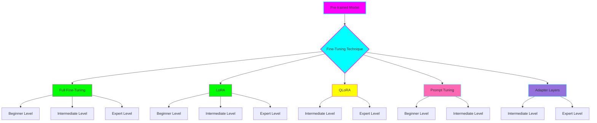

# Model Fine-Tuning Techniques

**Status:** 🧪 Experimental

**Tech Stack:** Python 3.11+ | PyTorch | Transformers | PEFT

**Started:** 2025-11-08

## Overview

A comprehensive learning project exploring different model fine-tuning techniques from beginner to expert level. This project provides hands-on implementations, detailed documentation, and structured learning paths for adapting pre-trained language models to specific tasks.

## Architecture



## Fine-Tuning Techniques Covered

### 1. Full Fine-Tuning
Complete retraining of all model parameters on your specific dataset.
- **Beginner:** Basic fine-tuning with simple dataset
- **Intermediate:** Custom datasets with evaluation metrics
- **Expert:** Distributed training with gradient accumulation

### 2. LoRA (Low-Rank Adaptation)
Efficient fine-tuning by injecting trainable low-rank matrices.
- **Beginner:** Basic LoRA implementation
- **Intermediate:** LoRA with different rank configurations
- **Expert:** Production LoRA with merging and optimization

### 3. QLoRA (Quantized LoRA)
LoRA combined with quantization for memory efficiency.
- **Intermediate:** 4-bit QLoRA implementation
- **Expert:** Advanced QLoRA with custom quantization

### 4. Prompt Tuning / Soft Prompts
Training only continuous prompt embeddings.
- **Beginner:** Basic prompt tuning
- **Intermediate:** Multi-task prompt tuning

### 5. Adapter Layers
Small trainable modules inserted into frozen models.
- **Intermediate:** Sequential adapter implementation
- **Expert:** Parallel adapters with routing

## Learning Paths

### Path 1: Quick Start (1-2 weeks)
**Goal:** Get hands-on with fine-tuning basics


### Path 2: Deep Dive (4-6 weeks)
**Goal:** Master multiple techniques with evaluation


### Path 3: Production Ready (8-12 weeks)
**Goal:** Build production-grade fine-tuning pipelines


## Environment Setup

This project uses Python 3.11+ with PyTorch and Hugging Face libraries.

### Quick Start

```bash
# Navigate to project directory
cd projects/model-fine-tuning-techniques

# Create virtual environment
uv venv

# Activate environment
source .venv/bin/activate  # Linux/Mac
# OR
.venv\Scripts\activate  # Windows

# Install dependencies
pip install -r requirements.txt

# Run a beginner example
cd examples/beginner/full-fine-tuning
python fine_tune.py
```

### Environment File

`.python-version` - Python 3.11

## Project Structure

```
model-fine-tuning-techniques/
├── README.md                          # This file
├── .python-version                    # Python version specification
├── requirements.txt                   # Dependencies
├── docs/                              # Documentation
│   ├── index.md                      # Overview & learning paths
│   ├── 01-introduction.md            # Introduction to fine-tuning
│   ├── 02-full-fine-tuning.md        # Full fine-tuning guide
│   ├── 03-lora.md                    # LoRA guide
│   ├── 04-qlora.md                   # QLoRA guide
│   ├── 05-prompt-tuning.md           # Prompt tuning guide
│   ├── 06-adapter-layers.md          # Adapter layers guide
│   └── learning-paths.md             # Detailed learning paths
└── examples/                          # Code examples
    ├── beginner/                      # Beginner level
    │   ├── full-fine-tuning/         # Basic full fine-tuning
    │   ├── lora/                     # Basic LoRA
    │   └── prompt-tuning/            # Basic prompt tuning
    ├── intermediate/                  # Intermediate level
    │   ├── full-fine-tuning/         # Advanced full fine-tuning
    │   ├── lora/                     # Advanced LoRA
    │   ├── qlora/                    # QLoRA implementation
    │   └── adapter-layers/           # Adapter implementation
    └── expert/                        # Expert level
        ├── production-lora/          # Production-ready LoRA
        ├── distributed-fine-tuning/  # Distributed training
        └── multi-task-learning/      # Multi-task fine-tuning
```

## Dependencies

See `requirements.txt` for full list. Key libraries:
- `torch` - Deep learning framework
- `transformers` - Pre-trained models and utilities
- `peft` - Parameter-efficient fine-tuning methods
- `datasets` - Hugging Face datasets library
- `accelerate` - Distributed training
- `bitsandbytes` - Quantization support

## Learning Log

### What I Learned
- Different fine-tuning approaches have different trade-offs (speed, memory, accuracy)
- LoRA can achieve 99% of full fine-tuning performance with <1% parameters
- QLoRA enables fine-tuning 65B+ models on consumer GPUs
- Prompt tuning works well for specific tasks but requires careful design

### Challenges
- Understanding when to use each technique
- Balancing model quality vs computational resources
- Debugging gradient flow in frozen vs trainable layers
- Choosing optimal hyperparameters for each method

### Next Steps
- [ ] Add more diverse dataset examples
- [ ] Implement evaluation benchmarks
- [ ] Create comparison dashboard
- [ ] Add deployment guides
- [ ] Explore hybrid approaches

## Graduation Criteria

Before moving to its own repository:
- [x] Core techniques documented (Full, LoRA, QLoRA, Prompt Tuning, Adapters)
- [x] 3 levels of complexity per technique
- [x] Learning paths created
- [ ] All code examples working and tested
- [ ] Evaluation metrics and comparisons
- [ ] Production deployment guide
- [ ] Ready for production/sharing

## References

- [Hugging Face PEFT Documentation](https://huggingface.co/docs/peft)
- [LoRA Paper](https://arxiv.org/abs/2106.09685)
- [QLoRA Paper](https://arxiv.org/abs/2305.14314)
- [Prompt Tuning Paper](https://arxiv.org/abs/2104.08691)
- [Adapter Papers](https://arxiv.org/abs/1902.00751)
- [PyTorch Fine-tuning Guide](https://pytorch.org/tutorials/)
