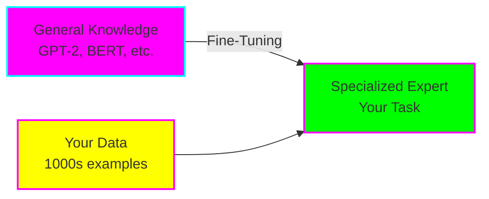
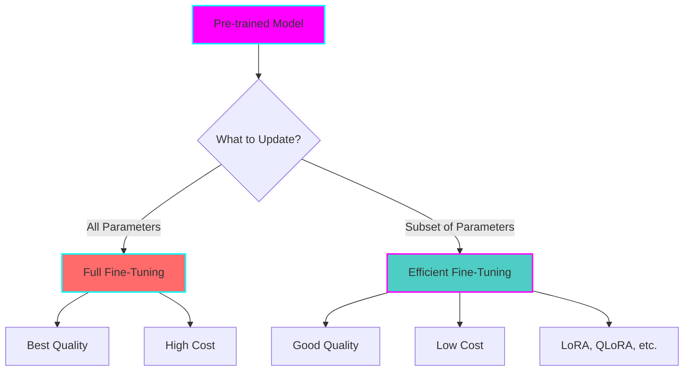
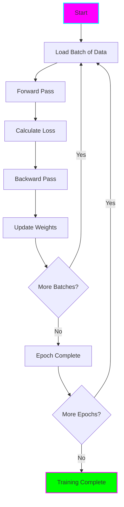
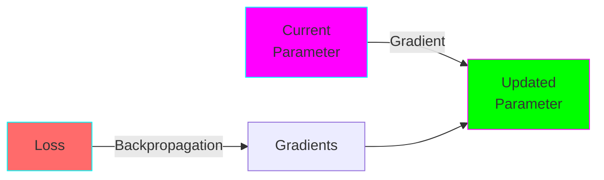
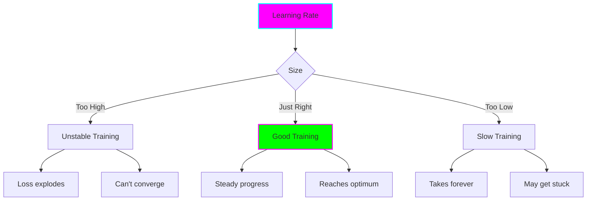
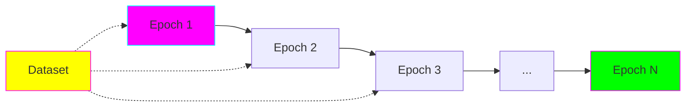
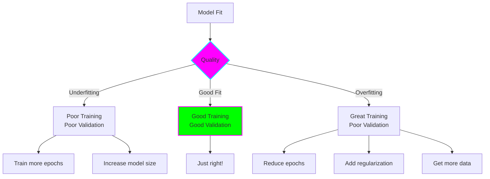
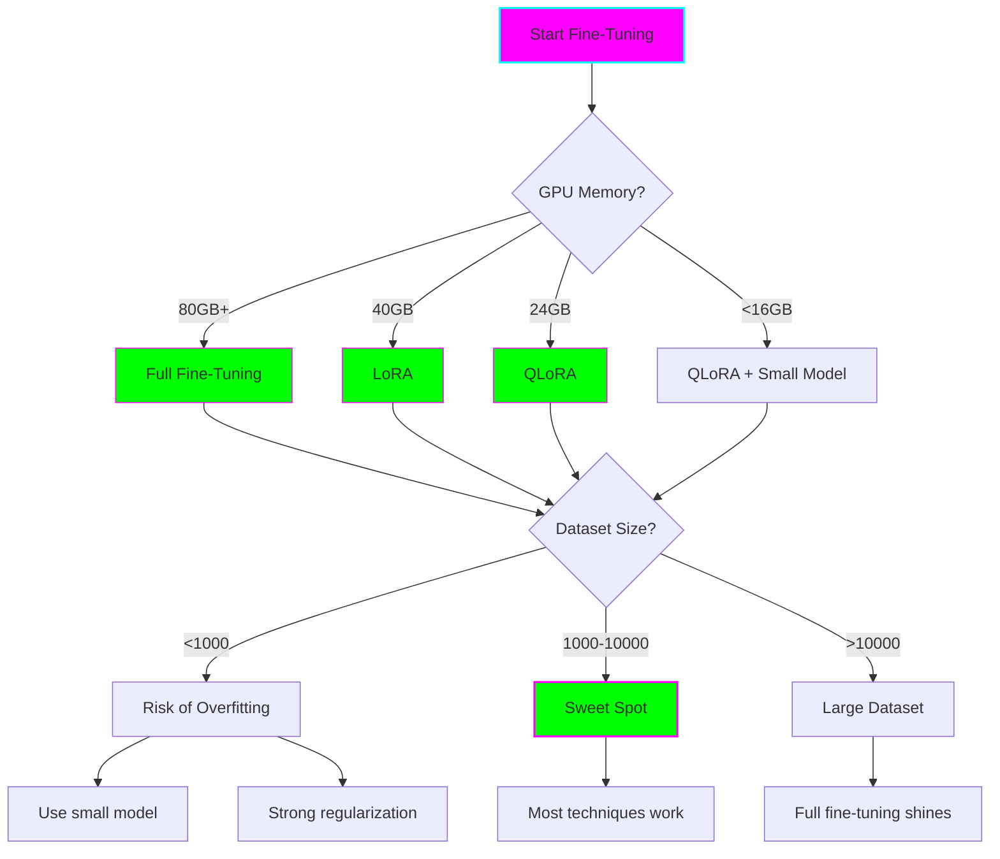

# Introduction to Model Fine-Tuning

## The Big Picture

Imagine you have a really smart assistant who knows a lot about everything, but doesn't know the specifics of YOUR job. Fine-tuning is like giving that assistant specialized training so they become an expert in your domain.



## How Models Learn

### Pre-training (What You Start With)

Pre-trained models have already learned from massive amounts of text:
- **GPT models:** Learned from billions of web pages
- **BERT models:** Learned language understanding from Wikipedia + Books
- **LLaMA models:** Trained on trillions of tokens

This gives them:
- Grammar and language structure
- General world knowledge
- Common sense reasoning
- Basic task capabilities

### Fine-Tuning (What You Add)

You teach the model YOUR specific:
- Domain vocabulary
- Task patterns
- Output format
- Style and tone
- Edge cases



## The Training Loop Explained

Every fine-tuning method follows this basic pattern:



### Step by Step

1. **Load Batch:** Get examples from your training data
2. **Forward Pass:** Run input through model, get predictions
3. **Calculate Loss:** Compare predictions to actual answers
4. **Backward Pass:** Calculate gradients (which direction to adjust weights)
5. **Update Weights:** Adjust model parameters to reduce loss
6. **Repeat:** Continue until model performs well

## Key Concepts

### 1. Parameters (Weights)

The numbers in the model that determine its behavior.

- **Small model (GPT-2):** ~125M parameters
- **Medium model (LLaMA 7B):** ~7B parameters
- **Large model (LLaMA 70B):** ~70B parameters

Each parameter needs:
- **Memory to store:** 2-4 bytes
- **Memory for gradients:** Same size during training
- **Memory for optimizer:** 2-3x size for Adam optimizer

**Example:** Training GPT-2 (125M params) with Adam:
- Model: 500 MB
- Gradients: 500 MB
- Optimizer: 1000 MB
- **Total: ~2 GB minimum**

### 2. Gradients

Gradients tell us which direction to adjust each parameter.



- **Positive gradient:** Decrease parameter
- **Negative gradient:** Increase parameter
- **Large gradient:** Big adjustment needed
- **Small gradient:** Almost optimal

### 3. Learning Rate

How big of a step to take when updating parameters.



**Typical values:**
- Full fine-tuning: `1e-5` to `5e-5`
- LoRA: `1e-4` to `3e-4`
- Prompt tuning: `1e-3` to `1e-2`

### 4. Batch Size

How many examples to process before updating weights.

- **Small batch (8-16):** Less memory, noisier updates, more iterations
- **Medium batch (32-64):** Good balance
- **Large batch (128+):** More memory, smoother updates, faster epochs

**Memory-constrained?** Use gradient accumulation:
- Process small batches
- Accumulate gradients
- Update after N batches (effective larger batch)

### 5. Epochs

One complete pass through your training dataset.



**How many epochs?**
- Too few: Underfitting (hasn't learned enough)
- Just right: Good performance
- Too many: Overfitting (memorizes training data)

**Typical:** 3-10 epochs for most tasks

### 6. Overfitting vs Underfitting



**Signs of overfitting:**
- Training loss keeps decreasing
- Validation loss starts increasing
- Perfect on training data, poor on new data

**Prevention:**
- Use validation set
- Early stopping
- Dropout
- Weight decay

## Memory Requirements

Understanding memory is crucial for choosing a technique.

### Formula

```
Total Memory = Model Size + Gradients + Optimizer States + Activations + Batch Data
```

### Example: Fine-tuning LLaMA 7B

**Full Fine-Tuning (Float32):**
- Model: 28 GB
- Gradients: 28 GB
- Adam optimizer: 56 GB
- Activations: ~20 GB
- **Total: ~132 GB** 🔴 Requires A100 80GB (or multiple GPUs)

**LoRA (Float32):**
- Base model: 28 GB (frozen, can use float16)
- LoRA parameters: 40 MB
- Gradients: 40 MB
- Optimizer: 80 MB
- Activations: ~10 GB
- **Total: ~40 GB** 🟡 Fits on A100 40GB

**QLoRA (4-bit):**
- Base model: 7 GB (4-bit quantized)
- LoRA parameters: 40 MB
- Gradients: 40 MB
- Optimizer: 80 MB
- Activations: ~10 GB
- **Total: ~18 GB** 🟢 Fits on RTX 3090/4090!

## Common Use Cases

### Text Classification

Categorize text into predefined classes.

**Examples:**
- Sentiment analysis (positive/negative/neutral)
- Spam detection
- Topic classification
- Intent recognition

**Best technique:** LoRA or Full fine-tuning
**Data needed:** 500-5000 labeled examples

### Text Generation

Generate coherent text for specific purposes.

**Examples:**
- Creative writing in specific style
- Code generation
- Report generation
- Dialogue generation

**Best technique:** Full fine-tuning or LoRA
**Data needed:** 1000-10000 examples

### Question Answering

Answer questions based on context.

**Examples:**
- Customer support bots
- Document QA
- Technical support
- Educational tutoring

**Best technique:** LoRA or Prompt tuning
**Data needed:** 1000-5000 Q&A pairs

### Named Entity Recognition

Extract specific entities from text.

**Examples:**
- Extract names, dates, locations
- Medical entity extraction
- Legal document parsing
- Product information extraction

**Best technique:** Full fine-tuning
**Data needed:** 1000-5000 annotated examples

### Instruction Following

Make model follow specific instruction formats.

**Examples:**
- Task-specific assistants
- API calling agents
- Multi-step reasoning
- Tool use

**Best technique:** Full fine-tuning or LoRA
**Data needed:** 5000-50000 instruction-response pairs

## Quick Decision Tree



## Next Steps

Now that you understand the basics:

1. **Start simple:** Begin with [Full Fine-Tuning - Beginner](../examples/beginner/full-fine-tuning/)
2. **Learn efficient methods:** Try [LoRA - Beginner](../examples/beginner/lora/)
3. **Explore techniques:** Read technique-specific guides:
   - [Full Fine-Tuning Guide](02-full-fine-tuning.md)
   - [LoRA Guide](03-lora.md)
   - [QLoRA Guide](04-qlora.md)
   - [Prompt Tuning Guide](05-prompt-tuning.md)

## Key Takeaways

- **Fine-tuning adapts pre-trained models to your specific task**
- **Different techniques trade off quality, speed, and memory**
- **Start with LoRA for most use cases**
- **Use QLoRA when memory is extremely limited**
- **Full fine-tuning for maximum quality with sufficient resources**
- **More data generally means better results**
- **Monitor for overfitting using validation set**

**Remember:** The best way to learn is by doing! Move on to the practical examples and get your hands dirty with code.
