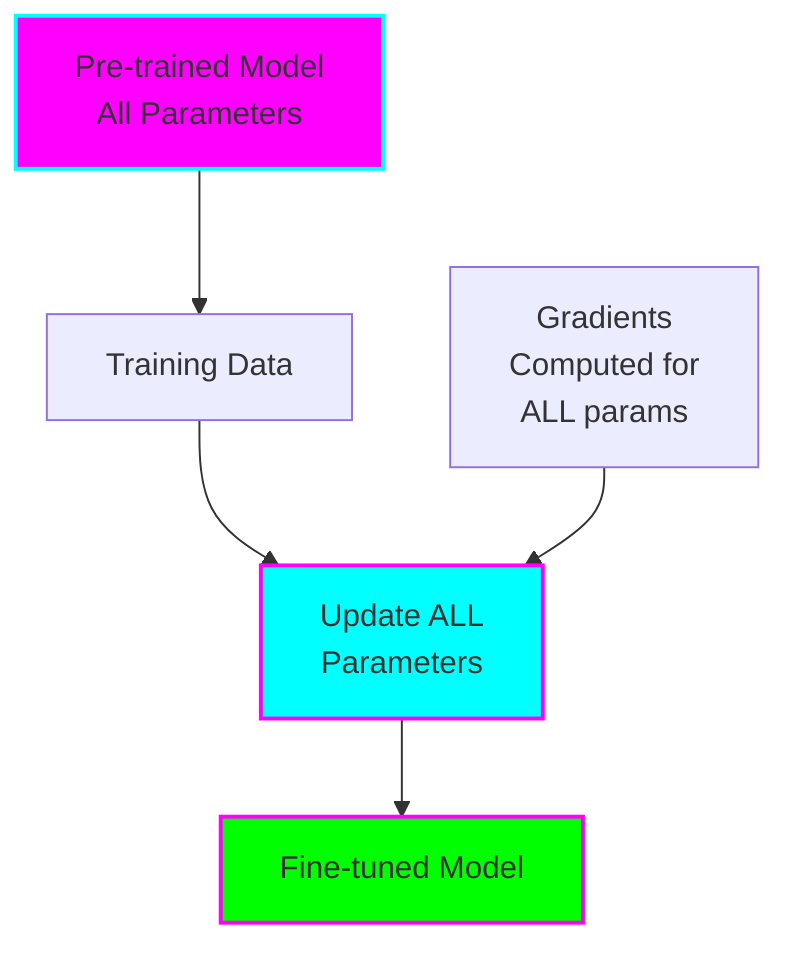
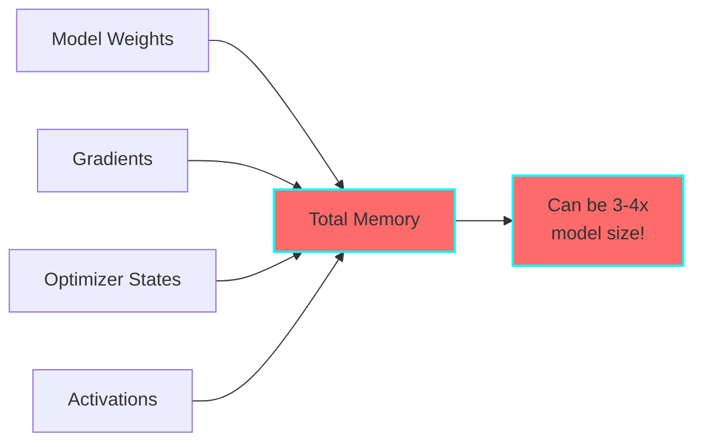
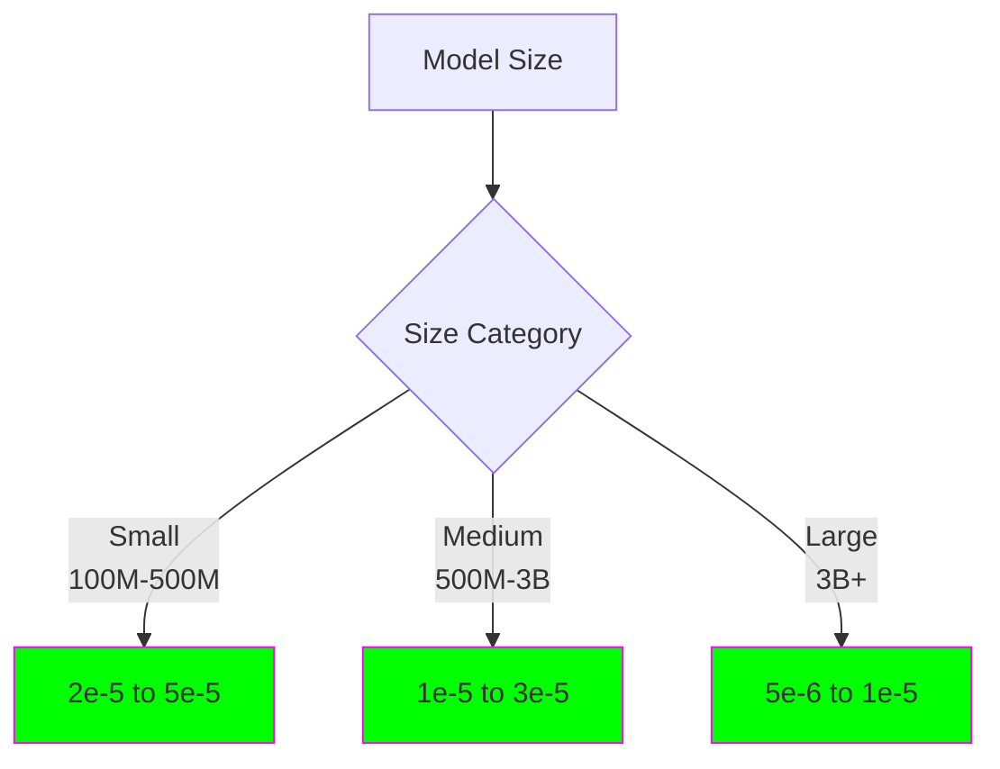
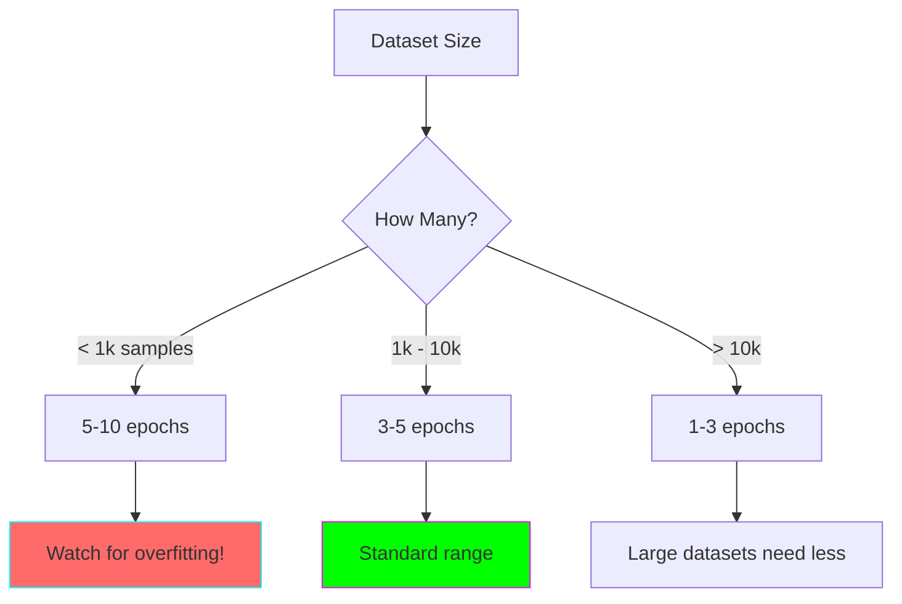
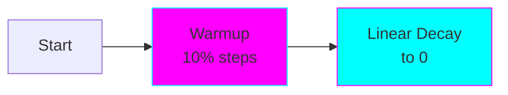
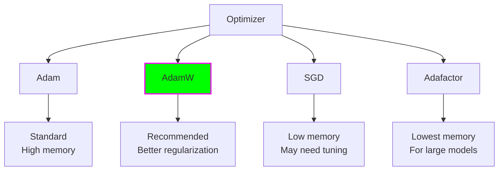

# Full Fine-Tuning

## Overview

Full fine-tuning is the traditional approach where all model parameters are updated during training. It's the most straightforward method and often achieves the best results when you have sufficient computational resources.



## How It Works

During full fine-tuning:
1. Load pre-trained weights
2. Replace/add task-specific head
3. Compute forward pass on training data
4. Calculate loss
5. Backpropagate through ALL layers
6. Update ALL parameters

**Key characteristic:** Every single weight in the model can be modified.

## Advantages

### 1. Maximum Flexibility
- Can completely adapt model to new domain
- No architectural constraints
- Full control over all parameters

### 2. Best Quality (Usually)
- Often achieves highest accuracy
- Can handle drastic domain shifts
- No capacity limitations

### 3. Well-Understood
- Decades of research
- Standard practice
- Abundant tutorials and resources

### 4. Simple Implementation
- Standard training loops
- No additional libraries needed
- Straightforward debugging

## Disadvantages

### 1. High Memory Requirements



**Example (LLaMA 7B):**
- Model: 28 GB (float32)
- Gradients: 28 GB
- Adam optimizer: 56 GB
- Activations: ~20 GB
- **Total: ~132 GB**

### 2. Slow Training
- Update billions of parameters
- Slower backward pass
- More GPU time required

### 3. Storage & Deployment
- Must save entire model
- Hard to maintain multiple versions
- Expensive storage costs

### 4. Overfitting Risk
- Can overfit on small datasets
- Requires careful regularization
- May need lots of data

## When to Use Full Fine-Tuning

### ✅ Use Full Fine-Tuning When:

1. **You have sufficient compute** (80GB+ GPU or multi-GPU setup)
2. **Large dataset available** (10k+ examples ideally)
3. **Drastic domain shift** (medical, legal, code, etc.)
4. **Maximum quality needed** (production critical applications)
5. **Compute cost < quality importance**

### ❌ Consider Alternatives When:

1. **Limited GPU memory** (<40 GB) → Try LoRA or QLoRA
2. **Small dataset** (<1000 examples) → Try LoRA or Prompt Tuning
3. **Quick experiments** needed → Try LoRA
4. **Multiple tasks** to fine-tune → Try LoRA (multiple adapters)
5. **Cost-sensitive** projects → Try QLoRA

## Best Practices

### 1. Learning Rate Selection



**General rule:** Smaller learning rate for larger models

### 2. Batch Size

**GPU Memory Limited:**
```python
# Use gradient accumulation
per_device_batch_size = 4
gradient_accumulation_steps = 4
# Effective batch size = 16
```

**Optimal batch sizes:**
- Classification: 16-32
- Generation: 8-16
- Large models (>7B): 4-8 with accumulation

### 3. Epochs



### 4. Regularization

**Weight Decay:**
```python
weight_decay = 0.01  # Standard value
```

**Dropout:**
- Usually inherited from pre-trained model
- Can increase if overfitting (0.1 → 0.2)

**Early Stopping:**
```python
load_best_model_at_end = True
metric_for_best_model = "eval_loss"
```

### 5. Learning Rate Schedules



**Common schedules:**
- Linear with warmup (recommended)
- Cosine with warmup
- Constant (for small datasets)

## Memory Optimization Techniques

### 1. Gradient Checkpointing

Trade computation for memory:

```python
model.gradient_checkpointing_enable()
```

**Effect:** ~30-40% memory reduction, ~20% slower

### 2. Mixed Precision Training

Use fp16 or bf16 instead of fp32:

```python
from transformers import TrainingArguments

training_args = TrainingArguments(
    fp16=True,  # or bf16=True for newer GPUs
    ...
)
```

**Effect:** ~50% memory reduction, often faster

### 3. Optimizer Choice



### 4. Batch Size & Gradient Accumulation

```python
# Instead of:
batch_size = 32  # Out of memory!

# Use:
per_device_batch_size = 8
gradient_accumulation_steps = 4
# Effective batch_size = 32
```

## Code Example

```python
from transformers import (
    AutoTokenizer,
    AutoModelForCausalLM,
    TrainingArguments,
    Trainer
)

# Load model
model = AutoModelForCausalLM.from_pretrained("gpt2")
tokenizer = AutoTokenizer.from_pretrained("gpt2")

# Prepare dataset (tokenized)
train_dataset = ...
eval_dataset = ...

# Training configuration
training_args = TrainingArguments(
    output_dir="./results",

    # Learning
    learning_rate=2e-5,
    num_train_epochs=3,

    # Batch size
    per_device_train_batch_size=8,
    gradient_accumulation_steps=2,  # Effective = 16

    # Memory optimization
    fp16=True,                      # Mixed precision
    gradient_checkpointing=True,    # Save memory

    # Regularization
    weight_decay=0.01,

    # Evaluation
    evaluation_strategy="epoch",
    save_strategy="epoch",
    load_best_model_at_end=True,

    # Logging
    logging_steps=100,
    report_to="wandb",              # Track experiments
)

# Train
trainer = Trainer(
    model=model,
    args=training_args,
    train_dataset=train_dataset,
    eval_dataset=eval_dataset,
)

trainer.train()
```

## Comparison with Other Methods

| Aspect | Full FT | LoRA | QLoRA | Prompt Tuning |
|--------|---------|------|-------|---------------|
| **Parameters Trained** | 100% | 0.1-1% | 0.1-1% | <0.01% |
| **Memory (7B model)** | ~130 GB | ~40 GB | ~18 GB | ~15 GB |
| **Training Speed** | Baseline | 2-3x faster | 1.5x faster | 3-4x faster |
| **Inference Speed** | Baseline | Same* | Same* | Same |
| **Quality** | ⭐⭐⭐⭐⭐ | ⭐⭐⭐⭐ | ⭐⭐⭐⭐ | ⭐⭐⭐ |
| **Setup Complexity** | ⭐ Easy | ⭐⭐ Medium | ⭐⭐⭐ Hard | ⭐⭐ Medium |

*After merging adapters

## Common Issues & Solutions

### Out of Memory

**Solutions:**
1. Reduce batch size
2. Enable gradient checkpointing
3. Use fp16/bf16
4. Increase gradient accumulation
5. Use smaller model
6. **Or switch to LoRA/QLoRA**

### Poor Performance

**Check:**
1. Learning rate (try 10x higher/lower)
2. Overfitting (reduce epochs, add regularization)
3. Data quality (clean and balance data)
4. Evaluation metrics (ensure they're correct)

### Slow Training

**Optimize:**
1. Use fp16/bf16
2. Disable gradient checkpointing if memory allows
3. Increase batch size
4. Use faster data loading
5. Profile code for bottlenecks

## Real-World Examples

### Example 1: Code Generation
- **Model:** CodeLlama 7B
- **Dataset:** 50k code pairs
- **Config:** lr=1e-5, batch=4, epochs=2
- **Result:** Improves from 30% → 65% pass@1

### Example 2: Medical QA
- **Model:** LLaMA 2 7B
- **Dataset:** 10k medical Q&A
- **Config:** lr=2e-5, batch=8, epochs=3
- **Result:** 85% accuracy on medical exams

### Example 3: Customer Support
- **Model:** GPT-2
- **Dataset:** 5k support tickets
- **Config:** lr=5e-5, batch=16, epochs=5
- **Result:** 78% first-response accuracy

## Further Resources

- [Hugging Face Fine-tuning Guide](https://huggingface.co/docs/transformers/training)
- [PyTorch Fine-tuning Tutorial](https://pytorch.org/tutorials/beginner/finetuning_torchvision_models_tutorial.html)
- [Papers with Code - Fine-tuning](https://paperswithcode.com/task/transfer-learning)

## Next Steps

1. Try the [Beginner Example](../examples/beginner/full-fine-tuning/)
2. Learn about [LoRA](03-lora.md) for efficient fine-tuning
3. Experiment with your own dataset
