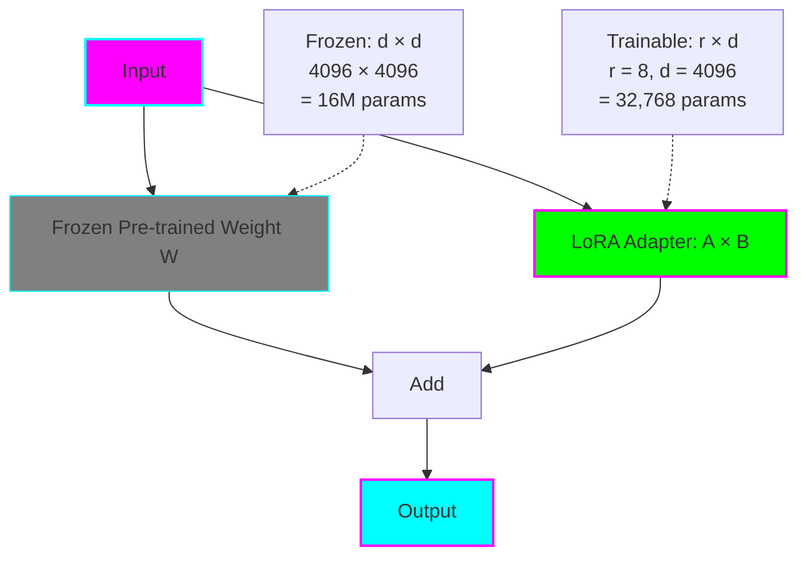
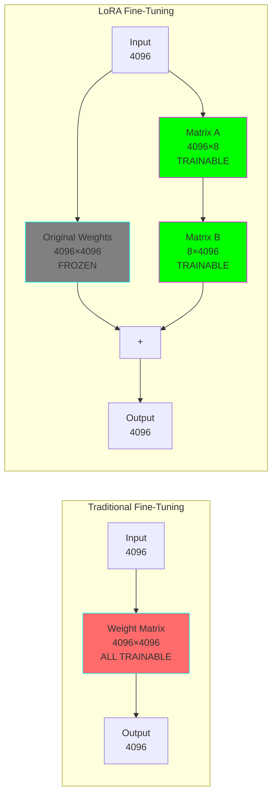
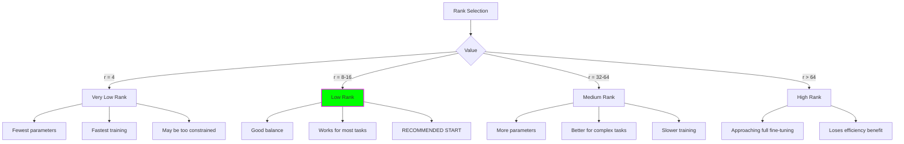
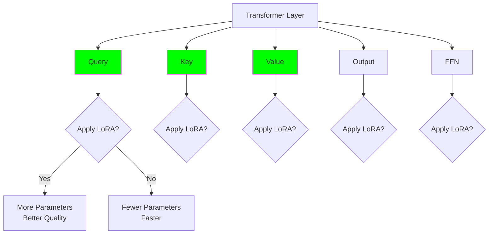
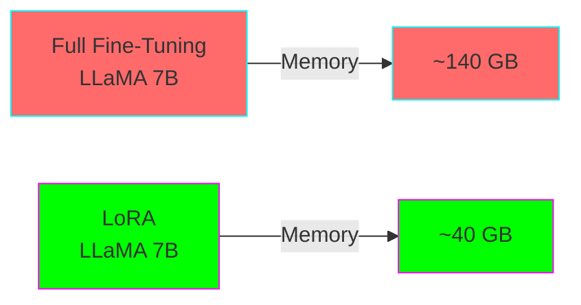
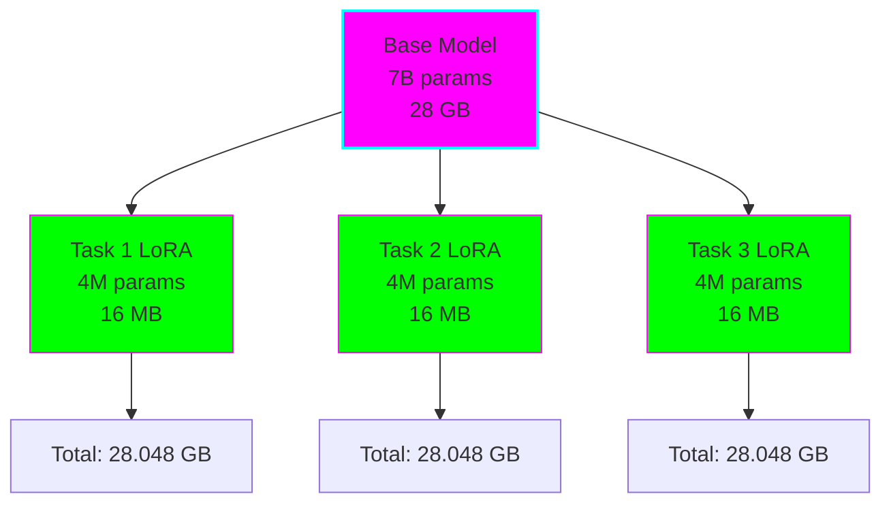
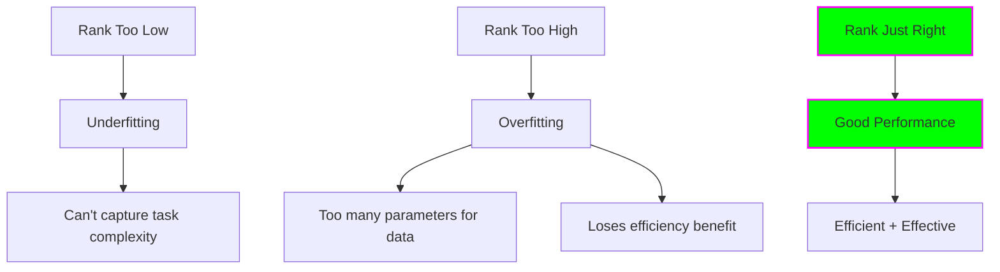

# LoRA: Low-Rank Adaptation

## What is LoRA?

LoRA (Low-Rank Adaptation) is a technique that lets you fine-tune large language models by training small "adapter" matrices instead of updating all model weights. It's like adding a small translator between layers instead of retraining the entire model.



## The Key Insight

Most model adaptations are **low-rank** - they lie in a much smaller dimensional space than the full parameter space. Instead of updating a 4096×4096 matrix (16M parameters), we can decompose the update into two smaller matrices:

- Matrix A: 4096 × r (where r = 8-64)
- Matrix B: r × 4096
- **Total:** Only 65K - 520K parameters instead of 16M!

## How LoRA Works

### Mathematical Foundation

Original transformation:
```
h = W₀x
```

LoRA adds a low-rank update:
```
h = W₀x + BAx = W₀x + ΔWx
```

Where:
- `W₀`: Frozen pre-trained weights (d × d)
- `B`: Trainable matrix (d × r)
- `A`: Trainable matrix (r × d)
- `r`: Rank (typically 8, 16, 32, or 64)
- `ΔW = BA`: The low-rank update

### Visual Example



## Key Hyperparameters

### 1. Rank (r)

The dimensionality of the low-rank matrices.



**Rule of thumb:** Start with r=8, increase if performance is poor.

### 2. Alpha (α)

Scaling factor for the LoRA update: `ΔW = (α/r) × BA`

**Common values:**
- `alpha = r`: No scaling (update and base model treated equally)
- `alpha = 2*r`: LoRA update scaled up 2x
- `alpha = r/2`: LoRA update scaled down

**Default:** Usually `alpha = r` (e.g., r=8, alpha=8)

### 3. Target Modules

Which layers to apply LoRA to.



**Common configurations:**

| Target Modules | Parameters | Quality | Use Case |
|----------------|------------|---------|----------|
| `q_proj, v_proj` | Low | Good | Default, most efficient |
| `q_proj, k_proj, v_proj, o_proj` | Medium | Better | Recommended for complex tasks |
| All attention + FFN | High | Best | When you have GPU memory |

### 4. Dropout

Regularization to prevent overfitting.

**Values:**
- `0.0`: No dropout (small datasets may overfit)
- `0.05`: Light regularization (recommended start)
- `0.1`: Medium regularization
- `0.3+`: Heavy regularization (rare, may undertrain)

## Parameter Calculation

### Example: LLaMA 7B with LoRA

**Model specs:**
- Hidden size: 4096
- Number of layers: 32
- Attention heads: 32

**Configuration 1: r=8, target=[q,v]**
```
Per layer: (4096 × 8 + 8 × 4096) × 2 = 131,072 params
Total: 131,072 × 32 layers = 4,194,304 params (~4M)

Percentage: 4M / 7B = 0.06% of model
```

**Configuration 2: r=16, target=[q,k,v,o]**
```
Per layer: (4096 × 16 + 16 × 4096) × 4 = 524,288 params
Total: 524,288 × 32 layers = 16,777,216 params (~17M)

Percentage: 17M / 7B = 0.24% of model
```

Even the larger config trains <1% of parameters!

## Advantages of LoRA

### 1. Memory Efficiency



- Only compute gradients for adapter weights
- Optimizer states only for 0.1-1% of parameters
- Can use lower precision for base model

### 2. Training Speed

- Fewer parameters to update → faster backward pass
- Smaller optimizer states → less memory movement
- Can use larger batch sizes with saved memory

**Typical speedup:** 2-3x faster than full fine-tuning

### 3. Storage & Deployment



- Store one base model + multiple small adapters
- Switch between tasks by swapping adapters
- Share base model across all tasks

### 4. Reversibility

LoRA adapters can be:
- **Merged:** Combine into base weights for faster inference
- **Unmerged:** Remove adaptation, return to base model
- **Composed:** Stack multiple LoRA adapters

## Limitations of LoRA

### 1. Quality vs Full Fine-Tuning

LoRA typically achieves 95-99% of full fine-tuning performance, but:
- May underperform on drastic domain shifts
- Complex tasks might need higher ranks
- Very small datasets may need full fine-tuning

### 2. Rank Selection



Finding the right rank requires experimentation.

### 3. Inference Overhead

If adapters are not merged:
- Extra matrix multiplications
- Slight latency increase (~5-10%)

**Solution:** Merge adapters for production deployment

## Best Practices

### Starting Configuration

For most tasks, start with:

```python
lora_config = {
    "r": 8,                          # Rank
    "lora_alpha": 16,                # Alpha (2x rank)
    "target_modules": ["q_proj", "v_proj"],  # Query and Value
    "lora_dropout": 0.05,            # Light regularization
    "bias": "none",                  # Don't train biases
    "task_type": "CAUSAL_LM"        # Or SEQUENCE_CLASSIFICATION
}
```

### Tuning Guidelines

**If model underperforms:**
1. Increase rank (8 → 16 → 32)
2. Add more target modules (q,v → q,k,v,o)
3. Adjust learning rate (try 2-5x higher than full fine-tuning)
4. Train for more epochs

**If model overfits:**
1. Decrease rank (16 → 8 → 4)
2. Increase dropout (0.05 → 0.1)
3. Reduce epochs
4. Get more training data

**If training is too slow:**
1. Reduce target modules
2. Lower rank
3. Use gradient checkpointing
4. Increase batch size

## LoRA vs Other Methods

| Criteria | Full FT | LoRA | QLoRA | Prompt Tuning |
|----------|---------|------|-------|---------------|
| Parameters | 100% | 0.1-1% | 0.1-1% | <0.01% |
| Memory | 🔴 Very High | 🟡 Medium | 🟢 Low | 🟢 Very Low |
| Quality | ⭐⭐⭐⭐⭐ | ⭐⭐⭐⭐ | ⭐⭐⭐⭐ | ⭐⭐⭐ |
| Speed | 🐌 Slow | 🏃 Fast | 🚶 Medium | 🏃‍♂️ Very Fast |
| Multi-task | ❌ Hard | ✅ Easy | ✅ Easy | ✅ Very Easy |
| Inference | ✅ Fast | 🟡 +5-10% | 🟡 +5-10% | ✅ Fast |

## When to Use LoRA

### ✅ Use LoRA when:
- You have limited GPU memory (16-40 GB)
- You need to fine-tune multiple tasks
- You want fast experimentation
- You need good quality with efficiency
- Your domain shift is moderate

### ❌ Consider alternatives when:
- You have ample GPU memory (80+ GB) → Try full fine-tuning
- You have very little memory (8 GB) → Try QLoRA
- You have tiny datasets (<500 examples) → Try prompt tuning
- You need absolute maximum quality → Try full fine-tuning
- Inference latency is critical → Full FT (merge LoRA before deployment)

## Code Example Preview

```python
from peft import LoraConfig, get_peft_model
from transformers import AutoModelForCausalLM

# Load base model
model = AutoModelForCausalLM.from_pretrained("meta-llama/Llama-2-7b-hf")

# Configure LoRA
config = LoraConfig(
    r=8,
    lora_alpha=16,
    target_modules=["q_proj", "v_proj"],
    lora_dropout=0.05,
    bias="none",
    task_type="CAUSAL_LM"
)

# Wrap model with LoRA
model = get_peft_model(model, config)

# See trainable parameters
model.print_trainable_parameters()
# Output: trainable params: 4,194,304 || all params: 6,742,609,920 || trainable%: 0.0622
```

Full examples available in:
- [Beginner LoRA Example](../examples/beginner/lora/)
- [Intermediate LoRA Example](../examples/intermediate/lora/)
- [Expert LoRA Example](../examples/expert/production-lora/)

## Next Steps

1. **Try it out:** Run the [Beginner LoRA Example](../examples/beginner/lora/)
2. **Compare:** See how it compares to [Full Fine-Tuning](02-full-fine-tuning.md)
3. **Go deeper:** Learn about [QLoRA](04-qlora.md) for even more efficiency
4. **Experiment:** Tune hyperparameters on your own dataset

## Further Reading

- [LoRA Paper (Hu et al., 2021)](https://arxiv.org/abs/2106.09685)
- [Hugging Face PEFT Documentation](https://huggingface.co/docs/peft)
- [LoRA on different model architectures](https://github.com/microsoft/LoRA)
