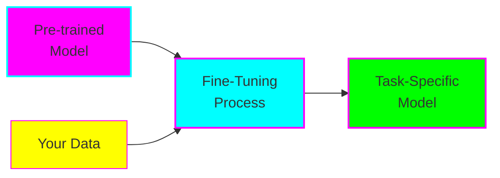
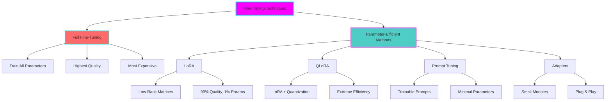
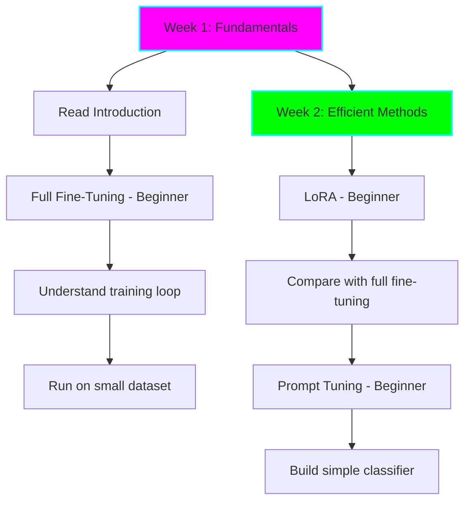
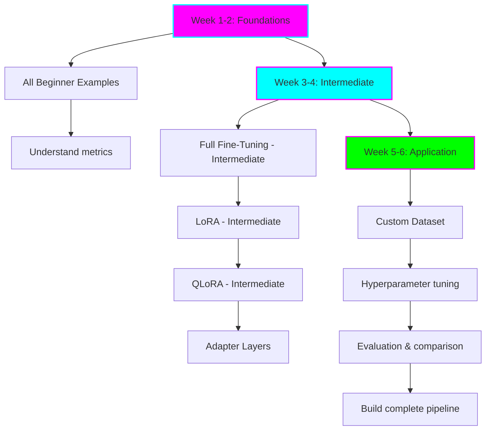
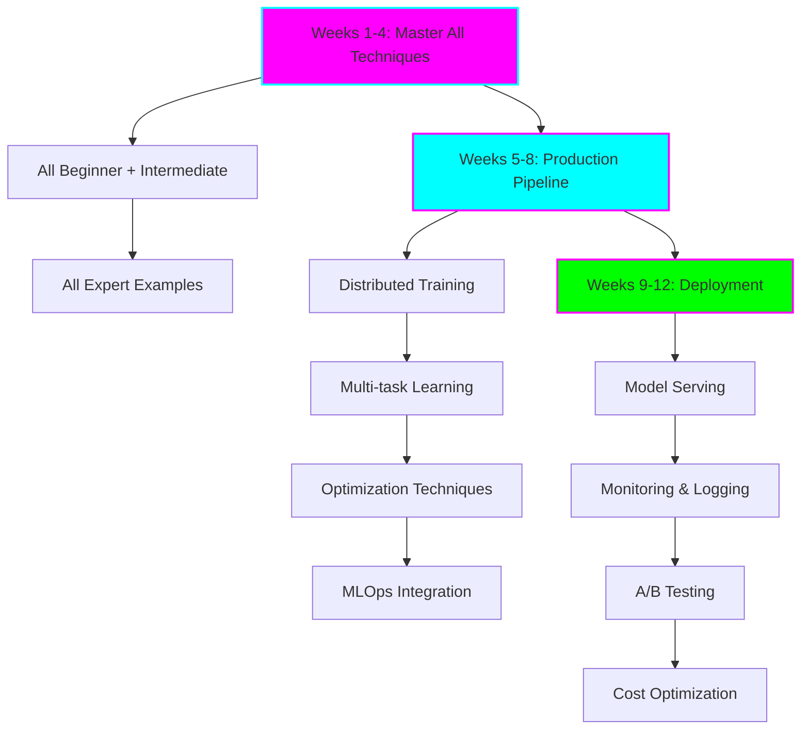

# Model Fine-Tuning Techniques - Overview

## What is Model Fine-Tuning?

Fine-tuning is the process of taking a pre-trained language model and adapting it to perform specific tasks or work with domain-specific data. Instead of training a model from scratch (which requires massive datasets and compute), we start with a model that already understands language and teach it your specific use case.

## Why Fine-Tune?

### Benefits
- **Improved Performance:** Models specialized for your task outperform general models
- **Data Efficiency:** Requires far less data than training from scratch
- **Cost Effective:** Uses existing knowledge, reducing compute needs
- **Domain Adaptation:** Adapts to specialized vocabulary and patterns

### When to Fine-Tune
- You have task-specific data (hundreds to thousands of examples)
- General models don't perform well on your domain
- You need consistent, reliable outputs for a specific task
- You want to reduce inference costs vs large prompt engineering

## Fine-Tuning Techniques Overview

### 1. Full Fine-Tuning

**What:** Update all model parameters during training

**Pros:**
- Maximum flexibility and performance
- Can completely adapt model behavior
- Well-understood and documented

**Cons:**
- Requires significant GPU memory
- Slower training
- Higher risk of overfitting on small datasets
- More expensive

**When to Use:**
- You have sufficient compute resources
- You need maximum model quality
- You have a large dataset (>10k examples)

### 2. LoRA (Low-Rank Adaptation)

**What:** Inject trainable low-rank matrices into model layers while freezing original weights

**Pros:**
- 99% of full fine-tuning quality
- Trains <1% of parameters
- Fast training and switching between tasks
- Easy to merge back into base model

**Cons:**
- Slightly lower quality than full fine-tuning
- Requires understanding of rank selection
- May not work well for drastic domain shifts

**When to Use:**
- Limited GPU memory
- Need to train multiple task adaptations
- Want fast experimentation cycles
- Most common starting point!

### 3. QLoRA (Quantized LoRA)

**What:** LoRA combined with 4-bit quantization of base model

**Pros:**
- Fine-tune 65B+ models on consumer GPUs
- Extreme memory efficiency
- Minimal quality loss vs full LoRA

**Cons:**
- Slightly slower training than LoRA
- Requires bitsandbytes library
- More complex setup

**When to Use:**
- Very limited GPU memory
- Want to fine-tune large models (30B+)
- Willing to trade some speed for efficiency

### 4. Prompt Tuning / Soft Prompts

**What:** Learn continuous prompt embeddings while keeping model frozen

**Pros:**
- Minimal parameters (0.01% of model)
- Very fast training
- Easy to manage multiple tasks
- Great for few-shot scenarios

**Cons:**
- Lower quality than LoRA/full fine-tuning
- Requires careful prompt design
- Best for simpler tasks

**When to Use:**
- Extremely limited resources
- Multi-task scenarios
- Simple classification/extraction tasks

### 5. Adapter Layers

**What:** Insert small trainable modules between frozen layers

**Pros:**
- Modular and composable
- Good balance of efficiency and quality
- Can combine multiple adapters

**Cons:**
- Increases inference latency
- More complex architecture
- Less popular than LoRA

**When to Use:**
- Need to combine multiple task adaptations
- Want modular, swappable components
- Inference latency is acceptable

## Technique Comparison

| Technique | Parameters Trained | Memory | Training Speed | Quality | Complexity |
|-----------|-------------------|--------|----------------|---------|------------|
| Full Fine-Tuning | 100% | 🔴 High | 🔴 Slow | ⭐⭐⭐⭐⭐ | ⭐ Easy |
| LoRA | <1% | 🟢 Low | 🟢 Fast | ⭐⭐⭐⭐ | ⭐⭐ Medium |
| QLoRA | <1% | 🟢 Very Low | 🟡 Medium | ⭐⭐⭐⭐ | ⭐⭐⭐ Hard |
| Prompt Tuning | <0.01% | 🟢 Very Low | 🟢 Very Fast | ⭐⭐⭐ | ⭐⭐ Medium |
| Adapters | 1-5% | 🟡 Medium | 🟡 Medium | ⭐⭐⭐⭐ | ⭐⭐⭐ Hard |

## Learning Paths

Choose your learning path based on your goals and timeline:

### 🚀 Path 1: Quick Start (1-2 weeks)

**Goal:** Get hands-on with fine-tuning basics and understand core concepts

**Checklist:**
- [ ] Understand what fine-tuning is and why it's useful
- [ ] Run beginner full fine-tuning example
- [ ] Run beginner LoRA example
- [ ] Compare results and understand trade-offs
- [ ] Run beginner prompt tuning example
- [ ] Fine-tune a model on your own simple dataset

**Time Commitment:** 5-10 hours/week

### 🎯 Path 2: Deep Dive (4-6 weeks)

**Goal:** Master multiple techniques, work with custom datasets, understand evaluation

**Checklist:**
- [ ] Complete all beginner examples
- [ ] Understand evaluation metrics (perplexity, accuracy, F1)
- [ ] Run all intermediate examples
- [ ] Prepare custom dataset (text classification or generation)
- [ ] Fine-tune model on custom data with 3+ techniques
- [ ] Compare techniques quantitatively
- [ ] Implement hyperparameter search
- [ ] Build evaluation pipeline

**Time Commitment:** 10-15 hours/week

### 🏆 Path 3: Production Ready (8-12 weeks)

**Goal:** Build production-grade fine-tuning pipelines with optimization and deployment

**Checklist:**
- [ ] Complete beginner and intermediate examples
- [ ] Complete all expert examples
- [ ] Implement distributed training (multi-GPU)
- [ ] Build multi-task fine-tuning system
- [ ] Implement gradient checkpointing and mixed precision
- [ ] Set up experiment tracking (Weights & Biases)
- [ ] Create model registry and versioning
- [ ] Deploy model to production endpoint
- [ ] Implement monitoring and alerting
- [ ] Set up A/B testing framework
- [ ] Optimize for cost and latency
- [ ] Document complete production pipeline

**Time Commitment:** 15-20 hours/week

## ADHD-Friendly Study Tips

### 🎯 Focus Strategies
1. **Time-box sessions:** 25-minute focused work, 5-minute break (Pomodoro)
2. **One technique at a time:** Don't try to learn everything simultaneously
3. **Visual progress:** Check off items as you complete them
4. **Celebrate wins:** Acknowledge each completed example!

### 📊 Track Your Progress
Use this simple tracking system:

| Technique | Beginner | Intermediate | Expert | Notes |
|-----------|----------|--------------|--------|-------|
| Full Fine-Tuning | ⬜ | ⬜ | ⬜ | |
| LoRA | ⬜ | ⬜ | ⬜ | |
| QLoRA | N/A | ⬜ | ⬜ | |
| Prompt Tuning | ⬜ | ⬜ | N/A | |
| Adapters | N/A | ⬜ | ⬜ | |

### 🚧 When You Get Stuck
1. **Don't spiral:** Set a 15-minute timer for debugging
2. **Ask for help:** Use the example error messages in docs
3. **Take a break:** Sometimes the solution comes when you step away
4. **Document:** Write down what you tried - future you will thank you

## Next Steps

Choose your starting point:

1. **Complete Beginner?** → Read [Introduction to Fine-Tuning](01-introduction.md)
2. **Ready to Code?** → Jump to [Full Fine-Tuning Beginner Example](../examples/beginner/full-fine-tuning/)
3. **Want Efficiency?** → Check out [LoRA Guide](03-lora.md)
4. **Limited Resources?** → Explore [QLoRA Guide](04-qlora.md)

## Resources

### Essential Reading
- [Hugging Face Fine-tuning Tutorial](https://huggingface.co/docs/transformers/training)
- [PEFT Documentation](https://huggingface.co/docs/peft)
- [LoRA Paper (2021)](https://arxiv.org/abs/2106.09685)
- [QLoRA Paper (2023)](https://arxiv.org/abs/2305.14314)

### Community
- [Hugging Face Forums](https://discuss.huggingface.co/)
- [r/LocalLLaMA](https://reddit.com/r/LocalLLaMA)
- [r/MachineLearning](https://reddit.com/r/MachineLearning)

### Tools
- [Weights & Biases](https://wandb.ai/) - Experiment tracking
- [Hugging Face Hub](https://huggingface.co/) - Model sharing
- [Google Colab](https://colab.research.google.com/) - Free GPU access
