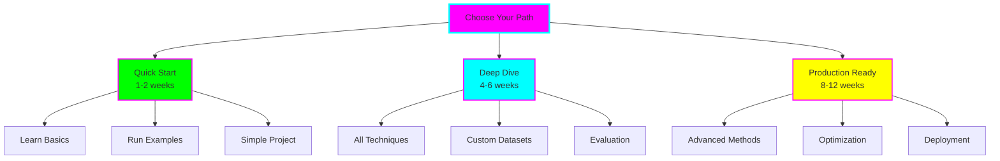

# Detailed Learning Paths

Choose your learning path based on your experience level, available time, and goals.

## Path Overview

---

## 🚀 Path 1: Quick Start (1-2 Weeks)

**For:** Beginners wanting hands-on experience quickly
**Time:** 5-10 hours/week
**Prerequisites:** Basic Python, understand what language models are
**Goal:** Understand fine-tuning basics and successfully fine-tune a model

### Week 1: Foundations & Full Fine-Tuning

#### Day 1-2: Theory (2-3 hours)
- [ ] Read [Introduction to Fine-Tuning](01-introduction.md)
- [ ] Understand key concepts:
  - What is fine-tuning?
  - Parameters, gradients, learning rate
  - Training loop
  - Overfitting vs underfitting

**Deliverable:** Can explain fine-tuning to a friend

#### Day 3-4: Full Fine-Tuning Example (3-4 hours)
- [ ] Set up environment
- [ ] Read [Full Fine-Tuning Beginner README](../examples/beginner/full-fine-tuning/README.md)
- [ ] Run `fine_tune.py`
- [ ] Observe:
  - Training loss decreasing
  - GPU memory usage
  - Time taken
  - Final accuracy

**Deliverable:** Successfully fine-tuned GPT-2 on IMDB dataset

#### Day 5: Experimentation (2-3 hours)
- [ ] Modify learning rate (try 1e-5, 5e-5)
- [ ] Modify batch size (try 4, 16)
- [ ] Observe impact on:
  - Training time
  - Memory usage
  - Final accuracy

**Deliverable:** Notes on hyperparameter effects

### Week 2: Efficient Methods

#### Day 1-2: LoRA Theory (2-3 hours)
- [ ] Read [LoRA Guide](03-lora.md)
- [ ] Understand:
  - How LoRA works
  - Rank and alpha parameters
  - Target modules
  - Advantages over full fine-tuning

**Deliverable:** Can explain why LoRA is efficient

#### Day 3-4: LoRA Example (3-4 hours)
- [ ] Read [LoRA Beginner README](../examples/beginner/lora/README.md)
- [ ] Run `fine_tune_lora.py`
- [ ] Compare with full fine-tuning:
  - Training time
  - Memory usage
  - Model size
  - Accuracy

**Deliverable:** Comparison table of Full FT vs LoRA

#### Day 5-7: Simple Project (3-5 hours)
- [ ] Find simple text classification dataset
  - Twitter sentiment
  - Product reviews
  - News categorization
- [ ] Fine-tune using LoRA
- [ ] Evaluate results
- [ ] Document findings

**Deliverable:** Fine-tuned model on custom dataset

### Path 1 Completion Checklist

- [ ] Understand fine-tuning fundamentals
- [ ] Successfully ran full fine-tuning example
- [ ] Successfully ran LoRA example
- [ ] Compared the two methods
- [ ] Fine-tuned a model on custom data
- [ ] Can explain trade-offs between methods

**Next Step:** Either move to Path 2 or apply your knowledge to a specific project!

---

## 🎯 Path 2: Deep Dive (4-6 Weeks)

**For:** Intermediate learners wanting comprehensive understanding
**Time:** 10-15 hours/week
**Prerequisites:** Completed Path 1 or equivalent experience
**Goal:** Master multiple techniques and build complete fine-tuning pipelines

### Weeks 1-2: All Beginner Examples

#### Week 1
- [ ] Complete Path 1 if not already done
- [ ] Deep dive into [Introduction](01-introduction.md)
- [ ] Read [Full Fine-Tuning Guide](02-full-fine-tuning.md)
- [ ] Read [LoRA Guide](03-lora.md)

#### Week 2
- [ ] Read [QLoRA Guide](04-qlora.md)
- [ ] Read [Prompt Tuning Guide](05-prompt-tuning.md)
- [ ] Read [Adapter Layers Guide](06-adapter-layers.md)
- [ ] Create comparison matrix of all techniques

**Deliverable:** Comprehensive notes on all techniques

### Week 3: Intermediate Examples

#### Full Fine-Tuning - Intermediate
- [ ] Custom dataset preparation
- [ ] Advanced training arguments
- [ ] Gradient accumulation
- [ ] Mixed precision training
- [ ] Learning rate schedules

#### LoRA - Intermediate
- [ ] Experiment with different ranks (4, 8, 16, 32, 64)
- [ ] Try different target modules
- [ ] Multiple LoRA adapters for different tasks
- [ ] Merging adapters

**Deliverable:** Trained models with various configurations

### Week 4: QLoRA and Adapters

#### QLoRA - Intermediate
- [ ] 4-bit quantization setup
- [ ] Fine-tune 7B model on single GPU
- [ ] Compare with LoRA
- [ ] Memory profiling

#### Adapter Layers - Intermediate
- [ ] Sequential adapter implementation
- [ ] Adapter composition
- [ ] Compare with LoRA

**Deliverable:** Fine-tuned 7B model using QLoRA

### Week 5: Evaluation & Comparison

- [ ] Implement comprehensive evaluation:
  - Accuracy, precision, recall, F1
  - Perplexity
  - Task-specific metrics
- [ ] Create evaluation pipeline
- [ ] Compare all techniques quantitatively
- [ ] Analyze trade-offs

**Deliverable:** Evaluation report with graphs

### Week 6: Custom Dataset Project

- [ ] Choose complex dataset:
  - Multi-class classification
  - Question answering
  - Text generation
- [ ] Prepare and clean data
- [ ] Try 3+ fine-tuning techniques
- [ ] Hyperparameter search
- [ ] Document complete pipeline

**Deliverable:** Production-quality fine-tuned model

### Path 2 Completion Checklist

- [ ] Completed all beginner examples
- [ ] Completed all intermediate examples
- [ ] Understand evaluation metrics
- [ ] Can choose appropriate technique for task
- [ ] Built custom dataset pipeline
- [ ] Performed hyperparameter tuning
- [ ] Created comprehensive comparison

**Next Step:** Move to Path 3 for production deployment or specialize in specific area!

---

## 🏆 Path 3: Production Ready (8-12 Weeks)

**For:** Advanced practitioners building production systems
**Time:** 15-20 hours/week
**Prerequisites:** Completed Path 2 or equivalent
**Goal:** Build production-grade fine-tuning and deployment pipelines

### Weeks 1-4: Master All Techniques

#### Weeks 1-2: Beginner & Intermediate
- [ ] Complete Path 2 if not done
- [ ] Review all documentation
- [ ] Run all examples

#### Weeks 3-4: Expert Examples
- [ ] Production LoRA
  - Efficient training pipelines
  - Adapter management
  - Merging strategies
- [ ] Distributed Fine-Tuning
  - Multi-GPU training
  - DeepSpeed integration
  - FSDP (Fully Sharded Data Parallel)
- [ ] Multi-Task Learning
  - Shared representations
  - Task balancing
  - Adapter routing

**Deliverable:** Expert-level implementations

### Weeks 5-6: Optimization Techniques

#### Advanced Training
- [ ] Gradient checkpointing
- [ ] Mixed precision (fp16, bf16)
- [ ] Flash Attention
- [ ] Gradient accumulation strategies

#### Memory Optimization
- [ ] CPU offloading
- [ ] Activation checkpointing
- [ ] Model parallelism
- [ ] Pipeline parallelism

#### Speed Optimization
- [ ] DataLoader optimization
- [ ] Compilation (torch.compile)
- [ ] Profiling and bottleneck analysis

**Deliverable:** Optimized training pipeline

### Weeks 7-8: MLOps Integration

#### Experiment Tracking
- [ ] Weights & Biases integration
- [ ] MLflow setup
- [ ] Experiment versioning
- [ ] Hyperparameter tracking

#### Model Registry
- [ ] Model versioning
- [ ] Metadata tracking
- [ ] A/B test tracking
- [ ] Model lineage

#### Data Pipeline
- [ ] Data versioning (DVC)
- [ ] Preprocessing pipelines
- [ ] Data quality checks
- [ ] Continuous data validation

**Deliverable:** Complete MLOps pipeline

### Weeks 9-10: Deployment

#### Model Serving
- [ ] FastAPI endpoint
- [ ] TorchServe deployment
- [ ] Triton Inference Server
- [ ] Batch inference

#### Optimization for Inference
- [ ] Merge LoRA adapters
- [ ] Model quantization
- [ ] ONNX export
- [ ] TensorRT optimization

#### Scaling
- [ ] Load balancing
- [ ] Auto-scaling
- [ ] Caching strategies
- [ ] Rate limiting

**Deliverable:** Production deployment

### Weeks 11-12: Monitoring & Maintenance

#### Monitoring
- [ ] Latency tracking
- [ ] Throughput monitoring
- [ ] Error rate alerting
- [ ] Model drift detection

#### A/B Testing
- [ ] Test framework setup
- [ ] Traffic splitting
- [ ] Metrics collection
- [ ] Statistical significance testing

#### Cost Optimization
- [ ] Compute cost tracking
- [ ] Auto-scaling policies
- [ ] Spot instance usage
- [ ] Model size optimization

#### Documentation
- [ ] API documentation
- [ ] Runbooks
- [ ] Troubleshooting guides
- [ ] Architecture diagrams

**Deliverable:** Complete production system with monitoring

### Path 3 Completion Checklist

- [ ] Completed all examples (beginner, intermediate, expert)
- [ ] Implemented distributed training
- [ ] Optimized for speed and memory
- [ ] Set up MLOps pipeline
- [ ] Deployed to production
- [ ] Implemented monitoring and alerting
- [ ] Created A/B testing framework
- [ ] Optimized for cost
- [ ] Comprehensive documentation

**Next Step:** You're a fine-tuning expert! Consider contributing to open source or teaching others!

---

## Custom Path Builder

Mix and match based on your needs:

### Focus Areas

#### Research-Oriented
- Deep dive into papers
- Implement from scratch
- Experiment with novel techniques
- Publish findings

**Modules:** Theory + All techniques + Experiments

#### Application-Oriented
- Quick practical knowledge
- Use existing tools
- Ship products fast
- Iterate quickly

**Modules:** Beginner examples + LoRA/QLoRA + Deployment basics

#### Cost-Optimized
- Maximum efficiency
- Minimal resources
- Best bang for buck
- Scale economically

**Modules:** QLoRA + Optimization + Cost monitoring

#### Quality-Focused
- Best possible performance
- Comprehensive evaluation
- Fine-grained control
- Research-grade results

**Modules:** Full fine-tuning + Hyperparameter tuning + Advanced evaluation

---

## Progress Tracking Template

### Weekly Check-In

**Week of:** _________

**Goals:**
- [ ] Goal 1
- [ ] Goal 2
- [ ] Goal 3

**Completed:**
- What I accomplished
- What I learned
- Challenges faced

**Next Week:**
- Planned tasks
- Questions to answer
- Resources needed

### Monthly Review

**Month:** _________

**Learning Metrics:**
- Examples completed: ___/___
- Documentation read: ___/___
- Projects built: ___

**Skills Gained:**
- [ ] Skill 1
- [ ] Skill 2
- [ ] Skill 3

**Portfolio:**
- Model 1: [Description]
- Model 2: [Description]
- Project: [Description]

**Reflections:**
- What worked well?
- What was challenging?
- What to focus on next?

---

## ADHD-Friendly Study Tips

### Time Management
- **Pomodoro:** 25 min focus, 5 min break
- **Time-box:** Set max time for tasks
- **Schedule:** Same time each day
- **Variety:** Mix theory and practice

### Focus Strategies
- **One thing:** Single technique at a time
- **No multitasking:** Finish before starting new
- **Remove distractions:** Close unrelated tabs
- **Movement:** Take active breaks

### Motivation
- **Visible progress:** Check off items
- **Quick wins:** Start with easy tasks
- **Share:** Tell someone what you learned
- **Celebrate:** Reward completions

### When Stuck
- **15-minute rule:** Debug for 15 min, then ask for help
- **Break:** Step away and return fresh
- **Different angle:** Try simpler example first
- **Document:** Write down what you tried

---

## Next Steps

1. **Choose your path** based on time and goals
2. **Set up tracking** using templates above
3. **Start with Week 1** of chosen path
4. **Join community** for support and questions
5. **Document journey** for future reference

Good luck on your fine-tuning journey! 🚀
