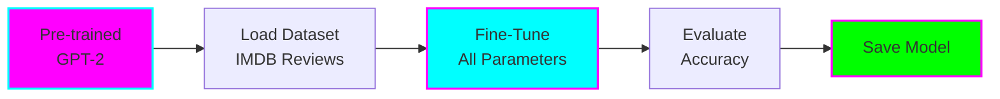
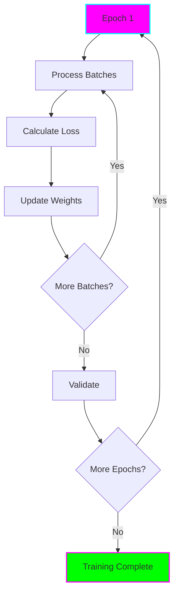

# Beginner: Full Fine-Tuning

**Level:** 🟢 Beginner

**Difficulty:** Easy

**Time to Complete:** 30-60 minutes

**GPU Required:** Recommended (can run on CPU, but very slow)

## What You'll Learn

- How to load a pre-trained model
- How to prepare a dataset for fine-tuning
- The complete fine-tuning training loop
- How to evaluate your fine-tuned model
- How to save and load your model

## Overview

This example shows the basics of full fine-tuning using a small GPT-2 model for text classification (sentiment analysis). We'll train it to classify movie reviews as positive or negative.



## What This Example Does

1. **Loads GPT-2 Small** (124M parameters)
2. **Loads IMDB dataset** (movie reviews with positive/negative labels)
3. **Adds classification head** for binary classification
4. **Trains all model parameters** for 3 epochs
5. **Evaluates** on test set
6. **Saves** the fine-tuned model

## Key Concepts

### Model Architecture

```mermaid
graph TD
    A[Input Text:<br/>"This movie was great!"] --> B[Tokenizer]
    B --> C[GPT-2 Transformer<br/>12 Layers<br/>124M Parameters]
    C --> D[Classification Head<br/>2 Classes]
    D --> E[Output:<br/>Positive: 0.92<br/>Negative: 0.08]

    style A fill:#ff00ff,stroke:#00ffff
    style C fill:#00ffff,stroke:#ff00ff,stroke-width:2px
    style E fill:#00ff00,stroke:#ff00ff
```

### Training Process



## Prerequisites

Install required packages:

```bash
pip install torch transformers datasets accelerate evaluate scikit-learn
```

## Files

- `fine_tune.py` - Main training script
- `evaluate.py` - Evaluation script
- `README.md` - This file

## Quick Start

```bash
# Run training
python fine_tune.py

# The script will:
# 1. Download GPT-2 model (~500MB)
# 2. Download IMDB dataset (~80MB)
# 3. Fine-tune for 3 epochs (~15-20 minutes on GPU)
# 4. Save model to ./gpt2-imdb-classifier/
```

## Code Walkthrough

### 1. Load Model and Tokenizer

```python
from transformers import AutoTokenizer, AutoModelForSequenceClassification

model_name = "gpt2"
tokenizer = AutoTokenizer.from_pretrained(model_name)
model = AutoModelForSequenceClassification.from_pretrained(
    model_name,
    num_labels=2  # Binary classification
)

# GPT-2 doesn't have a pad token, so we add one
tokenizer.pad_token = tokenizer.eos_token
model.config.pad_token_id = model.config.eos_token_id
```

### 2. Load and Prepare Dataset

```python
from datasets import load_dataset

# Load IMDB dataset
dataset = load_dataset("imdb")

# Tokenize function
def tokenize_function(examples):
    return tokenizer(
        examples["text"],
        padding="max_length",
        truncation=True,
        max_length=512
    )

# Tokenize dataset
tokenized_dataset = dataset.map(tokenize_function, batched=True)
```

### 3. Set Up Training

```python
from transformers import TrainingArguments, Trainer

training_args = TrainingArguments(
    output_dir="./results",
    learning_rate=2e-5,
    per_device_train_batch_size=8,
    per_device_eval_batch_size=8,
    num_train_epochs=3,
    weight_decay=0.01,
    evaluation_strategy="epoch",
    save_strategy="epoch",
    load_best_model_at_end=True,
)

trainer = Trainer(
    model=model,
    args=training_args,
    train_dataset=tokenized_dataset["train"],
    eval_dataset=tokenized_dataset["test"],
)
```

### 4. Train and Save

```python
# Train the model
trainer.train()

# Save the model
model.save_pretrained("./gpt2-imdb-classifier")
tokenizer.save_pretrained("./gpt2-imdb-classifier")
```

## Expected Results

After training, you should see:

- **Training Loss:** Decreases from ~0.7 to ~0.3
- **Validation Accuracy:** ~85-90%
- **Training Time:** 15-20 minutes on GPU, 2-3 hours on CPU

## Understanding the Output

```
Epoch 1/3
Training Loss: 0.682
Validation Loss: 0.412
Validation Accuracy: 0.823

Epoch 2/3
Training Loss: 0.356
Validation Loss: 0.378
Validation Accuracy: 0.864

Epoch 3/3
Training Loss: 0.289
Validation Loss: 0.392
Validation Accuracy: 0.872
```

## Troubleshooting

### Out of Memory Error

Reduce batch size:
```python
per_device_train_batch_size=4  # Instead of 8
```

Or use gradient accumulation:
```python
per_device_train_batch_size=4
gradient_accumulation_steps=2  # Effective batch size = 8
```

### Slow Training

- Use GPU if available
- Reduce max_length from 512 to 256
- Use smaller subset of data for testing

### Model Not Learning

- Check learning rate (try 5e-5 or 1e-5)
- Ensure labels are correct (0 and 1, not 1 and 2)
- Check for data preprocessing errors

## Next Steps

1. **Experiment:** Try different hyperparameters
   - Learning rate: 1e-5, 2e-5, 5e-5
   - Batch size: 4, 8, 16
   - Epochs: 2, 3, 5

2. **Compare:** Try the [LoRA beginner example](../lora/) and see:
   - How much faster it trains
   - How much less memory it uses
   - How the accuracy compares

3. **Apply:** Use your own dataset
   - Prepare CSV with text and label columns
   - Adjust num_labels for your task
   - Modify preprocessing as needed

## Key Takeaways

- ✅ Full fine-tuning updates ALL parameters
- ✅ Works well for most tasks with good datasets
- ✅ Straightforward and well-supported
- ⚠️ Requires significant GPU memory
- ⚠️ Can overfit on small datasets
- ⚠️ Slower than parameter-efficient methods

## Further Reading

- [Hugging Face Fine-tuning Tutorial](https://huggingface.co/docs/transformers/training)
- [Understanding Learning Rates](https://huggingface.co/docs/transformers/main_classes/optimizer_schedules)
- [Trainer API Documentation](https://huggingface.co/docs/transformers/main_classes/trainer)
