# Beginner: LoRA Fine-Tuning

**Level:** 🟢 Beginner

**Difficulty:** Easy

**Time to Complete:** 30-60 minutes

**GPU Required:** Recommended (works on smaller GPUs than full fine-tuning)

## What You'll Learn

- How LoRA differs from full fine-tuning
- How to configure LoRA parameters (rank, alpha, target modules)
- How to wrap a model with LoRA adapters
- The memory and speed advantages of LoRA
- How to save and load LoRA adapters

## Overview

This example demonstrates LoRA (Low-Rank Adaptation) fine-tuning using the same task as the full fine-tuning example: sentiment analysis on IMDB reviews. You'll see how LoRA achieves similar performance while training far fewer parameters.


## What This Example Does

1. **Loads GPT-2 Small** (124M parameters)
2. **Adds LoRA adapters** (only ~400K trainable parameters!)
3. **Trains only the adapters** (base model stays frozen)
4. **Achieves ~85% accuracy** (similar to full fine-tuning)
5. **Saves tiny adapter files** (~2MB vs 500MB for full model)

## LoRA vs Full Fine-Tuning

| Metric | Full Fine-Tuning | LoRA |
|--------|------------------|------|
| Trainable Parameters | 124,000,000 (100%) | ~400,000 (0.3%) |
| GPU Memory | ~8-10 GB | ~4-5 GB |
| Training Speed | Baseline | 2-3x faster |
| Model Size to Save | ~500 MB | ~2 MB |
| Accuracy | ~87% | ~85% |


## Prerequisites

Install required packages:

```bash
pip install torch transformers datasets peft accelerate evaluate scikit-learn
```

**Note:** The `peft` library is required for LoRA!

## Files

- `fine_tune_lora.py` - Main training script with LoRA
- `README.md` - This file

## Quick Start

```bash
# Run training
python fine_tune_lora.py

# The script will:
# 1. Download GPT-2 model (~500MB)
# 2. Add LoRA adapters
# 3. Fine-tune adapters only (~10-15 minutes on GPU)
# 4. Save adapters to ./gpt2-imdb-lora/
```

## Key Concepts

### LoRA Architecture

```mermaid
graph TD
    A[Input] --> B[Original Weight W<br/>FROZEN ❄️]
    A --> C[LoRA Matrix A<br/>TRAINABLE 🔥]

    C --> D[LoRA Matrix B<br/>TRAINABLE 🔥]

    B --> E[Add]
    D --> E

    E --> F[Output]

    style B fill:#808080,stroke:#00ffff
    style C fill:#00ff00,stroke:#ff00ff,stroke-width:2px
    style D fill:#00ff00,stroke:#ff00ff,stroke-width:2px
```



### How LoRA Reduces Parameters

Original: 768 × 768 = 589,824 parameters

LoRA (rank=8):
- Matrix A: 768 × 8 = 6,144 parameters
- Matrix B: 8 × 768 = 6,144 parameters
- Total: 12,288 parameters (98% reduction!)

## Code Walkthrough

### 1. Load Model (Same as Full Fine-Tuning)

```python
from transformers import AutoTokenizer, AutoModelForSequenceClassification

model_name = "gpt2"
tokenizer = AutoTokenizer.from_pretrained(model_name)
tokenizer.pad_token = tokenizer.eos_token

model = AutoModelForSequenceClassification.from_pretrained(
    model_name,
    num_labels=2
)
model.config.pad_token_id = model.config.eos_token_id
```

### 2. Configure LoRA (The Magic Part!)

```python
from peft import LoraConfig, get_peft_model

lora_config = LoraConfig(
    r=8,                          # Rank (number of low-rank dimensions)
    lora_alpha=16,                # Scaling factor (typically 2x rank)
    target_modules=["c_attn"],    # Which modules to apply LoRA to
    lora_dropout=0.05,            # Dropout for regularization
    bias="none",                  # Don't train biases
    task_type="SEQ_CLS"           # Task type: sequence classification
)

# Wrap model with LoRA
model = get_peft_model(model, lora_config)
```

### 3. Check Trainable Parameters

```python
model.print_trainable_parameters()
# Output: trainable params: 294,912 || all params: 124,734,720 || trainable%: 0.2364
```

Only 0.24% of parameters are trainable!

### 4. Train (Same API as Full Fine-Tuning)

```python
from transformers import Trainer, TrainingArguments

training_args = TrainingArguments(
    output_dir="./results",
    learning_rate=3e-4,           # Higher LR for LoRA
    per_device_train_batch_size=8,
    num_train_epochs=3,
)

trainer = Trainer(
    model=model,
    args=training_args,
    train_dataset=tokenized_dataset["train"],
    eval_dataset=tokenized_dataset["test"],
)

trainer.train()
```

### 5. Save LoRA Adapters

```python
# Save only the LoRA adapters (not the full model!)
model.save_pretrained("./gpt2-imdb-lora")

# File size: ~2MB instead of 500MB!
```

### 6. Load and Use LoRA Model

```python
from peft import AutoPeftModelForSequenceClassification

# Load base model + LoRA adapters
model = AutoPeftModelForSequenceClassification.from_pretrained(
    "./gpt2-imdb-lora"
)
```

## Configuration Explained

### Rank (r)

The dimensionality of the low-rank adaptation.


**Start with r=8**

### Alpha (lora_alpha)

Scaling factor for LoRA updates.

- `alpha = r`: Standard scaling
- `alpha = 2*r`: LoRA has more influence (recommended)
- `alpha = r/2`: LoRA has less influence

**Start with alpha = 2*r**

### Target Modules

Which layers to apply LoRA to.

For GPT-2:
- `c_attn`: Attention layers (most important)
- `c_proj`: Projection layers
- `c_fc`: Feed-forward layers

**Start with just `c_attn`**

## Expected Results

After training with the same dataset as full fine-tuning:

- **Training Loss:** Similar to full fine-tuning
- **Validation Accuracy:** ~85% (vs ~87% for full fine-tuning)
- **Training Time:** 10-15 minutes on GPU (vs 15-20 for full fine-tuning)
- **Model Size:** 2 MB (vs 500 MB for full fine-tuning)

## Troubleshooting

### "No module named 'peft'"

Install PEFT library:
```bash
pip install peft
```

### Out of Memory (Still!)

Reduce batch size:
```python
per_device_train_batch_size=4
```

Or use gradient accumulation:
```python
per_device_train_batch_size=4
gradient_accumulation_steps=2
```

### Lower Accuracy than Expected

Try:
1. Increase rank: `r=16` or `r=32`
2. Add more target modules: `["c_attn", "c_proj"]`
3. Train for more epochs
4. Increase learning rate to `5e-4`

## Comparison with Full Fine-Tuning

Run both examples and compare:

```bash
# Full fine-tuning
cd ../full-fine-tuning
python fine_tune.py

# LoRA
cd ../lora
python fine_tune_lora.py
```

**What to compare:**
- Training time
- GPU memory usage (use `nvidia-smi`)
- Final accuracy
- Model file size

## Next Steps

1. **Experiment with LoRA config:**
   - Try `r=4, 16, 32`
   - Try different target modules
   - Try different learning rates

2. **Try multiple adapters:**
   - Train one adapter per task
   - Switch between adapters
   - Merge adapters back into base model

3. **Move to QLoRA:**
   - See [QLoRA intermediate example](../../intermediate/qlora/)
   - Fine-tune even larger models with less memory

## Key Takeaways

- ✅ LoRA trains only 0.1-1% of parameters
- ✅ 2-3x faster training than full fine-tuning
- ✅ Uses 40-50% less GPU memory
- ✅ Adapter files are tiny (MBs vs GBs)
- ✅ Easy to train multiple task-specific adapters
- ✅ Can merge adapters back into base model
- ⚠️ Slightly lower accuracy than full fine-tuning (~2-5%)
- ⚠️ Requires tuning rank and target modules

## Further Reading

- [LoRA Paper](https://arxiv.org/abs/2106.09685)
- [PEFT Documentation](https://huggingface.co/docs/peft)
- [LoRA Detailed Guide](../../../docs/03-lora.md)
