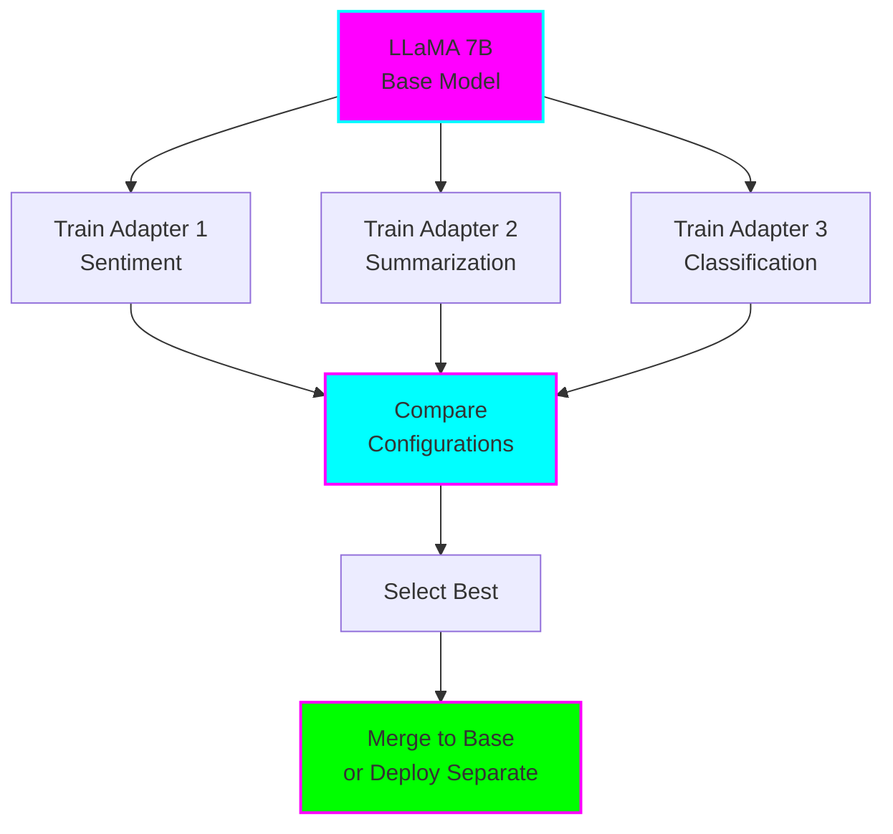
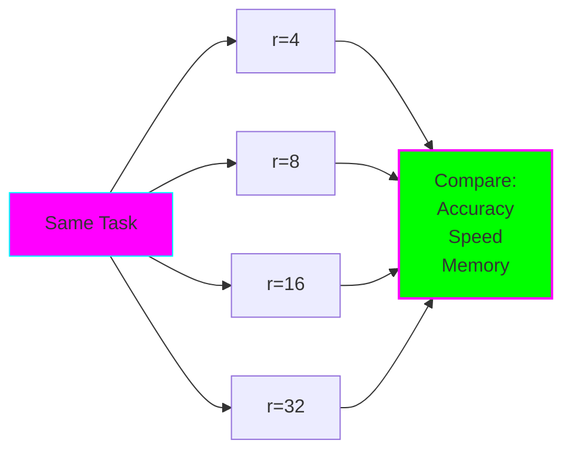
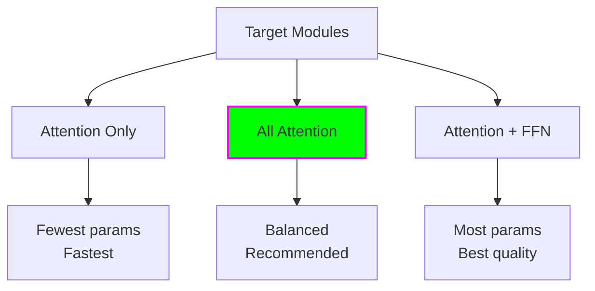
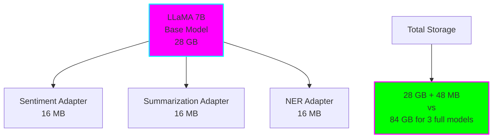
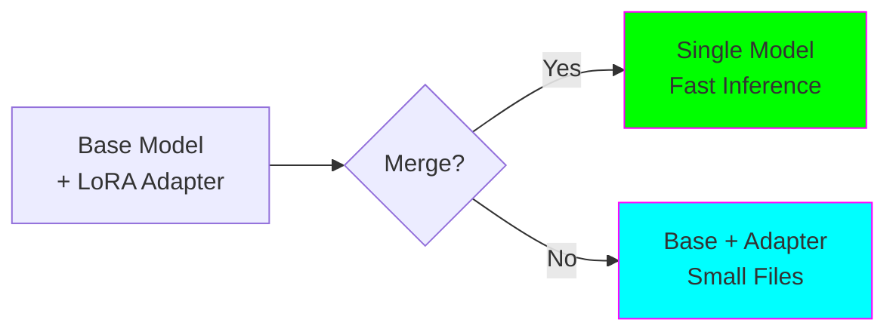

# Intermediate: Advanced LoRA Fine-Tuning

**Level:** 🟡 Intermediate

**Difficulty:** Medium

**Time to Complete:** 2-4 hours

**GPU Required:** Yes (8GB+ VRAM)

## What You'll Learn

- How to experiment with different LoRA configurations
- Training multiple LoRA adapters for different tasks
- Comparing LoRA ranks and their impact
- Merging LoRA adapters back into the base model
- Using larger models (LLaMA 7B) with LoRA

## Overview

This intermediate example goes beyond basic LoRA usage. You'll learn to optimize LoRA configurations, manage multiple adapters, and work with larger models efficiently.



## What This Example Does

1. **Experiments with LoRA ranks** (4, 8, 16, 32)
2. **Tests different target modules** (attention only, attention + MLP)
3. **Trains multiple task-specific adapters**
4. **Compares configurations quantitatively**
5. **Demonstrates adapter merging**
6. **Works with LLaMA 7B** (or similar large model)

## Prerequisites

Install required packages:

```bash
pip install torch transformers datasets peft accelerate evaluate bitsandbytes wandb
```

## Project Structure

```
intermediate/lora/
├── README.md                       # This file
├── experiment_ranks.py             # Compare different ranks
├── experiment_modules.py           # Compare target modules
├── multi_task_adapters.py          # Train multiple adapters
├── merge_adapters.py               # Merge adapters to base
└── utils.py                        # Shared utilities
```

## Experiments

### Experiment 1: Comparing LoRA Ranks

**Question:** How does rank affect performance and efficiency?



**Expected Results:**

| Rank | Params | Accuracy | Training Time | Memory |
|------|--------|----------|---------------|--------|
| r=4 | ~200K | 83% | Fastest | Lowest |
| r=8 | ~400K | 87% | Fast | Low |
| r=16 | ~800K | 89% | Medium | Medium |
| r=32 | ~1.6M | 90% | Slower | Higher |

**Run:**
```bash
python experiment_ranks.py
```

### Experiment 2: Target Modules

**Question:** Which modules should we apply LoRA to?

**Configurations to test:**
1. **Attention only:** `q_proj, v_proj`
2. **All attention:** `q_proj, k_proj, v_proj, o_proj`
3. **Attention + FFN:** All attention + `gate_proj, up_proj, down_proj`



**Run:**
```bash
python experiment_modules.py
```

### Experiment 3: Multi-Task Adapters

**Goal:** Train separate adapters for different tasks while sharing the same base model.



**Tasks:**
1. Sentiment Analysis (IMDB)
2. Summarization (CNN/DailyMail)
3. Question Answering (SQuAD)

**Run:**
```bash
python multi_task_adapters.py
```

### Experiment 4: Merging Adapters

**Options for deployment:**

1. **Separate adapters:** Keep base + multiple adapters
   - Pro: Tiny adapter files
   - Con: Slower inference (extra computation)

2. **Merged model:** Merge adapter into base weights
   - Pro: Faster inference
   - Con: Separate model per task



**Run:**
```bash
python merge_adapters.py
```

## Detailed Configuration Guide

### Finding Optimal Rank

**Start here and adjust:**

```python
# For simple tasks (sentiment, classification)
r = 8
lora_alpha = 16

# For complex tasks (generation, QA)
r = 16
lora_alpha = 32

# For very complex tasks (instruction following)
r = 32
lora_alpha = 64
```

**Tuning strategy:**
1. Start with r=8
2. If accuracy is low, double it (r=16)
3. If still low, double again (r=32)
4. If accuracy is good, try halving (r=4) to save compute

### Target Modules by Model

**LLaMA / Mistral / Mixtral:**
```python
target_modules = [
    "q_proj",      # Query projection
    "k_proj",      # Key projection
    "v_proj",      # Value projection
    "o_proj",      # Output projection
    "gate_proj",   # FFN gate (optional)
    "up_proj",     # FFN up (optional)
    "down_proj",   # FFN down (optional)
]
```

**GPT-2 / GPT-J:**
```python
target_modules = [
    "c_attn",      # Combined Q, K, V
    "c_proj",      # Output projection
    "c_fc",        # FFN (optional)
]
```

**BERT / RoBERTa:**
```python
target_modules = [
    "query",       # Query
    "key",         # Key
    "value",       # Value
    "dense",       # Output (optional)
]
```

### Learning Rate Guidelines

LoRA typically needs higher learning rates:

```python
# Full fine-tuning
lr_full_ft = 2e-5

# LoRA (3-10x higher)
lr_lora = 3e-4

# Scale by rank
lr = base_lr * (rank / 8)  # Adjust for rank
```

## Advanced Techniques

### 1. Rank Stabilization

Add extra regularization for higher ranks:

```python
lora_config = LoraConfig(
    r=32,
    lora_dropout=0.1,      # Higher dropout for higher rank
    init_lora_weights="gaussian",  # Better initialization
)
```

### 2. Layer-Specific Ranks

Different ranks for different layers:

```python
# Not directly supported by PEFT, but you can:
# 1. Create multiple LoRA configs
# 2. Apply to different layer subsets
# 3. Useful for very large models
```

### 3. Quantization + LoRA

Combine with 8-bit quantization (before QLoRA):

```python
from transformers import BitsAndBytesConfig

bnb_config = BitsAndBytesConfig(
    load_in_8bit=True,
)

model = AutoModelForCausalLM.from_pretrained(
    "meta-llama/Llama-2-7b-hf",
    quantization_config=bnb_config,
)
```

### 4. Multiple LoRA Adapters (Composition)

Stack adapters for multi-task:

```python
# Train adapter 1
model.save_pretrained("adapter1")

# Load and add adapter 2
model.load_adapter("adapter1", adapter_name="task1")
model.add_adapter(lora_config, adapter_name="task2")

# Use specific adapter
model.set_adapter("task1")  # Use task1 adapter
model.set_adapter("task2")  # Use task2 adapter
```

## Sample Code: Rank Comparison

```python
from peft import LoraConfig, get_peft_model
from transformers import AutoModelForCausalLM
import time

model_name = "meta-llama/Llama-2-7b-hf"
ranks = [4, 8, 16, 32]

results = []

for rank in ranks:
    print(f"\n Testing rank {rank}")

    # Load fresh model
    model = AutoModelForCausalLM.from_pretrained(model_name)

    # Configure LoRA
    config = LoraConfig(
        r=rank,
        lora_alpha=rank * 2,
        target_modules=["q_proj", "v_proj"],
        lora_dropout=0.05,
        task_type="CAUSAL_LM"
    )

    # Apply LoRA
    model = get_peft_model(model, config)

    # Count parameters
    trainable = sum(p.numel() for p in model.parameters() if p.requires_grad)

    # Train (pseudo-code)
    start_time = time.time()
    # trainer.train()
    train_time = time.time() - start_time

    # Evaluate
    # accuracy = evaluate(model)

    results.append({
        "rank": rank,
        "params": trainable,
        "time": train_time,
        # "accuracy": accuracy
    })

# Compare results
import pandas as pd
df = pd.DataFrame(results)
print(df)
```

## Expected Outcomes

### Memory Comparison

| Configuration | Parameters | Memory | Relative |
|---------------|-----------|--------|----------|
| Base (r=8, attn only) | 400K | 40 GB | 1.0x |
| Higher rank (r=16) | 800K | 41 GB | 1.02x |
| More modules (r=8, all) | 1.2M | 42 GB | 1.05x |

**Takeaway:** LoRA parameter changes have minimal memory impact!

### Accuracy Comparison

Typical results on IMDB sentiment:

| Configuration | Accuracy | F1 Score |
|---------------|----------|----------|
| r=4, attn only | 85% | 0.84 |
| r=8, attn only | 87% | 0.86 |
| r=16, attn only | 88% | 0.87 |
| r=8, all modules | 89% | 0.88 |

## Next Steps

1. **Run all experiments** and analyze results
2. **Try on your own dataset** with optimal config
3. **Explore QLoRA** for even larger models ([QLoRA Example](../qlora/))
4. **Production deployment** with merged adapters

## Troubleshooting

### Adapters not improving performance

- Increase rank (8 → 16 → 32)
- Add more target modules
- Increase learning rate (try 5e-4, 1e-3)
- Train for more epochs

### Out of memory with LLaMA 7B

- Use 8-bit loading (see above)
- Reduce batch size
- Try QLoRA example instead

### Merged model performs worse

- Check alpha scaling
- Ensure proper merging code
- Verify base model compatibility

## Key Takeaways

- ✅ Rank 8-16 works for most tasks
- ✅ Attention modules are most important
- ✅ Multiple adapters share same base (huge savings!)
- ✅ Higher ranks need higher dropout
- ✅ LoRA learning rates are 3-10x higher than full FT
- ✅ Merging is lossless (same inference quality)

## Further Reading

- [LoRA Paper](https://arxiv.org/abs/2106.09685)
- [PEFT Documentation - Multiple Adapters](https://huggingface.co/docs/peft/main/en/tutorial/peft_integrations#load-and-train-multiple-adapters)
- [Merging LoRA Adapters](https://huggingface.co/docs/peft/main/en/developer_guides/lora#merge-lora-weights-into-the-base-model)
