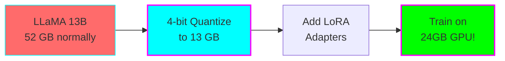
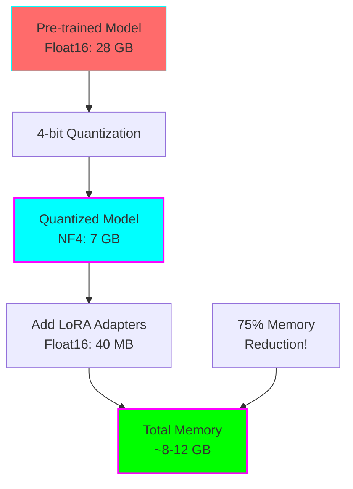
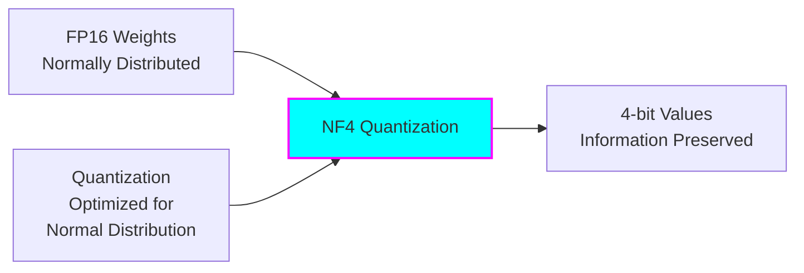
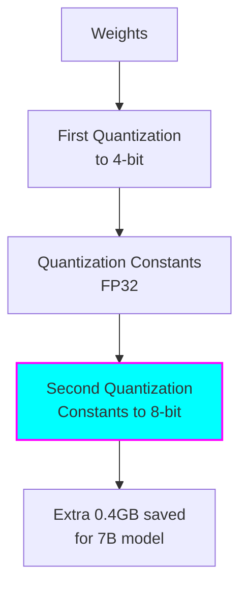
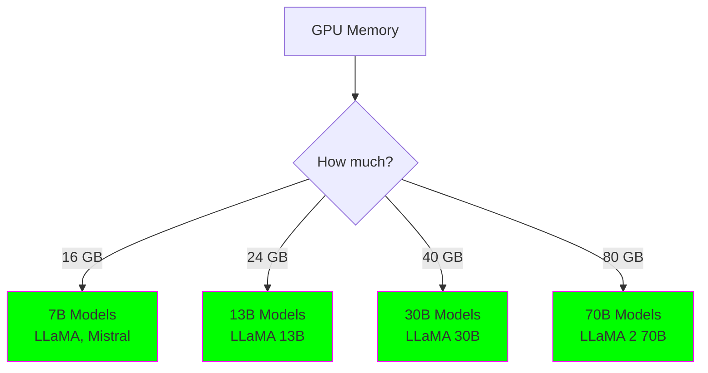
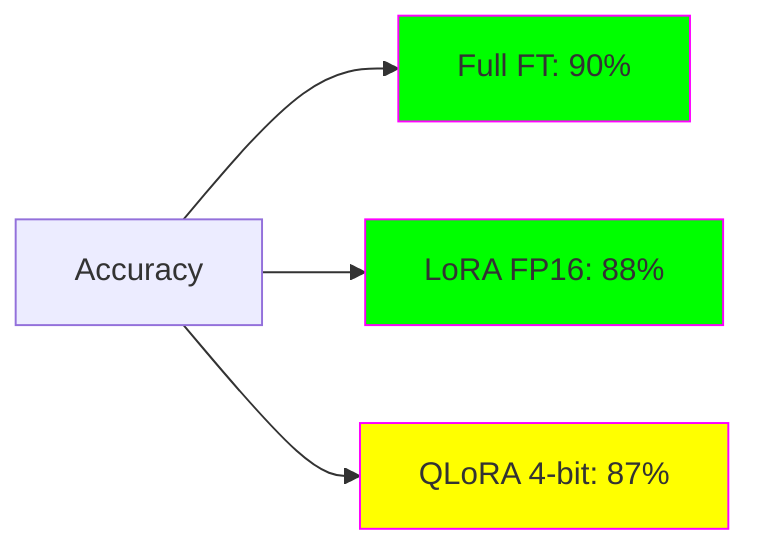

# Intermediate: QLoRA (Quantized LoRA)

**Level:** 🟡 Intermediate

**Difficulty:** Medium-Hard

**Time to Complete:** 2-4 hours

**GPU Required:** Yes (16GB+ VRAM for 7B models, 24GB+ for 13B)

## What You'll Learn

- How QLoRA combines quantization with LoRA
- 4-bit quantization and NormalFloat4 (NF4)
- Fine-tuning 7B-13B models on consumer GPUs
- Double quantization for extra memory savings
- Comparing QLoRA vs LoRA trade-offs

## Overview

QLoRA enables fine-tuning of massive models (7B, 13B, even 65B+) on consumer GPUs by combining 4-bit quantization of the base model with LoRA adapters. It's the technique that democratized large model fine-tuning!



## What is QLoRA?

**QLoRA = Quantized Low-Rank Adaptation**

Combines three key innovations:
1. **4-bit NormalFloat (NF4)** - Optimal quantization for normally distributed weights
2. **Double Quantization** - Quantize the quantization constants
3. **Paged Optimizers** - Handle memory spikes using CPU offloading



## Memory Breakdown: LLaMA 7B

| Component | Full FT | LoRA | QLoRA |
|-----------|---------|------|-------|
| Base Model (fp32) | 28 GB | 28 GB | - |
| Base Model (fp16) | - | - | - |
| Base Model (4-bit) | - | - | 7 GB |
| LoRA Adapters | - | 40 MB | 40 MB |
| Gradients | 28 GB | 40 MB | 40 MB |
| Optimizer States | 56 GB | 80 MB | 80 MB |
| Activations | ~20 GB | ~10 GB | ~10 GB |
| **Total** | **~132 GB** | **~40 GB** | **~18 GB** |

**Result:** Fine-tune LLaMA 7B on RTX 3090/4090 (24GB)!

## QLoRA Configuration

### Basic Setup

```python
from transformers import BitsAndBytesConfig
from peft import LoraConfig, prepare_model_for_kbit_training, get_peft_model

# 4-bit quantization config
bnb_config = BitsAndBytesConfig(
    load_in_4bit=True,                      # Enable 4-bit loading
    bnb_4bit_quant_type="nf4",              # Use NormalFloat4
    bnb_4bit_compute_dtype=torch.bfloat16,  # Compute in bfloat16
    bnb_4bit_use_double_quant=True,         # Double quantization
)

# Load model in 4-bit
model = AutoModelForCausalLM.from_pretrained(
    "meta-llama/Llama-2-7b-hf",
    quantization_config=bnb_config,
    device_map="auto",                      # Auto device placement
)

# Prepare for k-bit training
model = prepare_model_for_kbit_training(model)

# Add LoRA
lora_config = LoraConfig(
    r=16,
    lora_alpha=32,
    target_modules=["q_proj", "v_proj"],
    lora_dropout=0.05,
    bias="none",
    task_type="CAUSAL_LM"
)

model = get_peft_model(model, lora_config)
```

## Key Components Explained

### 1. NormalFloat4 (NF4)

Normal floats quantized to 4 bits:



**Why NF4?**
- Neural network weights follow normal distribution
- NF4 places quantization levels optimally
- Better quality than uniform 4-bit quantization

### 2. Double Quantization

Quantize the quantization constants themselves:



### 3. Paged Optimizers

Handle memory spikes by using CPU RAM:

```python
from bitsandbytes.optim import AdamW8bit

optimizer = AdamW8bit(
    model.parameters(),
    lr=2e-4,
    betas=(0.9, 0.999),
    eps=1e-8
)
```

## Configuration Options

### Quantization Types

```python
bnb_4bit_quant_type = "nf4"    # NormalFloat4 (recommended)
# or
bnb_4bit_quant_type = "fp4"    # Float4 (slightly less quality)
```

**Recommendation:** Use `nf4` unless you have specific reasons

### Compute Dtype

```python
bnb_4bit_compute_dtype = torch.bfloat16   # Recommended (if supported)
# or
bnb_4bit_compute_dtype = torch.float16    # Older GPUs
```

**Check GPU support:**
- **bfloat16:** RTX 30xx, RTX 40xx, A100, H100
- **float16:** All GPUs

### Double Quantization

```python
bnb_4bit_use_double_quant = True   # Extra memory savings
# or
bnb_4bit_use_double_quant = False  # Slightly faster
```

**Recommendation:** Always use `True` for maximum memory savings

## What Models Can You Train?

With different GPU memory:

| GPU VRAM | Max Model Size | Example Models |
|----------|----------------|----------------|
| 16 GB | 7B | LLaMA 7B, Mistral 7B |
| 24 GB | 13B | LLaMA 13B, Mixtral 8x7B* |
| 40 GB | 30B | LLaMA 30B |
| 48 GB | 65B | LLaMA 65B |
| 80 GB | 70B+ | LLaMA 2 70B, Falcon 180B* |

*With additional optimizations



## Prerequisites

Install required packages:

```bash
pip install torch transformers datasets peft accelerate bitsandbytes
pip install scipy  # Required for paged optimizers
```

**Important:** Requires CUDA-capable GPU

## Full Example Code

See `train_qlora.py` for complete implementation:

```python
"""
QLoRA Fine-Tuning Example
Fine-tune LLaMA 7B on consumer GPU
"""

import torch
from transformers import (
    AutoTokenizer,
    AutoModelForCausalLM,
    BitsAndBytesConfig,
    TrainingArguments,
)
from peft import LoraConfig, prepare_model_for_kbit_training, get_peft_model
from datasets import load_dataset

# 1. Quantization config
bnb_config = BitsAndBytesConfig(
    load_in_4bit=True,
    bnb_4bit_quant_type="nf4",
    bnb_4bit_compute_dtype=torch.bfloat16,
    bnb_4bit_use_double_quant=True,
)

# 2. Load model
model = AutoModelForCausalLM.from_pretrained(
    "meta-llama/Llama-2-7b-hf",
    quantization_config=bnb_config,
    device_map="auto",
    trust_remote_code=True,
)

# 3. Prepare for training
model = prepare_model_for_kbit_training(model)

# 4. LoRA config
lora_config = LoraConfig(
    r=16,
    lora_alpha=32,
    target_modules=[
        "q_proj",
        "k_proj",
        "v_proj",
        "o_proj",
    ],
    lora_dropout=0.05,
    bias="none",
    task_type="CAUSAL_LM"
)

# 5. Add LoRA adapters
model = get_peft_model(model, lora_config)
model.print_trainable_parameters()

# 6. Training arguments
training_args = TrainingArguments(
    output_dir="./results",
    per_device_train_batch_size=4,
    gradient_accumulation_steps=4,
    learning_rate=2e-4,
    num_train_epochs=3,
    fp16=True,
    logging_steps=10,
)

# 7. Train
# trainer = Trainer(...)
# trainer.train()
```

## QLoRA vs LoRA Comparison

### Quality



**Typical difference:** QLoRA is 1-2% lower than LoRA

### Speed

| Method | Steps/Second | Relative |
|--------|-------------|----------|
| LoRA (fp16) | 1.8 | 1.0x |
| QLoRA (4-bit) | 1.3 | 0.72x |

**QLoRA is slower** due to quantization/dequantization overhead

### Memory (LLaMA 7B)

| Method | Memory | Can Run On |
|--------|--------|------------|
| Full FT | 132 GB | 2x A100 80GB |
| LoRA | 40 GB | A100 40GB |
| QLoRA | 18 GB | RTX 3090/4090 |

## Best Practices

### 1. Batch Size & Gradient Accumulation

```python
# For 24GB GPU with LLaMA 7B
per_device_train_batch_size = 4
gradient_accumulation_steps = 4
# Effective batch size = 16
```

### 2. Learning Rate

QLoRA often needs slightly higher LR:

```python
# LoRA
learning_rate = 3e-4

# QLoRA (can go a bit higher)
learning_rate = 2e-4  # to 5e-4
```

### 3. Precision Training

```python
# Use bf16 if supported (RTX 30xx+)
bf16 = True

# Otherwise use fp16
fp16 = True  # (never both!)
```

### 4. Gradient Checkpointing

Save even more memory:

```python
training_args = TrainingArguments(
    gradient_checkpointing=True,
    ...
)
```

## Common Issues

### CUDA Out of Memory

**Solutions:**
1. Reduce batch size (4 → 2 → 1)
2. Increase gradient accumulation
3. Enable gradient checkpointing
4. Reduce sequence length
5. Use smaller model

### bitsandbytes Import Error

```bash
# Reinstall with correct CUDA version
pip uninstall bitsandbytes
pip install bitsandbytes --no-cache-dir
```

### Slow Training

**Expected behavior:**
- QLoRA is 20-30% slower than LoRA
- Trade-off for massive memory savings

**To speed up:**
- Ensure using GPU (not CPU)
- Check CUDA is properly installed
- Use bf16 instead of fp16 if supported

### Quality Lower Than Expected

**Try:**
1. Increase LoRA rank (16 → 32)
2. Add more target modules
3. Train for more epochs
4. Use higher learning rate
5. Check if bf16 is supported (better than fp16)

## When to Use QLoRA

### ✅ Use QLoRA When:

- **Limited GPU memory** (16-24 GB)
- **Want to fine-tune large models** (7B-70B)
- **Consumer GPU** (RTX 3090/4090)
- **Memory is the bottleneck**
- **Willing to trade speed for efficiency**

### ❌ Consider Alternatives When:

- **Have 40+ GB VRAM** → Use LoRA (faster, slightly better quality)
- **Have 80+ GB VRAM** → Consider full fine-tuning
- **Need fastest training** → LoRA is 30% faster
- **Every 1% accuracy matters** → LoRA or full FT

## Real-World Results

### LLaMA 7B on Alpaca Dataset

| Method | GPU | Time | Accuracy |
|--------|-----|------|----------|
| Full FT | 2x A100 80GB | 3 hours | 92% |
| LoRA | 1x A100 40GB | 1.5 hours | 90% |
| QLoRA | 1x RTX 4090 | 2 hours | 89% |

### Cost Comparison (Cloud GPUs)

| Method | GPU | Cost/Hour | Total Cost |
|--------|-----|-----------|------------|
| Full FT | 2x A100 | $6.00 | $18.00 |
| LoRA | 1x A100 | $3.00 | $4.50 |
| QLoRA | 1x RTX 4090 | $0.90 | $1.80 |

**QLoRA is 10x cheaper than full fine-tuning!**

## Next Steps

1. **Run the example** on a 7B model
2. **Try 13B model** if you have 24GB+ VRAM
3. **Compare with LoRA** on same dataset
4. **Fine-tune on your data**
5. **Explore expert examples** for production deployment

## Key Takeaways

- ✅ QLoRA enables 7B-70B models on consumer GPUs
- ✅ 4-bit quantization + LoRA = massive memory savings
- ✅ NF4 is optimal for neural network weights
- ✅ ~1-2% accuracy loss vs LoRA
- ✅ 20-30% slower than LoRA
- ✅ Use bfloat16 compute dtype if supported
- ✅ 10x more cost-effective than full fine-tuning

## Further Reading

- [QLoRA Paper](https://arxiv.org/abs/2305.14314)
- [bitsandbytes Documentation](https://github.com/TimDettmers/bitsandbytes)
- [PEFT QLoRA Guide](https://huggingface.co/blog/4bit-transformers-bitsandbytes)
