# Multi-Agent Orchestration Patterns

**Status:** 🚧 In Progress

**Tech Stack:** Python 3.12 | LangChain | LangGraph | OpenAI

**Started:** 2025-11-08

## Overview

A comprehensive research project exploring different multi-agent orchestration patterns for LLM-based systems. This project provides practical, real-world examples of 8 major orchestration patterns with two examples each:
- **Practical Example**: Real-world use case for a staff software engineer
- **Deep Dive Example**: Advanced implementation showing pattern nuances

## Architecture

```mermaid
graph TB
    A[Multi-Agent Orchestration Patterns] --> B[Swarm Pattern]
    A --> C[Supervisor Pattern]
    A --> D[Graph/Workflow Pattern]
    A --> E[Sequential Pattern]
    A --> F[Reflection Pattern]
    A --> G[Plan-Execute Pattern]
    A --> H[Router Pattern]
    A --> I[Parallel Pattern]

    B --> B1[Code Review Team]
    B --> B2[Distributed System Debug]

    C --> C1[API Design Assistant]
    C --> C2[Incident Response]

    D --> D1[CI/CD Pipeline]
    D --> D2[Complex Approval Flow]

    E --> E1[Log Analysis]
    E --> E2[Data Pipeline]

    F --> F1[Architecture Review]
    F --> F2[Research Paper Analysis]

    G --> G1[Feature Implementation]
    G --> G2[System Migration]

    H --> H1[Support Ticket Routing]
    H --> H2[Query Classification]

    I --> I1[Multi-Service Health Check]
    I --> I2[Concurrent Data Processing]

    style A fill:#ff00ff,stroke:#00ffff,stroke-width:3px
    style B fill:#00ffff,stroke:#ff00ff
    style C fill:#00ffff,stroke:#ff00ff
    style D fill:#00ffff,stroke:#ff00ff
    style E fill:#00ffff,stroke:#ff00ff
    style F fill:#00ffff,stroke:#ff00ff
    style G fill:#00ffff,stroke:#ff00ff
    style H fill:#00ffff,stroke:#ff00ff
    style I fill:#00ffff,stroke:#ff00ff
```



## Patterns Covered

### 1. **Swarm Pattern** (Decentralized)
Agents coordinate peer-to-peer with direct handoffs, no central controller.
- ✅ Example 1: Code review team with specialized reviewers
- ✅ Example 2: Distributed system debugging with autonomous agents

### 2. **Supervisor Pattern** (Centralized)
Central orchestrator delegates tasks to specialized sub-agents.
- ✅ Example 1: API design assistant with specialized validators
- ✅ Example 2: Incident response coordinator

### 3. **Graph/Workflow Pattern** (State Machine)
Structured state transitions with conditional paths.
- ✅ Example 1: CI/CD pipeline orchestration
- ✅ Example 2: Complex approval workflow

### 4. **Sequential/Pipeline Pattern** (Linear)
Linear chain of processing steps.
- ✅ Example 1: Log analysis pipeline
- ✅ Example 2: Data transformation pipeline

### 5. **Reflection/Debate Pattern** (Iterative Improvement)
Agents critique and improve each other's outputs.
- ✅ Example 1: Architecture decision review
- ✅ Example 2: Research paper multi-perspective analysis

### 6. **Plan-Execute Pattern** (Strategic)
Planner creates dynamic task list, executors carry them out.
- ✅ Example 1: Feature implementation planner
- ✅ Example 2: System migration orchestrator

### 7. **Router Pattern** (Classification)
Initial classifier directs work to specialized agents.
- ✅ Example 1: Support ticket routing
- ✅ Example 2: Multi-intent query handler

### 8. **Parallel/Concurrent Pattern** (Simultaneous)
Multiple agents work simultaneously on independent tasks.
- ✅ Example 1: Multi-service health checker
- ✅ Example 2: Concurrent data processing

## Environment Setup

This project uses Python 3.12 with modern dependency management.

- **Language/Runtime:** Python
- **Version:** 3.12
- **Environment File:** `.python-version`
- **Package Manager:** uv (recommended) or pip

### Quick Start

```bash
# Create and activate virtual environment
uv venv
source .venv/bin/activate  # On Windows: .venv\Scripts\activate

# Install dependencies
uv pip install -r requirements.txt

# Set up environment variables
cp .env.example .env
# Edit .env with your API keys

# Run a pattern example
python examples/swarm/code_review_team.py
```

### Environment Variables

Create a `.env` file with:

```env
OPENAI_API_KEY=your_openai_api_key
ANTHROPIC_API_KEY=your_anthropic_api_key  # Optional
LANGCHAIN_API_KEY=your_langsmith_key  # Optional for tracing
LANGCHAIN_TRACING_V2=true  # Optional
```

## Project Structure

```
multi-agent-orchestration/
├── README.md                          # This file
├── requirements.txt                   # Python dependencies
├── .python-version                    # Python version
├── .env.example                       # Environment template
├── docs/                              # Comprehensive documentation
│   ├── 01-introduction.md
│   ├── 02-pattern-comparison.md
│   ├── 03-swarm-pattern.md
│   ├── 04-supervisor-pattern.md
│   ├── 05-graph-pattern.md
│   ├── 06-sequential-pattern.md
│   ├── 07-reflection-pattern.md
│   ├── 08-plan-execute-pattern.md
│   ├── 09-router-pattern.md
│   ├── 10-parallel-pattern.md
│   └── 11-choosing-a-pattern.md
├── patterns/                          # Pattern base implementations
│   ├── swarm.py
│   ├── supervisor.py
│   ├── graph.py
│   ├── sequential.py
│   ├── reflection.py
│   ├── plan_execute.py
│   ├── router.py
│   └── parallel.py
└── examples/                          # Practical examples
    ├── swarm/
    │   ├── code_review_team.py
    │   └── distributed_debug.py
    ├── supervisor/
    │   ├── api_design_assistant.py
    │   └── incident_response.py
    ├── graph/
    │   ├── cicd_pipeline.py
    │   └── approval_workflow.py
    ├── sequential/
    │   ├── log_analysis.py
    │   └── data_pipeline.py
    ├── reflection/
    │   ├── architecture_review.py
    │   └── research_analysis.py
    ├── plan-execute/
    │   ├── feature_planner.py
    │   └── migration_orchestrator.py
    ├── router/
    │   ├── ticket_router.py
    │   └── query_classifier.py
    └── parallel/
        ├── health_checker.py
        └── data_processor.py
```

## Dependencies

See `requirements.txt` for full list. Key dependencies:
- **langchain** - Core agent framework
- **langchain-openai** - OpenAI integration
- **langgraph** - Graph-based workflows
- **python-dotenv** - Environment management
- **rich** - Beautiful terminal output

## Learning Log

### What I Learned

- **Pattern Selection Matters**: Different patterns excel in different scenarios
- **Swarm vs Supervisor**: Swarm reduces latency by ~40% but requires more careful design
- **LangGraph Power**: State machines provide excellent control for complex workflows
- **Reflection Benefits**: Iterative critique significantly improves output quality
- **Plan-Execute Flexibility**: Dynamic planning handles ambiguous requirements well

### Key Insights

1. **Swarm Pattern**: Best for collaborative, peer-level tasks with unclear delegation
2. **Supervisor Pattern**: Best for well-defined hierarchical task decomposition
3. **Graph Pattern**: Best for workflows with complex conditional logic
4. **Sequential Pattern**: Best for simple linear transformations
5. **Reflection Pattern**: Best when quality > speed, needs iterative improvement
6. **Plan-Execute Pattern**: Best for complex, multi-step tasks with uncertainty
7. **Router Pattern**: Best for classification and delegation to specialists
8. **Parallel Pattern**: Best for independent tasks that can run concurrently

### Challenges

- Managing state across agent handoffs
- Handling infinite loops in reflection patterns
- Balancing autonomy vs control in swarm architectures
- Cost management with multiple LLM calls
- Debugging multi-agent interactions

### Next Steps

- [ ] Add observability/tracing examples
- [ ] Implement hybrid patterns (combining multiple approaches)
- [ ] Add error handling and retry logic patterns
- [ ] Create pattern selection decision tree tool
- [ ] Add performance benchmarks
- [ ] Create agent memory/persistence examples

## Graduation Criteria

Before moving to its own repository:
- [x] Research completed on all major patterns
- [ ] All 8 patterns implemented with base classes
- [ ] 16 practical examples (2 per pattern)
- [ ] Comprehensive documentation complete
- [ ] Code tested and working
- [ ] README with clear examples
- [ ] Ready for community sharing

## References

### Research Papers
- [Multi-Agent Collaboration Mechanisms Survey](https://arxiv.org/html/2501.06322v1)
- [Self-Reflection in LLM Agents](https://arxiv.org/pdf/2405.06682)
- [Improving Factuality with Multiagent Debate](https://composable-models.github.io/llm_debate/)

### Framework Documentation
- [LangGraph Documentation](https://langchain-ai.github.io/langgraph/)
- [LangChain Multi-Agent](https://python.langchain.com/docs/modules/agents/)
- [OpenAI Agents SDK](https://openai.github.io/openai-agents-python/multi_agent/)
- [Microsoft AutoGen](https://microsoft.github.io/autogen/)
- [CrewAI Documentation](https://docs.crewai.com/)

### Blog Posts & Tutorials
- [Benchmarking Multi-Agent Architectures (LangChain)](https://blog.langchain.com/benchmarking-multi-agent-architectures/)
- [Agentic Design Patterns (DeepLearning.AI)](https://www.deeplearning.ai/the-batch/agentic-design-patterns-part-2-reflection/)
- [Agent Orchestration Patterns (Dynamiq)](https://www.getdynamiq.ai/post/agent-orchestration-patterns-in-multi-agent-systems-linear-and-adaptive-approaches-with-dynamiq)
- [Multi-Agent Architecture Guide 2025](https://collabnix.com/multi-agent-and-multi-llm-architecture-complete-guide-for-2025/)

### Comparisons
- [LangGraph vs AutoGen vs CrewAI](https://aaronyuqi.medium.com/first-hand-comparison-of-langgraph-crewai-and-autogen-30026e60b563)
- [Framework Comparison (Composio)](https://composio.dev/blog/openai-agents-sdk-vs-langgraph-vs-autogen-vs-crewai)
