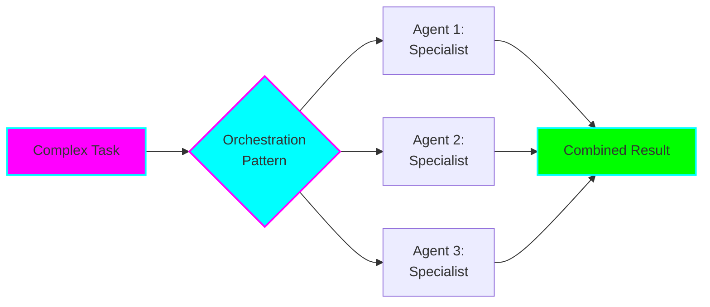
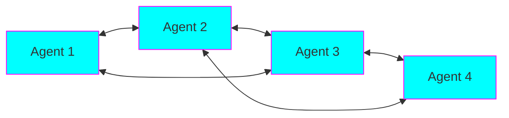
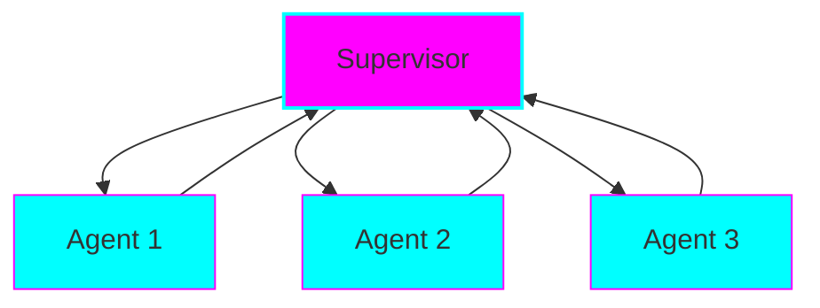
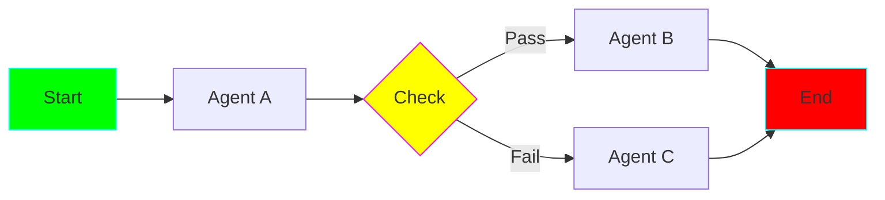
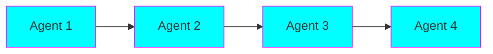
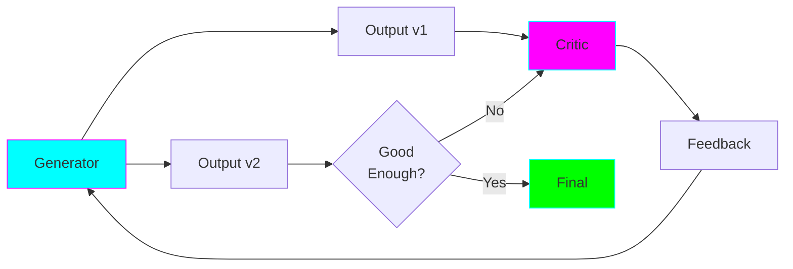
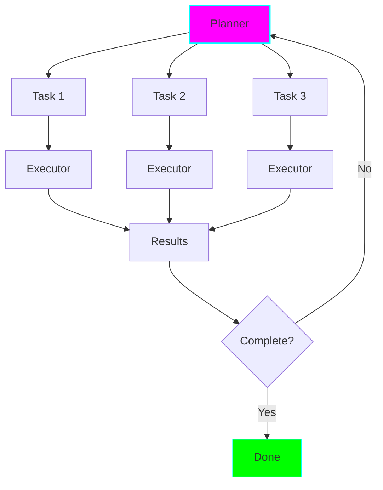
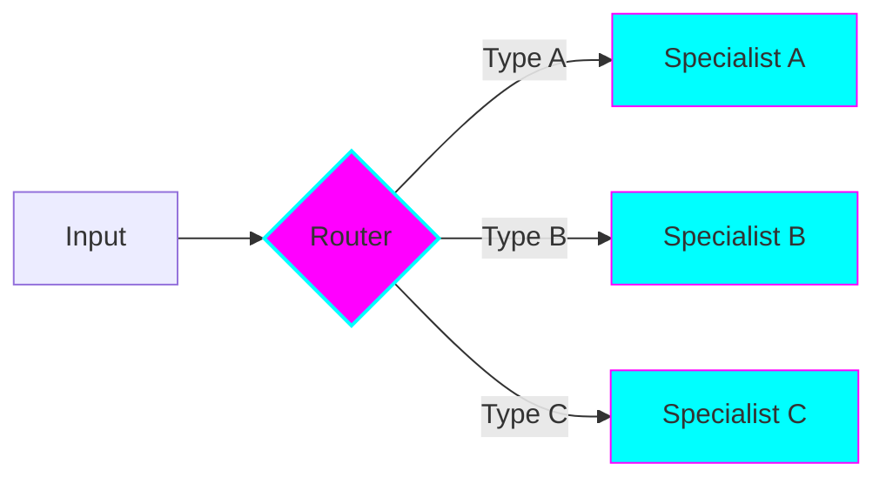
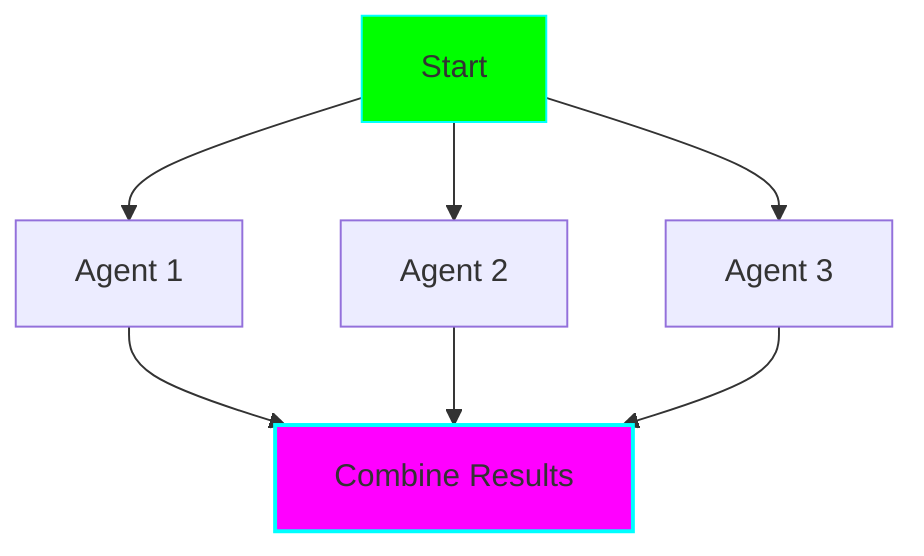
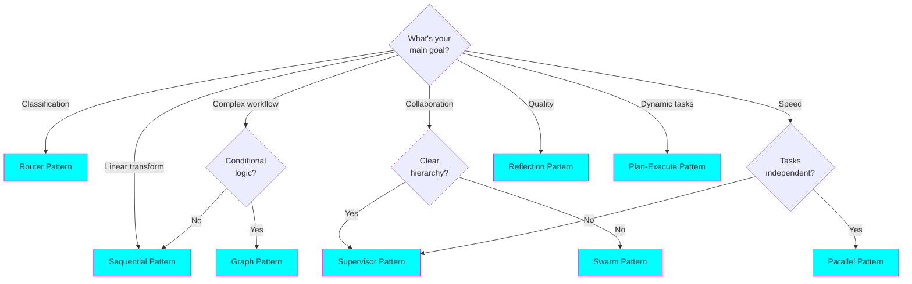

# Introduction to Multi-Agent Orchestration

## What is Multi-Agent Orchestration?

Multi-agent orchestration is the coordination of multiple AI agents working together to solve complex problems. Instead of a single LLM trying to handle everything, you break down tasks across specialized agents that collaborate.



## Why Use Multi-Agent Systems?

### Benefits

**1. Separation of Concerns**
Each agent has a specific role and expertise area.

```python
# Instead of one massive prompt:
mega_agent = Agent("Do code review, security audit, performance analysis, and style checking")

# Use specialized agents:
code_reviewer = Agent("Review code logic and correctness")
security_auditor = Agent("Check for security vulnerabilities")
perf_analyzer = Agent("Analyze performance bottlenecks")
style_checker = Agent("Verify code style compliance")
```

**2. Better Quality Through Specialization**
Agents can be optimized for their specific domain.

**3. Scalability**
Add new capabilities by adding new agents, not expanding prompts.

**4. Debuggability**
Easier to trace where problems occur in the pipeline.

**5. Flexibility**
Mix and match agents for different tasks.

### Trade-offs

**Costs:**
- More LLM calls = higher API costs
- More complexity in coordination
- Potential latency from handoffs

**When to Use Single vs Multi-Agent:**

| Scenario | Single Agent | Multi-Agent |
|----------|--------------|-------------|
| Simple Q&A | ✅ Better | ❌ Overkill |
| Code review | ⚠️ Can work | ✅ Better |
| Complex workflow | ❌ Too complex | ✅ Better |
| Budget constrained | ✅ Cheaper | ❌ More expensive |
| Need specialization | ❌ Limited | ✅ Excellent |

## The 8 Core Patterns

This project covers the 8 most common and useful multi-agent orchestration patterns:

### 1. Swarm (Decentralized)

**When:** Collaborative tasks where no clear hierarchy exists.

### 2. Supervisor (Centralized)

**When:** Clear task decomposition with hierarchical control needed.

### 3. Graph/Workflow (State Machine)

**When:** Complex conditional logic and state transitions.

### 4. Sequential/Pipeline (Linear)

**When:** Linear data transformation pipeline.

### 5. Reflection/Debate (Iterative)

**When:** Quality matters more than speed, iterative improvement.

### 6. Plan-Execute (Strategic)

**When:** Complex tasks requiring dynamic planning.

### 7. Router (Classification)

**When:** Need to classify and route to specialists.

### 8. Parallel/Concurrent (Simultaneous)

**When:** Independent tasks that can run simultaneously.

## Pattern Selection Decision Tree



## How to Use This Documentation

### For Learning
1. Read this introduction
2. Review the **Pattern Comparison** (next doc)
3. Deep dive into 2-3 patterns most relevant to your needs
4. Run the practical examples
5. Modify examples for your use cases

### For Implementation
1. Use the **Decision Tree** above to pick a pattern
2. Read that pattern's detailed documentation
3. Review both examples for that pattern
4. Copy the base implementation from `patterns/`
5. Adapt for your specific use case

### Documentation Structure

Each pattern documentation includes:
- **Overview**: What it is and when to use it
- **Architecture**: Visual diagrams
- **How It Works**: Step-by-step explanation
- **Advantages**: When this pattern excels
- **Disadvantages**: When to avoid it
- **Implementation**: Code walkthrough
- **Examples**: Two practical examples
  - Example 1: Real-world staff engineer use case
  - Example 2: Deep dive showing nuances
- **Tips & Best Practices**

## Key Concepts

### Agent
An AI entity with a specific role, tools, and instructions.

```python
from langchain.agents import AgentExecutor
from langchain_openai import ChatOpenAI

agent = AgentExecutor(
    llm=ChatOpenAI(model="gpt-4o-mini"),
    tools=[search_tool, calculator],
    system_message="You are a helpful research assistant."
)
```

### Handoff
Transferring control from one agent to another.

```python
# Agent A completes its work
result_a = agent_a.invoke(task)

# Hands off to Agent B
result_b = agent_b.invoke({
    "previous_result": result_a,
    "next_task": "Analyze the data"
})
```

### State
Shared information passed between agents.

```python
from typing import TypedDict

class AgentState(TypedDict):
    messages: list[str]
    current_agent: str
    results: dict
    iteration: int
```

### Orchestrator
The coordinator that manages agent interactions.

```python
class Orchestrator:
    def __init__(self, agents: list[Agent]):
        self.agents = agents

    def execute(self, task):
        # Coordination logic
        pass
```

## Real-World Applications

### Software Engineering
- **Code Review**: Swarm of specialized reviewers
- **Debugging**: Reflection pattern for iterative fixes
- **Architecture**: Plan-Execute for system design
- **Testing**: Parallel execution of test suites

### Operations
- **Incident Response**: Supervisor coordinating specialists
- **Monitoring**: Parallel health checks
- **Deployment**: Graph workflow for CI/CD

### Analysis
- **Data Pipeline**: Sequential transformations
- **Research**: Reflection for multi-perspective analysis
- **Classification**: Router for ticket/query handling

## Next Steps

Proceed to **02-pattern-comparison.md** for a side-by-side comparison of all patterns, or jump to a specific pattern that interests you:

- [03-swarm-pattern.md](03-swarm-pattern.md) - Decentralized collaboration
- [04-supervisor-pattern.md](04-supervisor-pattern.md) - Centralized orchestration
- [05-graph-pattern.md](05-graph-pattern.md) - State machine workflows
- [06-sequential-pattern.md](06-sequential-pattern.md) - Linear pipelines
- [07-reflection-pattern.md](07-reflection-pattern.md) - Iterative improvement
- [08-plan-execute-pattern.md](08-plan-execute-pattern.md) - Dynamic planning
- [09-router-pattern.md](09-router-pattern.md) - Classification and routing
- [10-parallel-pattern.md](10-parallel-pattern.md) - Concurrent execution
