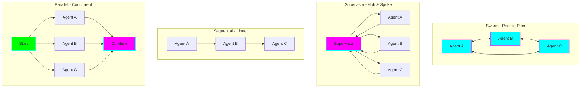
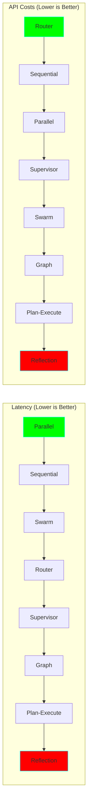
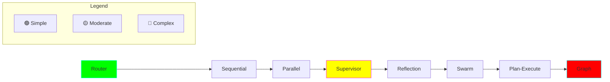
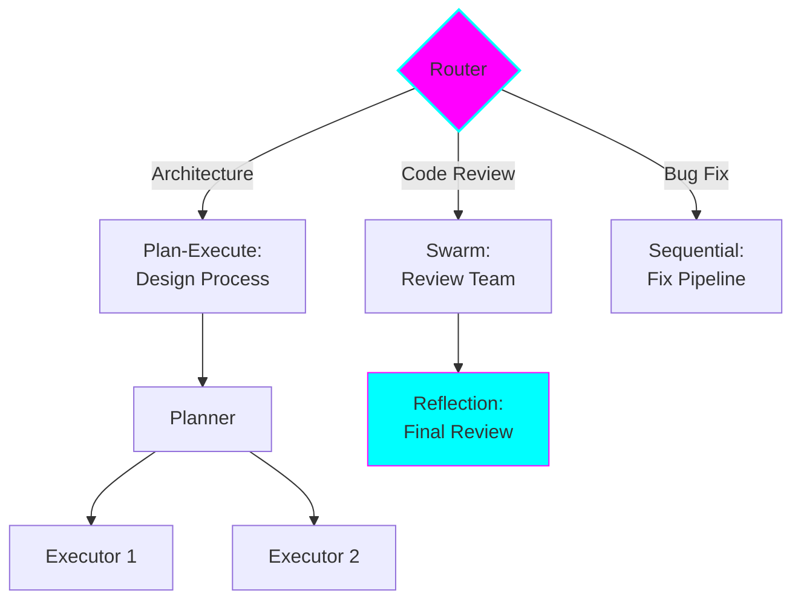

# Multi-Agent Pattern Comparison

## Quick Reference Matrix

| Pattern | Communication | Control | Latency | Complexity | Best For |
|---------|---------------|---------|---------|------------|----------|
| **Swarm** | Peer-to-peer | Decentralized | ⚡ Low | 🔴 High | Collaborative tasks |
| **Supervisor** | Hub-and-spoke | Centralized | ⚠️ Medium | 🟡 Medium | Clear hierarchies |
| **Graph** | Defined edges | Flow-based | ⚠️ Medium | 🔴 High | Complex workflows |
| **Sequential** | Linear | Deterministic | ⚡ Low | 🟢 Low | Pipelines |
| **Reflection** | Iterative loops | Critic-driven | 🔴 High | 🟡 Medium | Quality critical |
| **Plan-Execute** | Dynamic | Planner-driven | ⚠️ Medium | 🔴 High | Uncertain tasks |
| **Router** | One-to-one | Classification | ⚡ Low | 🟢 Low | Routing/triage |
| **Parallel** | Independent | Concurrent | ⚡⚡ Fastest | 🟡 Medium | Independent tasks |

## Detailed Comparison

### 1. Communication Patterns

### 2. Control Flow

| Pattern | Decision Making | Flexibility | Predictability |
|---------|----------------|-------------|----------------|
| **Swarm** | Distributed | 🔴 Very High | 🟡 Medium |
| **Supervisor** | Central authority | 🟡 Medium | 🟢 High |
| **Graph** | State transitions | 🟡 Medium | 🟢 High |
| **Sequential** | Fixed order | 🟢 Low | 🟢 Very High |
| **Reflection** | Quality threshold | 🟡 Medium | 🔴 Low |
| **Plan-Execute** | Dynamic planner | 🔴 Very High | 🔴 Low |
| **Router** | Classification | 🟢 Low | 🟢 High |
| **Parallel** | Independent | 🟢 Low | 🟢 High |

### 3. Performance Characteristics

#### Typical LLM Call Counts

| Pattern | Minimum Calls | Typical Calls | Max Calls |
|---------|---------------|---------------|-----------|
| **Swarm** | 3-4 | 5-7 | 10+ |
| **Supervisor** | 3 (1 supervisor + 2 agents) | 5-6 | 10+ |
| **Graph** | 3-4 | 6-8 | 15+ |
| **Sequential** | 3-4 | 4-5 | 7-8 |
| **Reflection** | 4 (2 iterations) | 8-10 | 20+ |
| **Plan-Execute** | 4-5 | 8-12 | 20+ |
| **Router** | 2 | 2-3 | 4 |
| **Parallel** | 3+ (concurrent) | 4-6 | 10+ |

### 4. Use Case Fit

#### Code Review

| Pattern | Fit | Reasoning |
|---------|-----|-----------|
| **Swarm** | ⭐⭐⭐⭐⭐ | Different reviewers can handoff to specialists |
| **Supervisor** | ⭐⭐⭐⭐ | Central coordinator assigns review aspects |
| **Sequential** | ⭐⭐ | Code review isn't strictly linear |
| **Reflection** | ⭐⭐⭐⭐⭐ | Iterative improvement of feedback |
| **Parallel** | ⭐⭐⭐⭐ | Different aspects reviewed concurrently |

#### API Design

| Pattern | Fit | Reasoning |
|---------|-----|-----------|
| **Supervisor** | ⭐⭐⭐⭐⭐ | Central architect coordinates specialists |
| **Plan-Execute** | ⭐⭐⭐⭐⭐ | Design requires planning then execution |
| **Sequential** | ⭐⭐⭐ | Can work for linear design process |
| **Reflection** | ⭐⭐⭐⭐ | Design benefits from critique |

#### Incident Response

| Pattern | Fit | Reasoning |
|---------|-----|-----------|
| **Supervisor** | ⭐⭐⭐⭐⭐ | Clear command structure needed |
| **Parallel** | ⭐⭐⭐⭐ | Multiple systems checked simultaneously |
| **Graph** | ⭐⭐⭐⭐ | Complex decision trees for diagnosis |

#### Data Pipeline

| Pattern | Fit | Reasoning |
|---------|-----|-----------|
| **Sequential** | ⭐⭐⭐⭐⭐ | Perfect for linear transformations |
| **Graph** | ⭐⭐⭐⭐ | If conditional branching needed |
| **Parallel** | ⭐⭐⭐ | If stages can run concurrently |

#### Research/Analysis

| Pattern | Fit | Reasoning |
|---------|-----|-----------|
| **Reflection** | ⭐⭐⭐⭐⭐ | Multiple perspectives improve quality |
| **Swarm** | ⭐⭐⭐⭐ | Collaborative analysis works well |
| **Plan-Execute** | ⭐⭐⭐⭐ | Research requires planning |

### 5. Complexity vs Capability

### 6. When to Use Each Pattern

#### Choose **Swarm** when:
✅ No clear hierarchy exists
✅ Agents are peer-level specialists
✅ Collaboration and handoffs are fluid
✅ You want ~40% latency reduction vs supervisor
❌ Avoid if: You need predictable execution paths

**Example:** Code review team where security expert hands off to performance expert

#### Choose **Supervisor** when:
✅ Clear task decomposition possible
✅ Central orchestration makes sense
✅ You need predictable control flow
✅ Debugging must be straightforward
❌ Avoid if: Tasks don't fit hierarchy or you need lowest latency

**Example:** API design with coordinator managing schema, validation, docs agents

#### Choose **Graph/Workflow** when:
✅ Complex conditional logic required
✅ State transitions are well-defined
✅ You need precise flow control
✅ Approval workflows or CI/CD pipelines
❌ Avoid if: Simple linear flow sufficient

**Example:** CI/CD pipeline with build → test → security scan → deploy

#### Choose **Sequential** when:
✅ Linear data transformation pipeline
✅ Each step depends on previous
✅ Simple, predictable flow
✅ Minimal complexity needed
❌ Avoid if: Need parallel processing or complex branching

**Example:** Log parsing → analysis → summarization → alerting

#### Choose **Reflection** when:
✅ Quality > speed
✅ Iterative improvement needed
✅ Multiple perspectives add value
✅ Critical decisions require review
❌ Avoid if: Latency-sensitive or cost-constrained

**Example:** Architecture decision records with critic feedback loop

#### Choose **Plan-Execute** when:
✅ Tasks are complex and multi-step
✅ Requirements are somewhat ambiguous
✅ Dynamic planning is beneficial
✅ Need to adapt mid-execution
❌ Avoid if: Simple, well-defined tasks

**Example:** Feature implementation planner that breaks down work

#### Choose **Router** when:
✅ Classification and delegation needed
✅ Clear specialist boundaries
✅ One-time handoff sufficient
✅ Want lowest latency
❌ Avoid if: Multi-step collaboration needed

**Example:** Support ticket routing to appropriate team

#### Choose **Parallel** when:
✅ Tasks are independent
✅ Can run concurrently
✅ Speed is critical
✅ Results can be combined
❌ Avoid if: Tasks have dependencies or order matters

**Example:** Multi-service health checks running simultaneously

### 7. Scalability Comparison

| Pattern | Agent Count | Communication Overhead | Bottlenecks |
|---------|-------------|------------------------|-------------|
| **Swarm** | 3-10 | O(n²) worst case | Agent coordination |
| **Supervisor** | 3-15 | O(n) | Central supervisor |
| **Graph** | 3-20 | O(edges) | Complex state |
| **Sequential** | 3-8 | O(n) | Slowest agent |
| **Reflection** | 2-4 | O(iterations) | Convergence time |
| **Plan-Execute** | 4-20 | O(n + planning) | Planner quality |
| **Router** | 3-50 | O(1) | Router accuracy |
| **Parallel** | 3-100 | O(1) | Result aggregation |

### 8. Error Handling Characteristics

| Pattern | Error Detection | Recovery | Debugging |
|---------|----------------|-----------|-----------|
| **Swarm** | 🔴 Hard | 🟡 Medium | 🔴 Hard |
| **Supervisor** | 🟢 Easy | 🟢 Easy | 🟢 Easy |
| **Graph** | 🟢 Easy | 🟢 Easy | 🟢 Easy |
| **Sequential** | 🟢 Easy | 🟡 Medium | 🟢 Easy |
| **Reflection** | 🟡 Medium | 🟢 Easy | 🟡 Medium |
| **Plan-Execute** | 🟡 Medium | 🟡 Medium | 🟡 Medium |
| **Router** | 🟢 Easy | 🟢 Easy | 🟢 Easy |
| **Parallel** | 🟡 Medium | 🔴 Hard | 🟡 Medium |

### 9. Hybrid Patterns

Many real systems combine patterns:

**Common Combinations:**
- **Router → Swarm**: Route to appropriate swarm team
- **Supervisor → Parallel**: Supervisor manages parallel workers
- **Plan-Execute → Sequential**: Planner creates sequential tasks
- **Sequential → Reflection**: Pipeline with quality checks
- **Graph → Supervisor**: Graph nodes are supervisors

### 10. Decision Matrix

Use this matrix to score your requirements (1-5):

| Requirement | Weight | Swarm | Supervisor | Graph | Sequential | Reflection | Plan-Exec | Router | Parallel |
|-------------|--------|-------|------------|-------|------------|------------|-----------|--------|----------|
| Low latency | × | 4 | 3 | 3 | 4 | 1 | 2 | 5 | 5 |
| Low cost | × | 2 | 3 | 2 | 4 | 1 | 2 | 5 | 3 |
| High quality | × | 4 | 3 | 4 | 2 | 5 | 4 | 2 | 3 |
| Predictable | × | 2 | 5 | 5 | 5 | 2 | 2 | 5 | 4 |
| Flexible | × | 5 | 3 | 3 | 2 | 3 | 5 | 2 | 2 |
| Easy debug | × | 2 | 5 | 4 | 5 | 3 | 3 | 5 | 3 |
| Scalable | × | 3 | 3 | 4 | 3 | 2 | 4 | 5 | 5 |

**How to use:**
1. Rate importance of each requirement (1-5)
2. Multiply by pattern score
3. Sum columns
4. Highest score = best fit

**Example:**
For a cost-sensitive, predictable task:
- Cost: 5 × [Swarm:2, Sequential:4, Router:5]
- Predictable: 5 × [Swarm:2, Sequential:5, Router:5]
- **Sequential or Router likely best**

## Summary

### Simplest → Most Complex
1. **Router** - Single classification
2. **Sequential** - Linear pipeline
3. **Parallel** - Concurrent execution
4. **Supervisor** - Centralized control
5. **Reflection** - Iterative loops
6. **Swarm** - Decentralized coordination
7. **Plan-Execute** - Dynamic planning
8. **Graph** - Complex state machines

### Most Cost-Effective → Most Expensive
1. **Router** - 2-3 calls
2. **Sequential** - 4-5 calls
3. **Parallel** - 4-6 calls (but concurrent)
4. **Supervisor** - 5-6 calls
5. **Swarm** - 5-7 calls
6. **Graph** - 6-8 calls
7. **Plan-Execute** - 8-12 calls
8. **Reflection** - 8-20 calls

### Fastest → Slowest
1. **Parallel** - Concurrent execution
2. **Router** - Single handoff
3. **Sequential** - Linear but fast
4. **Swarm** - Direct peer handoffs
5. **Supervisor** - Hub latency
6. **Graph** - State overhead
7. **Plan-Execute** - Planning overhead
8. **Reflection** - Multiple iterations

## Next Steps

Now that you understand the trade-offs, dive into specific patterns:

- [03-swarm-pattern.md](03-swarm-pattern.md)
- [04-supervisor-pattern.md](04-supervisor-pattern.md)
- [05-graph-pattern.md](05-graph-pattern.md)
- [06-sequential-pattern.md](06-sequential-pattern.md)
- [07-reflection-pattern.md](07-reflection-pattern.md)
- [08-plan-execute-pattern.md](08-plan-execute-pattern.md)
- [09-router-pattern.md](09-router-pattern.md)
- [10-parallel-pattern.md](10-parallel-pattern.md)
