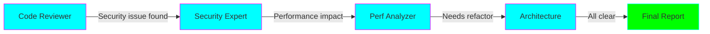
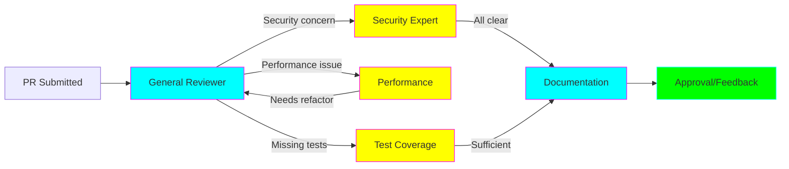

# Swarm Pattern (Decentralized Orchestration)

## Overview

The Swarm pattern enables **decentralized, peer-to-peer agent collaboration** where agents directly hand off to each other without a central controller. Each agent can autonomously decide when to involve another specialist.



## Key Characteristics

### Decentralized Control
- No single "supervisor" agent
- Each agent decides next steps
- Fluid, emergent collaboration

### Direct Handoffs
- Agents communicate peer-to-peer
- Explicit handoff tools for each agent
- Context preserved across handoffs

### Autonomous Decision-Making
- Agents choose when to handoff
- Agents select which peer to involve
- Natural specialization emerges

## When to Use

✅ **Use Swarm when:**
- No clear hierarchical structure
- Peer-level specialists collaborating
- Fluid, unpredictable workflows
- Want ~40% latency reduction vs supervisor
- Collaborative problem-solving needed

❌ **Avoid Swarm when:**
- Need predictable execution paths
- Debugging must be simple
- Clear task decomposition exists
- Strict control flow required

## How It Works

### 1. Agent Definition with Handoff Tools

Each agent has explicit tools to handoff to peers:

```python
from langchain_core.tools import tool

@tool
def handoff_to_security_expert():
    """Call this when security vulnerabilities are found."""
    return "HANDOFF:security_expert"

@tool
def handoff_to_performance_expert():
    """Call this when performance issues detected."""
    return "HANDOFF:performance_expert"

code_reviewer = Agent(
    name="code_reviewer",
    llm=ChatOpenAI(model="gpt-4o-mini"),
    tools=[handoff_to_security_expert, handoff_to_performance_expert],
    system_message="Review code and handoff to specialists when needed."
)
```

### 2. State Management

Track which agent is currently active:

```python
from typing import TypedDict

class SwarmState(TypedDict):
    messages: list[BaseMessage]
    current_agent: str  # Name of active agent
    handoff_count: int  # Prevent infinite loops
    results: dict
```

### 3. Execution Loop

```python
def run_swarm(task: str, max_handoffs: int = 5):
    state = {
        "messages": [HumanMessage(content=task)],
        "current_agent": "entry_agent",
        "handoff_count": 0,
        "results": {}
    }

    while state["handoff_count"] < max_handoffs:
        # Get current agent
        agent = agents[state["current_agent"]]

        # Execute agent
        result = agent.invoke(state["messages"])

        # Check for handoff
        if "HANDOFF:" in result.content:
            next_agent = parse_handoff(result.content)
            state["current_agent"] = next_agent
            state["handoff_count"] += 1
            state["messages"].append(result)
        else:
            # Agent finished
            return result

    return "Max handoffs reached"
```

## Architecture Diagram

```mermaid
sequenceDiagram
    participant U as User
    participant A1 as Code Reviewer
    participant A2 as Security Expert
    participant A3 as Performance Expert
    participant A4 as Architect

    U->>A1: Review this code
    A1->>A1: Analyze code
    Note over A1: Found SQL injection

    A1->>A2: HANDOFF: Security issue
    A2->>A2: Security analysis
    Note over A2: Fix SQL injection,<br/>check for XSS

    A2->>A3: HANDOFF: Check performance
    A3->>A3: Performance analysis
    Note over A3: N+1 query detected

    A3->>A4: HANDOFF: Architecture review
    A4->>A4: Architecture check
    A4->>U: Final recommendations

    style A1 fill:#00ffff,stroke:#ff00ff
    style A2 fill:#00ffff,stroke:#ff00ff
    style A3 fill:#00ffff,stroke:#ff00ff
    style A4 fill:#00ffff,stroke:#ff00ff
```

## Advantages

### 1. Lower Latency (~40% reduction)
No central supervisor means:
- Fewer total LLM calls
- Direct peer communication
- No "translation hop"

### 2. Natural Specialization
Agents develop expertise through focused tools and prompts.

### 3. Emergent Behavior
Collaboration patterns emerge organically based on task needs.

### 4. Scalability
Easy to add new specialist agents - just give others handoff tools.

### 5. Flexibility
Agents adapt handoff patterns to specific problems.

## Disadvantages

### 1. Harder to Debug
- Non-deterministic paths
- Difficult to trace handoff chains
- Emergent behavior can be unpredictable

### 2. Risk of Loops
Need safeguards against agents handing off in circles.

### 3. Complex Design
Requires careful thought about:
- Handoff tool design
- State management
- Termination conditions

### 4. Coordination Overhead
More agent communications (O(n²) worst case).

## Implementation Details

### Preventing Infinite Loops

```python
class SwarmOrchestrator:
    def __init__(self, agents: dict, max_handoffs: int = 10):
        self.agents = agents
        self.max_handoffs = max_handoffs
        self.handoff_history = []

    def detect_loop(self, from_agent: str, to_agent: str) -> bool:
        """Detect if handoff creates a loop."""
        recent = self.handoff_history[-3:]  # Last 3 handoffs
        pattern = f"{from_agent}->{to_agent}"

        # Check if we're repeating the same handoff pattern
        return pattern in [f"{a}->{b}" for a,b in recent]
```

### State Continuity

```python
def preserve_context(state: SwarmState, new_message: BaseMessage):
    """Ensure context is maintained across handoffs."""
    # Keep conversation history
    state["messages"].append(new_message)

    # Track handoff chain for debugging
    if "HANDOFF:" in new_message.content:
        state["handoff_chain"] = state.get("handoff_chain", [])
        state["handoff_chain"].append({
            "from": state["current_agent"],
            "to": parse_handoff(new_message.content),
            "reason": extract_reason(new_message.content),
            "timestamp": datetime.now()
        })
```

### Handoff Protocol

```python
@tool
def create_handoff_tool(target_agent: str, description: str):
    """Factory function for creating handoff tools."""

    @tool(name=f"handoff_to_{target_agent}")
    def handoff_tool(reason: str) -> str:
        f"""{description}

        Args:
            reason: Why you're handing off to {target_agent}
        """
        return f"HANDOFF:{target_agent}|REASON:{reason}"

    return handoff_tool

# Usage
security_handoff = create_handoff_tool(
    "security_expert",
    "Call when security vulnerabilities found"
)
```

## Example 1: Code Review Team (Practical)

**Scenario:** A staff engineer needs AI assistance reviewing pull requests.

**Agents:**
1. **General Reviewer**: Entry point, basic code review
2. **Security Expert**: Checks for vulnerabilities
3. **Performance Analyzer**: Identifies bottlenecks
4. **Test Coverage Expert**: Ensures adequate testing
5. **Documentation Reviewer**: Checks docs quality

**Flow:**


**Why Swarm?**
- Reviewers are peer-level experts
- Can't predict which specialists needed
- Direct handoffs more efficient
- Collaborative, not hierarchical

See: `examples/swarm/code_review_team.py`

## Example 2: Distributed System Debugging (Deep Dive)

**Scenario:** Debug complex distributed system issues where root cause could be in any component.

**Agents:**
1. **Triage Agent**: Initial assessment
2. **Database Expert**: Database-related issues
3. **Network Expert**: Network/connectivity
4. **Cache Expert**: Redis/caching layer
5. **API Expert**: API/application logic
6. **Infrastructure Expert**: K8s/Docker/cloud

**Advanced Features:**
- **Parallel investigation**: Multiple agents can work simultaneously
- **Hypothesis tracking**: Each agent maintains hypotheses
- **Evidence sharing**: Agents share findings
- **Collaborative diagnosis**: Agents debate root cause

**Why Swarm (Deep Dive)?**
- **Emergent specialization**: Agents learn common patterns
- **Dynamic collaboration**: Handoff patterns emerge based on error types
- **Knowledge synthesis**: Multiple perspectives converge on solution
- **Autonomous investigation**: Each agent follows leads independently

**Nuances Demonstrated:**
1. **Bidirectional handoffs**: Agents can return to previous agents with findings
2. **Multi-agent consensus**: Several agents must agree on diagnosis
3. **Evidence accumulation**: Shared state grows richer with each handoff
4. **Dead-end handling**: Agents recognize when they can't help and route elsewhere

See: `examples/swarm/distributed_debug.py`

## Best Practices

### 1. Clear Handoff Tools

```python
# ❌ Bad: Vague handoff
@tool
def get_help():
    """Get help from another agent."""
    pass

# ✅ Good: Specific handoff
@tool
def handoff_to_security_expert(vulnerability_type: str, code_location: str):
    """Hand off to security expert when vulnerability found.

    Args:
        vulnerability_type: Type of vulnerability (SQL injection, XSS, etc.)
        code_location: File and line number where issue found
    """
    return f"HANDOFF:security|TYPE:{vulnerability_type}|LOC:{code_location}"
```

### 2. Handoff Limits

```python
MAX_HANDOFFS = 5  # Prevent infinite loops
HANDOFF_TIMEOUT = 30  # seconds per agent
```

### 3. State Tracking

```python
# Track full handoff chain for debugging
state["handoff_chain"] = [
    {"from": "reviewer", "to": "security", "timestamp": "..."},
    {"from": "security", "to": "performance", "timestamp": "..."},
]
```

### 4. Graceful Termination

```python
@tool
def mark_complete(summary: str):
    """Call when work is complete and no more handoffs needed."""
    return f"COMPLETE:{summary}"
```

### 5. Specialized System Messages

```python
security_expert_prompt = """You are a security expert in a code review swarm.

Your expertise: OWASP Top 10, authentication, authorization, injection attacks.

When to handoff:
- Performance issues → handoff_to_performance_expert()
- Architecture concerns → handoff_to_architect()
- All security checks passed → mark_complete()

Always explain your findings clearly before handing off.
"""
```

## Common Pitfalls

### 1. Infinite Handoff Loops
**Problem:** Agent A → Agent B → Agent A → ...

**Solution:**
```python
if detect_loop(from_agent, to_agent):
    return "TERMINATE: Handoff loop detected"
```

### 2. Context Loss
**Problem:** Later agents don't have enough context.

**Solution:**
```python
# Include summary in each handoff
@tool
def handoff_with_context(target: str, summary: str, key_findings: list):
    """Handoff with preserved context."""
    return {
        "target": target,
        "summary": summary,
        "findings": key_findings,
        "full_history": state["messages"]
    }
```

### 3. No Clear End State
**Problem:** Swarm never terminates.

**Solution:**
```python
# Every agent should have a completion tool
@tool
def task_complete(final_summary: str):
    """Mark task as complete."""
    return "COMPLETE"
```

## Performance Tips

### 1. Use Cheaper Models for Routing
```python
# Expensive model for actual work
work_llm = ChatOpenAI(model="gpt-4")

# Cheap model for handoff decisions
routing_llm = ChatOpenAI(model="gpt-4o-mini")
```

### 2. Batch Related Checks
```python
# Instead of: Security agent → separate auth agent → separate injection agent
# Do: Security agent handles all security in one pass
```

### 3. Early Termination
```python
if all_checks_passed:
    return mark_complete("All checks passed")
# Don't keep handing off if there's nothing to do
```

## Debugging Swarms

### 1. Visualization
```python
def visualize_handoff_chain(state):
    """Create Mermaid diagram of actual handoff path."""
    chain = state["handoff_chain"]
    mermaid = "graph LR\n"
    for i, handoff in enumerate(chain):
        mermaid += f"    {handoff['from']} -->|{handoff['reason']}| {handoff['to']}\n"
    return mermaid
```

### 2. Logging
```python
import logging

logger.info(f"Handoff {count}: {from_agent} → {to_agent} (reason: {reason})")
```

### 3. LangSmith Tracing
```python
from langsmith import traceable

@traceable(run_type="chain")
def run_swarm(task):
    # Automatic tracing of entire swarm execution
    pass
```

## Further Reading

- [LangGraph Swarm Documentation](https://langchain-ai.github.io/langgraph/)
- [Benchmarking Multi-Agent Architectures](https://blog.langchain.com/benchmarking-multi-agent-architectures/)
- [OpenAI Swarm Framework](https://github.com/openai/swarm)

## Next Steps

- Implement the code review example: `examples/swarm/code_review_team.py`
- Try the debugging example: `examples/swarm/distributed_debug.py`
- Compare with Supervisor pattern: [04-supervisor-pattern.md](04-supervisor-pattern.md)
