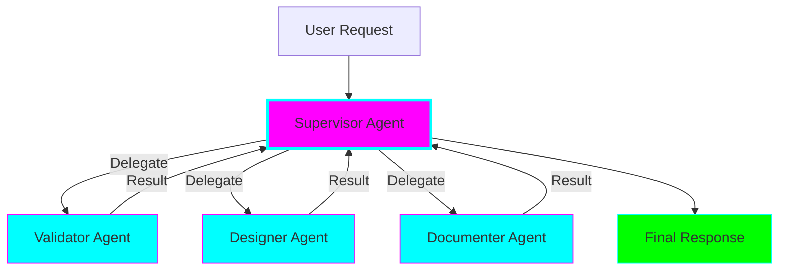
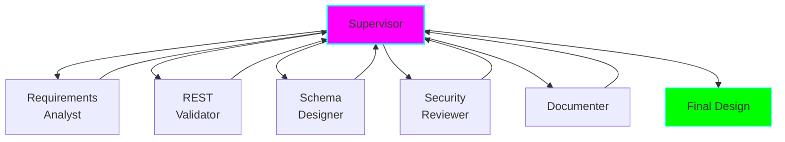

# Supervisor Pattern (Centralized Orchestration)

## Overview

The Supervisor pattern uses a **central orchestrator agent** that manages and coordinates specialized sub-agents. The supervisor receives all requests, delegates tasks, and synthesizes results.



## Key Characteristics

### Centralized Control
- Single supervisor makes all routing decisions
- Hub-and-spoke communication pattern
- Clear command structure

### Task Delegation
- Supervisor breaks down work
- Assigns tasks to specialists
- Collects and synthesizes results

### Predictable Flow
- Deterministic execution paths
- Easy to debug and trace
- Clear responsibility boundaries

## When to Use

✅ **Use Supervisor when:**
- Clear hierarchical task decomposition
- Need predictable, debuggable flow
- Well-defined specialist roles
- Central coordination makes sense
- Want straightforward error handling

❌ **Avoid Supervisor when:**
- Tasks don't fit hierarchy
- Need lowest possible latency
- Peer-level collaboration preferred
- Very simple linear flow (use Sequential)

## How It Works

### 1. Supervisor Agent

The supervisor has a routing function to pick the next agent:

```python
from langchain.agents import AgentExecutor
from langchain_openai import ChatOpenAI
from langchain_core.messages import HumanMessage, SystemMessage

supervisor_prompt = """You are a supervisor managing a team of specialists:

- validator: Validates API design against REST principles
- designer: Creates detailed API schema and endpoints
- documenter: Writes OpenAPI documentation

Given the current state, decide which agent should act next, or if the task is complete.

Respond with one of: "validator", "designer", "documenter", or "FINISH"
"""

supervisor = AgentExecutor(
    llm=ChatOpenAI(model="gpt-4o-mini"),
    system_message=supervisor_prompt
)
```

### 2. Specialized Sub-Agents

```python
validator_prompt = """You validate API designs against REST principles.
Check for:
- Proper HTTP methods
- Resource naming conventions
- Status code usage
- Idempotency where needed
"""

validator = AgentExecutor(
    llm=ChatOpenAI(model="gpt-4o-mini"),
    tools=[web_search, docs_lookup],
    system_message=validator_prompt
)
```

### 3. Orchestration Loop

```python
def run_supervisor(task: str, max_iterations: int = 10):
    state = {
        "messages": [HumanMessage(content=task)],
        "results": {},
        "iteration": 0
    }

    while state["iteration"] < max_iterations:
        # Supervisor decides next agent
        next_agent = supervisor.invoke(state["messages"])

        if next_agent == "FINISH":
            # Supervisor synthesizes final result
            return synthesize_results(state["results"])

        # Execute chosen agent
        agent = agents[next_agent]
        result = agent.invoke(state["messages"])

        # Store result
        state["results"][next_agent] = result
        state["messages"].append(result)
        state["iteration"] += 1

    return "Max iterations reached"
```

## Architecture Diagram

```mermaid
sequenceDiagram
    participant U as User
    participant S as Supervisor
    participant V as Validator
    participant D as Designer
    participant Doc as Documenter

    U->>S: Design /users API endpoint
    S->>S: Analyze request

    S->>V: Validate design principles
    V->>V: Check REST compliance
    V->>S: ✅ Approved

    S->>D: Create detailed design
    D->>D: Design schema
    D->>S: Schema complete

    S->>Doc: Generate documentation
    Doc->>Doc: Write OpenAPI spec
    Doc->>S: Documentation ready

    S->>S: Synthesize results
    S->>U: Complete API design

    style S fill:#ff00ff,stroke:#00ffff,stroke-width:2px
    style V fill:#00ffff,stroke:#ff00ff
    style D fill:#00ffff,stroke:#ff00ff
    style Doc fill:#00ffff,stroke:#ff00ff
```

## Advantages

### 1. Predictable & Debuggable
- Clear execution flow
- Easy to trace decisions
- Simple error handling

### 2. Easy to Implement
- Straightforward pattern
- Well-documented in frameworks
- Familiar hierarchical structure

### 3. Clear Responsibility
- Supervisor owns coordination
- Agents own their specialty
- No ambiguity about roles

### 4. Scalable Team
- Easy to add new specialists
- Just update supervisor's routing logic
- Agents remain independent

### 5. Quality Control
- Supervisor can review results
- Can enforce standards
- Central validation point

## Disadvantages

### 1. Supervisor Bottleneck
- All communication through supervisor
- Extra "translation hop" adds latency
- Supervisor must understand all domains

### 2. Higher Latency
- ~40% slower than Swarm pattern
- More total LLM calls
- Sequential delegation overhead

### 3. Less Flexible
- Rigid hierarchy
- Can't adapt flow dynamically
- Supervisor decides everything

### 4. Supervisor Complexity
- Routing logic can get complex
- Single point of failure
- Must handle all edge cases

## Implementation Details

### Supervisor Routing Strategies

#### 1. LLM-Based Routing (Flexible)

```python
def supervisor_route(state):
    """Let LLM decide next agent."""
    prompt = f"""Given the current state, which agent should act next?

State: {state}

Options: {list(agents.keys())} or FINISH

Your choice:"""

    response = llm.invoke(prompt)
    return parse_agent_choice(response)
```

#### 2. Structured Output Routing (Reliable)

```python
from pydantic import BaseModel

class RouteDecision(BaseModel):
    next_agent: str
    reasoning: str

def supervisor_route_structured(state):
    """Use structured output for reliable routing."""
    return llm.with_structured_output(RouteDecision).invoke(state)
```

#### 3. Rule-Based Routing (Fastest)

```python
def supervisor_route_rules(state):
    """Use rules for deterministic routing."""
    if not state["results"].get("validator"):
        return "validator"  # Always validate first
    elif state["results"]["validator"]["approved"] and not state["results"].get("designer"):
        return "designer"
    elif state["results"].get("designer") and not state["results"].get("documenter"):
        return "documenter"
    else:
        return "FINISH"
```

### State Management

```python
from typing import TypedDict, Annotated
from operator import add

class SupervisorState(TypedDict):
    messages: Annotated[list, add]  # Accumulate messages
    current_task: str
    completed_agents: list[str]
    agent_results: dict
    iteration: int
```

### Result Synthesis

```python
def synthesize_results(results: dict, supervisor_llm):
    """Supervisor combines agent results into final output."""
    synthesis_prompt = f"""You are a supervisor synthesizing results from your team.

Agent Results:
{json.dumps(results, indent=2)}

Create a comprehensive final response that combines these results."""

    return supervisor_llm.invoke(synthesis_prompt)
```

## Example 1: API Design Assistant (Practical)

**Scenario:** Staff engineer designing a new REST API needs AI assistance.

**Supervisor Agent:**
- Coordinates the design process
- Ensures all aspects are covered
- Synthesizes final design

**Sub-Agents:**
1. **Requirements Analyst**: Clarifies functional requirements
2. **REST Validator**: Ensures REST principles compliance
3. **Schema Designer**: Creates data models
4. **Security Reviewer**: Checks authentication/authorization
5. **Documenter**: Generates OpenAPI spec

**Flow:**


**Why Supervisor?**
- Clear sequential steps
- Each specialist has defined role
- Supervisor ensures completeness
- Predictable, debuggable flow

See: `examples/supervisor/api_design_assistant.py`

## Example 2: Incident Response Coordinator (Deep Dive)

**Scenario:** Production incident requires coordinated response across multiple systems.

**Supervisor (Incident Commander):**
- Receives incident report
- Coordinates investigation
- Tracks mitigation progress
- Synthesizes post-mortem

**Sub-Agents:**
1. **Triage Agent**: Assesses severity and impact
2. **Logs Analyzer**: Examines application logs
3. **Metrics Analyzer**: Checks system metrics
4. **Database Expert**: Investigates DB issues
5. **Notification Agent**: Updates stakeholders
6. **Mitigation Agent**: Proposes and executes fixes
7. **Post-Mortem Writer**: Documents incident

**Advanced Features:**
- **Parallel delegation**: Supervisor can dispatch multiple agents concurrently
- **Priority handling**: Critical agents (mitigation) get priority
- **Continuous updates**: Notification agent runs periodically
- **Adaptive workflow**: Supervisor adjusts based on findings

**Why Supervisor (Deep Dive)?**
- **Command structure**: Incident needs clear leadership
- **Coordination**: Multiple parallel investigations need orchestration
- **Accountability**: Supervisor tracks all actions
- **Communication**: Central point for stakeholder updates

**Nuances Demonstrated:**
1. **Parallel coordination**: Supervisor delegates to multiple agents simultaneously
2. **Priority queuing**: Critical tasks (mitigation) bypass normal flow
3. **Continuous monitoring**: Some agents re-invoked periodically
4. **Dynamic re-planning**: Supervisor adjusts plan based on findings
5. **State aggregation**: Supervisor maintains comprehensive incident state

See: `examples/supervisor/incident_response.py`

## Best Practices

### 1. Clear Agent Boundaries

```python
# ✅ Good: Clear, specific responsibilities
validator_agent = Agent(
    name="REST validator",
    specialty="Validate API design against REST principles",
    scope="Only REST compliance, not implementation details"
)

# ❌ Bad: Overlapping responsibilities
general_agent = Agent(
    name="API agent",
    specialty="Everything about APIs"  # Too broad
)
```

### 2. Supervisor Simplicity

```python
# Supervisor should focus on routing, not domain work
supervisor_prompt = """You coordinate specialists. Your job:
1. Decide which agent should act next
2. Determine when work is complete
3. Synthesize final results

Do NOT do the actual work - delegate to specialists."""
```

### 3. Error Handling

```python
def run_supervisor_safe(task):
    try:
        return run_supervisor(task)
    except AgentError as e:
        # Supervisor handles agent failures
        logger.error(f"Agent {e.agent} failed: {e.message}")

        # Supervisor can retry or route to different agent
        return supervisor_handle_error(e)
```

### 4. Result Validation

```python
def validate_agent_result(agent_name, result):
    """Supervisor validates agent outputs."""
    if not result:
        raise ValueError(f"{agent_name} returned empty result")

    if result.get("error"):
        # Supervisor decides how to handle errors
        return supervisor_handle_agent_error(agent_name, result["error"])

    return result
```

### 5. Iteration Limits

```python
MAX_ITERATIONS = 10  # Prevent infinite loops

if state["iteration"] >= MAX_ITERATIONS:
    logger.warning("Max iterations reached, forcing completion")
    return synthesize_results(state["results"])
```

## Common Pitfalls

### 1. Supervisor Doing Too Much

**Problem:** Supervisor tries to do domain work.

**Solution:**
```python
# ❌ Bad
supervisor_prompt = """You coordinate agents AND also validate API designs..."""

# ✅ Good
supervisor_prompt = """You coordinate agents. Delegate validation to validator agent."""
```

### 2. No Termination Condition

**Problem:** Supervisor never finishes.

**Solution:**
```python
def check_completion(state):
    """Clear completion criteria."""
    required = ["validator", "designer", "documenter"]
    completed = state["completed_agents"]
    return all(agent in completed for agent in required)
```

### 3. Poor Error Handling

**Problem:** Agent failure crashes entire workflow.

**Solution:**
```python
def supervisor_invoke_agent(agent_name, input):
    """Supervisor handles agent failures gracefully."""
    try:
        return agents[agent_name].invoke(input)
    except Exception as e:
        logger.error(f"{agent_name} failed: {e}")
        # Supervisor decides: retry, skip, or use fallback
        return handle_agent_failure(agent_name, e)
```

## Performance Tips

### 1. Parallel Delegation

```python
import asyncio

async def supervisor_parallel_delegate(agents_to_invoke):
    """Invoke multiple agents concurrently."""
    tasks = [agent.ainvoke(input) for agent in agents_to_invoke]
    return await asyncio.gather(*tasks)
```

### 2. Caching Agent Results

```python
from functools import lru_cache

@lru_cache(maxsize=100)
def invoke_agent_cached(agent_name, input_hash):
    """Cache agent results for identical inputs."""
    return agents[agent_name].invoke(input)
```

### 3. Cheap Supervisor LLM

```python
# Use cheaper model for routing decisions
supervisor_llm = ChatOpenAI(model="gpt-4o-mini")

# Use better model for actual work
specialist_llm = ChatOpenAI(model="gpt-4")
```

## Debugging Supervisors

### 1. Trace Execution Flow

```python
def trace_supervisor_execution(state):
    """Log each routing decision."""
    logger.info(f"""
Iteration: {state['iteration']}
Completed: {state['completed_agents']}
Next: {state['next_agent']}
""")
```

### 2. Visualize Workflow

```python
def visualize_supervisor_flow(execution_log):
    """Generate Mermaid diagram of actual execution."""
    mermaid = "graph TD\n"
    mermaid += "    S[Supervisor]\n"

    for step in execution_log:
        mermaid += f"    S --> {step['agent']}\n"
        mermaid += f"    {step['agent']} --> S\n"

    return mermaid
```

## Comparison: Supervisor vs Swarm

| Aspect | Supervisor | Swarm |
|--------|-----------|-------|
| Control | Centralized | Decentralized |
| Latency | Higher (~40%) | Lower |
| Debugging | ✅ Easy | ❌ Harder |
| Flexibility | ❌ Lower | ✅ Higher |
| Best for | Clear hierarchy | Peer collaboration |

## Further Reading

- [LangGraph Supervisor Tutorial](https://langchain-ai.github.io/langgraph/tutorials/multi_agent/agent_supervisor/)
- [Supervisor vs Swarm Benchmark](https://blog.langchain.com/benchmarking-multi-agent-architectures/)
- [Multi-Agent Supervisor Pattern](https://python.langchain.com/docs/use_cases/agent_supervisor/)

## Next Steps

- Implement API design example: `examples/supervisor/api_design_assistant.py`
- Try incident response: `examples/supervisor/incident_response.py`
- Compare with Swarm pattern: [03-swarm-pattern.md](03-swarm-pattern.md)
- Explore Graph pattern for more complex control flow: [05-graph-pattern.md](05-graph-pattern.md)
