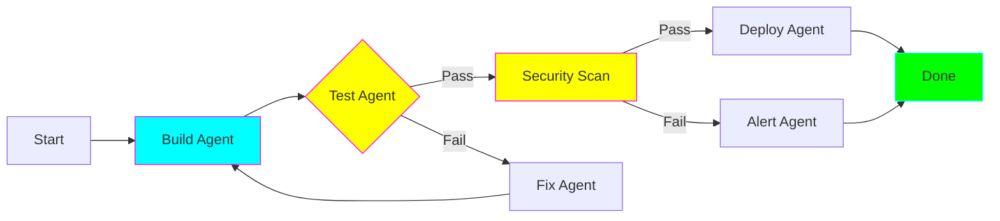

# Graph/Workflow Pattern (State Machine)

## Overview

The Graph pattern uses **state machines with defined transitions** for complex workflows with conditional logic and branching paths.

## When to Use

✅ **Best for:** CI/CD pipelines, approval workflows, complex conditional logic
❌ **Avoid for:** Simple linear flows, unclear state transitions

## Key Features

- Explicit state transitions
- Conditional branching
- Loop handling
- Precise flow control

## Example 1: CI/CD Pipeline

Build → Test → Security → Deploy with conditional paths based on results.

See: `examples/graph/cicd_pipeline.py`

## Example 2: Complex Approval Workflow

Multi-level approval with parallel reviews and conditional escalation.

See: `examples/graph/approval_workflow.py`
