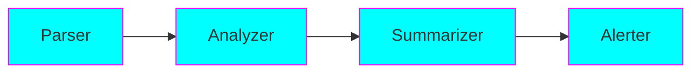

# Sequential/Pipeline Pattern (Linear Processing)

## Overview

The Sequential pattern chains agents in a **linear pipeline** where each agent processes and passes results to the next.

## When to Use

✅ **Best for:** Data pipelines, ETL, linear transformations
❌ **Avoid for:** Complex branching, parallel processing needs

## Key Features

- Simple, predictable flow
- Each step depends on previous
- Easy to debug
- Low complexity

## Example 1: Log Analysis Pipeline

Parse logs → Extract errors → Analyze patterns → Generate alerts

See: `examples/sequential/log_analysis.py`

## Example 2: Data Transformation Pipeline

Validate → Clean → Transform → Enrich → Load

See: `examples/sequential/data_pipeline.py`
