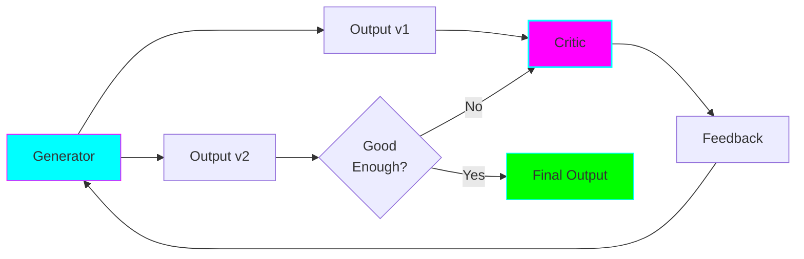
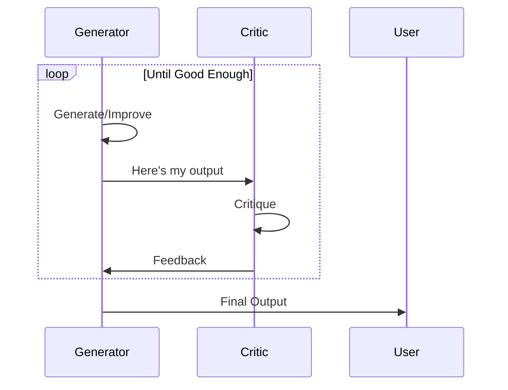
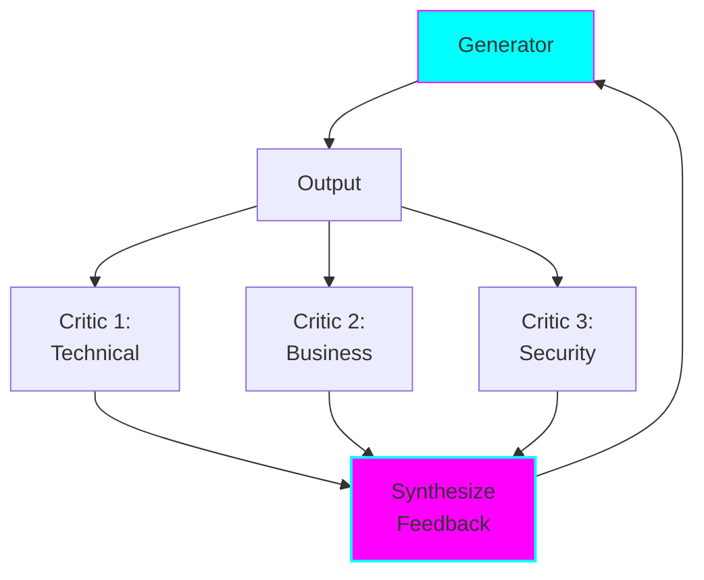

# Reflection Pattern (Iterative Improvement)

## Overview

The Reflection pattern uses **iterative critique and refinement** where one agent generates output and another agent critiques it, leading to improved results through multiple iterations.



## Key Characteristics

### Generator-Critic Loop
- Generator creates initial output
- Critic reviews and provides feedback
- Generator improves based on feedback
- Repeat until quality threshold met

### Quality Over Speed
- Multiple LLM calls per iteration
- Worth it when quality is critical
- Catches mistakes and improves reasoning

### Iterative Refinement
- Each iteration builds on previous
- Feedback is specific and actionable
- Convergence toward better solution

## When to Use

✅ **Use Reflection when:**
- Quality is more important than speed
- Output benefits from multiple perspectives
- Critical decisions need review
- Complex reasoning tasks
- Want to catch and fix errors

❌ **Avoid Reflection when:**
- Speed/latency is critical
- Budget constrained (many LLM calls)
- Simple tasks that don't benefit from iteration
- First draft is usually good enough

## How It Works

### 1. Generator Agent

```python
generator_prompt = """You are an expert architect creating design documents.
Create thorough, well-reasoned architecture decisions.

Focus on:
- Clear problem statement
- Multiple solution options
- Trade-off analysis
- Concrete recommendation
"""

generator = ChatOpenAI(model="gpt-4", temperature=0.7)
```

### 2. Critic Agent

```python
critic_prompt = """You are a critical reviewer of architecture documents.

Evaluate for:
- Logical consistency
- Missing considerations
- Weak reasoning
- Unclear sections
- Better alternatives

Provide specific, actionable feedback.
"""

critic = ChatOpenAI(model="gpt-4", temperature=0.3)
```

### 3. Reflection Loop

```python
def reflect(task: str, max_iterations: int = 3):
    output = None

    for iteration in range(max_iterations):
        # Generate or improve
        if iteration == 0:
            output = generator.invoke(task)
        else:
            output = generator.invoke(f"""
Previous attempt: {output}
Feedback: {feedback}

Improve the output based on this feedback.
""")

        # Check if good enough
        if is_good_enough(output, iteration):
            return output

        # Critique
        feedback = critic.invoke(f"""
Review this output: {output}

Provide specific feedback for improvement.
""")

    return output  # Return best attempt
```

## Architecture Patterns

### Pattern 1: Single Generator, Single Critic



### Pattern 2: Multiple Critics (Debate)



### Pattern 3: Self-Reflection (Same Agent)

```python
def self_reflect(task: str, max_iterations: int = 3):
    """Same agent plays both generator and critic roles."""

    agent = ChatOpenAI(model="gpt-4")
    output = agent.invoke(task)

    for iteration in range(max_iterations):
        # Self-critique
        reflection = agent.invoke(f"""
Review your own work: {output}

What could be improved? Be critical.
""")

        # Self-improve
        output = agent.invoke(f"""
Your previous work: {output}
Your self-critique: {reflection}

Improve based on your critique.
""")

    return output
```

## Advantages

### 1. Higher Quality Output
Multiple iterations catch errors and improve reasoning.

### 2. Multiple Perspectives
Different critics bring different expertise.

### 3. Self-Correction
Catches hallucinations and logical errors.

### 4. Transparency
Feedback makes reasoning visible.

### 5. Handles Complexity
Breaks complex reasoning into iterations.

## Disadvantages

### 1. High Latency
Multiple iterations = multiple LLM calls.

### 2. Higher Cost
Typical: 8-20 LLM calls for 3-5 iterations.

### 3. May Not Converge
Sometimes agents argue in circles.

### 4. Diminishing Returns
Later iterations may not add much value.

## Implementation Details

### Convergence Detection

```python
def is_good_enough(output: str, feedback: str, iteration: int) -> bool:
    """Determine if output is good enough to stop."""

    # Always do at least 2 iterations
    if iteration < 2:
        return False

    # Check if feedback is mostly positive
    sentiment = analyze_sentiment(feedback)
    if sentiment > 0.8:  # Mostly positive
        return True

    # Check if output hasn't changed much
    if iteration > 1:
        similarity = compute_similarity(output, previous_output)
        if similarity > 0.95:  # Converged
            return True

    # Max iterations
    if iteration >= MAX_ITERATIONS:
        return True

    return False
```

### Preventing Infinite Loops

```python
MAX_ITERATIONS = 5
SIMILARITY_THRESHOLD = 0.95  # If output stops changing, stop

def safe_reflect(task):
    outputs = []

    for i in range(MAX_ITERATIONS):
        output = generate_or_improve(task, feedback)
        outputs.append(output)

        # Check for convergence
        if len(outputs) >= 2:
            if compute_similarity(outputs[-1], outputs[-2]) > SIMILARITY_THRESHOLD:
                logger.info("Converged - outputs stopped changing")
                return outputs[-1]

        feedback = critique(output)

        # Check for positive feedback
        if is_positive_feedback(feedback):
            logger.info("Critic satisfied")
            return output

    logger.warning("Max iterations reached")
    return outputs[-1]  # Return best attempt
```

### Multi-Critic Synthesis

```python
async def multi_critic_reflect(task):
    """Use multiple critics for diverse perspectives."""

    output = generator.invoke(task)

    for iteration in range(MAX_ITERATIONS):
        # Get feedback from multiple critics in parallel
        critics = [technical_critic, business_critic, security_critic]

        feedback_tasks = [
            critic.ainvoke(f"Review: {output}")
            for critic in critics
        ]

        all_feedback = await asyncio.gather(*feedback_tasks)

        # Synthesize feedback
        combined_feedback = synthesize_feedback(all_feedback)

        # Check if all critics satisfied
        if all_critics_satisfied(all_feedback):
            return output

        # Improve based on combined feedback
        output = generator.invoke(f"""
Previous: {output}
Feedback from multiple reviewers:
{combined_feedback}

Address all feedback.
""")

    return output
```

## Example 1: Architecture Decision Review (Practical)

**Scenario:** Staff engineer writing Architecture Decision Record (ADR) needs quality review.

**Agents:**
1. **ADR Writer** (Generator): Writes decision document
2. **Architect Reviewer** (Critic): Reviews for completeness and quality

**Flow:**
1. Writer creates initial ADR
2. Reviewer critiques (checks for missing sections, weak reasoning, alternatives)
3. Writer improves based on feedback
4. Repeat 2-3 times
5. Final high-quality ADR

**Why Reflection?**
- ADRs are critical documents
- Benefit from thorough review
- Quality > speed for important decisions
- Multiple perspectives improve outcome

See: `examples/reflection/architecture_review.py`

## Example 2: Multi-Perspective Research Analysis (Deep Dive)

**Scenario:** Analyzing a complex research paper from multiple academic perspectives.

**Agents:**
1. **Summarizer** (Generator): Creates paper summary
2. **Technical Critic**: Reviews technical accuracy
3. **Methodology Critic**: Reviews research methodology
4. **Impact Critic**: Assesses practical implications
5. **Synthesizer**: Combines feedback

**Advanced Features:**
- **Parallel critique**: Multiple critics review simultaneously
- **Weighted feedback**: Different critics have different importance
- **Consensus detection**: Stop when critics agree
- **Debate mode**: Critics can debate each other's points

**Why Reflection (Deep Dive)?**
- **Multi-dimensional quality**: Technical, methodological, practical angles
- **Complex reasoning**: Research analysis benefits from iteration
- **Bias reduction**: Multiple perspectives counter individual biases
- **Depth over speed**: Understanding research can't be rushed

**Nuances Demonstrated:**
1. **Parallel multi-critic**: Scales to many reviewers
2. **Hierarchical feedback**: Critics review each other
3. **Confidence scoring**: Track how sure critics are
4. **Debate resolution**: Handle conflicting feedback

See: `examples/reflection/research_analysis.py`

## Best Practices

### 1. Specific Feedback

```python
# ❌ Bad: Vague feedback
"This could be better."

# ✅ Good: Specific, actionable feedback
"Section 2.3 lacks concrete examples. Add at least 2 real-world scenarios."
```

### 2. Different Temperatures

```python
# Generator: More creative
generator = ChatOpenAI(model="gpt-4", temperature=0.7)

# Critic: More consistent
critic = ChatOpenAI(model="gpt-4", temperature=0.3)
```

### 3. Clear Termination

```python
def termination_criteria(iteration, feedback, output):
    """Clear rules for when to stop."""
    return (
        iteration >= MIN_ITERATIONS and (
            is_positive_feedback(feedback) or
            output_unchanged(output) or
            iteration >= MAX_ITERATIONS
        )
    )
```

### 4. Track Improvements

```python
def track_quality(outputs: list):
    """Measure if quality is actually improving."""
    scores = [evaluate_quality(out) for out in outputs]

    for i in range(1, len(scores)):
        improvement = scores[i] - scores[i-1]
        logger.info(f"Iteration {i}: Quality change = {improvement:+.2f}")

    return scores
```

## Common Pitfalls

### 1. Infinite Loops

**Solution:** Always have max iterations and convergence detection.

### 2. Critic Too Harsh

**Solution:** Balance criticism with positive feedback.

```python
critic_prompt = """Provide balanced feedback:
1. What works well (be specific)
2. What could improve (be constructive)
3. Specific suggestions
"""
```

### 3. Generator Ignores Feedback

**Solution:** Explicitly require addressing feedback.

```python
improve_prompt = """Previous attempt: {output}
Feedback: {feedback}

You MUST address each point in the feedback.
For each criticism, explain how you fixed it.
"""
```

## Performance Tips

### 1. Progressive Quality Gates

```python
# Use cheap model for early iterations
if iteration < 2:
    generator = ChatOpenAI(model="gpt-4o-mini")
else:
    # Use expensive model for final polish
    generator = ChatOpenAI(model="gpt-4")
```

### 2. Parallel Critics

```python
# Run critics concurrently
feedback = await asyncio.gather(*[
    critic1.ainvoke(output),
    critic2.ainvoke(output),
    critic3.ainvoke(output)
])
```

### 3. Early Termination

```python
if iteration == 1 and quality_score(output) > 0.9:
    # First attempt was excellent, skip further iterations
    return output
```

## Measuring Success

```python
def evaluate_reflection_effectiveness(task, iterations):
    """Measure if reflection actually helps."""

    # Get quality scores for each iteration
    scores = [evaluate_quality(iter.output) for iter in iterations]

    metrics = {
        "initial_quality": scores[0],
        "final_quality": scores[-1],
        "improvement": scores[-1] - scores[0],
        "iterations": len(iterations),
        "cost": estimate_cost(iterations),
        "improvement_per_dollar": (scores[-1] - scores[0]) / estimate_cost(iterations)
    }

    return metrics
```

## Further Reading

- [Reflexion Paper](https://arxiv.org/abs/2303.11366)
- [Self-Refine Paper](https://arxiv.org/abs/2303.17651)
- [LLM Debate Paper](https://arxiv.org/abs/2305.14325)
- [LangGraph Reflection Tutorial](https://langchain-ai.github.io/langgraph/tutorials/reflection/reflection/)

## Next Steps

- Implement ADR review: `examples/reflection/architecture_review.py`
- Try research analysis: `examples/reflection/research_analysis.py`
- Compare cost vs Supervisor: [04-supervisor-pattern.md](04-supervisor-pattern.md)
