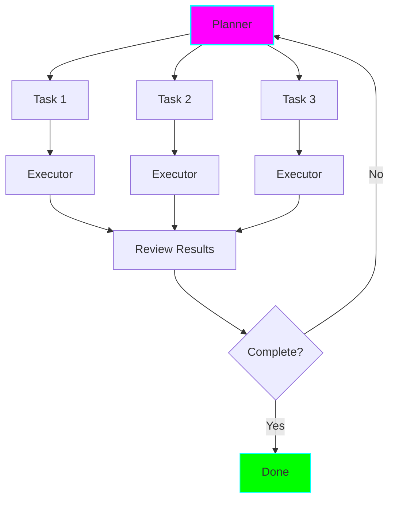

# Plan-Execute Pattern (Strategic Planning)

## Overview

The Plan-Execute pattern uses a **planner agent to create dynamic task lists** that executor agents carry out, with replanning based on results.

## When to Use

✅ **Best for:** Complex multi-step tasks, ambiguous requirements, need for adaptation
❌ **Avoid for:** Simple well-defined tasks, need for speed

## Key Features

- Dynamic planning
- Adaptive execution
- Handles ambiguity
- Can replan mid-execution

## Example 1: Feature Implementation Planner

Break down feature request → Create tasks → Execute → Verify → Iterate

See: `examples/plan-execute/feature_planner.py`

## Example 2: System Migration Orchestrator

Analyze current state → Plan migration steps → Execute with validation → Handle issues

See: `examples/plan-execute/migration_orchestrator.py`
