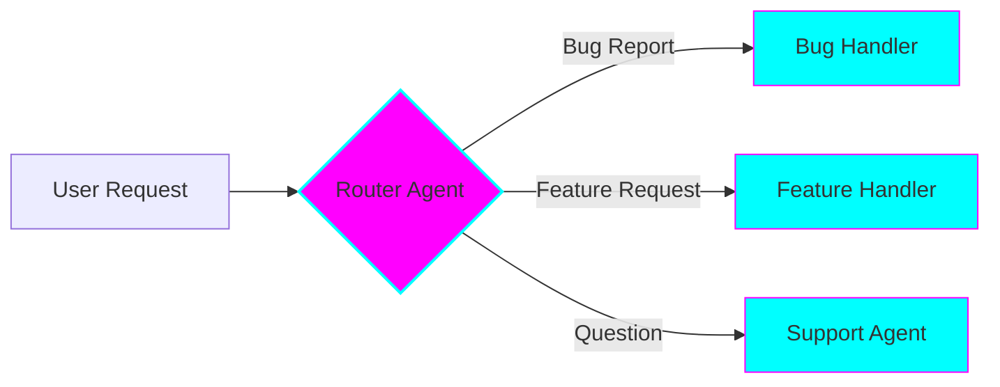

# Router Pattern (Classification & Delegation)

## Overview

The Router pattern uses an **initial classifier to route requests** to the appropriate specialist agent in a single handoff.

## When to Use

✅ **Best for:** Ticket routing, query classification, simple delegation
❌ **Avoid for:** Multi-step collaboration, complex workflows

## Key Features

- Fastest pattern (lowest latency)
- Simple classification
- Clear specialist boundaries
- One-time handoff

## Example 1: Support Ticket Router

Classify ticket type → Route to appropriate team → Handle

See: `examples/router/ticket_router.py`

## Example 2: Multi-Intent Query Handler

Detect query intent → Route to specialist → Combine results if needed

See: `examples/router/query_classifier.py`
