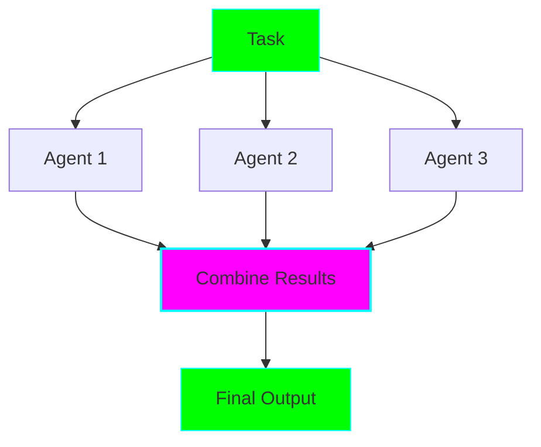

# Parallel/Concurrent Pattern (Simultaneous Execution)

## Overview

The Parallel pattern runs **multiple agents concurrently** on independent tasks, then combines results.

## When to Use

✅ **Best for:** Independent tasks, health checks, parallel data processing
❌ **Avoid for:** Dependent tasks, sequential requirements

## Key Features

- Fastest execution (concurrent)
- Independent agents
- Result aggregation
- Scales to many agents

## Example 1: Multi-Service Health Check

Check multiple services simultaneously → Aggregate status

See: `examples/parallel/health_checker.py`

## Example 2: Concurrent Data Processing

Process multiple data sources → Transform → Merge results

See: `examples/parallel/data_processor.py`
