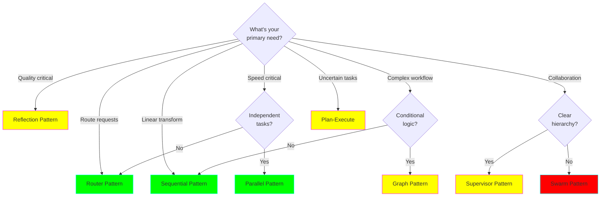
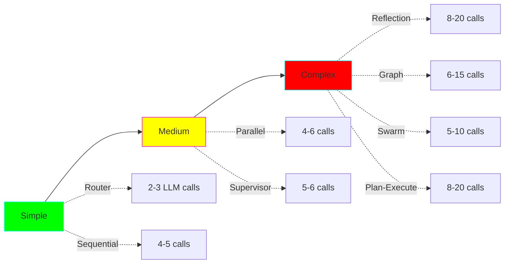

# Choosing the Right Pattern

## Quick Decision Tree

## Pattern Selection Matrix

| Your Requirement | Best Pattern | Alternative |
|-----------------|--------------|-------------|
| Simple classification | Router | Supervisor |
| Linear data pipeline | Sequential | Graph |
| Parallel independent tasks | Parallel | Supervisor |
| Complex conditional flow | Graph | Supervisor |
| Quality over speed | Reflection | Swarm |
| Clear hierarchy | Supervisor | Graph |
| Peer collaboration | Swarm | Supervisor |
| Dynamic planning | Plan-Execute | Supervisor |

## Complexity vs Capability

## Real-World Use Cases

### Software Engineering Tasks

| Task | Pattern | Why |
|------|---------|-----|
| Code review | Swarm or Reflection | Collaborative or iterative quality |
| API design | Supervisor | Clear sequential steps |
| Bug triage | Router | Classification task |
| Test suite | Parallel | Independent test runs |
| Refactoring | Plan-Execute | Complex planning needed |
| CI/CD | Graph | Conditional workflow |

### Operations Tasks

| Task | Pattern | Why |
|------|---------|-----|
| Incident response | Supervisor | Command structure |
| Health monitoring | Parallel | Check services concurrently |
| Deployment | Graph | Conditional rollout |
| Log analysis | Sequential | Linear pipeline |

### Analysis Tasks

| Task | Pattern | Why |
|------|---------|-----|
| Research review | Reflection | Multiple perspectives |
| Data processing | Sequential or Parallel | Depends on dependencies |
| Classification | Router | Simple routing |

## Cost vs Quality Trade-offs

| Pattern | Cost | Quality | Speed | Use When |
|---------|------|---------|-------|----------|
| Router | 💰 | ⭐⭐ | ⚡⚡⚡ | Budget tight |
| Sequential | 💰💰 | ⭐⭐⭐ | ⚡⚡ | Simple pipeline |
| Parallel | 💰💰 | ⭐⭐⭐ | ⚡⚡⚡ | Speed critical |
| Supervisor | 💰💰💰 | ⭐⭐⭐⭐ | ⚡⚡ | Need control |
| Swarm | 💰💰💰 | ⭐⭐⭐⭐ | ⚡⚡ | Collaboration |
| Graph | 💰💰💰 | ⭐⭐⭐⭐ | ⚡⚡ | Complex flow |
| Reflection | 💰💰💰💰 | ⭐⭐⭐⭐⭐ | ⚡ | Quality critical |
| Plan-Execute | 💰💰💰💰 | ⭐⭐⭐⭐ | ⚡ | Uncertain tasks |

## Hybrid Patterns

Often the best solution combines patterns:

### Router + Swarm
Route to appropriate swarm team.

### Supervisor + Parallel
Supervisor coordinates parallel workers.

### Plan-Execute + Sequential
Planner creates sequential task pipeline.

### Graph + Reflection
Each graph node includes reflection for quality.

## Getting Started

1. **Start simple**: Use Router or Sequential for first implementation
2. **Measure**: Track latency, cost, quality
3. **Iterate**: Upgrade to more complex patterns if needed
4. **Combine**: Hybrid patterns for production systems

## Next Steps

Choose a pattern and try the examples:
- [Swarm Examples](../examples/swarm/)
- [Supervisor Examples](../examples/supervisor/)
- [Reflection Examples](../examples/reflection/)
- [All Other Patterns](../examples/)
