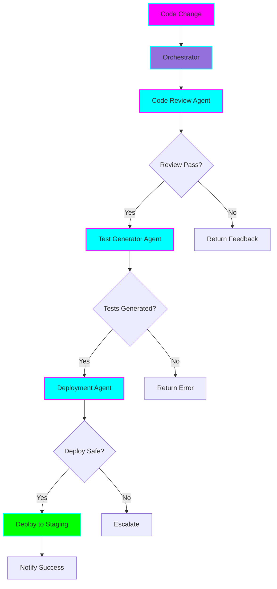
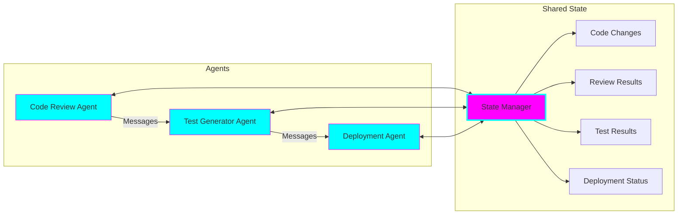
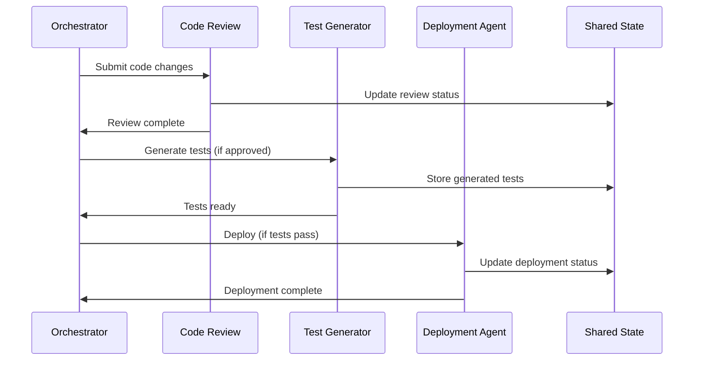

# 🤖 Multi-Agent SDLC Orchestra

**Status:** 🧪 Experimental

**Tech Stack:** Python 3.11+, LangGraph, LangChain, OpenAI API

**Purpose:** Orchestrate multiple AI agents through the Software Development Lifecycle (SDLC) - from code review to testing to deployment - with coordinated communication and shared state management.

## Architecture Overview



## Agent Architecture



## Features

### 1. Code Review Agent
- Analyzes code changes for:
  - Code quality and style
  - Security vulnerabilities
  - Performance issues
  - Best practices violations
- Generates detailed review comments
- Assigns severity levels (blocking, warning, suggestion)

### 2. Test Generator Agent
- Receives approved code changes
- Generates:
  - Unit tests
  - Integration tests
  - Edge case tests
- Validates test coverage
- Ensures tests are runnable

### 3. Deployment Agent
- Performs safety checks:
  - Breaking change detection
  - Dependency conflict detection
  - Resource usage estimation
- Executes deployment with rollback capability
- Monitors deployment health

### 4. Orchestration Layer (LangGraph)
- Manages agent workflow
- Handles message passing between agents
- Maintains shared state
- Implements retry logic and error handling
- Provides observability and logging

## LangGraph Patterns

### State Management Pattern

```python
from typing import TypedDict, Annotated
from langgraph.graph import StateGraph

class SDLCState(TypedDict):
    code_changes: str
    review_result: dict
    tests_generated: list[str]
    deployment_status: str
    messages: Annotated[list, "Message history"]
    errors: list[str]
```

### Agent Node Pattern

```python
def code_review_node(state: SDLCState) -> SDLCState:
    """Code Review Agent Node"""
    # Agent logic here
    review_result = review_code(state["code_changes"])
    return {
        **state,
        "review_result": review_result,
        "messages": state["messages"] + [
            {"agent": "code_review", "result": review_result}
        ]
    }
```

### Conditional Routing Pattern

```python
def should_proceed_to_testing(state: SDLCState) -> str:
    """Route based on review results"""
    if state["review_result"]["approved"]:
        return "test_generator"
    else:
        return "feedback"
```

## Message Passing Protocol



## Safety Considerations

### 1. Deployment Safeguards
- **Approval Gates:** Human approval required for production deployments
- **Canary Deployments:** Gradual rollout with health checks
- **Automatic Rollback:** Rollback on error threshold breach
- **Dry Run Mode:** Test deployment workflow without actual deployment

### 2. Agent Boundaries
- **Rate Limiting:** Max actions per agent per hour
- **Cost Tracking:** Monitor API usage and costs
- **Timeout Protection:** Hard timeouts for each agent
- **Sandbox Execution:** Isolated test environments

### 3. Error Handling
- **Graceful Degradation:** Continue with warnings if non-critical agent fails
- **Circuit Breaker:** Stop workflow on critical failures
- **Retry Logic:** Exponential backoff with max retries
- **Escalation Path:** Human notification on repeated failures

## Evaluation Metrics

### Agent Performance
- **Code Review Agent:**
  - True positive rate (real issues found)
  - False positive rate (false alarms)
  - Review completion time
  - Severity accuracy

- **Test Generator Agent:**
  - Code coverage achieved
  - Test quality score
  - Generation time
  - Test success rate

- **Deployment Agent:**
  - Deployment success rate
  - Rollback frequency
  - Deployment time
  - Zero-downtime percentage

### System Performance
- **End-to-End Latency:** Time from code change to deployment
- **Agent Communication Overhead:** Message passing efficiency
- **State Consistency:** State synchronization accuracy
- **Cost Efficiency:** API costs per deployment

## Environment Setup

### Prerequisites
- Python 3.11+
- OpenAI API key
- Git repository access

### Installation

```bash
# Activate Python environment
cd /home/user/fantastic-engine/projects/multi-agent-sdlc

# Create virtual environment
uv venv
source .venv/bin/activate  # On Windows: .venv\Scripts\activate

# Install dependencies
pip install -r requirements.txt

# Configure environment
cp .env.example .env
# Edit .env with your API keys
```

### Configuration

Create `.env` file with:

```env
OPENAI_API_KEY=your-api-key-here
LANGCHAIN_API_KEY=your-langchain-key  # Optional, for LangSmith tracing
MODEL_NAME=gpt-4-turbo-preview
MAX_RETRIES=3
DEPLOYMENT_MODE=dry_run  # dry_run | staging | production
```

## Usage Examples

### Basic Orchestration

```python
from multi_agent_sdlc import SDLCOrchestrator

# Initialize orchestrator
orchestrator = SDLCOrchestrator()

# Submit code changes
result = orchestrator.process_changes(
    code_changes="path/to/changes.diff",
    target_branch="main",
    deployment_target="staging"
)

# Check results
print(f"Review: {result['review_result']}")
print(f"Tests: {result['tests_generated']}")
print(f"Deployment: {result['deployment_status']}")
```

### Custom Agent Configuration

```python
from multi_agent_sdlc.agents import CodeReviewAgent, TestGeneratorAgent

# Configure Code Review Agent
review_agent = CodeReviewAgent(
    model="gpt-4",
    severity_threshold="warning",
    custom_rules=[
        "Check for SQL injection",
        "Verify input validation"
    ]
)

# Configure Test Generator Agent
test_agent = TestGeneratorAgent(
    model="gpt-4",
    coverage_target=80,
    test_frameworks=["pytest", "unittest"]
)
```

### Monitoring Workflow

```python
from multi_agent_sdlc.monitoring import WorkflowMonitor

# Monitor orchestration
monitor = WorkflowMonitor()

# Stream events
for event in orchestrator.stream_events():
    print(f"[{event.timestamp}] {event.agent}: {event.message}")
    monitor.log_event(event)

# Get metrics
metrics = monitor.get_metrics()
print(f"Total time: {metrics['total_time']}s")
print(f"Agents used: {metrics['agents_used']}")
```

## Project Structure

```
multi-agent-sdlc/
├── README.md
├── requirements.txt
├── .env.example
├── .python-version
├── multi_agent_sdlc/
│   ├── __init__.py
│   ├── orchestrator.py       # LangGraph orchestration
│   ├── state.py              # Shared state management
│   ├── agents/
│   │   ├── __init__.py
│   │   ├── base.py           # Base agent class
│   │   ├── code_review.py    # Code Review Agent
│   │   ├── test_generator.py # Test Generator Agent
│   │   └── deployment.py     # Deployment Agent
│   ├── messaging/
│   │   ├── __init__.py
│   │   └── protocol.py       # Message passing protocol
│   ├── monitoring/
│   │   ├── __init__.py
│   │   └── metrics.py        # Metrics and logging
│   └── config/
│       ├── __init__.py
│       └── agent_configs.py  # Agent configurations
├── examples/
│   ├── basic_workflow.py
│   ├── custom_agents.py
│   └── monitoring_demo.py
└── tests/
    ├── test_orchestrator.py
    ├── test_agents.py
    └── test_integration.py
```

## Learning Log

### Concepts to Master
- [ ] LangGraph state management
- [ ] Agent-to-agent communication patterns
- [ ] Conditional workflow routing
- [ ] Error handling in distributed systems
- [ ] Production deployment safeguards

### Challenges & Solutions
- **Challenge:** Managing shared state across agents
  - **Solution:** Use LangGraph's built-in state management with TypedDict
- **Challenge:** Preventing agent failures from breaking the entire workflow
  - **Solution:** Implement circuit breakers and graceful degradation
- **Challenge:** Coordinating asynchronous agent operations
  - **Solution:** Use message passing with state checkpoints

### Next Steps
- [ ] Implement basic orchestrator with LangGraph
- [ ] Build Code Review Agent with OpenAI
- [ ] Add Test Generator Agent
- [ ] Implement Deployment Agent with safety checks
- [ ] Add comprehensive monitoring and metrics
- [ ] Build web dashboard for workflow visualization
- [ ] Add human-in-the-loop approval gates

## Graduation Criteria

- [ ] All three agents implemented and functional
- [ ] LangGraph orchestration working end-to-end
- [ ] Safety mechanisms tested (rollback, circuit breaker)
- [ ] Metrics collection and reporting implemented
- [ ] Documentation complete with runbooks
- [ ] Integration tests passing
- [ ] Successfully deployed to staging environment
- [ ] Cost analysis completed

## Resources

- [LangGraph Documentation](https://langchain-ai.github.io/langgraph/)
- [Multi-Agent Patterns](https://python.langchain.com/docs/use_cases/multi_agent)
- [OpenAI Best Practices](https://platform.openai.com/docs/guides/production-best-practices)
- [Circuit Breaker Pattern](https://martinfowler.com/bliki/CircuitBreaker.html)

## License

MIT

---

**Remember:** This is an experimental project. Test thoroughly in staging before any production deployment. Monitor costs and set strict limits. 🚀
